# 1. 什么是基金？

## 1.1 基金的概念

**基金**指为兴办、维持或发展某种事业而储备的资金或专门拨款。基金必须用于指定的用途，并单独进行核算。广泛的目的组成各种需求的基金。做为不同的投资基金，通常都有人专门打理并有相关的管理办法。

**证券投资基金**在美国被称为共同基金，在英国和香港被称为单位信托基金[1]，它是指通过公开发售基金份额募集资金，由基金托管人托管，由基金管理人管理和运用资金，以资产组合方式进行投资的一种利益共享、风险共担的集合投资方式[2]。

## 1.2 基金的优势

- 1、起手金额少，投资门槛低;
- 2、可以有效地分散风险;
- 3、有专业的基金经理打理，省心省时省力。

## 1.3 基金的风险

**不同基金的风险不同**

- 最主要的影响因素是基金投资产品的种类，其中股票的占比越高基金的风险就越高。
- 基金的资金量大小，基金经理的能力，都会影响基金的风险程度。

**适合自己的基金才是好基金**

- 每个人的投资目的，持续时间，风险承受能力都不同，所以选择的基金类型也因人而异。
- 选择基金-定要匹配自身情况，靠自己的知识去判断，不要指望着别人的推荐。

## 1.4 基金的分类

**不同分类方式之间并不冲突**

### 1.4.1 按照投资品种不同分类

#### 货币基金、债券基金

- 两者的篮子里都会装国债、地方政府债、公司债等等。
- 不同之处：债券基金除了投资债券，还可以投资股票，当然债券占比必须在80%以上。他们除了投资债券的比例不同，时间也不同，货币基金投资的一般是1年以内的短期债券，而债券基金则会较长，一般
是1年以上的债券。另外：货币基金投资的企业债的企业信用程度会更高，货币基金对安全的要求更严格，货币基金收益在%3-%4左右，债券基金在6%-7%。

#### 混合型基金

- 混合型基金稳中求进，同时投资了股票和债券，可以通过调整股票和债券的投资占比，实现收益与风险之间的平衡。
- 按照偏重股票还是债券，混合型基金还细分为偏股型基金、偏债型基金、平衡型基金。

#### 股票基金

股票基金里大部分是股票，占比在80%以上，另外会有少部分投资在债券等其他的投资品上。

### 1.4.2 按照投资渠道不同分类

#### 场内基金

场内基金是放在证券交易所里卖的基金，和你交易的是其他买家卖家，需要开通股票账户在证券公司购买。

#### 场外基金

场外基金就是在证券交易所之外买卖基金，交易的对象是基金公司，比如支付宝/基金官网内买基金。

#### 区别

- 场内价格是实时变动的，买卖价格是根据供求关系而变化。

看到的基金都是别人出一个价格挂出来卖，如果觉得对方的价格合适，就可以买入，如果觉得价格太高，那么可以寻找看看有没有其他更低的价格可以买入。

- 场外基金一天只有一个价格。

如果在3点前买入，那么是以当天下午3点证券市场交易结束时的价格结算; 3点后买入则是以下一个交易日结束后的价格结算。

- 交易费率、到账时间等也有不同。

### 1.4.3 按照运作方式不同分类

#### 开放式基金和封闭式基金

- 开放式基金是指这只基金的规模是不固定的，投资者可以在场外随时买入或者卖出， 基金的规模可以增加也可以减少。
- 封闭式基金在成立后的一段时间内规模是不变的，投资者只能在场内进行买卖，这段时间就叫做它的封闭期，一般在5年以上。

#### 开放式基金和封闭式基金的区别

- 开放式基金的话，我们可以随时向基金公司买入，也可以随时向基金公司卖出。
- 封闭式基金，在封闭期内我们不是和基金公司交易，而是在场内和其他投资人交易。

## 1.5 基金招募书

获取基金招募书的来源：基金公司官网、沪深交易所、巨潮资讯网

#### 如何读基金招募书

- 第一问买入的基金是什么类型？并快速判断大概的风险程度;
- 第二问了解基金公司还有基金经理：丑闻、违纪现象、从业时间、业绩水平，看是否可以放心把资金交给他们打理;
- 第三问了解资金的投资范围，可以进一步知道这只基金的风险程度。


# 2. 货币基金

货币基金一般投资于1年以内的国债、地方政府债和企业债。一般来说可以从收益率、流动性、成立时间、基金规模、费率等五项指标来剖析一下货币基金。

以“天天基金网”为例，进入“基金排行”，选择“货币基金排行”，并且选择“100元起(A类)”，
把筛选出来的基金按近3年的收益率从高到低排序，然后选择前10家。按从上往下的顺序，分
析每只基金的收益率、流动性、成立时间、基金规模、费率等五项指标。以“易方达天天增利货币A，基金代码000704”为例。

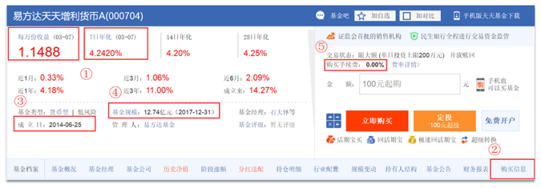

## 2.1 收益率

货币基金的收益情况,可以通过“每万份收益”和“7日年化”这两个指标判断。

所谓万份收益，就是指上一日或上一个交易日一万元本金能够赚多少钱，而7日年化收益则是指根据过去7天的收益总和，计算出的年化收益率。

**货币基金适合放-些随时会用到的钱，不要过分比较货币基金的收益，从整体来看，货币基金之间的收益不会有特别大的差异。**

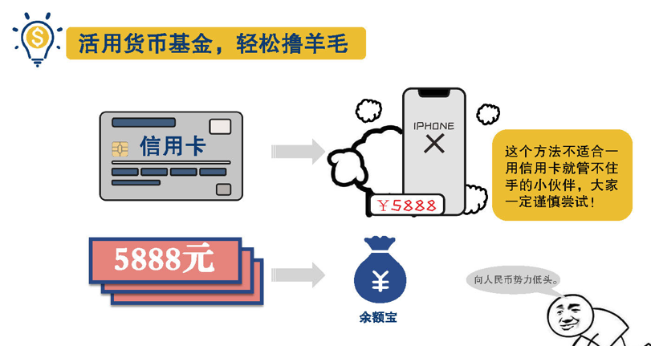

## 2.2 流动性

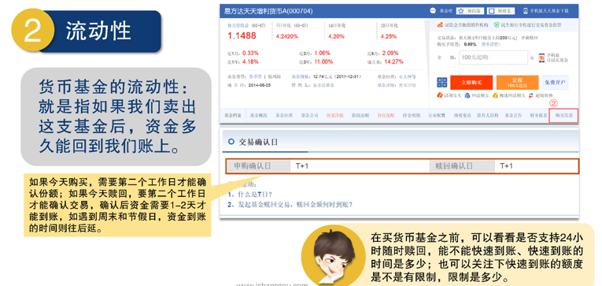

因为货币基金投资投资的都是短期的金融产品，所以流动性好

## 2.3 成立时间

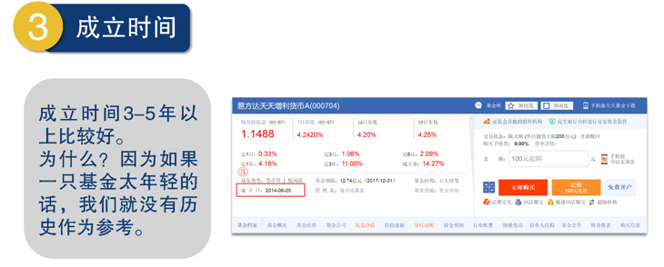

## 2.4 基金规模

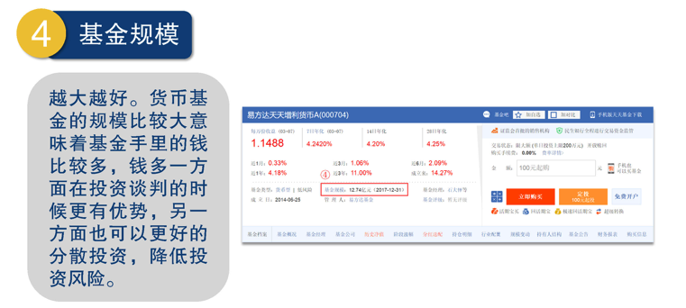

## 2.5 费率

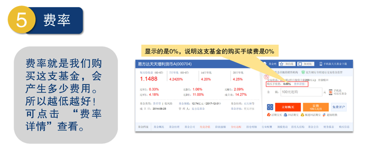
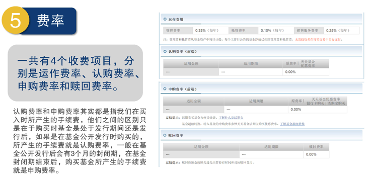

## 2.6 特点总结

**流动性高、风险低、收益稳定**

非常适合把一些可能近期会用到的钱或者不知道什么时候就会用到的钱放在里面，等要用的时候再赎回。


# 3. 债券基金

以“天天基金网”为例，点击“基金筛选”。在基金类型中选择“债券型”。也可以按照近三年收益率排名找前几个进行分析。

## 3.1 成立年限

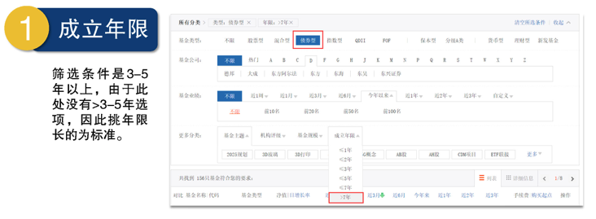

## 3.2 收益率

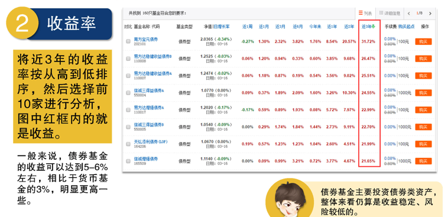

## 3.3 基金规模

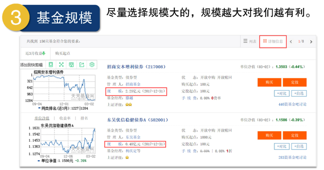

## 3.4 费率

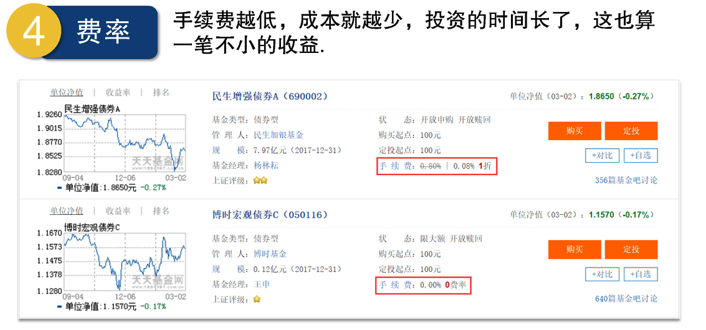

## 3.5 基金经理是否频繁更换?

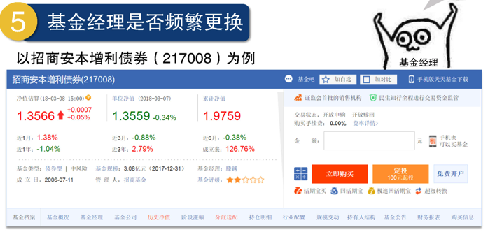
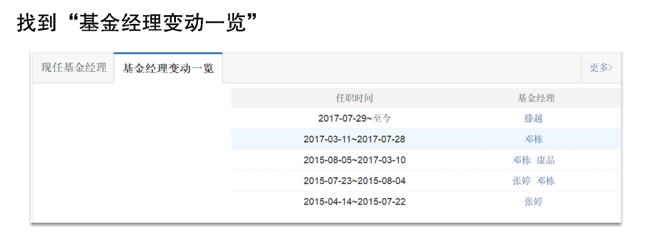

## 3.6 债券基金优势

- 短期来看，债券出现亏损的可能性是有的，但从长期来看，债基还是相当忠实可靠的，而且收益
会比一般的定期存款都高。
- 证券市场上债券无数，要从中选出值得投资的好债券需要投资者花费大量的时间和精力。既然基金的特点之一就是专家投资，那么由基金经理和他的团队来帮你投资省心又省力。
- 个人投资者资金有限，一方面在参与债券市场的时候会受到一些限制；另一方面，个人投资者很难做到分散投资，降低风险债券基金则具备资金上的优势，能选择不同种类的债券进行分散投资，降低风险，获得比较稳定的收益。

## 3.7 债券基金和货币基金的总结对比


# 4. 混合基金

**混合型基金最大的特点**：投资选择多，可以同时配置股票、债券、货币等，而且配置比例灵活，间接实现了分散投资，降低了风险。混合基金通过资产配置，简单来说就是进行一定比例的组合，以达到收益率最大、风险最小的目的。有时候表现好的话，混合基金的收益还会比股票基金高。

以“天天基金网”为例，点击“基金筛选”，基金类型选择“混合型”，然后在“基金业绩”这-项选择“近3年前100名”基金去分析。为什么是看三年呢？因为：过去1-2年的收益率可能是运气，但3-5年都能保持不错收益率的基金，那大概率就是有一定实力了。

## 4.1 基金的业绩（收益率）

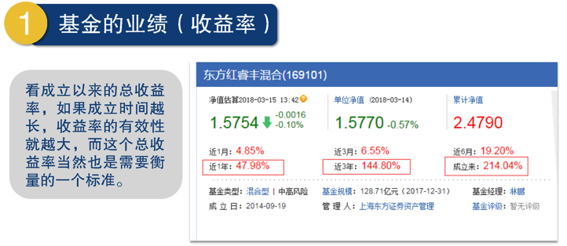

## 4.2 基金规模

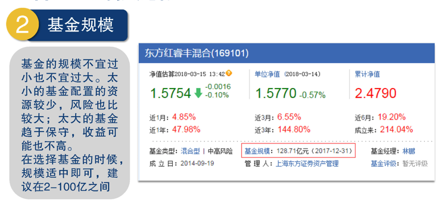

## 4.3 成立时间

**基金成立时间不能太短**

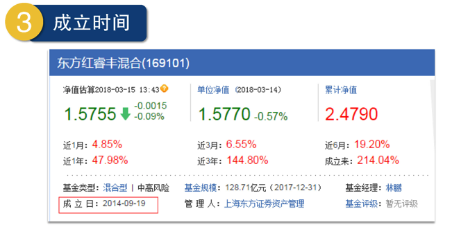

## 4.4 资产配置比例

投资风险和收益主要取决于股票与债券配置比例的大小，股票占比较高，风险和收益率也较高；债券占
比较高，风险和收益率就较低。

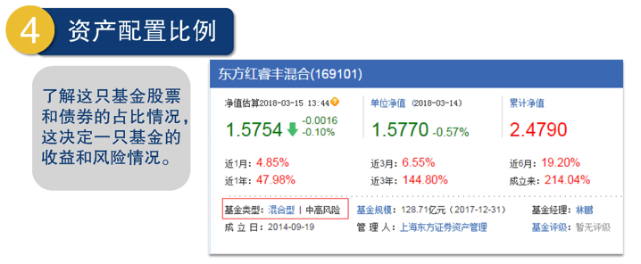

混合型基金因为可以根据市场来及时调整各项投资比例，所以风险要低于股票型基金，但又高于债券和货币基金，所以属于中高风险。

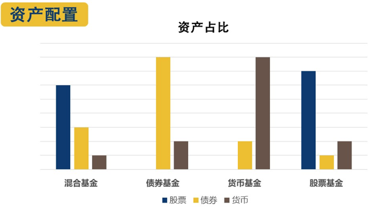

不要看到高收益就忘乎所以，这种高收益要持续才有意义，我们可以通过看管理他的企业靠不靠谱、基金经理能力如何来判断。

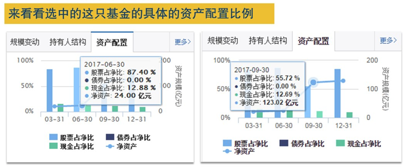

## 4.5 基金公司的盈利能力

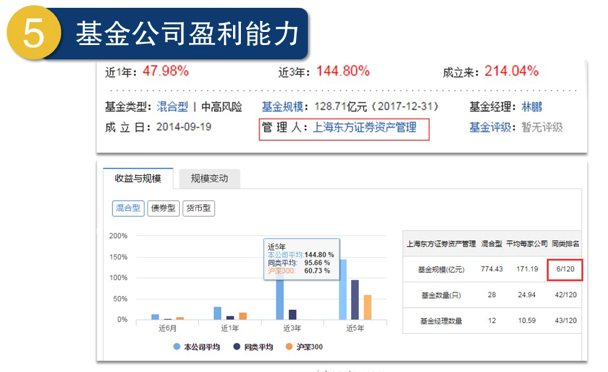

## 4.6 基金经理的更换频率和选股择时能力

**经理更换的频率越少越好**

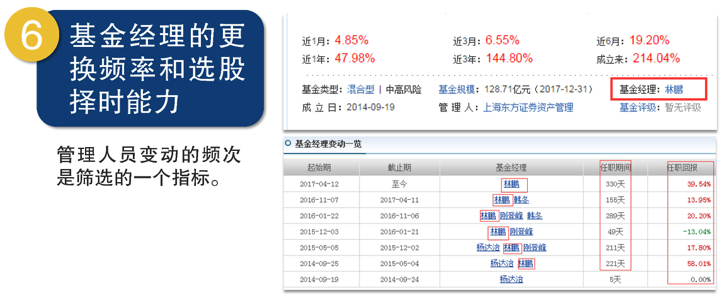

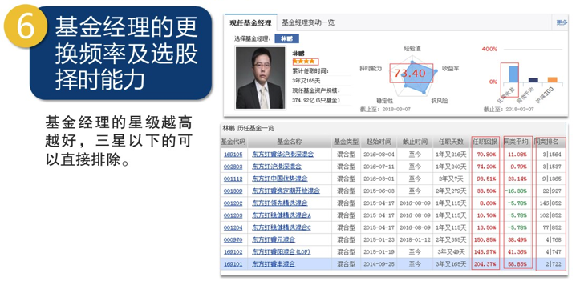

## 4.7 手续费

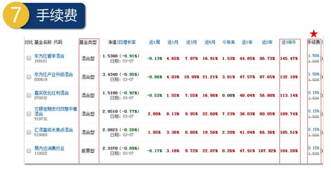


# 5. 股票型基金

- 混合基金投资比例非常灵活，不看好大盘后市的表现时可以完全不买股票，而感觉到有投资机会时则可以买入高达95%的仓位。
- **股票型基金：股票基金买股票的下限一般是80%**。

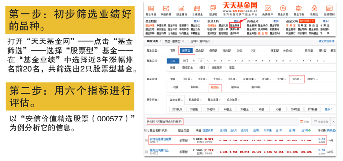

## 5.1 基金的业绩

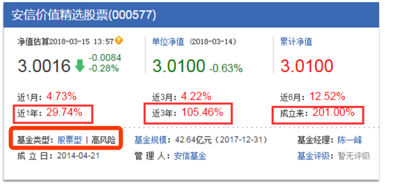

在所有的基金产品中，只要有一定比例的资金是投资于股票上的，就必须承受价格的波动，也就意味着它们相对于货币、债券这样的投资产品的风险要大。

## 5.2 基金的规模

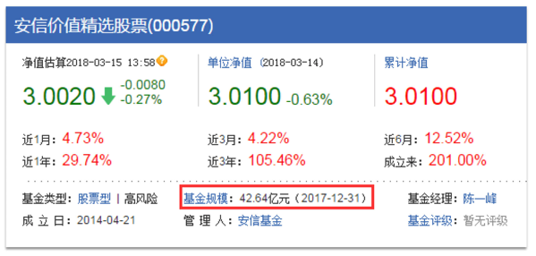

## 5.3 成立时间

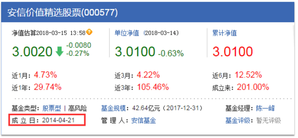

## 5.4 基金公司盈利能力

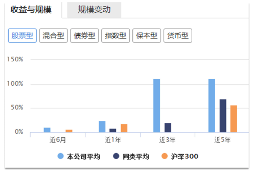

## 5.5 基金经理的更换频率和选股择时能力

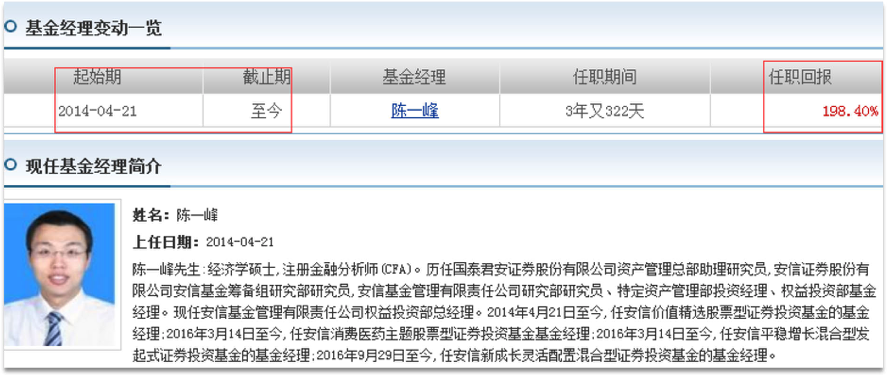
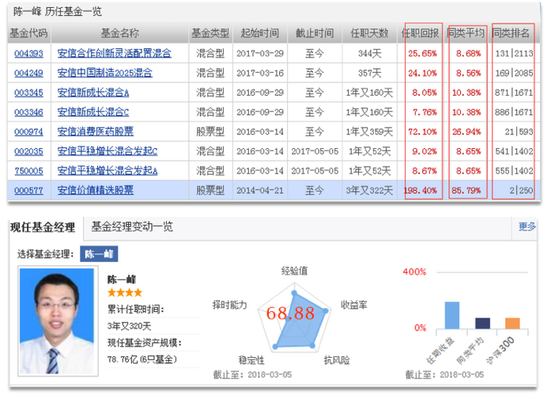

## 5.6 费率

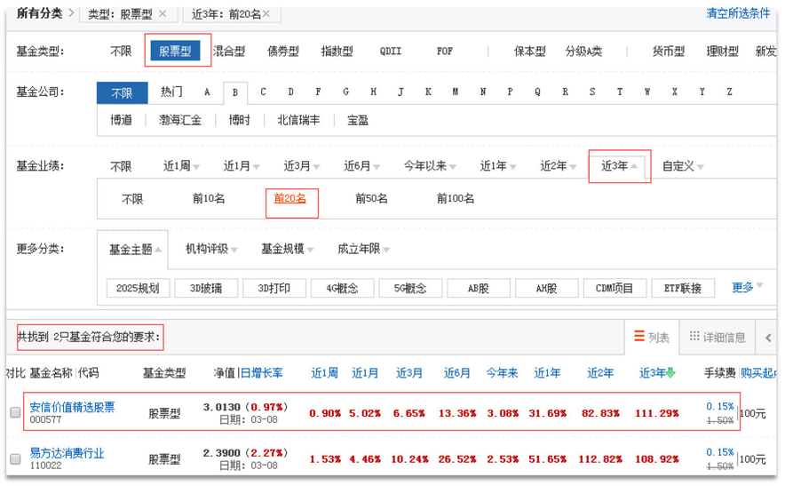

## 5.7 筛选法则总结

混合型基金和股票型基金的筛选指标，主要考虑以下七个方面:

- 1. 基金的业绩越强越好
- 2. 基金规模2亿-100亿比较好
- 3. 基金成立时间3年以上
- 4. 基金公司盈利能力越强越好
- 5. 基金经理更换频率越少越好，基金经理选股择时能力仅作为排除指标
- 6. 手续费越低越好
- 7. 资产配置比例是混合基金筛选的核心，股票型基金不用考虑此项指标

混合基金和股票基金由于有不同比例的资金投资于股票市场，所以
波动很大，一些鱼目混珠的家伙初筛就可能没有被筛出去。**在熊市里表现很烂但牛市里表现强于大盘的基金要慎重 => 基金经理可能过于投机！**


# 6. 主动型基金和被动型基金

**主动型基金：**

基金经理拿了户主的钱替户主投资，投资哪家的股票、哪家的债券，都是由基金经理说了算，主动出
击，寻求超越平均水准的超值回报。

**被动型基金：**

基金经理不主动寻求超越市场的表现，一般选取特定的指数成份股作为投资的对象，试图复制指数的表现，又叫指数基金。

## 6.1 主动型基金

主动型基金包含了混合型基金、普通股票型基金和债券型基金等，筛选方法跟混合基金和股票基金的筛选方法样。主动型基金高收益的同时也是高风险。

### 主动型基金筛选面临的问题

- 主动型基金的关键因素在人，想要选择准，要看眼光狠不狠。
- 主动型基金需要根据市场做出调整，操作6不6决定了收益6不6。

主动型基金经理根据市场对基金的配置比例做出的调整，如果判断正确，就会盈利最大化。如果判断错误，经理依然赚钱，因为手续费还是要付的。

## 6.2 被动型基金

指数基金是最适合普通人的投资选择，“傻瓜”式投资，它的风险和收益不用依赖基金经理，风险不如主动基金高，“长期”来看，指数基金收益更高更稳定。


# 7. 指数基金

```
以十年为期限看：
- 标普指数：年化收益率达8.5%
- 伯克希尔哈撒韦指数：年化收益率达7.7%
```

指数基金，指的是跟踪特定的指数，并按照这个指数成分股的比例，买入同样的股票组合的基金。

## 7.1 指数

指数其实就是一个选股规则，它是按照某个规则挑选出一篮子股票，并由专业机构通过复杂的计算后算出这一篮子股票的平均价格，然后用来反映市场上这一类股票的价格水平。我们把这个平均价格称为指数点位，放在这个篮子里的这些股票，我们称它们是这只指数的成份股。成份股是变化的，如果某只成份股不再符合标准，是会被新的股票替换的。

### A股、港股、美股

所谓A股就是人民币普通股，是由中国境内公司发行、供境内机构、组织或个人以人民币认购和交易的普通股股票。简单地把它理解为国内股票市场。

国内公司在上市的时候，除了可以选择在A股上市之外，也可以选择去美股或者港股市场上市，国内大部分的公司都是在A股上市的。

### 国内股票市场主要指数

#### 上证50指数

- 由上海证券市场规模大、流动性好的最具代表性的50只股票组成;
- 反映的是，**上海证券市场最具市场影响力的一批龙头企业的整体状况**。

#### 沪深300指数

- 从上海和深圳两个交易所挑选出来的市值排名前300的，上市公司所组成的指数;
- **国内影响力最大、最重要的指数**。

#### 中证500指数

- 沪市和深市中市值排名前800的上市公司中，前300家入围了沪深300指数，剩下的500家则组成了中证500指数，**代表了中国股市中小型上市公司的平均水平。**

#### 创业板指数

- 专门选择在创业板上市的小型企业;
- 这些公司规模不够大，盈利也不够多，被主板上市的门槛挡在门外。

#### 红利指数

- 由高分红的企业组成的指数;
- 挑选的是.上证交易所过去两年现金分红最高、市值最大、流动性最好的50家公司;
- 是上证A股市场真正的核心优质资产。


### 国外股票市场主要指数

#### 美股市场

- 标普500指数
- 纳斯达克指数：涵盖了纳斯达克市场上上市的所有美国和外国的公司，是证券市场上非常有影响力的一只指数。

#### 港股市场

- 恒生指数：诞生于1964年，是从港股上市公司中选择50家具有代表性的公司股票组成的指数，是香港股市价格非常重要的指标，也是一个老牌优秀的指数，相当于上证50。
- H股指数：被称作恒生中国企业指数或国企指数，它挑选了在香港上市的规模最大的33家国内企业。

QDII又称为合格的境内投资者，简单地理解，就是我们可以用人民币投资海外股票市场。跟踪H股指数和恒生指数的基金就是H股指数基金和恒生指数基金，他们的特别之处在于，都属于QDII基金。**投资QDII基金可做为应对人民币贬值的对冲方法**。


## 7.2 指数基金的分类

**按指数基金是否通吃各行各业分类**

### 7.2.1 宽基指数基金

- 在挑选股票的时候，不限制投资哪些行业，它覆盖了各行各业。
- 沪深300、上证50、中证500、恒生指数、标准普尔500、纳斯达克100等就属于宽基指数。

覆盖的行业更多更广分配更均匀，受某个行业的影响小，盈利更稳定。

### 7.2.2 行业指数基金

- 在挑选股票的时候，会要求只投资哪些行业的股票。
- 行业指数,有代表消费行业的上证消费80、中证消费指数；代表医疗行业的中证医疗指数和代表
白酒行业的中证白酒指数等等。

投资特定的行业，受行业影响大，投资风险高一些。

**按复制方式分类**

### 7.2.3 完全复制型指数基金

完全复制目标指数所包含的所有成分股，照葫芦画瓢，追求的是获得和跟踪指数持平的收益。

### 7.2.4 增强型指数基金

除了复制目标指数外，基金经理还加入自己的一些主观投资，追求超过跟踪的指数的收益。

**选择指数基金就是看中它的被动性，为何还要选择需要人操心的增强型基金呢?**

## 7.3 指数基金的优点

### 7.3.1 灭绝人性

老鼠仓指的是少数无良的基金经理会利用事先知道的内幕信息，让自己和亲友提前低价买入股票，等到你还有其他人的资金进入之后，他们再以高位的价格卖出，把投资者和机构的钱收进自己的口袋。

主动型基金的最大的风险之一是老鼠仓，也叫老鼠吃猫。收益高低完全取决于基金经理的能力和判断。

指数基金是被动型基金，直接跟踪和复制指数，基金经理照着指数买自然也就不用做什么买入卖出决策，可谓是灭绝人性的代表了。

### 7.3.2 永垂不朽

公司有可能因为经营不善/黑天鹅事件而倒闭，公司经营不善也要砸锅卖铁去还债券，但是并不会对股价负责到底。所谓的黑天鹅，就是指非常难以预测，且不寻常的事件，通常会引起市场连锁负面反应甚至颠覆，例如武汉新冠肺炎事件。

如果我们买指数基金，其中几家公司，更甚至是组成这只指数的所有的公司都倒闭了，还会有其他新的公司补充进来。铁打的指数，流水的公司。

### 7.3.3 笑到最后

股市有一个“七亏二平一盈”的魔咒。投资指数基金，是通过投资指数成分股，来获得和市场持平的收益。长期看来，只要经济是持续向好的，指数基金就有投资的价值，甚至可以穿越牛熊市盈利。

## 7.4 指数基金的风险

- 指数基金本质是股票型基金，它依然存在风险。
- 虽然指数基金是复制和跟踪指数，来调整篮子里面的股票组合。但是基金经理如果复制得有偏差，或者没有及时跟着指数调整，也会带来收益方面的**误差风险**。
- 选择的指数基金规模小或者运作历史不长的话，也会有风险。比如小基金公司遇到大额赎回，但是没有足够的现金，只能买股票套现，如果恰逢股票跌停无法买出，则会有资金链断裂的风险。


