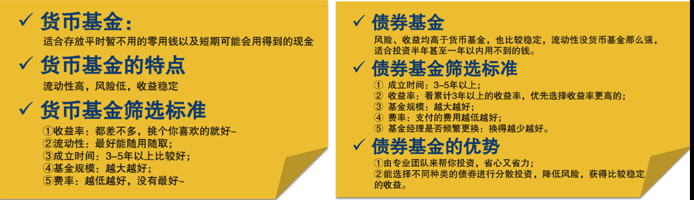
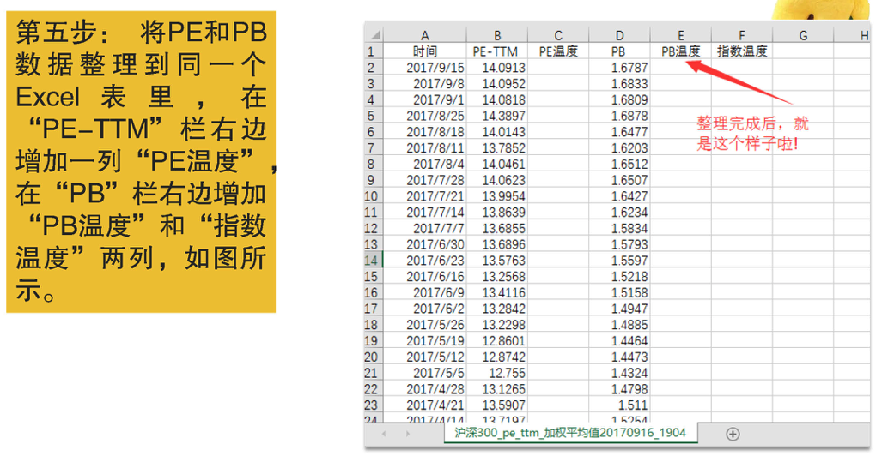
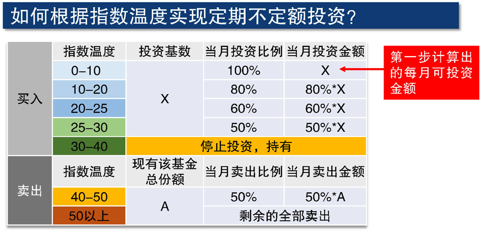
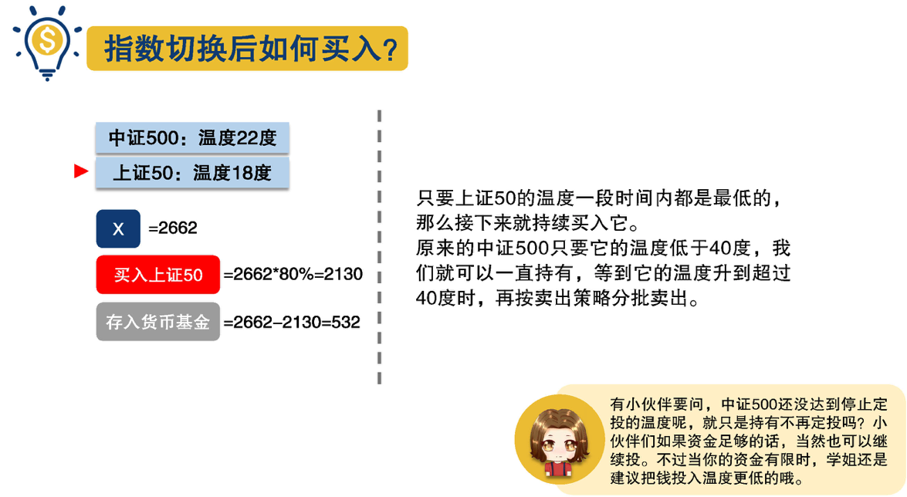

# 1. 什么是基金？

## 1.1 基金的概念

**基金**指为兴办、维持或发展某种事业而储备的资金或专门拨款。基金必须用于指定的用途，并单独进行核算。广泛的目的组成各种需求的基金。做为不同的投资基金，通常都有人专门打理并有相关的管理办法。

**证券投资基金**在美国被称为共同基金，在英国和香港被称为单位信托基金[1]，它是指通过公开发售基金份额募集资金，由基金托管人托管，由基金管理人管理和运用资金，以资产组合方式进行投资的一种利益共享、风险共担的集合投资方式[2]。

## 1.2 基金的优势

- 1、起手金额少，投资门槛低;
- 2、可以有效地分散风险;
- 3、有专业的基金经理打理，省心省时省力。

## 1.3 基金的风险

**不同基金的风险不同**

- 最主要的影响因素是基金投资产品的种类，其中股票的占比越高基金的风险就越高。
- 基金的资金量大小，基金经理的能力，都会影响基金的风险程度。

**适合自己的基金才是好基金**

- 每个人的投资目的，持续时间，风险承受能力都不同，所以选择的基金类型也因人而异。
- 选择基金-定要匹配自身情况，靠自己的知识去判断，不要指望着别人的推荐。

## 1.4 基金的分类

**不同分类方式之间并不冲突**

### 1.4.1 按照投资品种不同分类

#### 货币基金、债券基金

- 两者的篮子里都会装国债、地方政府债、公司债等等。
- 不同之处：债券基金除了投资债券，还可以投资股票，当然债券占比必须在80%以上。他们除了投资债券的比例不同，时间也不同，货币基金投资的一般是1年以内的短期债券，而债券基金则会较长，一般
是1年以上的债券。另外：货币基金投资的企业债的企业信用程度会更高，货币基金对安全的要求更严格，货币基金收益在%3-%4左右，债券基金在6%-7%。

#### 混合型基金

- 混合型基金稳中求进，同时投资了股票和债券，可以通过调整股票和债券的投资占比，实现收益与风险之间的平衡。
- 按照偏重股票还是债券，混合型基金还细分为偏股型基金、偏债型基金、平衡型基金。

#### 股票基金

股票基金里大部分是股票，占比在80%以上，另外会有少部分投资在债券等其他的投资品上。

### 1.4.2 按照投资渠道不同分类

#### 场内基金

场内基金是放在证券交易所里卖的基金，和你交易的是其他买家卖家，需要开通股票账户在证券公司购买。

#### 场外基金

场外基金就是在证券交易所之外买卖基金，交易的对象是基金公司，比如支付宝/基金官网内买基金。

#### 区别

- 场内价格是实时变动的，买卖价格是根据供求关系而变化。

看到的基金都是别人出一个价格挂出来卖，如果觉得对方的价格合适，就可以买入，如果觉得价格太高，那么可以寻找看看有没有其他更低的价格可以买入。

- 场外基金一天只有一个价格。

如果在3点前买入，那么是以当天下午3点证券市场交易结束时的价格结算; 3点后买入则是以下一个交易日结束后的价格结算。

- 交易费率、到账时间等也有不同。

### 1.4.3 按照运作方式不同分类

#### 开放式基金和封闭式基金

- 开放式基金是指这只基金的规模是不固定的，投资者可以在场外随时买入或者卖出， 基金的规模可以增加也可以减少。
- 封闭式基金在成立后的一段时间内规模是不变的，投资者只能在场内进行买卖，这段时间就叫做它的封闭期，一般在5年以上。

#### 开放式基金和封闭式基金的区别

- 开放式基金的话，我们可以随时向基金公司买入，也可以随时向基金公司卖出。
- 封闭式基金，在封闭期内我们不是和基金公司交易，而是在场内和其他投资人交易。

## 1.5 基金招募书

获取基金招募书的来源：基金公司官网、沪深交易所、巨潮资讯网

#### 如何读基金招募书

- 第一问买入的基金是什么类型？并快速判断大概的风险程度;
- 第二问了解基金公司还有基金经理：丑闻、违纪现象、从业时间、业绩水平，看是否可以放心把资金交给他们打理;
- 第三问了解资金的投资范围，可以进一步知道这只基金的风险程度。


# 2. 货币基金

货币基金一般投资于1年以内的国债、地方政府债和企业债。一般来说可以从收益率、流动性、成立时间、基金规模、费率等五项指标来剖析一下货币基金。

以“天天基金网”为例，进入“基金排行”，选择“货币基金排行”，并且选择“100元起(A类)”，
把筛选出来的基金按近3年的收益率从高到低排序，然后选择前10家。按从上往下的顺序，分
析每只基金的收益率、流动性、成立时间、基金规模、费率等五项指标。以“易方达天天增利货币A，基金代码000704”为例。


## 2.1 收益率

货币基金的收益情况,可以通过“每万份收益”和“7日年化”这两个指标判断。

所谓万份收益，就是指上一日或上一个交易日一万元本金能够赚多少钱，而7日年化收益则是指根据过去7天的收益总和，计算出的年化收益率。

**货币基金适合放-些随时会用到的钱，不要过分比较货币基金的收益，从整体来看，货币基金之间的收益不会有特别大的差异。**


## 2.2 流动性


因为货币基金投资投资的都是短期的金融产品，所以流动性好

## 2.3 成立时间


## 2.4 基金规模


## 2.5 费率


## 2.6 特点总结

**流动性高、风险低、收益稳定**

非常适合把一些可能近期会用到的钱或者不知道什么时候就会用到的钱放在里面，等要用的时候再赎回。


# 3. 债券基金

以“天天基金网”为例，点击“基金筛选”。在基金类型中选择“债券型”。也可以按照近三年收益率排名找前几个进行分析。

## 3.1 成立年限


## 3.2 收益率


## 3.3 基金规模


## 3.4 费率


## 3.5 基金经理是否频繁更换?


## 3.6 债券基金优势

- 短期来看，债券出现亏损的可能性是有的，但从长期来看，债基还是相当忠实可靠的，而且收益
会比一般的定期存款都高。
- 证券市场上债券无数，要从中选出值得投资的好债券需要投资者花费大量的时间和精力。既然基金的特点之一就是专家投资，那么由基金经理和他的团队来帮你投资省心又省力。
- 个人投资者资金有限，一方面在参与债券市场的时候会受到一些限制；另一方面，个人投资者很难做到分散投资，降低风险债券基金则具备资金上的优势，能选择不同种类的债券进行分散投资，降低风险，获得比较稳定的收益。

## 3.7 债券基金和货币基金的总结对比




# 4. 混合基金

**混合型基金最大的特点**：投资选择多，可以同时配置股票、债券、货币等，而且配置比例灵活，间接实现了分散投资，降低了风险。混合基金通过资产配置，简单来说就是进行一定比例的组合，以达到收益率最大、风险最小的目的。有时候表现好的话，混合基金的收益还会比股票基金高。

以“天天基金网”为例，点击“基金筛选”，基金类型选择“混合型”，然后在“基金业绩”这-项选择“近3年前100名”基金去分析。为什么是看三年呢？因为：过去1-2年的收益率可能是运气，但3-5年都能保持不错收益率的基金，那大概率就是有一定实力了。

## 4.1 基金的业绩（收益率）


## 4.2 基金规模


## 4.3 成立时间

**基金成立时间不能太短**


## 4.4 资产配置比例

投资风险和收益主要取决于股票与债券配置比例的大小，股票占比较高，风险和收益率也较高；债券占
比较高，风险和收益率就较低。


混合型基金因为可以根据市场来及时调整各项投资比例，所以风险要低于股票型基金，但又高于债券和货币基金，所以属于中高风险。


不要看到高收益就忘乎所以，这种高收益要持续才有意义，我们可以通过看管理他的企业靠不靠谱、基金经理能力如何来判断。


## 4.5 基金公司的盈利能力


## 4.6 基金经理的更换频率和选股择时能力

**经理更换的频率越少越好**


## 4.7 手续费


# 5. 股票型基金

- 混合基金投资比例非常灵活，不看好大盘后市的表现时可以完全不买股票，而感觉到有投资机会时则可以买入高达95%的仓位。
- **股票型基金：股票基金买股票的下限一般是80%**。


## 5.1 基金的业绩


在所有的基金产品中，只要有一定比例的资金是投资于股票上的，就必须承受价格的波动，也就意味着它们相对于货币、债券这样的投资产品的风险要大。

## 5.2 基金的规模


## 5.3 成立时间


## 5.4 基金公司盈利能力


## 5.5 基金经理的更换频率和选股择时能力


## 5.6 费率


## 5.7 筛选法则总结

混合型基金和股票型基金的筛选指标，主要考虑以下七个方面:

- 1. 基金的业绩越强越好
- 2. 基金规模2亿-100亿比较好
- 3. 基金成立时间3年以上
- 4. 基金公司盈利能力越强越好
- 5. 基金经理更换频率越少越好，基金经理选股择时能力仅作为排除指标
- 6. 手续费越低越好
- 7. 资产配置比例是混合基金筛选的核心，股票型基金不用考虑此项指标

混合基金和股票基金由于有不同比例的资金投资于股票市场，所以
波动很大，一些鱼目混珠的家伙初筛就可能没有被筛出去。**在熊市里表现很烂但牛市里表现强于大盘的基金要慎重 => 基金经理可能过于投机！**


# 6. 主动型基金和被动型基金

**主动型基金：**

基金经理拿了户主的钱替户主投资，投资哪家的股票、哪家的债券，都是由基金经理说了算，主动出
击，寻求超越平均水准的超值回报。

**被动型基金：**

基金经理不主动寻求超越市场的表现，一般选取特定的指数成份股作为投资的对象，试图复制指数的表现，又叫指数基金。

## 6.1 主动型基金

主动型基金包含了混合型基金、普通股票型基金和债券型基金等，筛选方法跟混合基金和股票基金的筛选方法样。主动型基金高收益的同时也是高风险。

### 主动型基金筛选面临的问题

- 主动型基金的关键因素在人，想要选择准，要看眼光狠不狠。
- 主动型基金需要根据市场做出调整，操作6不6决定了收益6不6。

主动型基金经理根据市场对基金的配置比例做出的调整，如果判断正确，就会盈利最大化。如果判断错误，经理依然赚钱，因为手续费还是要付的。

## 6.2 被动型基金

指数基金是最适合普通人的投资选择，“傻瓜”式投资，它的风险和收益不用依赖基金经理，风险不如主动基金高，“长期”来看，指数基金收益更高更稳定。


# 7. 指数基金

```
以十年为期限看：
- 标普指数：年化收益率达8.5%
- 伯克希尔哈撒韦指数：年化收益率达7.7%
```

指数基金，指的是跟踪特定的指数，并按照这个指数成分股的比例，买入同样的股票组合的基金。

## 7.1 指数

指数其实就是一个选股规则，它是按照某个规则挑选出一篮子股票，并由专业机构通过复杂的计算后算出这一篮子股票的平均价格，然后用来反映市场上这一类股票的价格水平。我们把这个平均价格称为指数点位，放在这个篮子里的这些股票，我们称它们是这只指数的成份股。成份股是变化的，如果某只成份股不再符合标准，是会被新的股票替换的。

### A股、港股、美股

所谓A股就是人民币普通股，是由中国境内公司发行、供境内机构、组织或个人以人民币认购和交易的普通股股票。简单地把它理解为国内股票市场。

国内公司在上市的时候，除了可以选择在A股上市之外，也可以选择去美股或者港股市场上市，国内大部分的公司都是在A股上市的。

### 国内股票市场主要指数

#### 上证50指数

- 由上海证券市场规模大、流动性好的最具代表性的50只股票组成;
- 反映的是，**上海证券市场最具市场影响力的一批龙头企业的整体状况**。

#### 沪深300指数

- 从上海和深圳两个交易所挑选出来的市值排名前300的，上市公司所组成的指数;
- **国内影响力最大、最重要的指数**。

#### 中证500指数

- 沪市和深市中市值排名前800的上市公司中，前300家入围了沪深300指数，剩下的500家则组成了中证500指数，**代表了中国股市中小型上市公司的平均水平。**

#### 创业板指数

- 专门选择在创业板上市的小型企业;
- 这些公司规模不够大，盈利也不够多，被主板上市的门槛挡在门外。

#### 红利指数

- 由高分红的企业组成的指数;
- 挑选的是.上证交易所过去两年现金分红最高、市值最大、流动性最好的50家公司;
- 是上证A股市场真正的核心优质资产。


### 国外股票市场主要指数

#### 美股市场

- 标普500指数
- 纳斯达克指数：涵盖了纳斯达克市场上上市的所有美国和外国的公司，是证券市场上非常有影响力的一只指数。

#### 港股市场

- 恒生指数：诞生于1964年，是从港股上市公司中选择50家具有代表性的公司股票组成的指数，是香港股市价格非常重要的指标，也是一个老牌优秀的指数，相当于上证50。
- H股指数：被称作恒生中国企业指数或国企指数，它挑选了在香港上市的规模最大的33家国内企业。

QDII又称为合格的境内投资者，简单地理解，就是我们可以用人民币投资海外股票市场。跟踪H股指数和恒生指数的基金就是H股指数基金和恒生指数基金，他们的特别之处在于，都属于QDII基金。**投资QDII基金可做为应对人民币贬值的对冲方法**。


## 7.2 指数基金的分类

**按指数基金是否通吃各行各业分类**

### 7.2.1 宽基指数基金

- 在挑选股票的时候，不限制投资哪些行业，它覆盖了各行各业。
- 沪深300、上证50、中证500、恒生指数、标准普尔500、纳斯达克100等就属于宽基指数。

覆盖的行业更多更广分配更均匀，受某个行业的影响小，盈利更稳定。

### 7.2.2 行业指数基金

- 在挑选股票的时候，会要求只投资哪些行业的股票。
- 行业指数,有代表消费行业的上证消费80、中证消费指数；代表医疗行业的中证医疗指数和代表
白酒行业的中证白酒指数等等。

投资特定的行业，受行业影响大，投资风险高一些。

**按复制方式分类**

### 7.2.3 完全复制型指数基金

完全复制目标指数所包含的所有成分股，照葫芦画瓢，追求的是获得和跟踪指数持平的收益。

### 7.2.4 增强型指数基金

除了复制目标指数外，基金经理还加入自己的一些主观投资，追求超过跟踪的指数的收益。

**选择指数基金就是看中它的被动性，为何还要选择需要人操心的增强型基金呢?**

## 7.3 指数基金的优点

### 7.3.1 灭绝人性

老鼠仓指的是少数无良的基金经理会利用事先知道的内幕信息，让自己和亲友提前低价买入股票，等到你还有其他人的资金进入之后，他们再以高位的价格卖出，把投资者和机构的钱收进自己的口袋。

主动型基金的最大的风险之一是老鼠仓，也叫老鼠吃猫。收益高低完全取决于基金经理的能力和判断。

指数基金是被动型基金，直接跟踪和复制指数，基金经理照着指数买自然也就不用做什么买入卖出决策，可谓是灭绝人性的代表了。

### 7.3.2 永垂不朽

公司有可能因为经营不善/黑天鹅事件而倒闭，公司经营不善也要砸锅卖铁去还债券，但是并不会对股价负责到底。所谓的黑天鹅，就是指非常难以预测，且不寻常的事件，通常会引起市场连锁负面反应甚至颠覆，例如武汉新冠肺炎事件。

如果我们买指数基金，其中几家公司，更甚至是组成这只指数的所有的公司都倒闭了，还会有其他新的公司补充进来。铁打的指数，流水的公司。

### 7.3.3 笑到最后

股市有一个“七亏二平一盈”的魔咒。投资指数基金，是通过投资指数成分股，来获得和市场持平的收益。长期看来，只要经济是持续向好的，指数基金就有投资的价值，甚至可以穿越牛熊市盈利。

## 7.4 指数基金的风险

- 指数基金本质是股票型基金，它依然存在风险。
- 虽然指数基金是复制和跟踪指数，来调整篮子里面的股票组合。但是基金经理如果复制得有偏差，或者没有及时跟着指数调整，也会带来收益方面的**误差风险**。
- 选择的指数基金规模小或者运作历史不长的话，也会有风险。比如小基金公司遇到大额赎回，但是没有足够的现金，只能买股票套现，如果恰逢股票跌停无法买出，则会有资金链断裂的风险。

## 7.5 如何选取指数基金？


### 7.5.1 确定想要投资的指数

选择指数基金的本质就是要选择指数，指数本身没有好坏之分，只有合适与否。对于大部分投资者来说，选择一个代表性强、主流的指数即可。只要指数本身是长期向上，就可以纳入投资范围。选择指数还可以结合自己的偏好或根据收益预期来决定。

如果想获得市场平均收益就可以选择代表A股的沪深300指数，最好选择宽基指数。

### 7.5.2 精选基金公司

基金公司的实力对指数基金的表现起着至关重要的作用。

在2015年股灾的时候，很多股票连续跌停，那个时候很多投资者手里拿着股票想卖都卖不出去，大量的投资人要赎回基金，而基金公司在应对大额赎回上的表现差距非常大，TOP10的基金公司无论实力还是经验都胜过小基金公司。

如何判断基金公司有没有实力呢?公司规模是一个重要的衡量标准，目前国内一般资金规模超1000亿的基金公司实力都不可小觑。

### 7.5.3 锁定指数基金的四个指标

#### 跟踪误差小

指数基金的投资目标就是为了完全复制指数，获得-个和指数-样的投资收益，那么判断。一个指数基金的好坏，关键并不是看它的收益率，而是跟踪误差率，误差率低说明基金运作水平高。

#### 基金规模大

规模越大，流动性越强的基金越好。一个指数基金规模较小，清盘（强制赎回）的概率就比较大。

#### 成立年限长

最好选择超过3年的，小于1年的不要考虑。

#### 费用成本低

费用包括管理费、托管费、申购费、赎回费，虽然大部分的基金费用为2%-3%，看起来也不是很大，但是在长期复利的威力下，就会对投资收益产生很大的影响，场内基金费用一般远比场外低。

### 7.5.4 例子（天天基金网）

- 确定想要投资的指数(以优秀的上证50为例来演示)

- 通过查询天天基金网，筛选出规模超千亿的基金公司。

- 找出这29家基金公司旗下的上证50基金并对比筛选。在基金公司排名的页面上有-个基金搜索框，在里面输入上证50，就会出来跟踪上证50的指数基金。


- 查找这7只基金的具体信息，对比进行进一步筛查


001549和001548这两只基金成立时间不满3年，剔除。


无论是跟踪误差率、规模还是费率的大小、多少，都必须是与同类基金相比较而得出的结果，并没有一个绝对的区间。


### 7.5 指数基金估值指标

#### 7.5.1 大盘点数？

- 不准确，因为指数是长期向上的，以香港的恒生指数为例，1964年只有100
点，而现在23000多点。

- 不同的指数不好对比。有的指数几万点是低估，有些指数5000点就是高估。

#### 7.5.2 看市盈率PE？

- 这个指标体现的是这笔投资到底要花多长时间才能拿回来，计算公式=市值/净利润，简单理解就是看一只股票的价格，相比它的盈利能力，是不是够便宜。

- 所以，可以通过市盈率初步判断一家公司是贵还是便宜，市盈率越低，公司越便宜，市盈率越高，公司越贵，但不能作为唯一指标。


PE的一大优点是快速有效，但是也有明显的缺陷：

- 不同的国家地区(如香港对中国)，不同的指数，估值的波动区间不一样。
- 就算在同一国家或地区来看，不同的行业市盈率各有不同，也没有可比性，而且就算有的市盈率低也并非就是好事。比如之前银行股票PE低但是市场不好，所以收益也不是很好。房地产企业PE很多低于10倍，但是负债很高，所以股票低迷。

### 7.5.3 看市净率PB？

市净率=市值/净资产，市净率体现的是公司的净资产是否被低估。

PB数值越低，公司越低估，股票越值得投资。但这个重要数据，跟市盈率指标一样，不能做唯一标准。比如对于一些轻资产的公司，他不需要投入太多的资产就能获取更多的利润，例如互联网行业。

### 7.5.4 指数温度

指数温度才是我们估值指标中的扛把子，是我们用来判断股市估值高低的依据。当指数温度越高，股市越火爆，风险越大，上涨的空间越小；温度越低，股市越冷清，风险则越小，上涨的空间更大。

我们可以把指数温度想象成一个范围是0-100度的温度计：

- 在0-10度之间，股票市场萎靡不振，一直在低位盘桓，但这个时候是最佳的买入时机
- 在10-20度之间，这个时候股票市场已经逐步企稳，蓄势待发中，仍是买入良机
- 在20-30度之间，股票市场一切欣欣向荣，可以继续买入
- 在30-40度之间，市场气氛热烈，可继续持有，但需提防风险
- 在40-50度之间，高温预警，可考虑逐步卖出
- 当温度大于90度，水都快要沸了，那简直堪比炮烙火刑，人间地狱，随时会灰飞烟灭。

### 7.5.5 计算指数温度

#### 计算原理

判断商品贵不贵的衡量标准是价格，而判断指数是否便宜的衡量标准则是估值。

这个估值包含了市盈率和市净率两个指标。通过计算这两个指标的温度，然后计算出

```
(PE温度+PB温度)/2
```

得出的就是这个指数的温度。

例子：当指数温度是20度时，说明历史中，估值低于当前估值的概率只有20%，现在的指数比较低估，适合买入，而当指数温度是80度时，说明在历史中，估值低于当前估值的概率高达80%，现在的指数就高估了，应该卖出。

要强调一点的是，指数温度的高低与价格高低没有必然的联系哦，指数温度的高低反映的是在历史中低于指数当前估值出现的概率。

#### 指数温度数据搜集与计算





指数小工具：长投学堂服务号里回复“指数温度”。这个界面里有常见指数的温度及对应的基金代码，可以根据这里的数据来选择自己的投资标的哦。

### 7.5.6 指数是否靠谱


从上面的数据可以看出，通过指数温度的投资方式就可以尽可能的避免主观情绪的影响，可以强化你的投资纪律，从而达到投资收益最大化。相比毫无选择地闭眼投资，获得长期年化收益率是8-10%；而如果用“指数温度”的这个策略，收益率可以达到20%。

## 7.6 指数基金投资方法

### 7.6.1 常见方式

#### 一次性投资

最简单省事、可以无脑操作的买入姿势。

缺点：如果买入基金后总是跌跌不休，这时想趁着价钱低再买入时，手里已经没有子弹，只能干瞪眼啦。

#### 不定期投资

需要择时投入，找到合适时机才下手买入。

缺点：这种投资方式会受到主观情绪的极大干扰，遇到市场暴涨暴跌的时候，很容易心态不稳情绪失控，从而影响到自己的决策：不定期投资因为它的难度和时间的不确定性，-般不像定投那样更能长期坚持。

#### 定期定额投资

社保和公积金，都是每个月从工资里扣除一部分，然后另一部分由单位帮你交，等到你退休了或者要买房子，需要用钱的时候，就可以把这部分钱取出来。这其实就是一种典型的定投。

- 强制储蓄：如果每个月15号发工资，可以设定16号进行基金定投的扣款，这样可以达到强制储蓄、告别月光的效果。
- 避免情绪干扰：只要用了正确的定投策略，坚持定投，就能获得合理的投资收益，而无需关注市场短期的涨跌。

#### 定期不定额投资

时间固定但投资金额不固定，投资金额根据基金的估值高低进行调整。

优点：主动地做到了便宜的时候多买点，贵的时候少买点甚至不买，在基金便宜的时候就能买到更多的基金份额。这也是定期不定额最重要的一个优点，投资坚持时间越长越划算，主要体现在“摊薄成本”上，时间越长，平均成本越低，利润也越高。

定期不定额投资，才是最推荐的定投方式，基金定投最佳投资姿势。


### 7.6.2 场内场外的区别？


#### 1. 交易渠道不同

- 场内

场内必须在证券公司的交易系统里下单买卖，证券公司也就是俗称的券商，比如华泰、广发等。

- 场外

场外通过银行柜台、网银、基金公司网站等平台进行交易，大家熟悉的蚂蚁金服，就是其中一个交易平台，还有部分券商也会跟基金公司合作，在券商的交易系统也能买到部分的场外基金。

一只基金究竟是属于场内交易还是场外交易，决定权在基金手里，如果他申请的是场内基金，那么就在场内交易，如果他申请的是场外基金，则使用场外的交易方式。场内场外都能交易的较为常见的是ETF基金和LOF基金。

#### 2. 交易费率不同

- 场内

场内买入或卖出单向交易费率最高不超过0.05%，现在很多券商都能做到万分之三，少部分券商只需每笔万分之且没有5元起点的限制。费率：万分之三交易1万元基金交易费用为10000 X 0.03% = 3元

- 场外

场外的买卖交易申购费率一般为0.6%到1.5%，赎回费率一般为0.5%。费率：千分之六交易1万元基金交易费用为10000 X 0.6% = 60元

场外交易的费用足足是场内交易的20倍，看到这个差距，是不是觉得场内交易超便宜啊。所以在选择渠道时，遇到同时有场内场外两个版本，而又有股票账户的话，优先选择场内。


#### 3. 委托方式不同

- 场内

场内交易的委托方式就是“买入卖出”了，是在证券市场上跟想要买卖的人直接交易。

- 场外

场外交易的委托方式是“申购赎回”。申购基金，实际上就是向基金公司申请购买新的基金份额；赎回基金，就是向基金公司申请卖出户主手里的基金份额，给回户主现金。

#### 4. 到账时间不同

- 场内

场内交易当天买入后下一个工作日就可以卖出了，卖出当天钱就会回到自己的证券账户。

- 场外

场外基金申购最快第2个交易日赎回，赎回后最快2-4天才能回到账户，然后再转账提现。

#### 5. 交易价格不同

- 场内

场内购买基金是按股票交易方式进行，主要是实时交易价格，同一交易日中实时交易价格是不断变化的，受买卖双方的需求关系的影响。

- 场外

场外申购，一天只有一个价格，最后的交易价格以当天收市时的基金单位净值为准。

基金单位净值其实就是一份基金的价值，等于基金当日根据收盘价计算出来的总市值减去当天的各类成本及费用，再除以基金发行的总份额数，在当天下午3点后发布。

委托时间不同，最后所依据的净值也不同，收市前的委托按3点后计算出来的当天净值算，而收市后的委托则按第二天收市后公布的净值算。

举个例子：广发行业领先A

2018年2月13日的净值是1.3942元，2月14日的净值是1.4027元。如果你是在2月13日开市期间(下午3点前)申请的申购或赎回，就按13日的净值1.3942成交，如果你在2月13日下午3点后才委托，那么交易价格就按14日的净值1.4027来算。

#### 6. 分红方式不同

- 场内

场内购买的基金的分红方式只有现金分红。

- 场外

场外购买的基金的分红方式有现金分红和红利再投资两种分红方式。大多数基金公司是允许投资者随时更改分红方式的，可以通过网络或者柜台来更改。现金分红方式是基金公司将基金收益的一部分，以现金的形式返还给投资者。红利再投资就是将分得的现金继续投入该基金，增加原基金的持有份额，不断滚动，是比较好的一种选择。

般基金管理公司为鼓励投资者继续投资，红利再投资他会直接拿这个钱帮你换成基金份额，不会再向你收取申购费。而现金分红也是不收取基金赎回费用的。

#### 7. 自动定投的设定不同

- 场内

场内没法自动定投，需要自己每个月到了定投日期去手动定投。

- 场外

场外只要你设置了定投时间和金额，系统就会自动定期替你购买。有场内场外两种选择时，优先考虑场内定投。

### 7.6.3 定投Tips

- 给定投日设置提醒：定投的意义就在于定期不定额的投入，如果坚持3个月、忘记5个月，那就没有任何意义了。

- 不加入主观臆断：在投资的过程中，不管是投资什么，最重要的事情就是一定要遵守投资纪律，克服人性中贪婪和恐惧的弱点。

- 收益投入再利用：赚到的钱千万不要随随便便用掉，而是应该作为投资本金继续来投资。


## 7.7 简投法

- 第一步:计算有目标时或者没有计划时每月的投资基数;
- 第二步:根据指数温度确定我们要投资的指数基金;
- 第三步:根据指数温度，确定买入卖出策略;
- 第四步:当出现另一只指数温度低于当前指数2度以上时，从温度高的指数切换到温度低的指数，买入更低的指数基金提高我们的收益率，待所有指数温度都高时再分批卖出。卖出后得到的钱，作为存量资金，待市场降温出现投资机会后，继续按照以上四步开启下一轮投资。








# 8. 投资心理

## 8.1 误区 - 不自信心理：我钱太少，不适合投资

6不积跬步无以至千里，不积小流无以成江河，越是钱少，越是要早日学理财。种一棵苹果树最好的时间是十年前，其次是现在。

- 缺乏开源节流和长期规划的投资意识

控制自己不合理的消费是第一步，第二步是努力养肥自己的鹅，创造更多的现金流，然后把这些现金流源源不断地投入理财中去，经过时间的发酵，雪球越滚越大，体验复利的威力。


## 8.2 误区 - 赌博心理：我想把所有的钱全部用来投资，以赚取更多的钱。

违背了基金投资的两个重要原则之一 => 闲钱

投资之前一定要先搞清自己的收入和消费状况，留足三个月的生活备用金和商业保险金，剩余的钱才能拿来投资。

记账小技巧:

- 善用手机上的记账APP
- 分类记账更清晰
- 定时记账不遗忘

这样连续记录几个月的收入和开支，你就能清晰了解自己消费的去向，判断自己真实的生活费用以及剩余资金量，然后计算出可投资资金，只用闲钱投资才更安心。

## 8.3 误区 - 投机心理：短期的波段操作、赚把钱就跑。

违背了基金投资的两个重要原则之一 => 长期

转变投资观念和方式，从短期投机转变到长期投资。要记住股市变幻莫测，永远不要尝试着去预测，更不要去搞什么短线操作。**除非是高频/量化策略**

## 8.4 误区 - 喜涨厌跌心理：希望股价一直上涨不要跌

指数往往在牛市的时候估值虛高，熊市的时候估值低迷，所以阶段性的低估会提供很好的买入机会，在经济周期底部的时候，买入一篮子低估的品种，然后耐心等待上行周期的到来，获取指数基金上涨带来的收益。

我们要正确认识到喜涨厌跌心理，做一个大智若愚的投资者，理性对待股市的波动，认识到涨跌对我们来说都是有利的。

## 8.5 误区 - 不知足心理：止盈早了感觉赚少了

进行心理预期管理。 没人能预测股市，没有赚到的钱就是在自己能力范围之外的钱。做好自己定投计划，并坚持按照指数温度的策略买卖，赚自己能赚到的钱才是王道。

## 8.6 误区 - 盲目从众心理：我的基金的盈利不如别人的股票，要不要换成股票?

只要能够坚持闲钱加长期原则，以及根据温度来进行定期不定额的策略，平均年化收益率15%-20%左右是没有问题的。股票投资确实能带来更高的收益，但跟基金一样，也是有很多原则和策略的，需要先进行系统学习才能开始实战。

## 8.7 最佳基金投资心理

### 高筑墙，广积粮，缓称王

- 高筑墙：寻找低温度指数基金
- 广积粮：开源节流，养大下蛋的鹅
- 缓称王：不急不躁，坐等财富增值，享受复利威力 

### 做一名佛系的投资者

指数基金长期内一定是向好的，但它什么时候跌什么时候涨都不受我们的控制，我们着急也没用，我们唯一能做的就是努力工作赚钱，然后把更多的钱投到低温度的指数基金里，静静等待它上涨的时候带着我们更多的惊喜。


# 9. 资产配置

把资产按50-50的比例分配到股权类和债权类资产中，这是资产配置中最简单易操作的方法。

对于普通投资者来说，股票和债券这两种投资需要的本钱不大，够亲民，虽各有优缺点，但他们互补的特性恰好可以为我们配置资产提供便利。

- 债券：风险较低预期年收益6%-7%，想跑赢通货膨胀不可能
- 股票：长期来看收益最高，常常不按常理出牌，全副身家押在它身上，容易提心吊胆。

如果我们的计划是50%买指数基金，50%买债券基金，那么就要同时买入，不能时买时不买，也不能只买组合中的部分品种，只有这样才能实现我们的进可攻退可守哦。

资产配置，就是让你可以在非常看好一个市场的时候，还能忍住不全仓杀入，因为现在看起来好的市场，未来未必仍会好，而现在看起来不好的市场，未来也未必仍会不好。

## 9.1 如何制定和实施资产配置?

- 第一步：根据自己的风险承受能力和偏好确定资产配置的策略和规则

刚开始的时候可以采用最简单的50:50股债策略，规则是将股权类资产和债权类资产严格控制在50:50的比例上。**这里的股权类资产建议使用前面重点介绍的各种指数型基金，债权类资产包括货币基金和债券基金**。

- 第二步：每年做一次动态再平衡，根据帐户资金的变化按制定的策略重新调整一次 资产比例。

严格执行这个策略就可以在股市中被动地进行低卖高卖，也被动地克服了人性的恐惧和贪婪。

注意，重点在于它是“被动”的，我们不需要做任何预判，就实现了多数投资者梦寐以求的“低买高卖”。股市和债市的波动越大，对我们就越有利。


## 9.2 资产配置技巧

### 技巧一：股票类资产可以再细分成几个不同的指数类型

如果想要获得更好的收益，同时更加分散风险，可以再将50%的股权类资产按照指数基金的不同类型再细分。

在A股市场中一般有这样的现象存在，当公司市值超过500亿的大盘股涨时，市值低于500亿的中小盘股一般不涨或下跌，反之，小盘股涨时大盘股则下跌或没表现。基于这种资产波动的特点，我们可以同时配置大盘股基金和小盘股基金。

不同国家和地区经济发展不同步，指数基金是跟随经济涨跌的，经济发展不同步，指数基金的涨跌当然也就不同步。比如同时配置A股和美股或港股的指数基金。

行业指数基金的投资：白酒、银行等。

### 技巧二：灵活调整股票和债券的配置比例

配置比例并非一成不变，随着投资水平的不断提高，我们可以在动态再平衡策略中加入一些主动的因素。

当指数温度低时多配指数基金，而指数温度高时则多配债券，这个投资比例可以在70:30到30:70之间来回变化。


