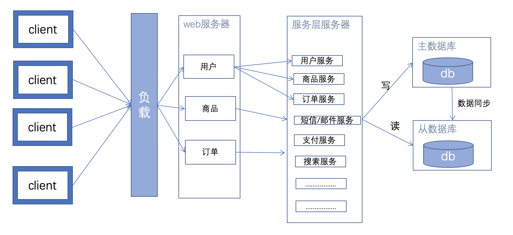
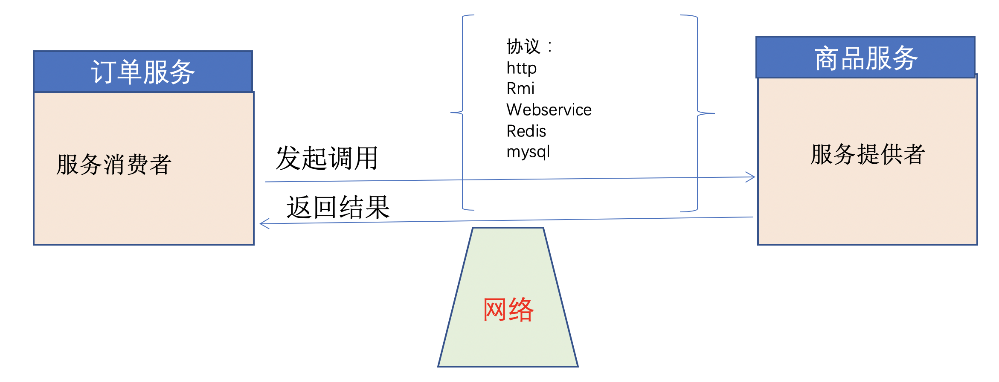
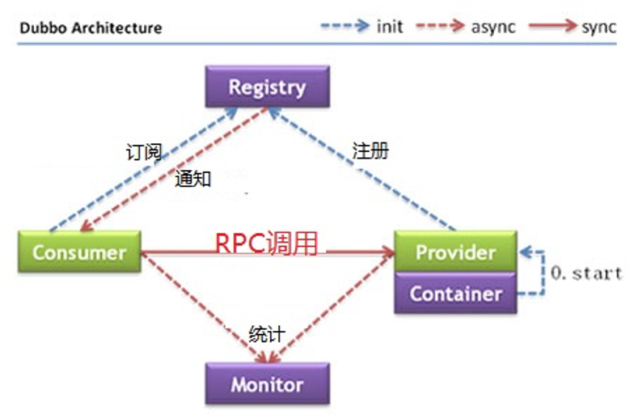
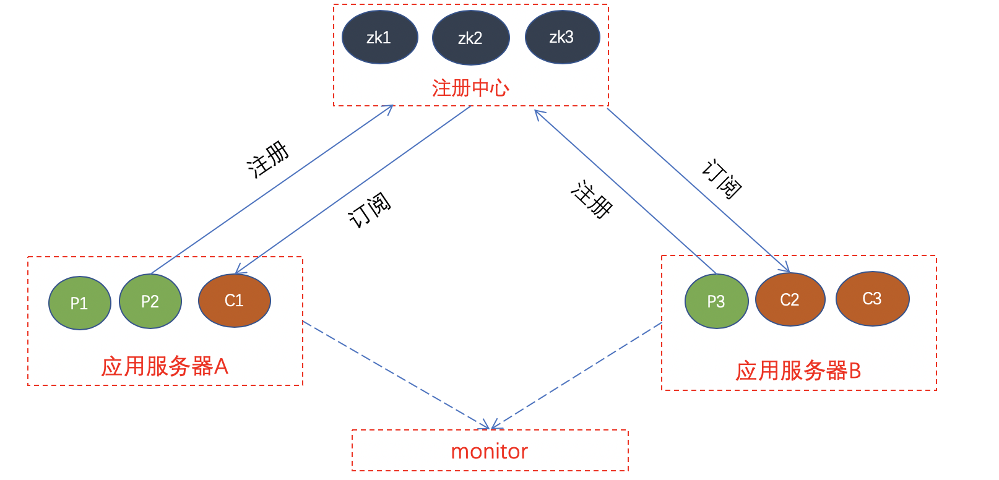
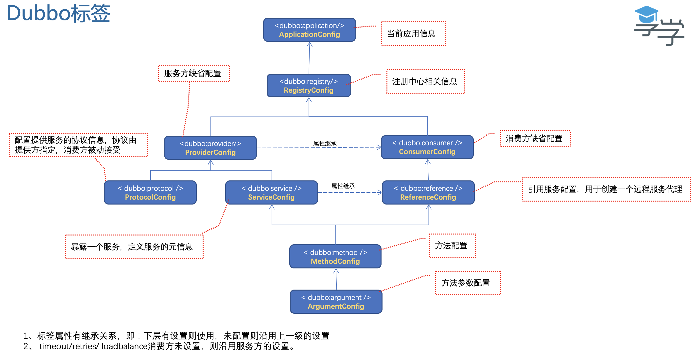
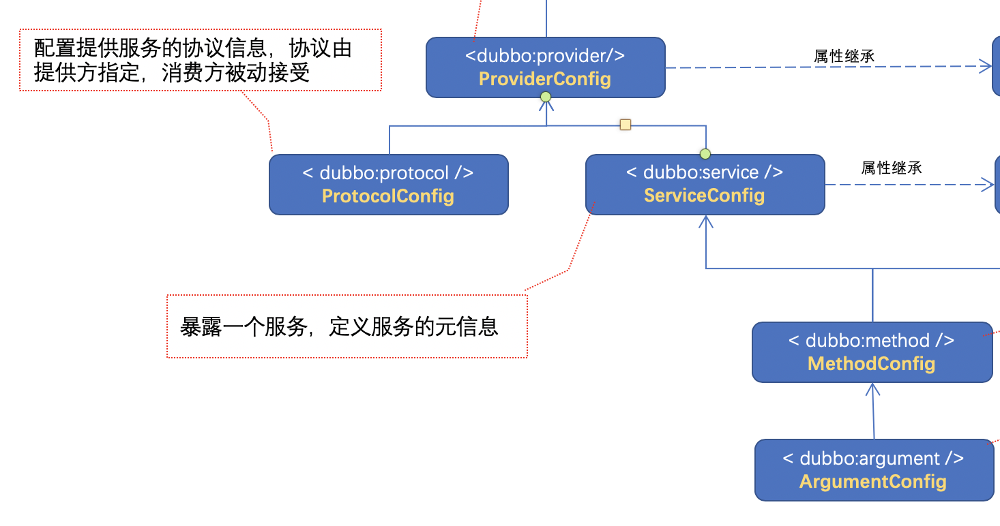
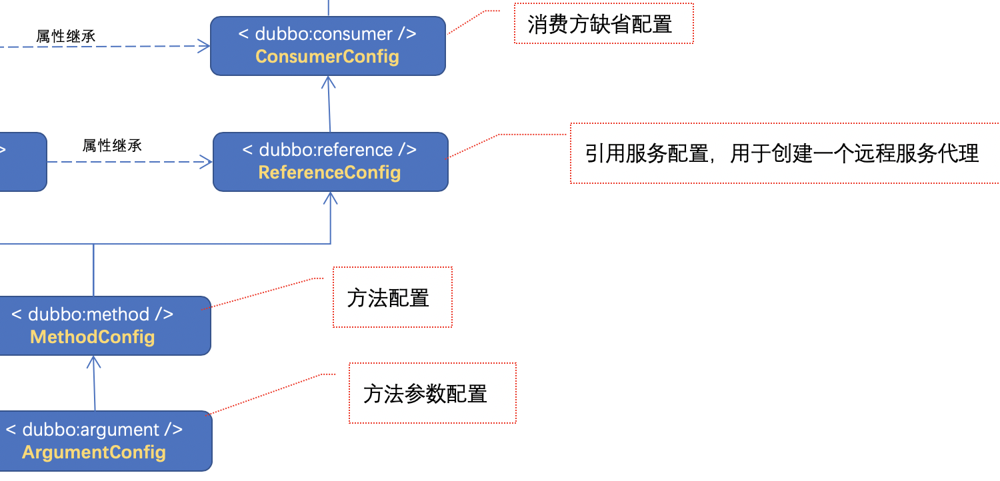
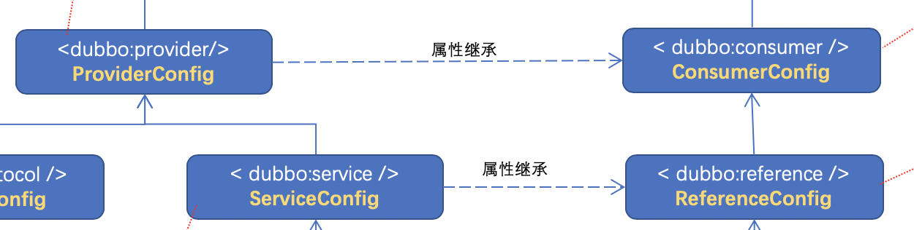

# 1. Dubbo简介

## 1.1 分布式服务结构



## 1.2 RPC示意图



RPC普遍存在的问题需求：

- 1、rpc调用需要定制。额外的工作量
- 2、分布式服务中，服务动辄几十上百，相互之间的调用错综复杂，相互依赖严重
- 3、对集群性的服务，需要负载策略
- 4、对集群性的服务，能动态扩展节点

## 1.3 Dubbo

Dubbo是一个一个分布式、高性能、透明化的RPC服务框架。(对业务类没有侵入、就好像掉用本地方法)提供服务自动注册、自动发现等高效服务治理方案。

其功能主要包括：高性能NIO通讯及多协议集成，服务动态寻址与路由，软负载均衡与容错，依赖分析与降级等。

```
--》2011年开源
--》2012-10 停止重要升级
--》2014-10 停止更新
--》2017-10起死回生
--》2018-02进入 Apache 孵化
```

### Dubbo结构及功能



- 1、container负责启动、加载、运行provider
- 2、provider启动时，向registry注册自己的服务；报告增加服务节点
- 3、cousumer启动时，向registry订阅自己的服务；收到报告，知道有几个服务供我调用
- 4、registry提供provider列表给consumer，实时推送变动情况
- 5、consumer根据provider列表，按负载算法选一台provider调用
- 6、monitor统计rpc的调用频次

### 项目部署中的dubbo



生产者发布一个服务过程：注册/协议/服务实现

消费者请求一个服务：注册/引用服务接口/方法

注册中心zookeeper：dubbo的消费/服务信息都注册在zookeeper上，可用dubbo admin读取相关信息

- 1、一台应用服务(application)内，既有对外提供服务(provider)，也有依赖外部服务(consumer)
- 2、provider涉及：registry/protocol/service/method/provider
- 3、consumer涉及：registry/reference/method/consumer
- 4、每台服务接口的信息，都会反映到monitor。以application的名称标识属于哪个应用。


# 2. 配置

## 2.1 xml配置provider

### 1. 引入dubbo依赖包

```xml
// pom.xml

	  <dependency>
            <groupId>com.101tec</groupId>
            <artifactId>zkclient</artifactId>
            <version>0.3</version>
        </dependency>
        <dependency>
            <groupId>org.apache.zookeeper</groupId>
            <artifactId>zookeeper</artifactId>
            <version>3.6.0</version>
        </dependency>
        <dependency>
            <groupId>com.alibaba</groupId>
            <artifactId>dubbo</artifactId>
            <version>${dubbo.version}</version>
            <scope>compile</scope>
            <exclusions>
                <exclusion>
                    <artifactId>spring</artifactId>
                    <groupId>org.springframework</groupId>
                </exclusion>
            </exclusions>
        </dependency>
```
### 2. 把serviceImpl配置进入spring容器，管理服务

dubbo只能支持spring的管理服务

```xml
// dubbo.xml
 <!--和本地bean一样实现服务 -->
    <bean id="orderService" class="com.enjoy.service.impl.OrderServiceImpl"/>
    <bean id="userService" class="com.enjoy.service.impl.UserServiceImpl"/>
    <bean id="vipUserService" class="com.enjoy.service.impl.VipUserServiceImpl"/>
```
 
### 3. 把spring管理的服务，转换成RPC服务对外开放

```xml
// dubbo.xml
	<dubbo:service interface="com.enjoy.service.OrderService" ref="orderService" protocol="dubbo">
        <dubbo:method name="getDetail" cache="lru" />
    </dubbo:service>

    <dubbo:service interface="com.enjoy.service.UserService" ref="userService" protocol="rmi"/>
    <dubbo:service interface="com.enjoy.service.VipUserService" ref="vipUserService" />
```
 
### 4. 把spring管理的服务，转换成RPC服务对外开放

启动spring容器

```java
ClassPathXmlApplicationContext context =
                new ClassPathXmlApplicationContext("classpath:dubbo.xml");
        context.start();
```

## 2.2 xml配置consumer

### 1. 引入dubbo依赖包

以dubbo 2.5.7为例

```xml
// pom.xml
	 <!-- dubbo 基础包 -->
        <dependency>
            <groupId>com.101tec</groupId>
            <artifactId>zkclient</artifactId>
            <version>0.3</version>
        </dependency>
        <dependency>
            <groupId>org.apache.zookeeper</groupId>
            <artifactId>zookeeper</artifactId>
            <version>3.6.0</version>
        </dependency>
        <dependency>
            <groupId>com.alibaba</groupId>
            <artifactId>dubbo</artifactId>
            <version>${dubbo.version}</version>
            <scope>compile</scope>
            <exclusions>
                <exclusion>
                    <artifactId>spring</artifactId>
                    <groupId>org.springframework</groupId>
                </exclusion>
            </exclusions>
        </dependency>
```

### 2. 在spring中配置引入的远程服务

```xml
<!-- 生成远程服务代理，可以和本地bean一样使用demoService -->
    <dubbo:reference id="orderService" interface="com.enjoy.service.OrderService" >
        <dubbo:method name="getDetail" cache="lru" />
    </dubbo:reference>

    <dubbo:reference id="userService" interface="com.enjoy.service.UserService"  />
    <dubbo:reference id="vipUserService" interface="com.enjoy.service.VipUserService"  />
```
 
### 3. web工程方式启动mvc容器

web.xml只用配置Spring-mvc部分，由spring-mvc去加载dubbo

```xml
//web.xml
<!-- Spring MVC servlet -->
    <servlet>  
        <servlet-name>SpringMVC</servlet-name>  
        <servlet-class>org.springframework.web.servlet.DispatcherServlet</servlet-class>  
        <init-param>  
            <param-name>contextConfigLocation</param-name>
            <param-value>classpath:spring-mvc.xml</param-value>
        </init-param>  
        <load-on-startup>1</load-on-startup>  
        <async-supported>true</async-supported>  
    </servlet>  
    <servlet-mapping>  
        <servlet-name>SpringMVC</servlet-name>  
        <!-- 此处可以可以配置成*.do，对应struts的后缀习惯 -->  
        <url-pattern>/</url-pattern>  
    </servlet-mapping>  
```

### 4. 让spring容器加入dubbo配置文件

```xml
//spring-mvc.xml
 <import resource="dubbo_annotation.xml"/>
```

### 5. 尽量不要在web.xml中分开在listen和servlet中分开配置springmvc和dubbo.xml

```xml
//web.xml 中不要这么配
<listener>
        <listener-class>spring dubbo配置</listener-class>
</listener>
```
 
 
## 2.3 properties配置

properties文件配置方式，优先级最低（xml缺的配置由属性文件顶上）

```
# 应用名
dubbo.application.name=storeServer_properties
# 注册中心地址
dubbo.registry.address=zookeeper://127.0.0.1:2181
# 调用协议地址
dubbo.protocol.name=dubbo
dubbo.protocol.port=28080
```

## 2.4 用注解方式配置

大同小异，只是需要加一个包扫描标签

### 1. 服务方

```xml
// dubbo.xml
 <context:component-scan base-package="com.enjoy.dao"/>

    <!-- 提供方应用信息，用于计算依赖关系 -->
    <dubbo:application name="storeServer_annotation"/>

    <!-- 使用zookeeper注册中心暴露服务地址 -->
    <dubbo:registry address="zookeeper://127.0.0.1:2181"/>

    <!-- 用dubbo协议在20880端口暴露服务 -->
    <dubbo:protocol name="rmi" port="20880"/>

    <dubbo:annotation package="com.enjoy.service" /> //服务提供方包扫描服务包
```

同时，组件所使用的@Service不能是spring原生的，应当用dubbo的@Service

```java
@Service // => com.alibaba.dubbo.config.annotation.Service
public class UserServiceImpl implements UserService {
	//...
}
```

### 2. 消费方

```xml
<!-- 提供方应用信息，用于计算依赖关系 -->
    <dubbo:application name="enjoyStore_annotation"/>

    <!-- 使用zookeeper注册中心暴露服务地址 -->
    <!--<dubbo:registry address="zookeeper://127.0.0.1:2181" check="false"/>-->

    <dubbo:annotation package="com.enjoy.controller" /> // 扫描controller包
```

同时，应当用dubbo的@Reference

```java
@Controller
public class IndexController implements ApplicationContextAware{
   private ApplicationContext context;

    @Reference // => com.alibaba.dubbo.config.annotation.Reference
    private UserService userService;
    //...
}
```

## 2.5 dubbo配置标签理解




```xml
	<!-- 提供方应用信息，用于计算依赖关系 -->
    <dubbo:application name="storeServer_annotation"/>
    <!-- 使用zookeeper注册中心暴露服务地址 -->
    <dubbo:registry address="zookeeper://127.0.0.1:2181"/>
```

这两个标签，provider和consumer都得配置

### provider的标签



- 标签属性有继承关系，即：下层有设置则使用，未配置则沿用上一级的设置

- provider：为默认配置，如药企继承作用，如timeout=1

- protocol：service配置目标实现类

- method：就是service配置的子标签

```xml
<dubbo:service interface="com.enjoy.service.OrderService" ref="orderService" protocol="dubbo">
        <dubbo:method name="getDetail" cache="lru" />
    </dubbo:service>
```

### comsumer的标签



### comsumer继承provider属性

因为只有provider，知道service怎么配置参数最合适，例如调整timeout




## 2.6 用API的方式发布和消费dubbo

```java
package com.enjoy.api;

public class StoreProvider {
    public static void main(String[] args) throws IOException {
        initDubbo();
    }

    public static void initDubbo() throws IOException {
            // 当前应用配置
            ApplicationConfig application = new ApplicationConfig();
            application.setName("StoreServerApi");

            // 连接注册中心配置
            RegistryConfig registry = new RegistryConfig();
            registry.setProtocol("zookeeper");
            registry.setAddress("172.17.0.2:2181");

            // 服务提供者协议配置
            ProtocolConfig protocol = new ProtocolConfig();
            protocol.setName("rmi");
            protocol.setPort(21880);
            protocol.setThreads(100);

            // 注意：ServiceConfig为重对象，内部封装了与注册中心的连接，以及开启服务端口
            // 服务提供者暴露服务配置
            // 此实例很重，封装了与注册中心的连接，请自行缓存，否则可能造成内存和连接泄漏
            ServiceConfig<VipUserService> service = new ServiceConfig<>();

            service.setApplication(application);
            service.setRegistry(registry); // 多个注册中心可以用setRegistries()
            service.setProtocol(protocol); // 多个协议可以用setProtocols()
            service.setInterface(VipUserService.class);
            service.setRef(new VipUserServiceImpl());

            // 暴露及注册服务
            service.export();

            System.in.read();

    }
}


package com.enjoy.api;

public class StoreConsumer {
    public static void main(String[] args) throws IOException {
        // 当前应用配置
        ApplicationConfig application = new ApplicationConfig();
        application.setName("StoreServerClientApi");

        // 连接注册中心配置
        RegistryConfig registry = new RegistryConfig();
        registry.setProtocol("zookeeper");
        registry.setAddress("172.17.0.2:2181");

        // 服务提供者协议配置
        ProtocolConfig protocol = new ProtocolConfig();
        protocol.setName("dubbo");
        protocol.setPort(20882);
        protocol.setThreads(100);

        // 注意：ReferenceConfig为重对象，内部封装了与注册中心的连接，以及与服务提供方的连接
        // 引用远程服务
        ReferenceConfig<VipUserService> reference = new ReferenceConfig<>(); // 此实例很重，封装了与注册中心的连接以及与提供者的连接，请自行缓存，否则可能造成内存和连接泄漏
        reference.setApplication(application);
        reference.setRegistry(registry); // 多个注册中心可以用setRegistries()
        reference.setInterface(VipUserService.class);

        // 和本地bean一样使用xxxService
        VipUserService vipUserService = reference.get(); // 注意：此代理对象内部封装了所有通讯细节，对象较重，请缓存复用
        String ret = vipUserService.getVipDetail("123");
        reference.destroy();
        System.out.println(ret);
    }
}
```


## 2.7 Spring Boot配置Dubbo

### 1. 引入pom依赖

```xml
<!-- dubbo 基础包 -->
        <dependency>
            <groupId>com.101tec</groupId>
            <artifactId>zkclient</artifactId>
            <version>0.3</version>
        </dependency>
        <dependency>
            <groupId>org.apache.zookeeper</groupId>
            <artifactId>zookeeper</artifactId>
            <version>3.4.5</version>
        </dependency>
        <dependency>
            <groupId>com.alibaba</groupId>
            <artifactId>dubbo</artifactId>
            <version>${dubbo.version}</version>
            <scope>compile</scope>
            <exclusions>
                <exclusion>
                    <artifactId>spring</artifactId>
                    <groupId>org.springframework</groupId>
                </exclusion>
            </exclusions>
```
 
### 2.指定包路径

```java
@SpringBootApplication
@DubboComponentScan(basePackages = "com.enjoy") // 扫描包路径
public class BootApp {
    public static void main(String[] args) {
        SpringApplication.run(BootApp.class, args);
    }
}
```

### 3. Spring Boot配置类

```java
@Configuration
public class DubboConfiguration {

    @Value("${dubbo.zookeeper}")
    private String zkAddr;
    @Value("${dubbo.name}")
    private String appName;

    @Bean
    public ApplicationConfig applicationConfig() {
        ApplicationConfig applicationConfig = new ApplicationConfig();
        applicationConfig.setName(appName);
        return applicationConfig;
    }

    @Bean
    public RegistryConfig registryConfig() {
        RegistryConfig registryConfig = new RegistryConfig();
        registryConfig.setAddress(zkAddr);
        return registryConfig;
    }

    @Bean
    public ProtocolConfig protocolConfig() { // 类似dubbo的API方式
        ProtocolConfig protocolConfig = new ProtocolConfig();
        protocolConfig.setName("dubbo");
        protocolConfig.setPort(20881);
        return protocolConfig;
    }
}
```

以及相关配置文件

```
// application.yml
server:
  port: 8090
  compression:
    enabled: true
  connection-timeout: 3000

dubbo:
  name: storeBoot
  zookeeper: zookeeper://172.17.0.2:2181
  
swagger:
  host: local.dev.com

```

### 4. provider标签

dubbo的@Service注解一共会产生两个实例，有两个功能：

- 注册服务到spring容器
- 暴露为RPC服务

```java
import com.alibaba.dubbo.config.annotation.Service;

@Service
public class ProductServiceImpl implements ProductService {

    @Override
    public String getDetail(String id) {
        System.out.println(super.getClass().getName()+"被调用一次："+System.currentTimeMillis());
        return "iponex 售价：1万元";
    }
}
```

### 5. comsumer标签

```java
import com.alibaba.dubbo.config.annotation.Reference;

@RestController
public class IndexController {
    @Reference(check = true)
    private UserService userService;

    @Reference(check = true)
    private OrderService orderService;

    @Autowired
    private ProductService productService;

    @RequestMapping(value = "/index", method = RequestMethod.GET)
    public Map index(HttpServletRequest request, HttpServletResponse response) {

        String id = request.getParameter("id");
        String userView = userService.getDetail(id);
        String orderView = orderService.getDetail(id);
        String productView = productService.getDetail(id);

        Map map = new HashMap<>();
        map.put("userView", userView);
        map.put("orderView", orderView);
        map.put("productView", productView);
        return map;
    }
}
```
 
 
 
 
 
 
 
 
 
 
 