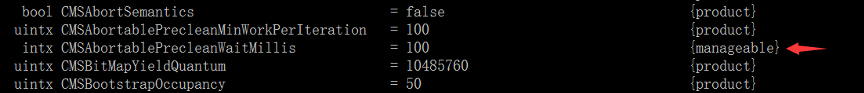

# 1. JVM简介

### Sun/Oracle系列的虚拟机

- Sun Classic/Exact VM：第一款商用Java虚拟机
- HotSpot VM：目前使用范围最广的Java虚拟机
- Mobile系列：面对移动和嵌入式市场

### BEA/IBM/MICROSOFT/GOOGLE

- BEA JRockit、IBM J9 VM、BEA Liquid VM
- Google Android、Dalvik VM
- Apache Harmony、Microsoft JVM及其他

### 未来的Java技术

模块化、混合语言、多核并行、丰富语法、64位、更强的垃圾回收


# 2. 运行时数据区域

定义：Java虚拟机在执行Java程序的 过程中会把它所管理的内存划 分为若干个不同的数据区域

类型：程序计数器、虚拟机栈、本地方法栈、Java堆、方法区(运行时常量池)、直接内存


- 程序计数器：较小的内存空间，当前线程执行的字节 码的行号指示器;各线程之间独立存储，互不影响; 

- java栈：线程私有，生命周期和线程，每个方法在执行 的同时都会创建一个栈帧用于存储局部变量表，操作 数栈，动态链接，方法出口等信息。方法的执行就对应着栈帧在虚拟机栈中入栈和出栈的过程；栈里面存放着各种基本数据类型和对象的引用(-Xss)；栈桢大小缺省为1M，可用参数 –Xss调整大小，例如-Xss256k

- 本地方法栈：本地方法栈保存的是native方法的信息，当一个JVM创建的线程调用native方法后，JVM不再为其在虚拟机栈中创建栈帧，JVM只是简单地动态链接 并直接调用native方法;


- 堆：Java堆是Javaer需要重点关注的一块区域，因为涉及到内存的分配 (new关键字，反射等)与回收(回收算法，收集器等) (-Xms; -Xmx; -Xmn; -XX:NewSize; -XX:MaxNewSize);

几乎所有对象都分配在这里，也是垃圾回收发生的主要区域，可用以下参数调整：

```bash
-Xms：堆的最小值；
-Xmx：堆的最大值；
-Xmn：新生代的大小；
-XX:NewSize：新生代最小值；
-XX:MaxNewSize：新生代最大值；
例如 -Xmx256m
```

- 方法区：也叫永久区，用于存储已经被虚拟机加载的类信息，常量("zdy","123"等)，静态变量(static变量)等数据(-XX:PermSize; -XX:MaxPermSize; -XX:MetaspaceSize; -XX:MaxMetaspaceSize)。

```
jdk1.7及以前：-XX:PermSize；-XX:MaxPermSize；
jdk1.8以后：-XX:MetaspaceSize； -XX:MaxMetaspaceSize
jdk1.8以后大小就只受本机总内存的限制
如：-XX:MaxMetaspaceSize=3M
```

- 运行时常量池：运行时常量池是方法区的一部分，用于存放编译期生成 的各种字面量("zdy","123"等)和符号引用。


## 各个版本内存区域的变化


[JVM内存：年轻代，老年代，永久代](https://blog.csdn.net/sted_zxz/article/details/72476673)

[Major GC和Full GC的区别是什么？触发条件呢？](https://www.zhihu.com/question/41922036)

永久代来存储类信息、常量、静态变量等数据不是个好主意, 很容易遇到内存溢出的问题。对永久代进行调优是很困难的, 同时将元空间与堆的垃圾回收进行了隔离，避免永久代引发 的Full GC和OOM等问题;

- 1）Full GC定义是相对明确的，就是针对整个新生代、老生代、元空间（metaspace，java8以上版本取代perm gen）的全局范围的GC；

- 2）Minor GC和Major GC是俗称，在Hotspot JVM实现的Serial GC, Parallel GC, CMS, G1 GC中大致可以对应到某个Young GC和Old GC算法组合；

## 直接内存


直接内存：不是虚拟机运行时数据区的一部分，也不是java虚拟机规范中定义的内存区域;

直接内存用于IO场景比较多，如果使用直接内存，可以省去OS从网卡缓存（系统态）拷贝数据到用户态，虚拟机需要使用网络数据可以直接去读取。但是需要节制使用，因为如果网络通讯不正常，可能造成网卡缓存堆积。影响系统整体的运行

如果使用了NIO，这块区域会被频繁使用，在java堆内可以用directByteBuffer对象直接引用并操作；这块内存不受java堆大小限制，但受本机总内存的限制，可以通过-XX:MaxDirectMemorySize来设置（默认与堆内存最大值一样），所以也会出现OOM异常。

```java
ByteBuffer b = ByteBuffer.allocateDirect(1024*1024*14);

// 如果运行时配置
-XX:MaxDirectMemorySize=10M

// output
Exception in thread "main" java.lang.OutOfMemoryError: Direct buffer memory
```


## 站在线程角度来看


## 深入辨析堆和栈

功能：

- 以栈帧的方式存储方法调用的过程，并存储方法调用过程中基本数据类型的变量(int、short、long、byte、float、double、boolean、char等)以及对象的引用变量，其内存分配在栈上，变量出了作用域就会自动释放;

- 而堆内存用来存储Java中的对象。无论是成员变量，局部变量，还是类变量，它们指向的对象都存储在堆内存
中;

线程独享还是共享：

- 栈内存归属于单个线程，每个线程都会有一个栈内存，其存储的变量只能在其所属线程中可见，即栈内存可以
理解成线程的私有内存。
- 堆内存中的对象对所有线程可见。堆内存中的对象可以被所有线程访问。

空间大小：

- 栈的内存要远远小于堆内存，栈的深度是有限制的，可能发生StackOverFlowError问题。


## 方法的出入栈


### 栈上分配

虚拟机提供的一种优化技术，基本思想是，对于线程私有的对象，将它打散分配在栈上，而不分配在堆上。好处是对象跟着方法调用自行销毁，不需要进行垃圾回收，可以提高性能。

栈上分配需要的技术基础，逃逸分析。逃逸分析的目的是判断对象的作用域是否会逃逸出方法体。注意，任何可以在多个线程之间共享的对象，一定都属于逃逸对象。

```java
public void test(int x,inty ){
	String x = "";
	User u = ….
}
```
User类型的对象u就没有逃逸出方法test。

```java
public  User test(int x,inty ){
	String x = “”;
	User u = ….
	return u;
}
```
User类型的对象u就逃逸出方法test。

### 如何启用栈上分配

```java
public class Escape {

    public static class User {
        public String name;
        public int age;
    }

    public static void alloc() {
        User user = new User();
        user.age = 66;
        user.name = "hh";
    }

    public static void main(String[] args) {
        long start = System.currentTimeMillis();
        for (long i = 0; i < 1000000000; i++) {
            alloc();
        }
        System.out.println("Duration: " + (System.currentTimeMillis()-start) + " ms");
    }
}
```
#### 正常运行结果：

```
Duration: 721 ms

Process finished with exit code 0
```

#### 打开栈上分配：

VM options:

```
-server
-Xmx10m
-Xms10m
-XX:+DoEscapeAnalysis
-XX:+PrintGC
-XX:+EliminateAllocations
-XX:-UseTLAB
```

Output:

```
[GC (Allocation Failure)  2047K->472K(9728K), 0.0008107 secs]
Duration: 439 ms

Process finished with exit code 0
```

#### 关闭栈上分配：

VM options:

```
-server
-Xmx10m
-Xms10m
-XX:+DoEscapeAnalysis
-XX:+PrintGC
-XX:-EliminateAllocations
-XX:-UseTLAB
```

Output:

```
...
[GC (Allocation Failure)  3009K->961K(9728K), 0.0002852 secs]
Duration: 18145 ms

Process finished with exit code 0
```

#### 使用JVM参数说明

```
-server JVM运行的模式之一, server模式才能进行逃逸分析， JVM运行的模式还有mix/client
-Xmx10m和-Xms10m：堆的大小
-XX:+DoEscapeAnalysis：启用逃逸分析(默认打开)
-XX:+PrintGC：打印GC日志
-XX:+EliminateAllocations：标量替换(默认打开)，是否允许将对象打散并在栈分配上。
-XX:-UseTLAB 关闭本地线程分配缓冲
TLAB： ThreadLocalAllocBuffer，事先在堆里给每个线程分配一块私有的堆，其他线程也能使用，只是不能在这块堆内分配，具体解释参见下文《虚拟机中的对象---对象的分配----2）》
```

对栈上分配发生影响的参数就是三个

```
-server
-XX:+DoEscapeAnalysis
-XX:+EliminateAllocations
```
任何一个发生变化都不会发生栈上分配，因为启用逃逸分析和标量替换默认是打开的，所以，在我们的例子中，JVM的参数只用-server一样可以有栈上替换的效果(以JDK1.8为例，其他版本JDK请自行尝试)。

### 栈上分配的效果
同样的User的对象实例，分配100000000次，启用栈上分配，只需6ms，不启用，需要3s。


## 虚拟机中的对象


### 对象的分配


虚拟机遇到一条new指令时：

- 1) 先执行相应的类加载过程。

- 2) 接下来虚拟机将为新生对象分配内存。为对象分配空间的任务等同于把一块确定大小的内存从Java堆中划分出来。
如果Java堆中内存是绝对规整的，所有用过的内存都放在一边，空闲的内存放在另一边，中间放着一个指针作为分界点的指示器，那所分配内存就仅仅是把那个指针向空闲空间那边挪动一段与对象大小相等的距离，这种分配方式称为“指针碰撞”。

	如果Java堆中的内存并不是规整的，已使用的内存和空闲的内存相互交错，那就没有办法简单地进行指针碰撞了，虚拟机就必须维护一个列表，记录上哪些内存块是可用的，在分配的时候从列表中找到一块足够大的空间划分给对象实例，并更新列表上的记录，这种分配方式称为“空闲列表”。
选择哪种分配方式由Java堆是否规整决定，而Java堆是否规整又由所采用的垃圾收集器是否带有压缩整理功能决定。
除如何划分可用空间之外，还有另外一个需要考虑的问题是对象创建在虚拟机中是非常频繁的行为，即使是仅仅修改一个指针所指向的位置，在并发情况下也并不是线程安全的，可能出现正在给对象A分配内存，指针还没来得及修改，对象B又同时使用了原来的指针来分配内存的情况。

	解决这个问题有两种方案，一种是对分配内存空间的动作进行同步处理——实际上虚拟机采用CAS配上失败重试的方式保证更新操作的原子性；

	另一种是把内存分配的动作按照线程划分在不同的空间之中进行，即每个线程在Java堆中预先分配一小块私有内存，也就是本地线程分配缓冲（Thread Local Allocation Buffer,TLAB），如果设置了虚拟机参数 -XX:UseTLAB，在线程初始化时，同时也会申请一块指定大小的内存，只给当前线程使用，这样每个线程都单独拥有一个Buffer，如果需要分配内存，就在自己的Buffer上分配，这样就不存在竞争的情况，可以大大提升分配效率，当Buffer容量不够的时候，再重新从Eden区域申请一块继续使用。
TLAB的目的是在为新对象分配内存空间时，让每个Java应用线程能在使用自己专属的分配指针来分配空间，减少同步开销。

	TLAB只是让每个线程有私有的分配指针，但底下存对象的内存空间还是给所有线程访问的，只是其它线程无法在这个区域分配而已。当一个TLAB用满（分配指针top撞上分配极限end了），就新申请一个TLAB。

- 3）内存分配完成后，虚拟机需要将分配到的内存空间都初始化为零值(如int值为0，boolean值为false等等)。这一步操作保证了对象的实例字段在Java代码中可以不赋初始值就直接使用，程序能访问到这些字段的数据类型所对应的零值。

- 4）接下来，虚拟机要对对象进行必要的设置，例如这个对象是哪个类的实例、如何才能找到类的元数据信息、对象的哈希码、对象的GC分代年龄等信息。这些信息存放在对象的对象头之中。

- 5）在上面工作都完成之后，从虚拟机的视角来看，一个新的对象已经产生了，但从Java程序的视角来看，对象创建才刚刚开始，所有的字段都还为零值。所以，一般来说，执行new指令之后会接着把对象按照程序员的意愿进行初始化，这样一个真正可用的对象才算完全产生出来。


### 对象的内存布局


在HotSpot虚拟机中，对象在内存中存储的布局可以分为3块区域：对象头（Header）、实例数据（Instance Data）和对齐填充（Padding）。

对象头包括两部分信息，第一部分用于存储对象自身的运行时数据，如哈希码（HashCode）、GC分代年龄、锁状态标志、线程持有的锁、偏向线程ID、偏向时间戳等。
 
对象头的另外一部分是类型指针，即对象指向它的类元数据的指针，虚拟机通过这个指针来确定这个对象是哪个类的实例。

第三部分对齐填充并不是必然存在的，也没有特别的含义，它仅仅起着占位符的作用。由于HotSpot VM的自动内存管理系统要求对对象的大小必须是8字节的整数倍。当对象其他数据部分没有对齐时，就需要通过对齐填充来补全。

### 对象的访问定位


建立对象是为了使用对象，我们的Java程序需要通过栈上的reference数据来操作堆上的具体对象。目前主流的访问方式有使用句柄和直接指针两种。

如果使用句柄访问的话，那么Java堆中将会划分出一块内存来作为句柄池，reference中存储的就是对象的句柄地址，而句柄中包含了对象实例数据与类型数据各自的具体地址信息。

如果使用直接指针访问， reference中存储的直接就是对象地址。

这两种对象访问方式各有优势，使用句柄来访问的最大好处就是reference中存储的是稳定的句柄地址，在对象被移动（垃圾收集时移动对象是非常普遍的行为）时只会改变句柄中的实例数据指针，而reference本身不需要修改。

使用直接指针访问方式的最大好处就是速度更快，它节省了一次指针定位的时间开销，由于对象的访问在Java中非常频繁，因此这类开销积少成多后也是一项非常可观的执行成本。

对Sun HotSpot而言，它是使用直接指针访问方式进行对象访问的。


## 堆参数设置和内存溢出测试

### 堆溢出

参数 ： -Xms5m -Xmx5m -XX:+PrintGC

出现java.lang.OutOfMemoryError: GC overhead limit exceeded  一般是（某个循环里可能性最大）在不停的分配对象，但是分配的太多，把堆撑爆了。

出现java.lang.OutOfMemoryError: Java heap space一般是分配了巨型对象

### 栈溢出

参数：-Xss256k

java.lang.StackOverflowError  一般的方法调用是很难出现的，如果出现了要考虑是否有无限递归。

虚拟机栈带给我们的启示：方法的执行因为要打包成栈桢，所以天生要比实现同样功能的循环慢，所以树的遍历算法中：递归和非递归(循环来实现)都有存在的意义。递归代码简洁，非递归代码复杂但是速度较快。


# 3. 垃圾收集器与内存分配策略

## 判断对象的存活

- 引用计数算法 

引用计数法：快，方便，实现简单，缺点：对象相互引用时，很难判断对象是否改回收。

- JVM使用可达性分析


**（面试时重要的知识点，牢记）**
来判定对象是否存活的。这个算法的基本思路就是通过一系列的称为“GC Roots”的对象作为起始点，从这些节点开始向下搜索，搜索所走过的路径称为引用链（Reference Chain），当一个对象到GC Roots没有任何引用链相连时，则证明此对象是不可用的。

作为GC Roots的对象包括下面几种：

- 虚拟机栈（栈帧中的本地变量表）中引用的对象。
- 方法区中类静态属性引用的对象。
- 方法区中常量引用的对象。
- 本地方法栈中JNI（即一般说的Native方法）引用的对象。


## 各种引用

### 强引用

一般的Object obj = new Object() ，就属于强引用。

### 软引用 SoftReference

一些有用但是并非必需，用软引用关联的对象，系统将要发生OOM之前，这些对象就会被回收。参见代码：

```java
public static void main(String[] args) {

		User u = new User(1,"Mark");
		SoftReference<User> userSoft = new SoftReference<>(u);
		u = null;//保证new User(1,"Mark")这个实例只有userSoft在软引用
		
		System.out.println(userSoft.get());
		System.gc();//展示gc的时候，SoftReference不一定会被回收
		System.out.println("AfterGc");
		System.out.println(userSoft.get());//new User(1,"Mark")没有被回收
		List<byte[]> list = new LinkedList<>();
		
		try {
			for(int i=0;i<100;i++) {
				//User(1,"Mark")实例一直存在
				System.out.println("********************"+userSoft.get());
				list.add(new byte[1024*1024*1]);
			}
		} catch (Throwable e) {
			//抛出了OOM异常后打印的，User(1,"Mark")这个实例被回收了
			System.out.println("Throwable********************"+userSoft.get());
		}
		
	}
	
// VM options: -Xms10m -Xmx10m -XX:+PrintGC
// output:
User [id=1, name=Mark]
[GC (System.gc())  1445K->488K(9728K), 0.0016449 secs]
[Full GC (System.gc())  488K->382K(9728K), 0.0042361 secs]
AfterGc
User [id=1, name=Mark]
********************User [id=1, name=Mark]
********************User [id=1, name=Mark]
********************User [id=1, name=Mark]
********************User [id=1, name=Mark]
********************User [id=1, name=Mark]
********************User [id=1, name=Mark]
********************User [id=1, name=Mark]
********************User [id=1, name=Mark]
[GC (Allocation Failure) -- 7693K->7693K(9728K), 0.0035641 secs]
[Full GC (Ergonomics)  7693K->7540K(9728K), 0.0052145 secs]
[GC (Allocation Failure) -- 7540K->7540K(9728K), 0.0014144 secs]
[Full GC (Allocation Failure)  7540K->7523K(9728K), 0.0074239 secs]
Throwable********************null	
```

### 弱引用 WeakReference

一些有用（程度比软引用更低）但是并非必需，用弱引用关联的对象，只能生存到下一次垃圾回收之前，GC发生时，不管内存够不够，都会被回收。

参看代码：

```java
	public static void main(String[] args) {
		User u = new User(1,"Mark");
		WeakReference<User> userWeak = new WeakReference<>(u);
		u = null;
		System.out.println(userWeak.get());
		System.gc();
		System.out.println("AfterGc");
		System.out.println(userWeak.get());
		
	}
	
// output
User [id=1, name=Mark]
AfterGc
null

Process finished with exit code 0	
```

### 虚引用 PhantomReference

幽灵引用，最弱，被垃圾回收的时候收到一个通知

### 注意

软引用 SoftReference和弱引用 WeakReference，可以用在内存资源紧张的情况下以及创建不是很重要的数据缓存。当系统内存不足的时候，缓存中的内容是可以被释放的。

例如，一个程序用来处理用户提供的图片。如果将所有图片读入内存，这样虽然可以很快的打开图片，但内存空间使用巨大，一些使用较少的图片浪费内存空间，需要手动从内存中移除。如果每次打开图片都从磁盘文件中读取到内存再显示出来，虽然内存占用较少，但一些经常使用的图片每次打开都要访问磁盘，代价巨大。这个时候就可以用软引用构建缓存。


## 标记-清除算法(Mark-Sweep)

算法分为“标记”和“清除”两个阶段：首先标记出所有需要回收的对象，在标记完成后统一回收所有被标记的对象。


它的主要不足是空间问题，标记清除之后会**产生大量不连续的内存碎片，空间碎片太多可能会导致以后在程序运行过程中需要分配较大对象时，无法找到足够的连续内存而不得不提前触发另一次垃圾收集动作。**


## 复制算法(Copying)

将可用内存按容量划分为大小相等的两块，每次只使用其中的一块。当这一块的内存用完了，就将还存活着的对象复制到另外一块上面，然后再把已使用过的内存空间一次清理掉。这样使得每次都是对整个半区进行内存回收，内存分配时也就不用考虑内存碎片等复杂情况，只要按顺序分配内存即可，实现简单，运行高效。只是这种算法的代价是将内存缩小为了原来的一半。而且内存移动也消耗资源


## 标记-整理算法(Mark-Compact)

首先标记出所有需要回收的对象，在标记完成后，后续步骤不是直接对可回收对象进行清理，而是让所有存活的对象都向一端移动，然后直接清理掉端边界以外的内存。


同样需要移动内存，同样消耗资源


## 综合之前的算法

当前商业虚拟机的垃圾收集都采用“分代收集”（Generational Collection）算法，这种算法并没有什么新的思想，只是根据对象存活周期的不同将内存划分为几块。一般是把Java堆分为新生代和老年代（存活超过一定数量次数的GC），这样就可以根据各个年代的特点采用最适当的收集算法。

专门研究表明，新生代中的对象98%是“朝生夕死”的，所以并不需要按照1:1的比例来划分内存空间，而是将内存分为一块较大的Eden空间和两块较小的Survivor空间，每次使用Eden和其中一块Survivor[1]。当回收时，将Eden和Survivor中还存活着的对象一次性地复制到另外一块Survivor空间上，最后清理掉Eden和刚才用过的Survivor空间。

HotSpot虚拟机默认Eden和Survivor的大小比例是8:1，也就是每次新生代中可用内存空间为整个新生代容量的90%（80%+10%），只有10%的内存会被“浪费”。当然，98%的对象可回收只是一般场景下的数据，我们没有办法保证每次回收都只有不多于10%的对象存活，当Survivor空间不够用时，需要依赖其他内存（这里指老年代）进行分配担保（Handle Promotion）。

在新生代中，每次垃圾收集时都发现有大批对象死去，只有少量存活，那就选用复制算法，只需要付出少量存活对象的复制成本就可以完成收集。而老年代中因为对象存活率高、没有额外空间对它进行分配担保，就必须使用“标记—清理”或者“标记—整理”算法来进行回收。

请记住下图的垃圾收集器和之间的连线关系。


查看垃圾回收器

```bash
dinghaoli:JVM dinghaoli$ java -XX:+PrintCommandLineFlags -version
-XX:InitialHeapSize=134217728 -XX:MaxHeapSize=2147483648 -XX:+PrintCommandLineFlags -XX:+UseCompressedClassPointers -XX:+UseCompressedOops -XX:+UseParallelGC 
java version "1.8.0_201"
Java(TM) SE Runtime Environment (build 1.8.0_201-b09)
Java HotSpot(TM) 64-Bit Server VM (build 25.201-b09, mixed mode)
```

## 垃圾回收器列表


### Serial/Serial Old

最古老的，单线程，独占式（会发生STW），成熟，适合单CPU服务器

```
-XX:+UseSerialGC 新生代和老年代都用串行收集器
-XX:+UseParNewGC 新生代使用ParNew，老年代使用Serial Old
-XX:+UseParallelGC 新生代使用ParallerGC，老年代使用Serial Old
```

### ParNew 

和Serial基本没区别，唯一的区别：多线程，多CPU的，停顿时间比Serial少

```
-XX:+UseParNewGC 新生代使用ParNew，老年代使用Serial Old
```

### Parallel Scavenge（ParallerGC）/Parallel Old

关注吞吐量的垃圾收集器，高吞吐量则可以高效率地利用CPU时间，尽快完成程序的运算任务，主要适合在后台运算而不需要太多交互的任务。

所谓吞吐量就是CPU用于运行用户代码的时间与CPU总消耗时间的比值，即吞吐量=运行用户代码时间/（运行用户代码时间+垃圾收集时间），虚拟机总共运行了100分钟，其中垃圾收集花掉1分钟，那吞吐量就是99%。

-XX:+UseParallerOldGC：新生代使用ParallerGC，老年代使用Parallel Old

-XX:MaxGCPauseMills  ：参数允许的值是一个大于0的毫秒数，收集器将尽可能地保证内存回收花费的时间不超过设定值。不过大家不要认为如果把这个参数的值设置得稍小一点就能使得系统的垃圾收集速度变得更快，GC停顿时间缩短是以牺牲吞吐量和新生代空间来换取的：系统把新生代调小一些，收集300MB新生代肯定比收集500MB快吧，这也直接导致垃圾收集发生得更频繁一些，原来10秒收集一次、每次停顿100毫秒，现在变成5秒收集一次、每次停顿70毫秒。停顿时间的确在下降，但吞吐量也降下来了。

-XX:GCTimeRatio参数的值应当是一个大于0且小于100的整数，也就是垃圾收集时间占总时间的比率，相当于是吞吐量的倒数。如果把此参数设置为19，那允许的最大GC时间就占总时间的5%（即1/（1+19）），默认值为99，就是允许最大1%（即1/（1+99））的垃圾收集时间。

-XX:+UseAdaptiveSizePolicy 当这个参数打开之后，就不需要手工指定新生代的大小（-Xmn）、Eden与Survivor区的比例（-XX：SurvivorRatio）、晋升老年代对象年龄（-XX：PretenureSizeThreshold）等细节参数了，虚拟机会根据当前系统的运行情况收集性能监控信息，动态调整这些参数以提供最合适的停顿时间或者最大的吞吐量，这种调节方式称为GC自适应的调节策略。

如果对于收集器运作原来不太了解，手工优化存在困难的时候，使用Parallel Scavenge收集器配合自适应调节策略，把内存管理的调优任务交给虚拟机去完成将是一个不错的选择。只需要把基本的内存数据设置好（如-Xmx设置最大堆），然后使用MaxGCPauseMillis参数（更关注最大停顿时间）或GCTimeRatio（更关注吞吐量）参数给虚拟机设立一个优化目标，那具体细节参数的调节工作就由虚拟机完成了。自适应调节策略也是Parallel Scavenge收集器与ParNew收集器的一个重要区别。

### Concurrent Mark Sweep （CMS）

收集器是一种以获取最短回收停顿时间为目标的收集器。目前很大一部分的Java应用集中在互联网站或者B/S系统的服务端上，这类应用尤其重视服务的响应速度，希望系统停顿时间最短，以给用户带来较好的体验。CMS收集器就非常符合这类应用的需求。

从名字（包含“Mark Sweep”）上就可以看出，CMS收集器是基于“标记—清除”算法实现的，它的运作过程相对于前面几种收集器来说更复杂一些，整个过程分为4个步骤，包括：

- 初始标记-短暂，仅仅只是标记一下GC Roots能直接关联到的对象，速度很快。

- 并发标记-和用户的应用程序同时进行，进行GC RootsTracing的过程

- 重新标记-短暂，为了修正并发标记期间因用户程序继续运作而导致标记产生变动的那一部分对象的标记记录，这个阶段的停顿时间一般会比初始标记阶段稍长一些，但远比并发标记的时间短。

- 并发清除,由于整个过程中耗时最长的并发标记和并发清除过程收集器线程都可以与用户线程一起工作，所以，从总体上来说，CMS收集器的内存回收过程是与用户线程一起并发执行的。

```
-XX:+UseConcMarkSweepGC ，表示新生代使用ParNew，老年代的用CMS
```

**注意：**如果CMS失败的时候（内存碎片过多，无法有足够的整块空间），会使用Serial Old来规整内存（存在STW）。

- 浮动垃圾：由于CMS并发清理阶段用户线程还在运行着，伴随程序运行自然就还会有新的垃圾不断产生，这一部分垃圾出现在标记过程之后，CMS无法在当次收集中处理掉它们，只好留待下一次GC时再清理掉。这一部分垃圾就称为“浮动垃圾”。
同时用户的线程还在运行，需要给用户线程留下运行的内存空间。

-XX:CMSInitialOccupyFraction  ，因为以上两点，因此CMS收集器不能像其他收集器那样等到老年代几乎完全被填满了再进行收集，需要预留一部分空间提供并发收集时的程序运作使用。在JDK 早期版本的默认设置下，CMS收集器当老年代使用了68%的空间后就会被激活，这是一个偏保守的设置，如果在应用中老年代增长不是太快，可以适当调高参数-XX：CMSInitiatingOccupancyFraction的值来提高触发百分比，以便降低内存回收次数从而获取更好的性能，在JDK 1.6中，CMS收集器的启动阈值已经提升至92%。要是CMS运行期间预留的内存无法满足程序需要，就会出现一次“Concurrent Mode Failure”失败，这时虚拟机将启动后备预案：临时启用Serial Old收集器来重新进行老年代的垃圾收集，这样停顿时间就很长了。所以说参数-XX：CMSInitiatingOccupancyFraction设置得太高很容易导致大量“Concurrent Mode Failure”失败，性能反而降低。

-XX:+UseCMSCompactAtFullCollection为了解决这个问题，CMS收集器提供了一个这个开关参数（默认就是开启的），用于在CMS收集器顶不住要进行FullGC时开启内存碎片的合并整理过程，内存整理的过程是无法并发的，空间碎片问题没有了，但停顿时间不得不变长。

-XX：CMSFullGCsBeforeCompaction，这个参数是用于设置执行多少次不压缩的Full GC后，跟着来一次带压缩的（默认值为0，表示每次进入FullGC时都进行碎片整理）。


## 垃圾回收器工作示意图


并行：垃圾收集的多线程的同时进行。
并发：垃圾收集的多线程和应用的多线程同时进行。


## G1图示


```
-XX:+UseG1GC
```

- 并行与并发：G1能充分利用多CPU、多核环境下的硬件优势，使用多个CPU（CPU或者CPU核心）来缩短Stop-The-World停顿的时间，部分其他收集器原本需要停顿Java线程执行的GC动作，G1收集器仍然可以通过并发的方式让Java程序继续执行。

- 分代收集：与其他收集器一样，分代概念在G1中依然得以保留。虽然G1可以不需要其他收集器配合就能独立管理整个GC堆，但它能够采用不同的方式去处理新创建的对象和已经存活了一段时间、熬过多次GC的旧对象以获取更好的收集效果。

- 空间整合：与CMS的“标记—清理”算法不同，G1从整体来看是基于“标记—整理”算法实现的收集器，从局部（两个Region之间）上来看是基于“复制”算法实现的，但无论如何，这两种算法都意味着G1运作期间不会产生内存空间碎片，收集后能提供规整的可用内存。这种特性有利于程序长时间运行，分配大对象时不会因为无法找到连续内存空间而提前触发下一次GC。

- 内存布局：在G1之前的其他收集器进行收集的范围都是整个新生代或者老年代，而G1不再是这样。使用G1收集器时，Java堆的内存布局就与其他收集器有很大差别，它将整个Java堆划分为多个大小相等的独立区域（Region），虽然还保留有新生代和老年代的概念，但新生代和老年代不再是物理隔离的了，它们都是一部分Region（不需要连续）的集合。

### 阶段1 新生代GC

回收Eden区和survivor区，回收后，所有eden区被清空，存在一个survivor区保存了部分数据。老年代区域会增多，因为部分新生代的对象会晋升到老年代。

### 阶段2 并发标记周期
 
- 初始标记：短暂，仅仅只是标记一下GC Roots能直接关联到的对象，速度很快，产生一个全局停顿，都伴随有一次新生代的GC。

- 根区域扫描：扫描survivor区可以直接到达的老年代区域。

- 并发标记阶段：扫描和查找整个堆的存活对象，并标记。

- 重新标记：会产生全局停顿，对并发标记阶段的结果进行修正。

- 独占清理：会产生全局停顿，对GC回收比例进行排序，供混合收集阶段使用

- 并发清理：识别并清理完全空闲的区域，并发进行

### 阶段3 混合收集 

对含有垃圾比例较高的Region进行回收。

### 阶段4 Full GC

G1当出现内存不足的的情况，也可能进行的FullGC回收。

G1中重要的参数：

```
-XX:MaxGCPauseMillis 指定目标的最大停顿时间，G1尝试调整新生代和老年代的比例，堆大小，晋升年龄来达到这个目标时间。

-XX:ParallerGCThreads：设置GC的工作线程数量
```

## 未来的垃圾回收

JDK 11中的ZGC-一种可扩展的低延迟垃圾收集器 

- 处理TB量级的堆
- GC时间不超过10ms
- 与使用G1相比，应用吞吐量的降低不超过15%

ZGC通过技术手段把stw的情况控制在仅有一次，就是第一次的初始标记才会发生，这样也就不难理解为什么GC停顿时间不随着堆增大而上升了，再大我也是通过并发的时间去回收了

### 关键技术

- 有色指针（Colored Pointers）
- 加载屏障（Load Barrier）

类似Golang中的三色标记法？

[一文读懂Java 11的ZGC为何如此高效](https://zhuanlan.zhihu.com/p/43608166)


## Stop The World


GC收集器和我们GC调优的目标就是尽可能的减少STW的时间和次数。

## 内存分配与回收策略

- 对象优先在Eden分配
- 大对象直接进入老年代
- 长期存活的对象将进入老年代 n 动态对象年龄判定
- 空间分配担保

- **对象优先在Eden分配**，如果说Eden内存空间不足，就会发生Minor GC

- **大对象直接进入老年代**，大对象（>1M）：需要大量连续内存空间的Java对象，比如很长的字符串和大型数组，大对象放入Eden会有以下的问题：
	- 1、导致内存有空间，但是没有连续空间，还是需要提前进行垃圾回收获取连续空间来放他们，
	- 2、会进行大量的内存复制。
	
	-XX:PretenureSizeThreshold 参数 ，大于这个数量直接在老年代分配，缺省为0 ，表示绝不会直接分配在老年代。
	
- **长期存活的对象将进入老年代**，新生代一般默认15岁（熬过15次GC）后，就可以进入老年代。这个阈值可以通过-XX:MaxTenuringThreshold调整，参数主要是控制新生代需要经历多少次GC晋升到老年代中的最大阈值。

- **动态对象年龄判定**，为了能更好地适应不同程序的内存状况，虚拟机并不是永远地要求对象的年龄必须达到了MaxTenuringThreshold才能晋升老年代，如果在Survivor空间中相同年龄所有对象大小的总和大于Survivor空间的一半，年龄大于或等于该年龄的对象就可以直接进入老年代，无须等到MaxTenuringThreshold中要求的年龄

- **空间分配担保**：新生代中有大量的对象存活，survivor空间不够，当出现大量对象在MinorGC后仍然存活的情况（最极端的情况就是内存回收后新生代中所有对象都存活），就需要老年代进行分配担保，把Survivor无法容纳的对象直接进入老年代。只要老年代的连续空间大于新生代对象的总大小或者历次晋升的平均大小，就进行Minor GC，否则FullGC。

## 新生代配置

新生代大小配置参数的优先级：

```
高：-XX:NewSize/MaxNewSize
中间 -Xmn （NewSize= MaxNewSize）
低：-XX:NewRatio  表示比例，例如=2，表示 新生代：老年代 = 1:2

-XX:SurvivorRatio 表示Eden和Survivor的比值，
缺省为8 表示 Eden:FromSurvivor:ToSurvivor= 8:1:1

同样的代码情况下：

-Xms20M -Xmx20M –Xmn2m -XX:+PrintGCDetails -XX:SurvivorRatio=2
数组都在老年代

[GC (Allocation Failure) [PSYoungGen: 1024K->464K(1536K)] 1024K->464K(19968K), 0.0015115 secs] [Times: user=0.01 sys=0.00, real=0.01 secs] 
Heap
 PSYoungGen      total 1536K, used 1002K [0x00000007bfe00000, 0x00000007c0000000, 0x00000007c0000000)
  eden space 1024K, 52% used [0x00000007bfe00000,0x00000007bfe86a08,0x00000007bff00000)
  from space 512K, 90% used [0x00000007bff00000,0x00000007bff74010,0x00000007bff80000)
  to   space 512K, 0% used [0x00000007bff80000,0x00000007bff80000,0x00000007c0000000)
 ParOldGen       total 18432K, used 10240K [0x00000007bec00000, 0x00000007bfe00000, 0x00000007bfe00000)
  object space 18432K, 55% used [0x00000007bec00000,0x00000007bf6000a0,0x00000007bfe00000)
 Metaspace       used 3180K, capacity 4496K, committed 4864K, reserved 1056768K
  class space    used 348K, capacity 388K, committed 512K, reserved 1048576K

-Xms20M -Xmx20M -XX:+PrintGCDetails -Xmn7m -XX:SurvivorRatio=2
发生了垃圾回收
新生代存了部分数组，老年代也保存了部分数组，发生了晋升现象

[GC (Allocation Failure) [PSYoungGen: 3512K->1488K(5632K)] 3512K->2520K(18944K), 0.0036797 secs] [Times: user=0.01 sys=0.01, real=0.00 secs] 
[GC (Allocation Failure) [PSYoungGen: 4680K->1472K(5632K)] 5712K->5576K(18944K), 0.0068879 secs] [Times: user=0.01 sys=0.00, real=0.01 secs] 
[GC (Allocation Failure) [PSYoungGen: 4641K->1456K(5632K)] 8745K->8632K(18944K), 0.0025395 secs] [Times: user=0.00 sys=0.00, real=0.00 secs] 
Heap
 PSYoungGen      total 5632K, used 3718K [0x00000007bf900000, 0x00000007c0000000, 0x00000007c0000000)
  eden space 4096K, 55% used [0x00000007bf900000,0x00000007bfb35940,0x00000007bfd00000)
  from space 1536K, 94% used [0x00000007bfd00000,0x00000007bfe6c020,0x00000007bfe80000)
  to   space 1536K, 0% used [0x00000007bfe80000,0x00000007bfe80000,0x00000007c0000000)
 ParOldGen       total 13312K, used 7176K [0x00000007bec00000, 0x00000007bf900000, 0x00000007bf900000)
  object space 13312K, 53% used [0x00000007bec00000,0x00000007bf302070,0x00000007bf900000)
 Metaspace       used 2962K, capacity 4496K, committed 4864K, reserved 1056768K
  class space    used 327K, capacity 388K, committed 512K, reserved 1048576K
  
-Xms20M -Xmx20M -Xmn15m -XX:+PrintGCDetails  -XX:SurvivorRatio=8
新生代可以放下所有的数组
老年代没放

Heap
 PSYoungGen      total 13824K, used 12288K [0x00000007bf100000, 0x00000007c0000000, 0x00000007c0000000)
  eden space 12288K, 100% used [0x00000007bf100000,0x00000007bfd00000,0x00000007bfd00000)
  from space 1536K, 0% used [0x00000007bfe80000,0x00000007bfe80000,0x00000007c0000000)
  to   space 1536K, 0% used [0x00000007bfd00000,0x00000007bfd00000,0x00000007bfe80000)
 ParOldGen       total 5120K, used 0K [0x00000007bec00000, 0x00000007bf100000, 0x00000007bf100000)
  object space 5120K, 0% used [0x00000007bec00000,0x00000007bec00000,0x00000007bf100000)
 Metaspace       used 3132K, capacity 4496K, committed 4864K, reserved 1056768K
  class space    used 342K, capacity 388K, committed 512K, reserved 1048576K

-Xms20M -Xmx20M -XX:+PrintGCDetails -XX:NewRatio=2
发生了垃圾回收
出现了空间分配担保，survival根本不足1M，所以有些数组直接进入老年代。而且，只要老年代的连续空间小于新生代对象的总大小或者历次晋升的平均大小，发生了FullGC。

[GC (Allocation Failure) [PSYoungGen: 4622K->496K(6144K)] 4622K->3576K(19968K), 0.0058872 secs] [Times: user=0.00 sys=0.00, real=0.00 secs] 
[GC (Allocation Failure) [PSYoungGen: 5788K->480K(6144K)] 8868K->8688K(19968K), 0.0033904 secs] [Times: user=0.00 sys=0.00, real=0.00 secs] 
[Full GC (Ergonomics) [PSYoungGen: 480K->0K(6144K)] [ParOldGen: 8208K->8556K(13824K)] 8688K->8556K(19968K), [Metaspace: 2997K->2997K(1056768K)], 0.0060758 secs] [Times: user=0.01 sys=0.00, real=0.01 secs] 
Heap
 PSYoungGen      total 6144K, used 2433K [0x00000007bf980000, 0x00000007c0000000, 0x00000007c0000000)
  eden space 5632K, 43% used [0x00000007bf980000,0x00000007bfbe0678,0x00000007bff00000)
  from space 512K, 0% used [0x00000007bff80000,0x00000007bff80000,0x00000007c0000000)
  to   space 512K, 0% used [0x00000007bff00000,0x00000007bff00000,0x00000007bff80000)
 ParOldGen       total 13824K, used 8556K [0x00000007bec00000, 0x00000007bf980000, 0x00000007bf980000)
  object space 13824K, 61% used [0x00000007bec00000,0x00000007bf45b3f8,0x00000007bf980000)
 Metaspace       used 3106K, capacity 4496K, committed 4864K, reserved 1056768K
  class space    used 337K, capacity 388K, committed 512K, reserved 1048576K
```

## 内存泄漏和内存溢出辨析

- 内存溢出：实实在在的内存空间不足导致；
- 内存泄漏：该释放的对象没有释放，多见于自己使用容器保存元素的情况下。

## JDK为我们提供的工具


### jps
 
列出当前机器上正在运行的虚拟机进程

```
-p  :仅仅显示VM 标示，不显示jar,class, main参数等信息.
-m:输出主函数传入的参数. 下的hello 就是在执行程序时从命令行输入的参数
-l: 输出应用程序主类完整package名称或jar完整名称.
-v: 列出jvm参数, -Xms20m -Xmx50m是启动程序指定的jvm参数
```

### jstat

是用于监视虚拟机各种运行状态信息的命令行工具。它可以显示本地或者远程虚拟机进程中的类装载、内存、垃圾收集、JIT编译等运行数据，在没有GUI图形界面，只提供了纯文本控制台环境的服务器上，它将是运行期定位虚拟机性能问题的首选工具。

假设需要每250毫秒查询一次进程2764垃圾收集状况，一共查询20次，那命令应当是：jstat -gc 2764 250 20

```
常用参数：
-class (类加载器) 
-compiler (JIT) 
-gc (GC堆状态) 
-gccapacity (各区大小) 
-gccause (最近一次GC统计和原因) 
-gcnew (新区统计)
-gcnewcapacity (新区大小)
-gcold (老区统计)
-gcoldcapacity (老区大小)
-gcpermcapacity (永久区大小)
-gcutil (GC统计汇总)
-printcompilation (HotSpot编译统计)
```

### jinfo 

查看和修改虚拟机的参数

```
jinfo –sysprops 可以查看由System.getProperties()取得的参数
jinfo –flag 未被显式指定的参数的系统默认值
jinfo –flags（注意s）显示虚拟机的参数
jinfo –flag +[参数] 可以增加参数，但是仅限于由java -XX:+PrintFlagsFinal –version查询出来且为manageable的参数
jinfo –flag -[参数] 可以去除参数
Thread.getAllStackTraces();
```


可以不停止程序但是加上相关参数：

```
jinfo -flag +PrintGCDetails <pid> 让程序开始打印GC细节
```

### jmap

用于生成堆转储快照（一般称为heapdump或dump文件）。jmap的作用并不仅仅是为了获取dump文件，它还可以查询finalize执行队列、Java堆和永久代的详细信息，如空间使用率、当前用的是哪种收集器等。和jinfo命令一样，jmap有不少功能在Windows平台下都是受限的，除了生成dump文件的-dump选项和用于查看每个类的实例、空间占用统计的-histo选项在所有操作系统都提供之外，其余选项都只能在Linux/Solaris下使用。

```
jmap -dump:live,format=b,file=heap.bin <pid>
Sun JDK提供jhat（JVM Heap Analysis Tool）命令与jmap搭配使用，来分析jmap生成的堆转储快照。
```

### jhat

```
jhat dump文件名
```

后屏幕显示“Server is ready.”的提示后，用户在浏览器中键入http://localhost：7000/就可以访问详情

### jstack

（Stack Trace for Java）命令用于生成虚拟机当前时刻的线程快照。线程快照就是当前虚拟机内每一条线程正在执行的方法堆栈的集合，生成线程快照的主要目的是定位线程出现长时间停顿的原因，如线程间死锁、死循环、请求外部资源导致的长时间等待等都是导致线程长时间停顿的常见原因。

在代码中可以用java.lang.Thread类的getAllStackTraces（）方法用于获取虚拟机中所有线程的StackTraceElement对象。

```java
Map<Thread, StackTraceElement[]> threadMap
	           =  Thread.getAllStackTraces();
	           for(Map.Entry<Thread, StackTraceElement[]> entry:
	        	   threadMap.entrySet()) {
	        	   Thread t = entry.getKey();
	        	   StackTraceElement[] ss = entry.getValue();
	        	   System.out.println(t.getName()+"-"+t.getId());
	        	   for(StackTraceElement s:ss) {
	        		   System.out.println(s);
	        	   }

	           }
```

使用这个方法可以通过简单的几行代码就完成jstack的大部分功能，在实际项目中不妨调用这个方法做个管理员页面，可以随时使用浏览器来查看线程堆栈。

```
管理远程进程需要在远程程序的启动参数中增加：
-Djava.rmi.server.hostname=…..
-Dcom.sun.management.jmxremote
-Dcom.sun.management.jmxremote.port=8888
-Dcom.sun.management.jmxremote.authenticate=false
-Dcom.sun.management.jmxremote.ssl=false
```

### visualvm

[插件中心地址]
(https://visualvm.github.io)

但是注意版本问题，不同的JDK所带的visualvm是不一样的，下载插件时需要下对应的版本。

### 浅堆和深堆

浅堆（Shallow Heap）：是指一个对象所消耗的内存。例如，在32位系统中，一个对象引用会占据4个字节，一个int类型会占据4个字节，long型变量会占据8个字节，每个对象头需要占用8个字节。

深堆（Retained Heap） ：这个对象被GC回收后，可以真实释放的内存大小，也就是只能通过对象被直接或间接访问到的所有对象的集合。通俗地说，就是指仅被对象所持有的对象的集合。深堆是指对象的保留集中所有的对象的浅堆大小之和。

举例：对象A引用了C和D，对象B引用了C和E。那么对象A的浅堆大小只是A本身，不含C和D，而A的实际大小为A、C、D三者之和。而A的深堆大小为A与D之和，由于对象C还可以通过对象B访问到，因此不在对象A的深堆范围内。


## 了解MAT


# 4. JVM的执行子系统


## Class类文件结构

### Java跨平台的基础

各种不同平台的虚拟机与所有平台都统一使用的程序存储格式——字节码（ByteCode）是构成平台无关性的基石，也是语言无关性的基础。Java虚拟机不和包括Java在内的任何语言绑定，它只与“Class文件”这种特定的二进制文件格式所关联，Class文件中包含了Java虚拟机指令集和符号表以及若干其他辅助信息。

### Class类的本质

任何一个Class文件都对应着唯一一个类或接口的定义信息，但反过来说，Class文件实际上它并不一定以磁盘文件的形式存在。Class文件是一组以8位字节为基础单位的二进制流。

- Class文件是一组以8位字节为基础单位的二进制流
- 类似于结构体的伪结构来存储数据
- 只有两种数据类型:无符号数和表
- 无符号数属于基本的数据类型，以u1、u2、u4、u8
- 表是由多个无符号数或者其他表作为数据项构成的复合数据类型

## Class文件格式


各个数据项目严格按照顺序紧凑地排列在Class文件之中，中间没有添加任何分隔符，这使得整个Class文件中存储的内容几乎全部是程序运行的必要数据，没有空隙存在。

Class文件格式采用一种类似于C语言结构体的伪结构来存储数据，这种伪结构中只有两种数据类型：无符号数和表。

无符号数属于基本的数据类型，以u1、u2、u4、u8来分别代表1个字节、2个字节、4个字节和8个字节的无符号数，无符号数可以用来描述数字、索引引用、数量值或者按照UTF-8编码构成字符串值。

表是由多个无符号数或者其他表作为数据项构成的复合数据类型，所有表都习惯性地以“_info”结尾。表用于描述有层次关系的复合结构的数据，整个Class文件本质上就是一张表。


## Class文件格式详解

Class的结构不像XML等描述语言，由于它没有任何分隔符号，所以在其中的数据项，无论是顺序还是数量，都是被严格限定的，哪个字节代表什么含义，长度是多少，先后顺序如何，都不允许改变。

```
可利用javap工具查看class文件
javap -verbose <Class File>
```

按顺序包括：

### 魔数与Class文件的版本

每个Class文件的头4个字节称为魔数（Magic Number），(CAFEBABE)它的唯一作用是确定这个文件是否为一个能被虚拟机接受的Class文件。使用魔数而不是扩展名来进行识别主要是基于安全方面的考虑，因为文件扩展名可以随意地改动。文件格式的制定者可以自由地选择魔数值，只要这个魔数值还没有被广泛采用过同时又不会引起混淆即可。

紧接着魔数的4个字节存储的是Class文件的版本号：第5和第6个字节是次版本号（MinorVersion），第7和第8个字节是主版本号（Major Version）。Java的版本号是从45开始的，JDK 1.1之后的每个JDK大版本发布主版本号向上加1高版本的JDK能向下兼容以前版本的Class文件，但不能运行以后版本的Class文件，即使文件格式并未发生任何变化，虚拟机也必须拒绝执行超过其版本号的Class文件。

### 常量池

常量池中常量的数量是不固定的，所以在常量池的入口需要放置一项u2类型的数据，代表常量池容量计数值（constant_pool_count）。与Java中语言习惯不一样的是，这个容量计数是从1而不是0开始的

常量池中主要存放两大类常量：字面量（Literal）和符号引用（Symbolic References）。

- 字面量比较接近于Java语言层面的常量概念，如文本字符串、声明为final的常量值等。

- 符号引用则属于编译原理方面的概念，包括了下面三类常量：
	- 类和接口的全限定名（Fully Qualified Name）
	- 字段的名称和描述符（Descriptor）
	- 方法的名称和描述符

### 访问标志

用于识别一些类或者接口层次的访问信息，包括：这个Class是类还是接口；是否定义为public类型；是否定义为abstract类型；如果是类的话，是否被声明为final等

### 类索引、父类索引与接口索引集合

这三项数据来确定这个类的继承关系。类索引用于确定这个类的全限定名，父类索引用于确定这个类的父类的全限定名。由于Java语言不允许多重继承，所以父类索引只有一个，除了java.lang.Object之外，所有的Java类都有父类，因此除了java.lang.Object外，所有Java类的父类索引都不为0。接口索引集合就用来描述这个类实现了哪些接口，这些被实现的接口将按implements语句（如果这个类本身是一个接口，则应当是extends语句）后的接口顺序从左到右排列在接口索引集合中

### 字段表集合

描述接口或者类中声明的变量。字段（field）包括类级变量以及实例级变量。
而字段叫什么名字、字段被定义为什么数据类型，这些都是无法固定的，只能引用常量池中的常量来描述。

字段表集合中不会列出从超类或者父接口中继承而来的字段，但有可能列出原本Java代码之中不存在的字段，譬如在内部类中为了保持对外部类的访问性，会自动添加指向外部类实例的字段。


### 方法表集合 

描述了方法的定义，但是方法里的Java代码，经过编译器编译成字节码指令后，存放在属性表集合中的方法属性表集合中一个名为“Code”的属性里面。
与字段表集合相类似的，如果父类方法在子类中没有被重写（Override），方法表集合中就不会出现来自父类的方法信息。但同样的，有可能会出现由编译器自动添加的方法，最典型的便是类构造器“＜clinit＞”方法和实例构造器“＜init＞”


### 属性表集合

存储Class文件、字段表、方法表都自己的属性表集合，以用于描述某些场景专有的信息。如方法的代码就存储在Code属性表中。


## 字节码指令

Java虚拟机的指令由一个字节长度的、代表着某种特定操作含义的数字（称为操作码，Opcode）以及跟随其后的零至多个代表此操作所需参数（称为操作数，Operands）而构成。

由于限制了Java虚拟机操作码的长度为一个字节（即0～255），这意味着指令集的操作码总数不可能超过256条。

大多数的指令都包含了其操作所对应的数据类型信息。例如：iload指令用于从局部变量表中加载int型的数据到操作数栈中，而fload指令加载的则是float类型的数据。

大部分的指令都没有支持整数类型byte、char和short，甚至没有任何指令支持boolean类型。大多数对于boolean、byte、short和char类型数据的操作，实际上都是使用相应的int类型作为运算类型

**阅读字节码作为了解Java虚拟机的基础技能，请熟练掌握。请熟悉并掌握常见指令即可。**

### 加载和存储指令

用于将数据在栈帧中的局部变量表和操作数栈之间来回传输，这类指令包括如下内容。

将一个局部变量加载到操作栈：
```
iload、iload_＜n＞、lload、lload_＜n＞、fload、fload_＜n＞、dload、dload_＜n＞、aload、aload_＜n＞
```

将一个数值从操作数栈存储到局部变量表：
```
istore、istore_＜n＞、lstore、lstore_＜n＞、fstore、fstore_＜n＞、dstore、dstore_＜n＞、astore、astore_＜n＞
```

将一个常量加载到操作数栈：
```
bipush、sipush、ldc、ldc_w、ldc2_w、aconst_null、iconst_m1、iconst_＜i＞、lconst_＜l＞、fconst_＜f＞、dconst_＜d＞
```

扩充局部变量表的访问索引的指令：wide。

### 运算或算术指令

用于对两个操作数栈上的值进行某种特定运算，并把结果重新存入到操作栈顶。
```
加法指令：iadd、ladd、fadd、dadd
减法指令：isub、lsub、fsub、dsub
乘法指令：imul、lmul、fmul、dmul
```

### 类型转换指令

可以将两种不同的数值类型进行相互转换，Java虚拟机直接支持以下数值类型的宽化类型转换（即小范围类型向大范围类型的安全转换）：

```
int类型到long、float或者double类型。
long类型到float、double类型。
float类型到double类型。
```

处理窄化类型转换（Narrowing Numeric Conversions）时，必须显式地使用转换指令来完成，这些转换指令包括：i2b、i2c、i2s、l2i、f2i、f2l、d2i、d2l和d2f。

### 创建类实例的指令

new

### 创建数组的指令

newarray、anewarray、multianewarray。

### 访问字段指令

getfield、putfield、getstatic、putstatic。

### 数组存取相关指令

把一个数组元素加载到操作数栈的指令：baload、caload、saload、iaload、laload、faload、daload、aaload。

将一个操作数栈的值存储到数组元素中的指令：bastore、castore、sastore、iastore、fastore、dastore、aastore。

取数组长度的指令：arraylength。

### 检查类实例类型的指令

instanceof、checkcast。

### 操作数栈管理指令

如同操作一个普通数据结构中的堆栈那样，Java虚拟机提供了一些用于直接操作操作数栈的指令，包括：将操作数栈的栈顶一个或两个元素出栈：pop、pop2。

复制栈顶一个或两个数值并将复制值或双份的复制值重新压入栈顶：dup、dup2、dup_x1、dup2_x1、dup_x2、dup2_x2。

将栈最顶端的两个数值互换：swap。

### 控制转移指令

控制转移指令可以让Java虚拟机有条件或无条件地从指定的位置指令而不是控制转移指令的下一条指令继续执行程序，从概念模型上理解，可以认为控制转移指令就是在有条件或无条件地修改PC寄存器的值。控制转移指令如下。

条件分支：ifeq、iflt、ifle、ifne、ifgt、ifge、ifnull、ifnonnull、if_icmpeq、if_icmpne、if_icmplt、if_icmpgt、if_icmple、if_icmpge、if_acmpeq和if_acmpne。

复合条件分支：tableswitch、lookupswitch。

无条件分支：goto、goto_w、jsr、jsr_w、ret。

### 方法调用指令

invokevirtual指令用于调用对象的实例方法，根据对象的实际类型进行分派（虚方法分派），这也是Java语言中最常见的方法分派方式。

invokeinterface指令用于调用接口方法，它会在运行时搜索一个实现了这个接口方法的对象，找出适合的方法进行调用。

invokespecial指令用于调用一些需要特殊处理的实例方法，包括实例初始化方法、私有方法和父类方法。

invokestatic指令用于调用类方法（static方法）。

invokedynamic指令用于在运行时动态解析出调用点限定符所引用的方法，并执行该方法，前面4条调用指令的分派逻辑都固化在Java虚拟机内部，而invokedynamic指令的分派逻辑是由用户所设定的引导方法决定的。方法调用指令与数据类型无关。

### 方法返回指令

是根据返回值的类型区分的，包括ireturn（当返回值是boolean、byte、char、short和int类型时使用）、lreturn、freturn、dreturn和areturn，另外还有一条return指令供声明为void的方法、实例初始化方法以及类和接口的类初始化方法使用。

### 异常处理指令

在Java程序中显式抛出异常的操作（throw语句）都由athrow指令来实现

### 同步指令

有monitorenter和monitorexit两条指令来支持synchronized关键字的语义


## 类加载机制


### 概述

类从被加载到虚拟机内存中开始，到卸载出内存为止，它的整个生命周期包括：加载（Loading）、验证（Verification）、准备（Preparation）、解析（Resolution）、初始化（Initialization）、使用（Using）和卸载（Unloading）7个阶段。其中验证、准备、解析3个部分统称为连接（Linking）
于初始化阶段，虚拟机规范则是严格规定了有且只有5种情况必须立即对类进行“初始化”（而加载、验证、准备自然需要在此之前开始）：

- 1）遇到new、getstatic、putstatic或invokestatic这4条字节码指令时，如果类没有进行过初始化，则需要先触发其初始化。生成这4条指令的最常见的Java代码场景是：使用new关键字实例化对象的时候、读取或设置一个类的静态字段（被final修饰、已在编译期把结果放入常量池的静态字段除外）的时候，以及调用一个类的静态方法的时候。

- 2）使用java.lang.reflect包的方法对类进行反射调用的时候，如果类没有进行过初始化，则需要先触发其初始化。

- 3）当初始化一个类的时候，如果发现其父类还没有进行过初始化，则需要先触发其父类的初始化。

- 4）当虚拟机启动时，用户需要指定一个要执行的主类（包含main（）方法的那个类），虚拟机会先初始化这个主类。

- 5）当使用JDK 1.7的动态语言支持时，如果一个java.lang.invoke.MethodHandle实例最后的解析结果REF_getStatic、REF_putStatic、REF_invokeStatic的方法句柄，并且这个方法句柄所对应的类没有进行过初始化，则需要先触发其初始化。

####  注意

对于静态字段，只有直接定义这个字段的类才会被初始化，因此通过其子类来引用父类中定义的静态字段，只会触发父类的初始化而不会触发子类的初始化。

常量HELLOWORLD，但其实在编译阶段通过常量传播优化，已经将此常量的值“hello world”存储到了NotInitialization类的常量池中，以后NotInitialization对常量ConstClass.HELLOWORLD的引用实际都被转化为NotInitialization类对自身常量池的引用了。

也就是说，实际上NotInitialization的Class文件之中并没有ConstClass类的符号引用入口，这两个类在编译成Class之后就不存在任何联系了。

```java
public class SuperClazz {
	static {
		System.out.println("SuperClass init!");
	}
	public static int value = 123;//0
	public static final String HELLOWORLD = "hello,world";
	public static final int WHAT = value;
}

public class SubClazz extends SuperClazz {	
	static {
		System.out.println("Subclass init!");
	}
}

public class Main {
	public static void main(String[] args) {
		System.out.println(SubClazz.value);
		//	output: 	
		//	SuperClass init!
		//	123

		SuperClazz[] sca = new SuperClazz[10];
		// Nothing...


		 System.out.println(SubClazz.HELLOWORLD);
		// hello,world
		// SubClazz.HELLOWORLD存储常量池，编译器会优化，直接取出常量，不用加载SuperClazz

		System.out.println(SubClazz.WHAT);
		//	SuperClass init!
		//	123
	}
}
```

### 加载阶段

虚拟机需要完成以下3件事情：

- 1）通过一个类的全限定名来获取定义此类的二进制字节流。
- 2）将这个字节流所代表的静态存储结构转化为方法区的运行时数据结构。
- 3）在内存中生成一个代表这个类的java.lang.Class对象，作为方法区这个类的各种数据的访问入口。

### 验证

是连接阶段的第一步，这一阶段的目的是为了确保Class文件的字节流中包含的信息符合当前虚拟机的要求，并且不会危害虚拟机自身的安全。但从整体上看，验证阶段大致上会完成下面4个阶段的检验动作：文件格式验证、元数据验证、字节码验证、符号引用验证。

### 准备阶段

是正式为类变量分配内存并设置类变量初始值的阶段，这些变量所使用的内存都将在方法区中进行分配。这个阶段中有两个容易产生混淆的概念需要强调一下，首先，这时候进行内存分配的仅包括类变量（被static修饰的变量），而不包括实例变量，实例变量将会在对象实例化时随着对象一起分配在Java堆中。其次，这里所说的初始值“通常情况”下是数据类型的零值，假设一个类变量的定义为：
public static int value=123；

那变量value在准备阶段过后的初始值为0而不是123，因为这时候尚未开始执行任何Java方法，而把value赋值为123的putstatic指令是程序被编译后，存放于类构造器＜clinit＞（）方法之中，所以把value赋值为123的动作将在初始化阶段才会执行。表7-1列出了Java中所有基本数据类型的零值。

假设上面类变量value的定义变为：public static final int value=123；
编译时Javac将会为value生成ConstantValue属性，在准备阶段虚拟机就会根据ConstantValue的设置将value赋值为123。

### 解析阶段

是虚拟机将常量池内的符号引用替换为直接引用的过程

### 类初始化阶段

是类加载过程的最后一步，前面的类加载过程中，除了在加载阶段用户应用程序可以通过自定义类加载器参与之外，其余动作完全由虚拟机主导和控制。到了初始化阶段，才真正开始执行类中定义的Java程序代码在准备阶段，变量已经赋过一次系统要求的初始值，而在初始化阶段，则根据程序员通过程序制定的主观计划去初始化类变量和其他资源，或者可以从另外一个角度来表达：初始化阶段是执行类构造器＜clinit＞（）方法的过程。＜clinit＞（）方法是由编译器自动收集类中的所有类变量的赋值动作和静态语句块（static{}块）中的语句合并产生的，编译器收集的顺序是由语句在源文件中出现的顺序所决定的。

＜clinit＞（）方法对于类或接口来说并不是必需的，如果一个类中没有静态语句块，也没有对变量的赋值操作，那么编译器可以不为这个类生成＜clinit＞（）方法。

虚拟机会保证一个类的＜clinit＞（）方法在多线程环境中被正确地加锁、同步，如果多个线程同时去初始化一个类，那么只会有一个线程去执行这个类的＜clinit＞（）方法，其他线程都需要阻塞等待，直到活动线程执行＜clinit＞（）方法完毕。如果在一个类的＜clinit＞（）方法中有耗时很长的操作，就可能造成多个进程阻塞。


## 类加载器

什么是类加载器?

用途：热加载、代码保护和加解密、类层次划分、OSGi等，自定义类加载对类进行加密和解密

如何自定义类加载器，看代码:

加密程序：

```java
package com.xiangxue.ch03.deencrpt;

import java.io.*;

public class XorEncrpt{

    private void xor(InputStream in, OutputStream out)  throws Exception{
        int ch;
        while (-1 != (ch = in.read())){
            ch = ch^ 0xff;
            out.write(ch);
        }
    }

    public void encrypt(File src, File des) throws Exception {
        InputStream in = new FileInputStream(src);
        OutputStream out = new FileOutputStream(des);

        xor(in,out);

        in.close();
        out.close();
    }

    public byte[] decrypt(File src) throws Exception {
        InputStream in = new FileInputStream(src);
        ByteArrayOutputStream bos = new ByteArrayOutputStream();
        xor(in,bos);
        byte[] data = bos.toByteArray();;
        return data;
    }
    
    public static void main(String[] args) throws Exception {
        File src = new File("/Users/dinghaoli/Desktop/Repo/vip-jvm/bin/com/xiangxue/ch03/deencrpt/DemoUserSrc.class");
        File dest = new File("/Users/dinghaoli/Desktop/Repo/vip-jvm/bin/com/xiangxue/ch03/deencrpt/DemoUser.class");
        XorEncrpt demoEncryptUtil = new XorEncrpt();
        demoEncryptUtil.encrypt(src,dest);
        System.out.println("加密完成！");
    }
}
```

解密加载

```java
package com.xiangxue.ch03.deencrpt;


import java.io.File;

public class CustomClassLoader extends ClassLoader{

    private final String name;
    private String basePath;
    private final static String FILE_EXT = ".class";

    public CustomClassLoader(String name) {
        super();
        this.name = name;
    }

    public void setBasePath(String basePath) {
        this.basePath = basePath;
    }

    private byte[] loadClassData(String name){
        byte[] data = null;
        XorEncrpt demoEncryptUtil = new XorEncrpt();
        try {
        	String tempName = name.replaceAll("\\.","/");
            data = demoEncryptUtil.decrypt(new File(basePath+tempName+FILE_EXT));
        } catch (Exception e) {
            e.printStackTrace();
        }
        return data;
    }

    @Override
    protected Class<?> findClass(String name) throws ClassNotFoundException {
        byte[] data = this.loadClassData(name);
        return this.defineClass(name,data,0,data.length);
    }
}


package com.xiangxue.ch03.deencrpt;

public class DemoRun {

    public static void main(String[] args) throws Exception {
        CustomClassLoader demoCustomClassLoader = new CustomClassLoader("My ClassLoader");
        demoCustomClassLoader.setBasePath("/Users/dinghaoli/Desktop/Repo/vip-jvm/bin/");
        Class<?> clazz = demoCustomClassLoader.findClass("com.xiangxue.ch03.deencrpt.DemoUser");
        System.out.println(clazz.getClassLoader());
        Object o = clazz.newInstance();
        System.out.println(o);
    }
}
```

## 系统的类加载器

对于任意一个类，都需要由加载它的类加载器和这个类本身一同确立其在Java虚拟机中的唯一性，每一个类加载器，都拥有一个独立的类名称空间。这句话可以表达得更通俗一些：比较两个类是否“相等”，只有在这两个类是由同一个类加载器加载的前提下才有意义，否则，即使这两个类来源于同一个Class文件，被同一个虚拟机加载，只要加载它们的类加载器不同，那这两个类就必定不相等。

这里所指的“相等”，包括代表类的Class对象的equals（）方法、isAssignableFrom（）方法、isInstance（）方法的返回结果，也包括使用instanceof关键字做对象所属关系判定等情况。

在自定义ClassLoader的子类时候，我们常见的会有两种做法，一种是重写loadClass方法，另一种是重写findClass方法。其实这两种方法本质上差不多，毕竟loadClass也会调用findClass，但是从逻辑上讲我们最好不要直接修改loadClass的内部逻辑。我建议的做法是只在findClass里重写自定义类的加载方法。

loadClass这个方法是实现双亲委托模型逻辑的地方，擅自修改这个方法会导致模型被破坏，容易造成问题。因此我们最好是在双亲委托模型框架内进行小范围的改动，不破坏原有的稳定结构。同时，也避免了自己重写loadClass方法的过程中必须写双亲委托的重复代码，从代码的复用性来看，不直接修改这个方法始终是比较好的选择。

从Java虚拟机的角度来讲，只存在两种不同的类加载器：一种是启动类加载器（Bootstrap ClassLoader），这个类加载器使用C++语言实现，是虚拟机自身的一部分；另一种就是所有其他的类加载器，这些类加载器都由Java语言实现，独立于虚拟机外部，并且全都继承自抽象类java.lang.ClassLoader。

启动类加载器（Bootstrap ClassLoader）：这个类将器负责将存放在＜JAVA_HOME＞\lib目录中的，或者被-Xbootclasspath参数所指定的路径中的，并且是虚拟机识别的（仅按照文件名识别，如rt.jar，名字不符合的类库即使放在lib目录中也不会被加载）类库加载到虚拟机内存中。启动类加载器无法被Java程序直接引用，用户在编写自定义类加载器时，如果需要把加载请求委派给引导类加载器，那直接使用null代替即可。

扩展类加载器（Extension ClassLoader）：这个加载器由sun.misc.Launcher\$ExtClassLoader实现，它负责加载＜JAVA_HOME＞\lib\ext目录中的，或者被java.ext.dirs系统变量所指定的路径中的所有类库，开发者可以直接使用扩展类加载器。

应用程序类加载器（Application ClassLoader）：这个类加载器由sun.misc.Launcher \$App-ClassLoader实现。由于这个类加载器是ClassLoader中的getSystemClassLoader（）方法的返回值，所以一般也称它为系统类加载器。它负责加载用户类路径（ClassPath）上所指定的类库，开发者可以直接使用这个类加载器，如果应用程序中没有自定义过自己的类加载器，一般情况下这个就是程序中默认的类加载器。

我们的应用程序都是由这3种类加载器互相配合进行加载的，如果有必要，还可以加入自己定义的类加载器。


## 双亲委派模型


双亲委派模型要求除了顶层的启动类加载器外，其余的类加载器都应当有自己的父类加载器。这里类加载器之间的父子关系一般不会以继承（Inheritance）的关系来实现，而是都使用组合（Composition）关系来复用父加载器的代码。

使用双亲委派模型来组织类加载器之间的关系，有一个显而易见的好处就是Java类随着它的类加载器一起具备了一种带有优先级的层次关系。例如类java.lang.Object，它存放在rt.jar之中，无论哪一个类加载器要加载这个类，最终都是委派给处于模型最顶端的启动类加载器进行加载，因此Object类在程序的各种类加载器环境中都是同一个类。相反，如果没有使用双亲委派模型，由各个类加载器自行去加载的话，如果用户自己编写了一个称为java.lang.Object的类，并放在程序的ClassPath中，那系统中将会出现多个不同的Object类，Java类型体系中最基础的行为也就无法保证，应用程序也将会变得一片混乱。


## Tomcat类加载机制

同一个tomcat容器下的两个应用以及tomcat的lib目录中都有UserServiceImpl类，tomcat怎么 样保证类的隔离性?
 
 
 
 
 Tomcat本身也是一个java项目，因此其也需要被JDK的类加载机制加载，也就必然存在引导类加载器、扩展类加载器和应用(系统)类加载器。
Common ClassLoader作为Catalina ClassLoader和Shared ClassLoader的parent，而Shared ClassLoader又可能存在多个children类加载器WebApp ClassLoader，一个WebApp ClassLoader实际上就对应一个Web应用，那Web应用就有可能存在Jsp页面，这些Jsp页面最终会转成class类被加载，因此也需要一个Jsp的类加载器。
需要注意的是，在代码层面Catalina ClassLoader、Shared ClassLoader、Common ClassLoader对应的实体类实际上都是URLClassLoader或者SecureClassLoader，一般我们只是根据加载内容的不同和加载父子顺序的关系，在逻辑上划分为这三个类加载器；而WebApp ClassLoader和JasperLoader都是存在对应的类加载器类的。

当tomcat启动时，会创建几种类加载器：

- 1）Bootstrap 引导类加载器 加载JVM启动所需的类，以及标准扩展类（位于jre/lib/ext下）

- 2）System 系统类加载器 加载tomcat启动的类，比如bootstrap.jar，通常在catalina.bat或者catalina.sh中指定。位于CATALINA_HOME/bin下。

- 3）Common 通用类加载器 加载tomcat使用以及应用通用的一些类，位于CATALINA_HOME/lib下，比如servlet-api.jar

- 4）webapp 应用类加载器每个应用在部署后，都会创建一个唯一的类加载器。该类加载器会加载位于 WEB-INF/lib下的jar文件中的class 和 WEB-INF/classes下的class文件。


## 栈桢

运行时的栈桢结构


- 局部变量表 
- 操作数栈
- 动态连接
- 方法返回地址


## 方法调用详解


### 解析

调用目标在程序代码写好、编译器进行编译时就必须确定下来。这类方法的调用称为解析。

在Java语言中符合“编译期可知，运行期不可变”这个要求的方法，主要包括静态方法和私有方法两大类，前者与类型直接关联，后者在外部不可被访问，这两种方法各自的特点决定了它们都不可能通过继承或别的方式重写其他版本，因此它们都适合在类加载阶段进行解析。

### 静态分派

多见于方法的重载。


“Human”称为变量的静态类型（Static Type），或者叫做的外观类型（Apparent Type），后面的“Man”则称为变量的实际类型（Actual Type），静态类型和实际类型在程序中都可以发生一些变化，区别是静态类型的变化仅仅在使用时发生，变量本身的静态类型不会被改变，并且最终的静态类型是在编译期可知的；而实际类型变化的结果在运行期才可确定，编译器在编译程序的时候并不知道一个对象的实际类型是什么。

代码中定义了两个静态类型相同但实际类型不同的变量，但虚拟机（准确地说是编译器）在重载时是通过参数的静态类型而不是实际类型作为判定依据的。并且静态类型是编译期可知的，因此，在编译阶段，Javac编译器会根据参数的静态类型决定使用哪个重载版本，所以选择了sayHello（Human）作为调用目标。所有依赖静态类型来定位方法执行版本的分派动作称为静态分派。静态分派的典型应用是方法重载。静态分派发生在编译阶段，因此确定静态分派的动作实际上不是由虚拟机来执行的。

### 动态分派

静态类型同样都是Human的两个变量man和woman在调用sayHello（）方法时执行了不同的行为，并且变量man在两次调用中执行了不同的方法。导致这个现象的原因很明显，是这两个变量的实际类型不同。

在实现上，最常用的手段就是为类在方法区中建立一个虚方法表。虚方法表中存放着各个方法的实际入口地址。如果某个方法在子类中没有被重写，那子类的虚方法表里面的地址入口和父类相同方法的地址入口是一致的，都指向父类的实现入口。如果子类中重写了这个方法，子类方法表中的地址将会替换为指向子类实现版本的入口地址。PPT图中，Son重写了来自Father的全部方法，因此Son的方法表没有指向Father类型数据的箭头。但是Son和Father都没有重写来自Object的方法，所以它们的方法表中所有从Object继承来的方法都指向了Object的数据类型。


## 基于栈的字节码解释执行引擎


基于栈的指令集与基于寄存器的指令集
基于栈的解释器执行过程，分析下面这段代码在虚拟机中的执行情况

```java
public int calc(){ 
	int a=100; 
	int b=200; 
	int c=300;
	return (a+b)*c;
}
```


