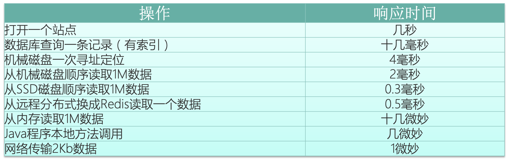

# 编写高效优雅安全Java程序的常见原则

## 面向对象

### 1. 构造器参数太多怎么办?

#### 1.1 全参数（不推荐）

可读性差

```java
public class FoodNormal {
    //required
    private final String foodName;//名称
    private final int reilang;//热量

    //optional
    private final int danbz;//蛋白质
    private final int dianfen;//淀粉
    private final int zf;//脂肪
    private final int tang;//糖分
    private  final int wss;//维生素
    
    //全参数
	public FoodNormal(String foodName, int reilang, int danbz, 
			int dianfen, int zf, int tang, int wss) {
		super();
		this.foodName = foodName;
		this.reilang = reilang;
		this.danbz = danbz;
		this.dianfen = dianfen;
		this.zf = zf;
		this.tang = tang;
		this.wss = wss;
	}

	//2个参数
	public FoodNormal(String foodName, int reilang) {
		this(foodName,reilang,0,0,0,0,0);
	}
	
	//3....6个参数
	public static void main(String[] args) {
		FoodNormal fn = new FoodNormal("food1",1200,200,0,0,300,100);
	}
}
```

#### 1.2 Bean模式 （不推荐）

无法检查参数是否检验完成，多线程不友好

```java
class FoodJavaBean {

    //required
    private final String foodName;
    private final int reilang;

    //optional
    private  int danbz;
    private  int dianfen;
    private  int zf;
    private  int tang;
    private  int wss;
    
	public FoodJavaBean(String foodName, int reilang) {
		super();
		this.foodName = foodName;
		this.reilang = reilang;
	}

	public int getDanbz() {
		return danbz;
	}
	public void setDanbz(int danbz) {
		this.danbz = danbz;
	}
	//,,,
}
```

#### 1.3 Builder模式（推荐）

适用场景：

- 参数5个或者5个以上
- 参数不多，但是预计未来会增长

```java
package com.xiangxue.ch04.builder01;

public class Food {

    //required
    private final String foodName;
    private final int reilang;

    //optional
    private  int danbz;
    private  int dianfen;
    private  int zf;
    private  int tang;
    private   int wss;
    
    public static class Builder {
        //required
        private final String foodName;
        private final int reilang;

        //optional
        private  int danbz;
        private  int dianfen;
        private  int zf;
        private  int tang;
        private   int wss;
        
		public Builder(String foodName, int reilang) {
			super();
			this.foodName = foodName;
			this.reilang = reilang;
		}
		
		public Builder danbz(int val) {
			this.danbz = val;
			return this;
		}
        
		//.......
		
		public Food build() {
			return new Food(this);
		}
    }
    
    private Food(Builder builder) {
    	foodName = builder.foodName;
    	reilang = builder.reilang;
    	danbz = builder.danbz;
    	//.....
    	
    }
    
    public static void main(String[] args) {
        Food food = new Food.Builder("food2", 1000).danbz(100)
    	//.....
    	.build();

	}
}
```

Builder模式 - 对象的创建模式

- 抽象创建者：一般来说是个接口
	- 建造方法，建造部件的方法（不止一个）
	- 返回产品的方法
- 具体建造者：实现抽象创建者
- 导演者：调用具体的建造者，创建产品对象
- 产品：需要创建的复杂对象

客户端只需要创建导演着，和具体建造者

```java
//类说明：抽象建造者
public abstract class PersonBuilder {
	//建造部件
	public abstract void buildHead();
	public abstract void buildBody();
	public abstract void buildFoot();
	
	public abstract Person createPerson();
}

// 类说明：具体建造者
public class ManBuilder extends PersonBuilder {
	
	private Person person;
	
	public ManBuilder() { 
		this.person = new Man();
	}

	@Override
	public void buildHead() { person.setHead("Brave Head"); }

	@Override
	public void buildBody() { person.setBody("Strong body"); }

	@Override
	public void buildFoot() { person.setFoot("Powerful foot"); }

	@Override
	public Person createPerson() {
		return person;
	}
}

//类说明：导演者
public class NvWa {
	public Person buildPerson(PersonBuilder pb) {
		pb.buildHead();
		pb.buildBody();
		pb.buildFoot();
		return pb.createPerson();
	}
}

//类说明：客户端
public class Mingyun {
    public static void main(String[] args) {
    	System.out.println("create NvWa");
    	NvWa nvwa =  new NvWa();
    	nvwa.buildPerson(new ManBuilder());
    	nvwa.buildPerson(new WomanBuilder());
    }
}
```


### 2. 不需要实例化的类应该构造器私有 

某些工具类不想让别人实例化时，需要私有化构造器

```java
public class Tools {
	private Tools() {}
}
```

### 3. 不要创建不必要的对象

- 能使用基本类型就使用基本类型，防止不必要的自动装箱
- 实例共用的东西可以尝试使用static，不需要个实例都拥有一份

一般来说，如果对象创建非常昂贵（数据库连接、网络连接、占用空间巨大）的时候，可以尝试使用对象池。

#### 例子1

```java
public class Sum {
	public static void main(String[] args) {
		long start = System.currentTimeMillis();
		Long sum = 0L;//对象
		for(long i=0;i<Integer.MAX_VALUE;i++) {
			sum = sum+i;
			//new 20多亿的Long的实例
		}
		System.out.println("spend time:"+(System.currentTimeMillis()-start)+"ms");
	}
}
```

#### 例子2

```java
public class SlowPerson {
	private final Date birthDate;//生日

	public SlowPerson(Date birthDate) {
		this.birthDate = new Date(birthDate.getTime());
	}
	
	public boolean is90s() {
		Calendar cal = Calendar.getInstance(TimeZone.getTimeZone("GMT"));
		cal.set(1990, Calendar.JANUARY,1,0,0,0);
		Date begin = cal.getTime();
		//.....
		return false;
	}
}

// 所有实例共用日期的static实例
public class FastPerson {
	private final Date birthDate;

	public FastPerson(Date birthDate) {
		this.birthDate = new Date(birthDate.getTime());
	}
	
	private static final Date Begin;
	
	static {
		Calendar cal = Calendar.getInstance(TimeZone.getTimeZone("GMT"));
		cal.set(1990, Calendar.JANUARY,1,0,0,0);
		Begin = cal.getTime();
		//.....
	}

	public boolean is90s() {
		//比较begin和end
		//.....
		return false;
	}
}
```

### 4. 避免使用终结方法

- jdk不保证Object.finalize()会被执行或者及时执行。
- 最好写显示的清理方法，类似close与try/finally配合的手动调用

### 5. 使类和成员的可访问性最小化

**模块之间需要接耦，高内聚、低耦合**，IOC和AOP的主要作用也就是接耦，封装隐藏模块内的实现细节，只用API/接口进行通信。方便代码的升级开发和调试。微服务之间的模块对内部可以进行较大改动时，只要不影响接口就会给其他模块带来便利。

class不加public可以达到package内私有

### 6. 使可变性最小化

根据业务要求，尽量让类的实例不可变，String、Integer、包装类。不可变的特性可以带来线程安全，多使用final或者不设置这个成员变量的设置方法，也可以模仿写时复制（Copy On Write）容器。但是对大对象可能带来很多复制开销。

### 7. 优先使用复合/代理（区别于继承）

复用代码时，可以尽量使用内部的代理变量去达到代码复用。因为继承的关系很脆弱，重写函数的相互调用可能会出问题，有时候需要考虑或依赖父类的实现，破坏了父类的封装性。而使用代理的方式去复用代码，会保证重用部分的干净，只依赖接口编程就可以了。

只有类在逻辑上确确实实是父类的子类时，才考虑使用继承关系。

#### 例子

```java
/**
 *类说明：统计增加的元素个数，继承
 */
public class ExtendsHashSet<E> extends HashSet<E> {
	private int addCount = 0;//计数器

	public ExtendsHashSet() {
	}

	@Override
	public boolean add(E e) {
		addCount++;
		return super.add(e);
	}
	
	@Override
	public boolean addAll(Collection<? extends E> c) {
		addCount = addCount+c.size();
		return super.addAll(c); // addAll会调用add，所以又会加一次
	}

	public int getAddCount() {
		return addCount;
	}

	public static void main(String[] args) {
		ExtendsHashSet<String> s = new ExtendsHashSet<String>();
		s.addAll(Arrays.asList("Mark","James","Lison"));
		System.out.println(s.getAddCount());
	}
}

// Effective Java - Wrapper class - uses composition in place of inheritance - Page 84
/**
 *类说明：统计增加的元素个数，组合
 */
public class CompositionSet<E>{
	private int addCount = 0;
	private final Set<E> s;

	public int getAddCount() {
		return addCount;
	}

	public CompositionSet(Set<E> s) {
		super();
		this.s = s;
	}
	
	public boolean add(E e) {
		addCount++;
		return s.add(e);
	}
	
	public boolean addAll(Collection<? extends E> c) {
		addCount = addCount+c.size();
		return s.addAll(c); 
	}

	public static void main(String[] args) {
		CompositionSet<String> s = new CompositionSet<>(new HashSet<String>());
		s.addAll(Arrays.asList("Mark","James","Lison"));
		System.out.println(s.getAddCount());
	}
}
```


### 8. 接口优于抽象类

- 使用抽象类必须要继承抽象类本身，而JAVA只允许单继承，而接口可以实现很多个
- 增加新的功能，只需要增加新的接口就可以，而抽象类可能需要改类的定义

JDK中的抽象骨架类（例如AbstractSet）可以内部实现一些基本的功能，子类不喜欢再修改。我们也可以借鉴这种架构：定义一个接口，声明一个抽象的骨架类实现这个接口。同时，实际的业务类可以同时实现接口又继承骨架类。
 

## 方法

### 9. 可变参数要谨慎使用

可变参数允许传0个参数，且参数个数是1到多个之间的时候，要做单独业务判断，可能需要判断参数的长度并作一些异常处理。

```java
//可能很多 0~很多
	static int sum(int... args) {
		int sum = 0;
		for (int arg : args)
			sum += arg;
		return sum;
	}
	
	//要求参数的个数，是1~多个
	//
	static int sum1(int... args) {
		if(args.length==0) {
			//做点异常处理
		}
		if(args[0]==100) {

		}
		for(int i=1;i<args.length;i++) {
			int sum = 0;
			sum += args[i];
			return sum;
		}
		return 0;
	}
	
	//可以修改成
	static int sum2(int flag, int... args) {
		if(flag==100) {

		}
		int sum = 0;
		for (int arg : args)
			sum += arg;
		return sum;
	}
```

### 10. 返回零长度的数组或集合，不要返回null

如果返回null，会要求调用方专门处理为null的情况，可以使用Collections.EMPTY_LIST

### 11. 优先使用标准的异常

```java
throw new IllegalArgumentException("ERROR:....");
throw new IllegalStateException("ERROR:...");
throw new UnsupportedOperationException("");

例如：
// AbstractQueuedSynchronizer中需要子类重新实现的方法
protected boolean tryAcquire(int arg) {
        throw new UnsupportedOperationException();
}
```

- 追求代码的重用
- 不写自己的异常类，提升类装载的性能 

## 通用程序设计

### 12. 用枚举代替int常量

枚举类本质就是一个类，每一个枚举类型是这个枚举类的实例，所以可以给枚举类增加相关的成员方法

如果用int常量定义：

```java
// 不使用枚举
public class SampleIntConst {
	
	//延时订单状态
	public static final int ORDER_DEPOT_UNPAY = 0;
	//public static final String ORDER_DEPOT_UNPAY_DESC = "unpay";
	public static final int ORDER_DEPOT_PAID = 3;
	public static final int ORDER_DEPOT_TIMOUT = 2;
	
	//物流订单状态
	public static final int ORDER_LOGISTICS_READY = 0;
	public static final int ORDER_LOGISTICS_TRANSPORT = 1;
	public static final int ORDER_LOGISTICS_ARRIVED = 2;
	
	//
	public enum Depot{UNPAY,PAID,TIMOUT}//0,1,2
	public enum Logistics{READY,TRANSPORT,ARRIVED}
	
	public static void main(String[] args) {
		
		System.out.println(Depot.UNPAY); 
		// 编译器无法判断我们使用的是哪种订单的状态，要打印还需要使用ORDER_DEPOT_UNPAY_DESC
		// 同时静态变量不拘泥于类文件，所以修改值之后，可能需要重新编译所涉及的所有类
	}	
}

// 使用枚举
public enum DepotEnum {
	UNPAY(0,"未支付"),PAID(1,"已支付"),TIMOUT(-1,"超时");
	
	private int status;
	private String desc;
	private String dbInfo;//其他属性
	
	private DepotEnum(int status, String desc) {
		this.status = status;
		this.desc = desc;
	}

	public int getStatus() {
		return status;
	}

	public String getDesc() {
		return desc;
	}

	public String getDbInfo() {
		return dbInfo;
	}
	
	public int calcStatus(int params) {
		return status+params;
	}
	
	public static void main(String[] args) {
		for(DepotEnum e:DepotEnum.values()) {
			System.out.println(e+":"+e.calcStatus(14));
		}
	}
}


/**
 *
 *类说明：枚举和行为绑定
 */
public class ActiveEnum {
	
	public enum NormalActive{
		PLUS,MINUS,MULTI,DIVIDS,DIFFER;
		
		double oper(double x,double y) {
			switch(this) {
			case PLUS:return x+y;
			case MINUS:return x-y;
			case MULTI:return x*y;
			case DIVIDS:return x/y;
			}
			// 抛异常不好处理
			throw new UnsupportedOperationException();
		}		
	}
	
	public enum BetterActive{
		// 如果没有相关方法，编译就不会过
		PLUS {
			@Override
			double oper(double x, double y) {
				return x+y;
			}
		},MINUS {
			@Override
			double oper(double x, double y) {
				return x-y;
			}
		};
		
		abstract double oper(double x,double y);
	}

	public static void main(String[] args) {
		System.out.println(NormalActive.PLUS.oper(0.1, 0.2));
		System.out.println(BetterActive.PLUS.oper(3, 5));
	}
}

enum PayDay {
	MONDAY, TUESDAY, WEDNESDAY, THURSDAY, FRIDAY, SATURDAY, SUNDAY,WUYI;
	
	private static final int HOURS_WORK = 2;
	private static final int HOURS_REST = 3;
	
	//超时时间
	double pay(double hoursOvertime) {
		switch(this) {
		case SATURDAY:case SUNDAY:
			return hoursOvertime*HOURS_REST;
		default:
			return hoursOvertime*HOURS_WORK;
		}
	}
}

public enum BetterPayDay {
	MONDAY(PayType.WORK), TUESDAY(PayType.WORK), WEDNESDAY(
			PayType.WORK), THURSDAY(PayType.WORK), FRIDAY(PayType.WORK), 
	SATURDAY(PayType.REST), SUNDAY(PayType.REST),WUYI(PayType.REST);

	private final PayType payType;//成员变量，新增的BetterPayDay枚举必须初始化PayType

	BetterPayDay(PayType payType) {
		this.payType = payType;
	}

	double pay(double hoursOvertime) {
		return payType.pay(hoursOvertime);
	}

	//策略枚举
	private enum PayType {
		WORK {
			double pay(double hoursOvertime) {
				return hoursOvertime*HOURS_WORK;
			}
		},
		REST {
			double pay(double hoursOvertime) {
				return hoursOvertime*HOURS_REST;
			}
		};
		
		private static final int HOURS_WORK = 2;
		private static final int HOURS_REST = 3;

		abstract double pay(double hoursOvertime);//抽象计算加班费的方法
	}
	
	public static void main(String[] args) {
		System.out.println(BetterPayDay.MONDAY.pay(7.5));
	}
}
```

### 13. 将局部变量的作用域最小化

- gc回收快、栈帧内希望重用局部变量槽 =>  减小局部变量表 => 减小栈桢
- 在第一次使用的地方才声明局部变量，不要统一在一开始定义
- 局部变量都是要自行初始化，如果初始化条件不满足，就不要过早声明


### 14. 精确计算，避免使用float和double

float和double内部存储的结构，会分整数、小数位，容易出精度问题 => 可以选择int、long或者BigDecimal

### 15. 当心字符串连接的性能

String 不可变，在每一次拼接中，jdk都会复制一遍新的String才返回。字符串拼接比较长，推荐使用StringBuiler、StringBuffer

```java
public class Test {
    private static class Log{
    
        public static void debug(String msg){
            if (isDebug()) System.out.println(msg);
        }

        public static boolean isDebug(){
            return false;
        }
    }

    public static void main(String[] args) {
        int count = 100000000;
        long start = System.currentTimeMillis();
//        StringBuiler
//        StringBuffer;
//        "a"+"b"+"";
        for(int i = 0;i<count;i++){

            Log.debug("The system is running and the time is "
                    +System.currentTimeMillis()
                    +" now,Let's do another thing:"+System.nanoTime());

        }
        System.out.println("直接打印模式,次数："+count+"：spend time :"
                +(System.currentTimeMillis()-start)+"ms");

        start = System.currentTimeMillis();
        for(int i = 0;i<count;i++){
            if(Log.isDebug())
                Log.debug("The system is running and the time is "
                        +System.currentTimeMillis()
                    +" now,Let's do another thing:"+System.nanoTime());
        }
        System.out.println("先判断再打印模式,次数："+count+"：spend time :"
                +(System.currentTimeMillis()-start)+"ms");
    }
}
// 直接打印模式,次数：100000000：spend time :20754ms
// 先判断再打印模式,次数：100000000：spend time :2ms
```

### 16. 控制方法的大小

一个方法尽量不要超过50-80行。


# 深入了解性能优化

影响一个系统性能的方方面面，JVM只占一部分


## 常用的性能评价/测试指标

### 响应时间

- 提交请求和返回该请求的响应之间使用的时间，一般比较关注平均响应时间。
- 如:数据库查询花费的时间，将字符回显到终端上花费的时间，访问 Web 页面花费的时间;



### 并发数

指同一时刻，对服务器有实际交互的请求数。和网站在线用户数的关联。

### 吞吐量

- 对单位时间内完成的工作量(请求)的量度。
- 如:每分钟的数据库事务，每秒传送的文件千字节数，每分钟的 Web 服务器命中数

#### 关系

```
QPS（TPS）：每秒钟request/事务数量
并发数： 系统同时处理的request/事务数
响应时间：  一般取平均响应时间
QPS（TPS）= 并发数/平均响应时间
```
通常，平均响应时间越短，系统吞吐量越大；平均响应时间越长，系统吞吐量越小。但是，系统吞吐量越大，未必平均响应时间越短。


## 常用的性能优化手段

当时内部的过度设计有两个结果：一些设计根本不可能用上，另一些等到用上的时候，发现当初设计的时候考虑不全，还不能用，正所谓半吊子。

- 避免过早优化 （总规则）。We should forget about small efficiencies, say about 97% of the time: premature optimization is the root of all evil. Yet we should not pass up our opportunities in that critical 3%. - Donald Knuth

- 进行系统性能测试 

- 寻找系统瓶颈，分而治之，逐步优化：前端优化、应用服务性能优化、存储性能优化

## 前端优化常用手段

### 浏览器/App

- 减少请求数：合并CSS、JS、图片等资源，对http连接最大化利用，http头打开KeepAlive

- 使用客户端缓冲：静态资源文件（更新频率低）缓存在浏览器 => Cache-Control（获取资源后多久才重新获取，是用相对时间） 和 Expires（服务器过期时间，过多久之后才重新获取，标准是服务器的时间）

- 启用压缩：服务器端压缩，浏览器端解压缩，但是压缩本身会给双方带来性能压力，需要权衡。如果通信带框良好就不用压缩

- 资源文件加载顺序：css放在页面最上面（浏览器下载全部CSS后才会渲染），js放在最下面

- 减少Cookie传输：Cookie每次连接都传递，所以不能太大，静态资源就别放在Cookie

- 给用户一个提示：正在加载等等


### CDN加速

内容分发网络，把相关数据（静态资源、页面、CSS、JS）缓存在离用户最近的服务器（路由路径最短）。可以使用商用CDN

### 反向代理缓存

nginx当中的缓存，直接都不用连接后端服务器

### WEB组件分离

- 页面的组件分离，客户端缓存起来后，如果有更新只用重新下载改变的部分。例如：React用Webpack把大Bundles拆分成各种小包，从而进行代码分离。

- 把不同的静态资源用不同的子域名去加载

 
## 应用服务性能优化

### 缓存

- 网站性能优化第一定律：优先考虑使用缓存优化性能
- 缓存离用户越近越好

缓存：本质是哈希表，用于存放读写比很高的数据。

- 频繁修改的数据，尽量不要缓存，读写比2:1以上
- 缓存一定是热点数据，非热点数据很容易会被挤出缓存
- 应用要容忍一定时间的数据不一致
- 缓存可用性问题，如果缓存雪崩怎么办？可用缓存分布式集群
- 缓存预热机制，一开始没有数据时，对数据库压力会很大
- 缓存击穿（因为bug、持续高并发去请求不存在的数据），所有的数据需求都到数据库上。 => 可利用布隆过滤器、把不存在的数据也缓存起来（哪怕返回null）
- 分布式缓存：
	- JBOSS缓存 => 所有服务器保存相同的数据：缓存更新要同步所有机器，代价惊人，缓存数据量小可以尝试
	- [一致性哈希](https://zhuanlan.zhihu.com/p/34985026) => 数据迁移少、预防缓存雪崩，提升容错性和可拓展性。数据倾斜可以引入虚拟hash节点


### 异步

- 同步和异步关注的是结果消息的通信机制
- 阻塞非阻塞关注的是等待结果返回给调用方状态
- bio同步阻塞、nio同步非阻塞、aio异步非阻塞

常见异步手段：

- Servlet异步：将请求交给不同的服务器处理，可以加速服务响应的速度
- 多线程
- 消息队列


### 集群化


均匀负载

## 程序

### 代码级别 

- 选择合适的数据结构：
	- 链表好扩容，而数组扩容的时候需要复制元素
	- HashMap扩容加载因子和初始大小 

- 选择更优的算法：
	- jdk的sort算法：元素个数小于等于29用插入排序、大于29就用快速排序
	- 最大子序列：穷举复杂度n^3，分治复杂度nlogn，动态规划复杂度n

- 编写更少的代码：代码越多 => 类加载时间越多、GC负载越大、内存消耗越多等等

- 参见笔记《编写高效优雅Java程序》或 Effective Java

### 并发编程

- 充分利用CPU多核，尽量使用线程池，合理设置线程数量，尽量使用JDK提供的各种并发框架和工具
- 实现线程安全的类，避免线程安全问题 
- 同步下减少锁的竞争
	- 缩小锁的范围，减少锁的粒度，锁分段，
	- 替换独占锁，读写锁，CAS代替锁，ThreadLocal等等

### 资源的复用

 减少开销很大的系统资源的创建和销毁
 
- 单例模式：Spring单例Bean
- （对于昂贵的资源）池化技术：线程池、各种连接池

### JVM


#### 与JIT编译器相关的优化 

- [热点编译](https://juejin.im/post/5b3782b1e51d4558dc4ae4a7)的概念

- 选择编译器类型 -server（长期运行的程序），-client（快速启动、快速结束），-XX:+TieredCompilation(分层编译) 

- 代码缓存相关–XX:ReservedCodeCacheSize=N：JIT编译大量放入缓存，如果缓存不够会出现Code Cache is full，需要提升ReservedCodeCacheSize，缺点：虚拟机会提前单独申请相关的内存，如果太大回影响机器性能

- 编译阈值：用于判断这段代码是否能成为热点代码，一般用如下两个工具判断。可调但是一般不调
	- 方法调用计数器：（一段时间内）计算方法调用次数，如果过了一段时间不掉用，计数会根据时间衰减
	- 循环回边计数器：（一段时间内）计算方法内的类似for loop的调用次数
	- -UseCounterDecay：启动衰减计数
	- -XX:CounterHalfLifeTime：控制衰减的周期

- 编译线程：sever模式一般用两个线程编译 

- 方法内联（-XX:Inline）：避免把小方法/热方法打包成栈帧，这个功能默认打开，不要关闭！
	- 字节码小与325字节才会内联，可用-XX:MaxFreqInlineSize=N调整，可以适当提高
	- 字节码小与35字节一定内联，可用-XX:MaxInlineSize调整

- 逃逸分析：最激进/复杂的优化措施，默认开启，会改动代码，如果运行出错会关闭逃逸分析，尽量不要改动缺省值。代码量越少逃逸分析出错概率越小

####  GC调优

- 目的：GC的时间够小，GC的次数够少，Full GC越少越好

- 调优的原则：
	- 大多数的Java应用不需要GC调优
	- 大部分需要GC调优的，不是参数问题，一般是代码问题
	- GC调优是最后的手段
		- 第一位：选择合适的GC回收期
		- 第二位：选择合适的堆大小
		- 第三位：选择年轻代在堆中的比重

- 步骤：
	- 分析结果、看是否要优化，如果达到下方情况，一般不要优化
		- minor GC时间<50ms ，10s一次	
		- Full GC执行时间1s以下，间隔10min以上
	- 先挑一台机器调整，然后和其他机器对比然后继续反复调整

- 学会阅读GC日志

- 其他与GC相关的参数
	- -XX:PrintGCDetails 打印GC细节（调优用）
	- -XX:HeapDumpOnOutOfMemoryError -XX:HeadDumpPath 跟踪定位OOM问题（一直开启）
	- -Xlogger:logpath （调优用）
	- -XX:PrintHeapAtGC （垃圾回收前后堆情况）
	- -XX:TraceClassLoading （类加载分析）

- 推荐策略：
	- 一般来说，年轻代大一些，不能太小  =>  直接进入老年代 => 老年代满 =>  Full GC 	


### 存储性能优化

- 尽量使用SSD
- 定时清理数据或者按数据的性质分开存放 
	- 日志数据库和业务数据库分开
- 结果集处理
	- 大量数据一次性获取可能导致OOM：jdbc可以用setFetchSize调整结果集大小 


