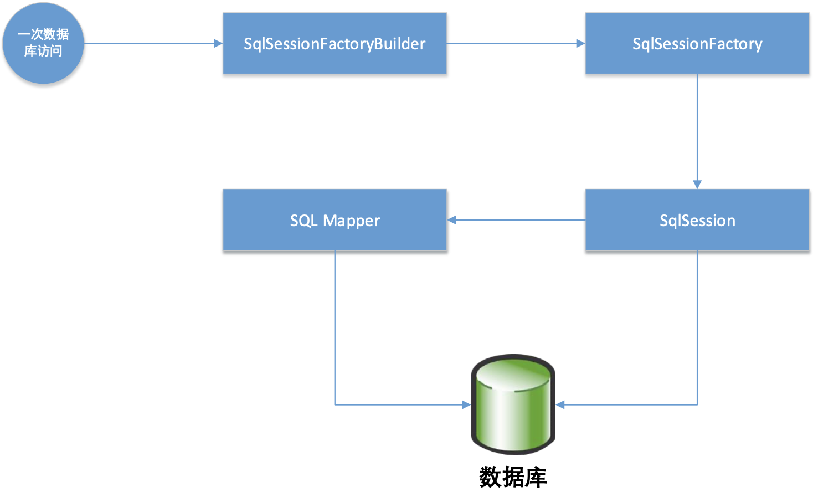
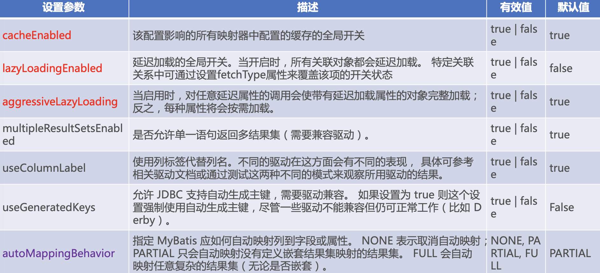
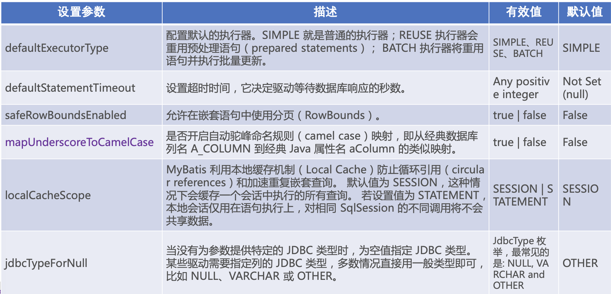
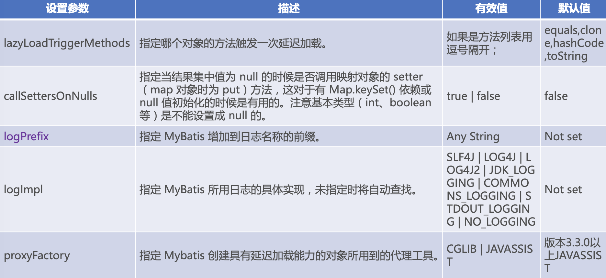
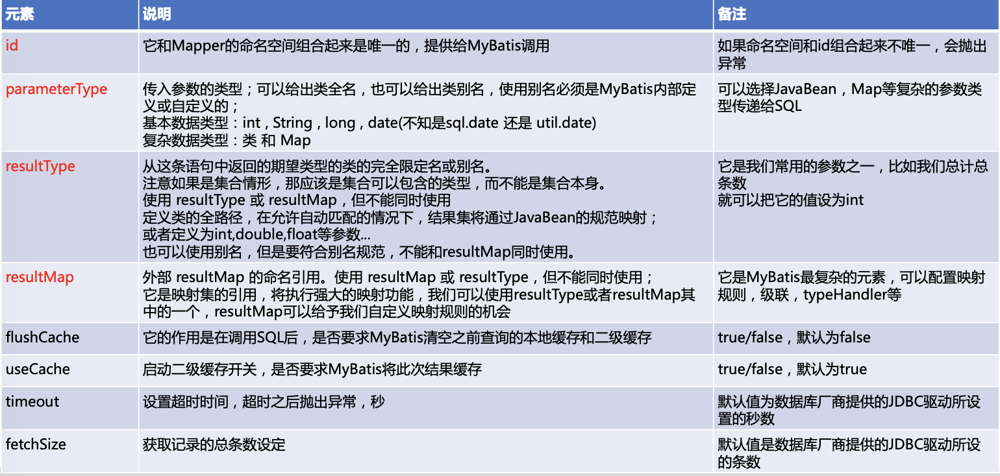
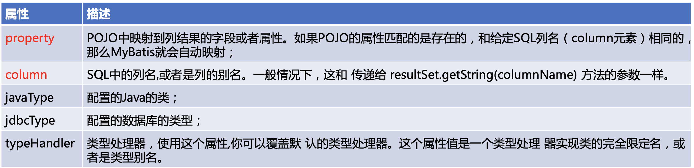
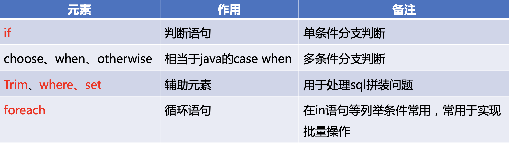

# Mybatis概述

## 1. 为什么需要ORM框架？

### 先回顾传统JDBC的代码

```java
package test.java.com.enjoylearning.mybatis;

//STEP 1. 导入sql相关的包
import com.mysql.jdbc.Driver;
import java.sql.Connection;
import java.sql.DriverManager;
import java.sql.PreparedStatement;
import java.sql.ResultSet;
import java.sql.SQLException;
import java.sql.Statement;
import java.util.ArrayList;
import java.util.List;

import org.junit.Test;

import com.enjoylearning.mybatis.entity.TUser;

public class JdbcDemo {
	static final String JDBC_DRIVER = "com.mysql.jdbc.Driver";
	static final String DB_URL = "jdbc:mysql://localhost:3306/mybatis?useUnicode=true&characterEncoding=utf8&allowMultiQueries=true";

	// Database credentials
	static final String USER = "root";
	static final String PASS = "lixun033";

	@Test
	public void QueryStatementDemo() {
		Connection conn = null;
		Statement stmt = null;
		List<TUser> users = new ArrayList<>();
		try {
			// STEP 2: 注册mysql的驱动
			Class.forName("com.mysql.jdbc.Driver");

			// STEP 3: 获得一个连接
			System.out.println("Connecting to database...");
			conn = DriverManager.getConnection(DB_URL, USER, PASS);

			// STEP 4: 创建一个查询
			System.out.println("Creating statement...");
			stmt = conn.createStatement();
			String userName = "lison";
			String sql="SELECT * FROM t_user where user_name='"+userName+"'";
			ResultSet rs = stmt.executeQuery(sql);
			System.out.println(stmt.toString());
			

			// STEP 5: 从resultSet中获取数据并转化成bean
			while (rs.next()) {
				System.out.println("------------------------------");
				// Retrieve by column name
				TUser user = new TUser();
//				user.setId(rs.getInt("id"));
//				user.setUserName(rs.getString("user_name"));
				user.setRealName(rs.getString("real_name"));
				user.setSex(rs.getByte("sex"));
				user.setMobile(rs.getString("mobile"));
				user.setEmail(rs.getString("email"));
				user.setNote(rs.getString("note"));

				System.out.println(user.toString());
				
				users.add(user);
			}
			// STEP 6: 关闭连接
			rs.close();
			stmt.close();
			conn.close();
		} catch (SQLException se) {
			// Handle errors for JDBC
			se.printStackTrace();
		} catch (Exception e) {
			// Handle errors for Class.forName
			e.printStackTrace();
		} finally {
			// finally block used to close resources
			try {
				if (stmt != null)
					stmt.close();
			} catch (SQLException se2) {
			}// nothing we can do
			try {
				if (conn != null)
					conn.close();
			} catch (SQLException se) {
				se.printStackTrace();
			}
		}
		System.out.println("-------------------------");
		System.out.println("there are "+users.size()+" users in the list!");
	}
	
	// PreparedStatement第一次有预编译过程，特别慢，数据库对sql语句的执行计划等缓存，第二次，但三次就很快
	// Mybatis源码中，默认配置是使用PreparedStatement，同时：占位符可以避免sql注入
	@Test
	public void QueryPreparedStatementDemo() {
		Connection conn = null;
		PreparedStatement stmt = null;
		List<TUser> users = new ArrayList<>();
		try {
			// STEP 2: 注册mysql的驱动
			Class.forName("com.mysql.jdbc.Driver");

			// STEP 3: 获得一个连接
			System.out.println("Connecting to database...");
			conn = DriverManager.getConnection(DB_URL, USER, PASS);

			// STEP 4: 创建一个查询
			System.out.println("Creating statement...");
			String sql;
			// prepareStatement占位符可以避免sql注入
			sql = "SELECT * FROM t_user where user_name= ? ";
			stmt = conn.prepareStatement(sql);
			stmt.setString(1, "lison");
			System.out.println(stmt.toString());//打印sql
			ResultSet rs = stmt.executeQuery();
			

			// STEP 5: 从resultSet中获取数据并转化成bean
			while (rs.next()) {
				System.out.println("------------------------------");
				// Retrieve by column name
				TUser user = new TUser();
//				user.setId(rs.getInt("id"));
//				user.setUserName(rs.getString("user_name"));
				user.setRealName(rs.getString("real_name"));
				user.setSex(rs.getByte("sex"));
				user.setMobile(rs.getString("mobile"));
				user.setEmail(rs.getString("email"));
				user.setNote(rs.getString("note"));

				System.out.println(user.toString());
				
				users.add(user);
			}
			// STEP 6: 关闭连接
			rs.close();
			stmt.close();
			conn.close();
		} catch (SQLException se) {
			// Handle errors for JDBC
			se.printStackTrace();
		} catch (Exception e) {
			// Handle errors for Class.forName
			e.printStackTrace();
		} finally {
			// finally block used to close resources
			try {
				if (stmt != null)
					stmt.close();
			} catch (SQLException se2) {
			}// nothing we can do
			try {
				if (conn != null)
					conn.close();
			} catch (SQLException se) {
				se.printStackTrace();
			}
		}
		System.out.println("-------------------------");
		System.out.println("there are "+users.size()+" users in the list!");
	}

	@Test
	public void updateDemo(){
		Connection conn = null;
		PreparedStatement stmt = null;
		try {
			// STEP 2: 注册mysql的驱动
			Class.forName("com.mysql.jdbc.Driver");

			// STEP 3: 获得一个连接
			System.out.println("Connecting to database...");
			conn = DriverManager.getConnection(DB_URL, USER, PASS);
			
			// STEP 4: 启动手动提交（关闭自动提交）
			conn.setAutoCommit(false);
			

			// STEP 5: 创建一个更新
			System.out.println("Creating statement...");
			String sql = "update t_user  set mobile= ? where user_name= ? ";
			stmt = conn.prepareStatement(sql);
			// 写操作比读操作多一个步骤：事务的管理。
			stmt.setString(1, "186995587411");
			stmt.setString(2, "lison");
			System.out.println(stmt.toString());//打印sql
			int ret = stmt.executeUpdate();
			System.out.println("此次修改影响数据库的行数为："+ret);

			// STEP 6: 手动提交数据
			conn.commit();
			
			// STEP 7: 关闭连接
			stmt.close();
			conn.close();
		} catch (SQLException se) {
			// Handle errors for JDBC
			try {
				conn.rollback();
			} catch (SQLException e) {
				// TODO Auto-generated catch block
				e.printStackTrace();
			}
			se.printStackTrace();
		} catch (Exception e) {
			try {
				conn.rollback();
			} catch (SQLException e1) {
				// TODO Auto-generated catch block
				e1.printStackTrace();
			}
			e.printStackTrace();
		} finally {
			// finally block used to close resources
			try {
				if (stmt != null)
					stmt.close();
			} catch (SQLException se2) {
			}// nothing we can do
			try {
				if (conn != null)
					conn.close();
			} catch (SQLException se) {
				se.printStackTrace();
			}
		}
	}
}

```

### 传统JDBC的弊端

- 工作量大，数据库操作至少5步
- 业务代码和技术代码耦合，灵活性、可维护性大打折扣
- 链接资源手动关闭，带来了隐患，容易出错。数据路连接池很宝贵，容易出bug导致连接池未关闭

### ORM 是什么？

对象关系映射(ORM Obeject Relational Mapping)，ORM模型就是数据库的表与简单Java对象 (POJO)的映射模型，它主要解决数据库数据和POJO对象的相互映射;


#### ORM带来的好处：

- 更加贴合面向对象的编程语意，Java程序员喜欢的姿势;
- 技术和业务解耦，Java程序员无需对数据库相关的知识深入了解，可让新手专注业务开发 
- 妈妈再也不用担心我，不释放数据库连接资源了

#### ORM框架两大霸主：

**Hibernate**（传统软件开发：OA、财务等
管理系统）

- xml文件配置 => 全表映射、默认取出/反序列化所有字段 => 带来不便、性能开销
- 无法自定义组装SQL => 不好优化
- 复杂关联关系以及复杂SQL语句支持弱
- 不支持存储过程（之前的版本？）
- HQL黑盒封装，调优复杂
- 性能较差，不适合大型互联网高性能要求

**Mybatis**（互联网公司）

- 几乎可以替换JDBC
- 高度灵活
- 基于底层SQL的优化能力 
- 学习门槛低，易于维护 
- 开发工作量相对较大

## 2. Mybatis是什么？

Mybatis前身是iBatis,其源于“Internet”和“ibatis”的组合，本质是一种**半自动的ORM框架**，除了POJO 和映射关系之外，还需要编写SQL语句。


### Mybatis运行基础结构



- SqlSessionFactoryBuilder：读取配置信 息创建SqlSessionFactory，建造者模式， 方法级别生命周期;
- SqlSessionFactory：看作一个容器，存了配置信息，维护了一个数据库连接池，创建Sqlsession，工厂单例模式，存在于程序的整个生命周期;
- SqlSession：代表一次数据库连接，可以直接发送SQL执行，也可以通过调用 Mapper访问数据库。线程不安全，要保证线程独享(方法级)，不能把SqlSession定义为类属性
- SQL Mapper：由一个Java接口和XML文件组成，包含了要执行的SQL语句和结果 集映射规则。一般由SqlSession产生，方法级别生命周期，生命周期一般来说比SqlSession短;

## 3. Mybatis配置

以下方为例：

```xml
<?xml version="1.0" encoding="UTF-8" ?>
<!DOCTYPE configuration PUBLIC "-//mybatis.org//DTD Config 3.0//EN" "http://mybatis.org/dtd/mybatis-3-config.dtd">
<configuration>

	<!-- 参数设置 -->
	<settings>
		<!-- 这个配置使全局的映射器启用或禁用缓存 -->
		<setting name="cacheEnabled" value="true" />
		<!-- 全局启用或禁用延迟加载。当禁用时，所有关联对象都会即时加载 -->
		<setting name="lazyLoadingEnabled" value="true" />
		<!-- 当启用时，有延迟加载属性的对象在被调用时将会完全加载任意属性。否则，每种属性将会按需要加载 -->
		<setting name="aggressiveLazyLoading" value="true" />
		<!-- 允许或不允许多种结果集从一个单独的语句中返回（需要适合的驱动） -->
		<setting name="multipleResultSetsEnabled" value="true" />
		<!-- 使用列标签代替列名。不同的驱动在这方便表现不同。参考驱动文档或充分测试两种方法来决定所使用的驱动 -->
		<setting name="useColumnLabel" value="true" />
		<!-- 允许JDBC支持生成的键。需要适合的驱动。如果设置为true则这个设置强制生成的键被使用，尽管一些驱动拒绝兼容但仍然有效（比如Derby） -->
		<setting name="useGeneratedKeys" value="true" />
		<!-- 指定MyBatis如何自动映射列到字段/属性。PARTIAL只会自动映射简单，没有嵌套的结果。FULL会自动映射任意复杂的结果（嵌套的或其他情况） -->
		<setting name="autoMappingBehavior" value="PARTIAL" />
		<!--当检测出未知列（或未知属性）时，如何处理，默认情况下没有任何提示，这在测试的时候很不方便，不容易找到错误。 NONE : 不做任何处理 
			(默认值) WARNING : 警告日志形式的详细信息 FAILING : 映射失败，抛出异常和详细信息 -->
		<setting name="autoMappingUnknownColumnBehavior" value="WARNING" />
		<!-- 配置默认的执行器。SIMPLE执行器没有什么特别之处。REUSE执行器重用预处理语句。BATCH执行器重用语句和批量更新 -->
		<setting name="defaultExecutorType" value="SIMPLE" />
		<!-- 设置超时时间，它决定驱动等待一个数据库响应的时间 -->
		<setting name="defaultStatementTimeout" value="25000" />
		<!--设置查询返回值数量，可以被查询数值覆盖 -->
		<setting name="defaultFetchSize" value="100" />
		<!-- 允许在嵌套语句中使用分页 -->
		<setting name="safeRowBoundsEnabled" value="false" />
		<!--是否开启自动驼峰命名规则（camel case）映射，即从经典数据库列名 A_COLUMN 到经典 Java 属性名 aColumn 
			的类似映射。 -->
		<setting name="mapUnderscoreToCamelCase" value="false" />
		<!--MyBatis 利用本地缓存机制（Local Cache）防止循环引用（circular references）和加速重复嵌套查询。 
			默认值为 SESSION，这种情况下会缓存一个会话中执行的所有查询。 若设置值为 STATEMENT，本地会话仅用在语句执行上，对相同 SqlSession 
			的不同调用将不会共享数据。 -->
		<setting name="localCacheScope" value="SESSION" />
		<!-- 当没有为参数提供特定的 JDBC 类型时，为空值指定 JDBC 类型。 某些驱动需要指定列的 JDBC 类型，多数情况直接用一般类型即可，比如 
			NULL、VARCHAR OTHER。 -->
		<setting name="jdbcTypeForNull" value="OTHER" />
		<!-- 指定哪个对象的方法触发一次延迟加载。 -->
		<setting name="lazyLoadTriggerMethods" value="equals,clone,hashCode,toString" />
	</settings>

	<!-- 别名定义 -->
	<typeAliases>
		<typeAlias alias="pageAccessURL" type="com.lgm.mybatis.model.PageAccessURL" />
	</typeAliases>

	<!--自定义类型处理器 -->
	<typeHandlers>
		<!-- <typeHandler handler="com.xhm.util.BooleanTypeHandlder" /> -->
		<!--扫描整个包下的自定义类型处理器 -->
		<package name="com.xhm.util" />
	</typeHandlers>

	<!--plugins插件之 分页拦截器 -->
	<plugins>
		<plugin interceptor="com.xhm.util.PageInterceptor"></plugin>
	</plugins>

	<!--配置environment环境 -->
	<environments default="development">
		<!-- 环境配置1，每个SqlSessionFactory对应一个环境 -->
		<environment id="development1">
			<!-- 事务配置 type= JDBC、MANAGED 1.JDBC:这个配置直接简单使用了JDBC的提交和回滚设置。它依赖于从数据源得到的连接来管理事务范围。 
				2.MANAGED:这个配置几乎没做什么。它从来不提交或回滚一个连接。而它会让容器来管理事务的整个生命周期（比如Spring或JEE应用服务器的上下文）。 
				默认情况下它会关闭连接。然而一些容器并不希望这样，因此如果你需要从连接中停止它，将closeConnection属性设置为false -->
			<transactionManager type="JDBC" />
			<!-- <transactionManager type="MANAGED"> <property name="closeConnection" 
				value="false"/> </transactionManager> -->
			<!-- 数据源类型：type = UNPOOLED、POOLED、JNDI 1.UNPOOLED：这个数据源的实现是每次被请求时简单打开和关闭连接。它有一点慢，这是对简单应用程序的一个很好的选择，因为它不需要及时的可用连接。 
				不同的数据库对这个的表现也是不一样的，所以对某些数据库来说配置数据源并不重要，这个配置也是闲置的 2.POOLED：这是JDBC连接对象的数据源连接池的实现，用来避免创建新的连接实例时必要的初始连接和认证时间。 
				这是一种当前Web应用程序用来快速响应请求很流行的方法。 3.JNDI：这个数据源的实现是为了使用如Spring或应用服务器这类的容器，容器可以集中或在外部配置数据源，然后放置一个JNDI上下文的引用 -->
			<dataSource type="UNPOOLED">
				<property name="driver" value="com.mysql.jdbc.Driver" />
				<property name="url" value="jdbc:mysql://localhost:3306/xhm" />
				<property name="username" value="root" />
				<property name="password" value="root" />
				<!-- 默认连接事务隔离级别 <property name="defaultTransactionIsolationLevel" value="" 
					/> -->
			</dataSource>
		</environment>

		<!-- 环境配置2 -->
		<environment id="development2">
			<transactionManager type="JDBC" />
			<dataSource type="POOLED">
				<property name="driver" value="com.mysql.jdbc.Driver" />
				<property name="url" value="jdbc:mysql://localhost:3306/xhm" />
				<property name="username" value="root" />
				<property name="password" value="root" />
				<!-- 在任意时间存在的活动（也就是正在使用）连接的数量 -->
				<property name="poolMaximumActiveConnections" value="10" />
				<!-- 任意时间存在的空闲连接数 -->
				<property name="poolMaximumIdleConnections" value="5" />
				<!-- 在被强制返回之前，池中连接被检查的时间 -->
				<property name="poolMaximumCheckoutTime" value="20000" />
				<!-- 这是给连接池一个打印日志状态机会的低层次设置，还有重新尝试获得连接，这些情况下往往需要很长时间（为了避免连接池没有配置时静默失败） -->
				<property name="poolTimeToWait" value="20000" />
				<!-- 发送到数据的侦测查询，用来验证连接是否正常工作，并且准备接受请求。 -->
				<property name="poolPingQuery" value="NO PING QUERY SET" />
				<!-- 这是开启或禁用侦测查询。如果开启，你必须用一个合法的SQL语句（最好是很快速的）设置poolPingQuery属性 -->
				<property name="poolPingEnabled" value="false" />
				<!-- 这是用来配置poolPingQuery多次时间被用一次。这可以被设置匹配标准的数据库连接超时时间，来避免不必要的侦测 -->
				<property name="poolPingConnectionsNotUsedFor" value="0" />
			</dataSource>
		</environment>

		<!-- 环境配置3 -->
		<environment id="development3">
			<transactionManager type="JDBC" />
			<dataSource type="JNDI">
				<property name="data_source" value="java:comp/env/jndi/mybatis" />
				<property name="env.encoding" value="UTF8" />
				<!-- <property name="initial_context" value=""/> <property name="env.encoding" 
					value="UTF8"/> -->
			</dataSource>
		</environment>
	</environments>

	<!-- 映射文件，mapper的配置文件 -->
	<mappers>
		<!--直接映射到相应的mapper文件 -->
		<mapper resource="com/xhm/mapper/UserMapper.xml" />
		<!--扫描包路径下所有xxMapper.xml文件 -->
		<package name="com.xhm.mapper" />
	</mappers>

</configuration>  
```

- **properties**：定义配置，配置的属性可以在整个配置文件中其他位置进行引用 - 重要，优先使用property配置文件解耦。

- **settings**：设置，用于指定MyBatis的一些全局配置属性，这些属性非常重要， 它们会改变MyBatis的运行时行为 - 重要，后面专门说明

- **typeAliases**： 别名，为Java类型设置一个短的名字，映射时方便使用；分为系统定 义别名和自定义别名 - 可以通过xml和注解配置

- typeHandlers：用于jdbcType与javaType之间的转换，例如Java的int和sql的int等基础的转换已经有默认转换器 - 无特殊需求不需要调整，如果有枚举类型去要拓展，需要额外开发;

- ObjectFactory：MyBatis每次创建结果对象的新实例时，它都会使用对象工厂(ObjectFactory)去构建POJO - 有默认实现，大部分场景下无需修改

- plugins：插件，MyBatis允许你在已映射的语句执行过程中的某一点进行拦截、调用。

- **environments**：用于配置多个数据源，每个数据源分为数据库源和事务的配置 - 在多数据源环境使用，结合Spring来配置。

- databaseIdProvider：MyBatis可以根据不同的数据库厂商执行不同的语句，用于一个系统 内多厂商数据源支持 - 大部分场景下无需修改

- **mappers**：配置引入映射器的方法。可以使用相对于类路径的资源引用、或完全 限定资源定位符(包括file:///的URL)，或类名和包名等等

### 3.1 setting





### 3.2 mapper

#### 用classPath下资源引用

与Mybatis配置同一目录下找xml

```xml
 <mappers>
	<!--直接映射到相应的mapper文件 -->
	<mapper resource="sqlmapper/TUserMapper.xml" />
</mappers>
```

#### 用类注册方式引用

```xml
 <mappers>
	<!--通过类扫描mapper文件 -->
	<mapper class="com.enjoylearning.mybatis.mapper.TUserMapper" />
 </mappers>
```

#### 使用包名引入引射器名

```xml
<mappers>
	<!-- 扫描包下所有的mapper文件 -->
	<package name="com.enjoylearning.mybatis.mapper"/>
</mappers>
```

### 3.3 基于xml配置mapper映射器文件

SQl相关：

- resultMap – 是最复杂也是最强大的元素，用来描述如何从数据库结果集中来加载对象。 
- sql – 可被其他语句引用的可重用语句块。
- insert – 映射插入语句
- update – 映射更新语句
- delete – 映射删除语句
- select – 映射查询语句

缓存能力：

- cache – 给定命名空间的缓存配置。
- cache-ref – 其他命名空间缓存配置的引用。

#### 3.3.1 select元素



##### 自动映射

- 前提：SQL列名和JavaBean的属性是一致的;
- 自动映射等级autoMappingBehavior设置为PARTIAL，需要谨慎使用FULL;
- 使用resultType;
- 如果列名和JavaBean不一致，但列名符合单词下划线分割，Java是驼峰命名法
则mapUnderscoreToCamelCase可设置为true;

**不要用 resultClass 当返回参数，即使所有类属性名与数据库字段一一对应，也需 要定义。反过来，每一个表也必然有一个与之对应。说明: 配置映射关系，使字段与 DO 类解耦，方便维护。**

##### 传递多个查询入参

- 使用map传递参数：可读性差，导致可维护性和可扩展性差，**杜绝使用**;
- 使用注解传递参数：直观明了，当参数较少一般小于5个的时候，**建议使用**; 
- 使用Java Bean的方式传递参数：当参数大于5个的时候，**建议使用**;

##### resultMap属性

- resultMap 元素是 MyBatis 中最重要最强大的元素。它可以让你从 90% 的 JDBC ResultSets 数据提取代码中解放出来,在对复杂语句进行联合映射的时候，它很可能可以代替数千行的同等功能的代码。
- ResultMap的设计思想是，简单的语句不需要明确的结果映射，而复杂一点的语句只需要描述它们的关系就行了。

属性：

- id：当前命名空间中的一个唯一标识，用于标识一个result map.
- type：类的完全限定名, 或者一个类型别名 (内置的别名可以参考上面的表格).
- autoMapping：如果设置这个属性，MyBatis将会为这个ResultMap开启或者关闭自动映射。这个属性会覆盖全局的属性autoMappingBehavior。默认值为:unset。

##### resultMap子元素

- constructor - 用于在实例化类时，注入结果到构造方法中
	- idArg - ID 参数；标记出作为 ID 的结果可以帮助提高整体性能
	- arg - 将被注入到构造方法的一个普通结果

- **id** – 一个 ID 结果；标记出作为 ID 的结果可以帮助提高整体性能

- **result** – 注入到字段或 JavaBean 属性的普通结果

- association – 一个复杂类型的关联;许多结果将包装成这种类型
	- 嵌套结果映射 – 关联可以指定为一个 resultMap 元素，或者引用一个

- collection – 一个复杂类型的集合
	- 嵌套结果映射 – 集合可以指定为一个 resultMap 元素，或者引用一个

- discriminator – 使用结果值来决定使用哪个 resultMap
	- case – 基于某些值的结果映射 
		- 嵌套结果映射 – 一个 case 也是一个映射它本身的结果,因此可以包含很多相 同的元素，或者它可以参照一个外部的 resultMap


###### id & result

- id 和 result 都将一个列的值映射到一个简单数据类型(字符串，整型，双精度浮点数，日期等)的属性或字段 
- 两者之间的唯一不同是，id 表示的结果将是对象的标识属性，这会在比较对象实例时用到。 这样可以提高整体的性能，尤其是缓存和嵌套结果映射(也就是联合映射)的时候。

**result的属性：**



###### constructor

- 一个pojo不存在没有参数的构造方法，就需要使用constructor;
- 为了通过名称来引用构造方法参数，你可以添加@Param注解,指定参数名称的前提下，以任意顺序编写arg元素

```xml
<constructor>
	<idArg column="id" javaType="int" />
	<arg column="user_name" javaType="String" />
</constructor>
```

#### 3.3.2 insert, update 和 delete

- **id**：命名空间中的唯一标识符，可被用来代表这条语句。

- **parameterType**：将要传入语句的参数的完全限定类名或别名。这个属性是可选的，因为 MyBatis 可以通过 TypeHandler 推断出具体 传入语句的参数，默认值为 unset。

- flushCache：将其设置为true，任何时候只要语句被调用，都会导致本地缓存和二级缓存都会被清空，默认值:true(对应插入、 更新和删除语句)。

- timeout：这个设置是在抛出异常之前，驱动程序等待数据库返回请求结果的秒数。默认值为 unset(依赖驱动)。

- statementType：STATEMENT，PREPARED 或 CALLABLE 的一个。这会让 MyBatis 分别使用 Statement，PreparedStatement 或 CallableStatement，默认值:PREPARED。

- **useGeneratedKeys**：(仅对 insert 和 update 有用)这会令 MyBatis 使用 JDBC 的 getGeneratedKeys 方法来取出由数据库内部生成的主键(比如:像 MySQL 和 SQL Server 这样的关系数据库管理系统的**自动递增字段**)，默认值:false。

- **keyProperty**：(仅对 insert 和 update 有用)唯一标记一个属性，MyBatis 会通过 getGeneratedKeys 的返回值或者通过 insert 语句的 selectKey 子元素设置它的键值，默认:unset。如果希望得到多个生成的列，也可以是逗号分隔的属性名称 列表。

- keyColumn：(仅对 insert 和 update 有用)通过生成的键值设置表中的列名，这个设置仅在某些数据库(像 PostgreSQL)是必 须的，当主键列不是表中的第一列的时候需要设置。如果希望得到多个生成的列，也可以是逗号分隔的属性名称列表。

- databaseId：如果配置了 databaseIdProvider，MyBatis 会加载所有的不带 databaseId 或匹配当前 databaseId 的语句，如果带或者不带的语句都有，则不带的会被忽略。


**注意：**例如对id使用useGeneratedKeys和keyProperty时，mybatis会用根据历史所有插入数据的最大id+1，而不是当前表最大id+1

##### selectKey元素

- keyProperty：selectKey语句结果应该被设置的目标属性。如果希望得到多个生成的列，也可以是逗号分隔的属性名称列表。

- keyColumn：匹配属性的返回结果集中的列名称。如果希望得到多个生成的列，也可以是逗号分隔的属性名称列表。

- resultType：结果的类型。MyBatis通常可以推算出来，但是为了更加确定写上也不会有什么问题。MyBatis 允许任何简单类型用作主键的类型，包括字符串。如果希望作用于多个生成的列，则可以使用一个包含期望属性的 Object 或一个 Map。

- order这可以被设置为 BEFORE 或 AFTER。如果设置为 BEFORE，那么它会首先选择主键，设置 keyProperty 然后执行插 入语句。如果设置为 AFTER，那么先执行插入语句，然后是 selectKey 元素

- 这和像Oracle的数据库相似，在插入语句内部可能有嵌入索引调用。statementType与前面相同，MyBatis 支持 STATEMENT，PREPARED和CALLABLE语句的映射类型，分别代表PreparedStatement和CallableStatement类型。


##### sql元素和参数

- sql元素：用来定义可重用的 SQL 代码段，可以包含在其他语句中;

- 参数：向sql语句中传递的可变参数
	- 预编译#{}：将传入的数据都当成一个字符串，**会对自动传入的数据加一个单引号（预编译）**，能够很大程度防止
sql注入;
	- 传值${}：传入的数据直接显示生成在sql中，无法防止sql注入; 
	- 表名、选取的列是动态的，order by和in操作， 可以考虑使用${}

##### 注解方式配置（不推荐）

注解方式就是将SQL语句直接写在接口上，对于需求比较简单的系统，效率较高。缺点在于，每次修改sql语句 都要编译代码，对于复杂的sql语句可编辑性和可读性都差，一般不建议使用这种配置方式：@Select、@Results、@Insert、@Update、@Delete


# 4. 动态SQL

## 4.1 动态SQL元素



### Examples

```xml
	<select id="selectIfandWhereOper" resultMap="BaseResultMap">
		select
		<include refid="Base_Column_List" />
		from t_user a
		<where>
			<if test="email != null and email != ''">
			  	and a.email like CONCAT('%', #{email}, '%') 
			</if>
			<if test="sex != null ">
				and a.sex = #{sex}
			</if>
		</where>
	</select>

	<update id="updateIfAndSetOper" parameterType="TUser">
		update t_user
		  <set> 
			<if test="userName != null">
				user_name = #{userName,jdbcType=VARCHAR},
			</if>
			<if test="realName != null">
				real_name = #{realName,jdbcType=VARCHAR},
			</if>
			<if test="sex != null">
				sex = #{sex,jdbcType=TINYINT},
			</if>
			<if test="mobile != null">
				mobile = #{mobile,jdbcType=VARCHAR},
			</if>
			<if test="email != null">
				email = #{email,jdbcType=VARCHAR},
			</if>
			<if test="note != null">
				note = #{note,jdbcType=VARCHAR},
			</if>
			<if test="positionId != null">
				position_id = #{positionId,jdbcType=INTEGER},
			</if>
		</set>
		where id = #{id,jdbcType=INTEGER}
	</update>

	<insert id="insertSelective" parameterType="TUser">
		insert into t_user
		<trim prefix="(" suffix=")" suffixOverrides=",">
			<if test="id != null">
				id,
			</if>
			<if test="userName != null">
				user_name,
			</if>
			<if test="realName != null">
				real_name,
			</if>
			<if test="sex != null">
				sex,
			</if>
			<if test="mobile != null">
				mobile,
			</if>
			<if test="email != null">
				email,
			</if>
			<if test="note != null">
				note,
			</if>
			<if test="positionId != null">
				position_id,
			</if>
		</trim>
		<trim prefix="values (" suffix=")" suffixOverrides=",">
			<if test="id != null">
				#{id,jdbcType=INTEGER},
			</if>
			<if test="userName != null">
				#{userName,jdbcType=VARCHAR},
			</if>
			<if test="realName != null">
				#{realName,jdbcType=VARCHAR},
			</if>
			<if test="sex != null">
				#{sex,jdbcType=TINYINT},
			</if>
			<if test="mobile != null">
				#{mobile,jdbcType=VARCHAR},
			</if>
			<if test="email != null">
				#{email,jdbcType=VARCHAR},
			</if>
			<if test="note != null">
				#{note,jdbcType=VARCHAR},
			</if>
			<if test="positionId != null">
				#{positionId,jdbcType=INTEGER},
			</if>
		</trim>
	</insert>

	<select id="selectForeach4In" resultMap="BaseResultMap">
		select
		<include refid="Base_Column_List" />
		from t_user a
		where a.user_name in 
		<foreach collection="array" open="(" close=")" item="userName" index="i" separator=",">
			#{userName}
		</foreach>	
	</select>
	
	<insert id="insertForeach4Batch">
		insert into t_user (user_name, real_name,
		sex, mobile,email,note, position_id) 
		values
		<foreach collection="list" separator="," item="user">
			(
			#{user.userName,jdbcType=VARCHAR},
			#{user.realName,jdbcType=VARCHAR},
			#{user.sex,jdbcType=TINYINT}, 
			#{user.mobile,jdbcType=VARCHAR},
			#{user.email,jdbcType=VARCHAR},
			#{user.note,jdbcType=VARCHAR},
			#{user.positionId,jdbcType=INTEGER}
			)
		</foreach>
	</insert>
```

## 4.2 批量操作

- 通过foreach动态拼装SQL语句
- 使用BATCH类型的excutor


