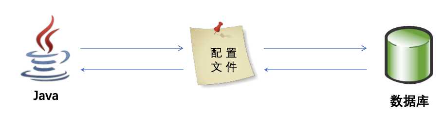
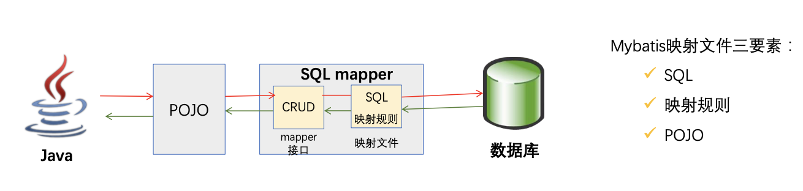

# Mybatis概述

## 1. 为什么需要ORM框架？

### 先回顾传统JDBC的代码

```java
package test.java.com.enjoylearning.mybatis;

//STEP 1. 导入sql相关的包
import com.mysql.jdbc.Driver;
import java.sql.Connection;
import java.sql.DriverManager;
import java.sql.PreparedStatement;
import java.sql.ResultSet;
import java.sql.SQLException;
import java.sql.Statement;
import java.util.ArrayList;
import java.util.List;

import org.junit.Test;

import com.enjoylearning.mybatis.entity.TUser;

public class JdbcDemo {
	static final String JDBC_DRIVER = "com.mysql.jdbc.Driver";
	static final String DB_URL = "jdbc:mysql://localhost:3306/mybatis?useUnicode=true&characterEncoding=utf8&allowMultiQueries=true";

	// Database credentials
	static final String USER = "root";
	static final String PASS = "lixun033";

	@Test
	public void QueryStatementDemo() {
		Connection conn = null;
		Statement stmt = null;
		List<TUser> users = new ArrayList<>();
		try {
			// STEP 2: 注册mysql的驱动
			Class.forName("com.mysql.jdbc.Driver");

			// STEP 3: 获得一个连接
			System.out.println("Connecting to database...");
			conn = DriverManager.getConnection(DB_URL, USER, PASS);

			// STEP 4: 创建一个查询
			System.out.println("Creating statement...");
			stmt = conn.createStatement();
			String userName = "lison";
			String sql="SELECT * FROM t_user where user_name='"+userName+"'";
			ResultSet rs = stmt.executeQuery(sql);
			System.out.println(stmt.toString());
			

			// STEP 5: 从resultSet中获取数据并转化成bean
			while (rs.next()) {
				System.out.println("------------------------------");
				// Retrieve by column name
				TUser user = new TUser();
//				user.setId(rs.getInt("id"));
//				user.setUserName(rs.getString("user_name"));
				user.setRealName(rs.getString("real_name"));
				user.setSex(rs.getByte("sex"));
				user.setMobile(rs.getString("mobile"));
				user.setEmail(rs.getString("email"));
				user.setNote(rs.getString("note"));

				System.out.println(user.toString());
				
				users.add(user);
			}
			// STEP 6: 关闭连接
			rs.close();
			stmt.close();
			conn.close();
		} catch (SQLException se) {
			// Handle errors for JDBC
			se.printStackTrace();
		} catch (Exception e) {
			// Handle errors for Class.forName
			e.printStackTrace();
		} finally {
			// finally block used to close resources
			try {
				if (stmt != null)
					stmt.close();
			} catch (SQLException se2) {
			}// nothing we can do
			try {
				if (conn != null)
					conn.close();
			} catch (SQLException se) {
				se.printStackTrace();
			}
		}
		System.out.println("-------------------------");
		System.out.println("there are "+users.size()+" users in the list!");
	}
	
	// PreparedStatement第一次有预编译过程，特别慢，数据库对sql语句的执行计划等缓存，第二次，但三次就很快
	// Mybatis源码中，默认配置是使用PreparedStatement，同时：占位符可以避免sql注入
	@Test
	public void QueryPreparedStatementDemo() {
		Connection conn = null;
		PreparedStatement stmt = null;
		List<TUser> users = new ArrayList<>();
		try {
			// STEP 2: 注册mysql的驱动
			Class.forName("com.mysql.jdbc.Driver");

			// STEP 3: 获得一个连接
			System.out.println("Connecting to database...");
			conn = DriverManager.getConnection(DB_URL, USER, PASS);

			// STEP 4: 创建一个查询
			System.out.println("Creating statement...");
			String sql;
			// prepareStatement占位符可以避免sql注入
			sql = "SELECT * FROM t_user where user_name= ? ";
			stmt = conn.prepareStatement(sql);
			stmt.setString(1, "lison");
			System.out.println(stmt.toString());//打印sql
			ResultSet rs = stmt.executeQuery();
			

			// STEP 5: 从resultSet中获取数据并转化成bean
			while (rs.next()) {
				System.out.println("------------------------------");
				// Retrieve by column name
				TUser user = new TUser();
//				user.setId(rs.getInt("id"));
//				user.setUserName(rs.getString("user_name"));
				user.setRealName(rs.getString("real_name"));
				user.setSex(rs.getByte("sex"));
				user.setMobile(rs.getString("mobile"));
				user.setEmail(rs.getString("email"));
				user.setNote(rs.getString("note"));

				System.out.println(user.toString());
				
				users.add(user);
			}
			// STEP 6: 关闭连接
			rs.close();
			stmt.close();
			conn.close();
		} catch (SQLException se) {
			// Handle errors for JDBC
			se.printStackTrace();
		} catch (Exception e) {
			// Handle errors for Class.forName
			e.printStackTrace();
		} finally {
			// finally block used to close resources
			try {
				if (stmt != null)
					stmt.close();
			} catch (SQLException se2) {
			}// nothing we can do
			try {
				if (conn != null)
					conn.close();
			} catch (SQLException se) {
				se.printStackTrace();
			}
		}
		System.out.println("-------------------------");
		System.out.println("there are "+users.size()+" users in the list!");
	}

	@Test
	public void updateDemo(){
		Connection conn = null;
		PreparedStatement stmt = null;
		try {
			// STEP 2: 注册mysql的驱动
			Class.forName("com.mysql.jdbc.Driver");

			// STEP 3: 获得一个连接
			System.out.println("Connecting to database...");
			conn = DriverManager.getConnection(DB_URL, USER, PASS);
			
			// STEP 4: 启动手动提交（关闭自动提交）
			conn.setAutoCommit(false);
			

			// STEP 5: 创建一个更新
			System.out.println("Creating statement...");
			String sql = "update t_user  set mobile= ? where user_name= ? ";
			stmt = conn.prepareStatement(sql);
			// 写操作比读操作多一个步骤：事务的管理。
			stmt.setString(1, "186995587411");
			stmt.setString(2, "lison");
			System.out.println(stmt.toString());//打印sql
			int ret = stmt.executeUpdate();
			System.out.println("此次修改影响数据库的行数为："+ret);

			// STEP 6: 手动提交数据
			conn.commit();
			
			// STEP 7: 关闭连接
			stmt.close();
			conn.close();
		} catch (SQLException se) {
			// Handle errors for JDBC
			try {
				conn.rollback();
			} catch (SQLException e) {
				// TODO Auto-generated catch block
				e.printStackTrace();
			}
			se.printStackTrace();
		} catch (Exception e) {
			try {
				conn.rollback();
			} catch (SQLException e1) {
				// TODO Auto-generated catch block
				e1.printStackTrace();
			}
			e.printStackTrace();
		} finally {
			// finally block used to close resources
			try {
				if (stmt != null)
					stmt.close();
			} catch (SQLException se2) {
			}// nothing we can do
			try {
				if (conn != null)
					conn.close();
			} catch (SQLException se) {
				se.printStackTrace();
			}
		}
	}
}

```

### 传统JDBC的弊端

- 工作量大，数据库操作至少5步
- 业务代码和技术代码耦合，灵活性、可维护性大打折扣
- 链接资源手动关闭，带来了隐患，容易出错。数据路连接池很宝贵，容易出bug导致连接池未关闭

### ORM 是什么？

对象关系映射(ORM Obeject Relational Mapping)，ORM模型就是数据库的表与简单Java对象 (POJO)的映射模型，它主要解决数据库数据和POJO对象的相互映射;



#### ORM带来的好处：

- 更加贴合面向对象的编程语意，Java程序员喜欢的姿势;
- 技术和业务解耦，Java程序员无需对数据库相关的知识深入了解，可让新手专注业务开发 
- 妈妈再也不用担心我，不释放数据库连接资源了

#### ORM框架两大霸主：

**Hibernate**（传统软件开发：OA、财务等管理系统）

- xml文件配置 => 全表映射、默认取出/反序列化所有字段 => 带来不便、性能开销
- 无法自定义组装SQL => 不好优化
- 复杂关联关系以及复杂SQL语句支持弱
- 不支持存储过程（之前的版本？）
- HQL黑盒封装，调优复杂
- 性能较差，不适合大型互联网高性能要求

**Mybatis**（互联网公司）

- 几乎可以替换JDBC
- 高度灵活
- 基于底层SQL的优化能力 
- 学习门槛低，易于维护 
- 开发工作量相对较大

## 2. Mybatis是什么？

Mybatis前身是iBatis,其源于“Internet”和“ibatis”的组合，本质是一种**半自动的ORM框架**，除了POJO 和映射关系之外，还需要编写SQL语句。




