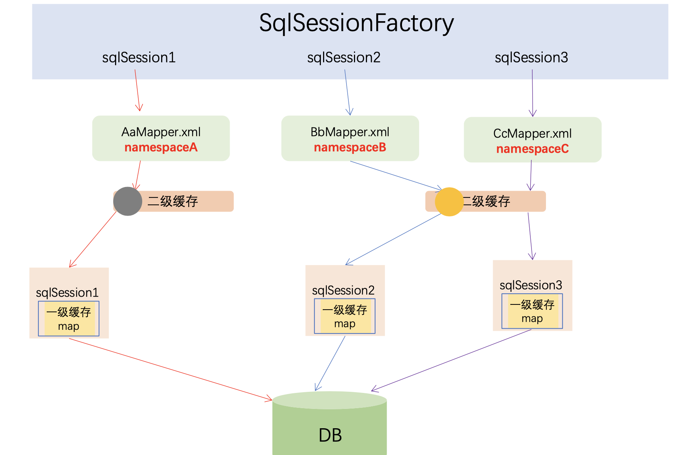
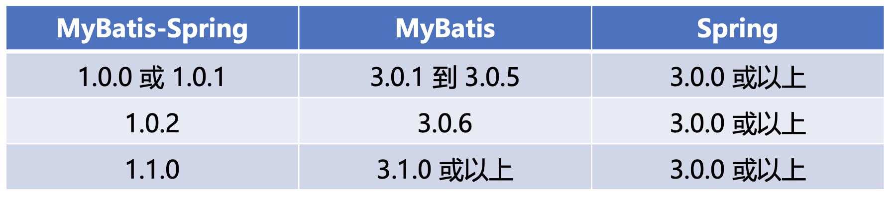

# Mybatis 进阶

## 1. 代码生成器 - Mybatis Generator (MBG)

### 1.1 MBG配置

MyBatis Generator：MyBatis 的开发团队提供了一个很强大的代码生成器，代码包含了数据库表对应的实体类 、Mapper 接口类、 Mapper XML 文件和 Example 对象等，这些代码文件中几乎包含了全部的单表操作方法，使用 MBG 可以极大程度上方便我们使用 MyBatis，还可以减少很多重复操作。

- generatorConfiguration – 根节点
	- properties – 用于指定一个需要在配置中解析使用的外部属性文件;
	- classPathEntry - 在MBG工作的时候，需要额外加载的依赖包;
	- context -用于指定生成一组对象的环境
		- property (0 个或多个) - 设置一些固定属性
		- plugin (0 个或多个)- 定义一个插件，用于扩展或修改通过 MBG 生成的代码
		- commentGenerator (0 个或 1 个) - 该标签用来配置如何生成注释信息
		- jdbcConnection ( 1 个)- 必须要有的，使用这个配置链接数据库
		- javaTypeResolver ( 0 个或 1 个) - 指定 JDBC 类型和 Java 类型如何转换
		- javaModelGenerator ( 1 个) - java模型创建器
		- sqlMapGenerator (0 个或 1 个)- 生成SQL map的XML文件生成器
		- javaClientGenerator (0 个或 1 个)- 生成Mapper接口
		- table ( 1个或多个) -选择一个table来生成相关文件，可以有一个或多个table

#### db.properties

```
jdbc_driver=com.mysql.jdbc.Driver
jdbc_url=jdbc:mysql://localhost:3306/mybatis?useUnicode=true&characterEncoding=utf8&allowMultiQueries=true
jdbc_username=root
jdbc_password=ldh5398938
project_src =src/main/java
project_mapper_xml =src/main/resources/sqlmapper
class_path=/Users/dinghaoli/Desktop/Repo/Java_Course/mysql-connector-java-5.1.48/mysql-connector-java-5.1.48.jar
```

#### generatorConfig.xml

```xml
<?xml version="1.0" encoding="UTF-8" ?>  
<!DOCTYPE generatorConfiguration PUBLIC   
"-//mybatis.org//DTD MyBatis Generator Configuration 1.0//EN"  
 "http://mybatis.org/dtd/mybatis-generator-config_1_0.dtd" >
<generatorConfiguration>
	<!-- 引入配置文件 -->
	<properties resource="db.properties" />

	<!-- 加载数据库驱动 -->
	<classPathEntry location="${class_path}" />
	
	<!-- context:生成一组对象的环境 
			id:必选，上下文id，用于在生成错误时提示 
			defaultModelType:指定生成对象的样式 
				 1，conditional：类似hierarchical；
				 2，flat：所有内容（主键，blob）等全部生成在一个对象中，推荐使用； 
		  		 3，hierarchical：主键生成一个XXKey对象(key class)，Blob等单独生成一个对象，其他简单属性在一个对象中(record class) 
		  	targetRuntime: 
		  		 1，MyBatis3：默认的值，生成基于MyBatis3.x以上版本的内容，包括XXXExample； 
		         2，MyBatis3Simple：类似MyBatis3，只是不生成XXXExample；
		         3，XXXExample可以减少要写的sql，但是有耦合的问题，同时不利于优化sql提升性能
     -->
	<context id="context1" targetRuntime="MyBatis3"	defaultModelType="flat">
	
	    <!-- 生成的Java文件的编码 -->
    	<property name="javaFileEncoding" value="UTF-8"/>
	
	
		<commentGenerator>
			<!-- 是否去除自动生成的注释 true：是 ： false:否 -->
			<property name="suppressAllComments" value="false" />
			<!-- 阻止注释中包含时间戳 true：是 ： false:否 -->
			<property name="suppressDate" value="true" />
			<!--  注释是否包含数据库表的注释信息  true：是 ： false:否 -->
			<property name="addRemarkComments" value="true" />
		</commentGenerator>
		
		<!--数据库连接的信息：驱动类、连接地址、用户名、密码 -->
		<jdbcConnection driverClass="${jdbc_driver}"
			connectionURL="${jdbc_url}" userId="${jdbc_username}" password="${jdbc_password}" />


        <!-- java模型创建器，是必须要的元素   负责：1，key类（见context的defaultModelType）；2，java类；3，查询类
        	targetPackage：生成的类要放的包，真实的包受enableSubPackages属性控制；
        	targetProject：目标项目，指定一个存在的目录下，生成的内容会放到指定目录中，如果目录不存在，MBG不会自动建目录
     	-->
		<javaModelGenerator targetPackage="com.enjoylearning.mybatis.entity" targetProject="${project_src}">
			<!-- 设置一个根对象，
	                      如果设置了这个根对象，那么生成的keyClass或者recordClass会继承这个类；在Table的rootClass属性中可以覆盖该选项
	                      注意：如果在key class或者record class中有root class相同的属性，MBG就不会重新生成这些属性了，包括：
	                1，属性名相同，类型相同，有相同的getter/setter方法；
	         -->
			<property name="rootClass" value="com.enjoylearning.mybatis.entity.BaseEntity" />
		</javaModelGenerator>


		<!-- 生成SQL map的XML文件生成器，
            targetPackage：生成的类要放的包，真实的包受enableSubPackages属性控制；
        	targetProject：目标项目，指定一个存在的目录下，生成的内容会放到指定目录中，如果目录不存在，MBG不会自动建目录
         -->
		<sqlMapGenerator targetPackage="." targetProject="${project_mapper_xml}">
		</sqlMapGenerator>
		
		
		 <!-- 对于mybatis来说，即生成Mapper接口，注意，如果没有配置该元素，那么默认不会生成Mapper接口 
		        type：选择怎么生成mapper接口（在MyBatis3/MyBatis3Simple下）：
		            1，ANNOTATEDMAPPER：会生成使用Mapper接口+Annotation的方式创建（SQL生成在annotation中），不会生成对应的XML；
		            2，MIXEDMAPPER：使用混合配置，会生成Mapper接口，并适当添加合适的Annotation，但是XML会生成在XML中；
		            3，XMLMAPPER：会生成Mapper接口，接口完全依赖XML；
		        注意，如果context是MyBatis3Simple：只支持ANNOTATEDMAPPER和XMLMAPPER
		    -->		
    	<javaClientGenerator  targetPackage="com.enjoylearning.mybatis.mapper"	targetProject="${project_src}" type="XMLMAPPER" />


		<!-- shema 数据库 tableName表明 -->
		<table schema="${jdbc_username}" tableName="%" >
			<generatedKey column="id" sqlStatement="MySql"/>
		</table>


	</context>
</generatorConfiguration>
```

### 1.2 MBG运行

对逆向工程定制较少，项目工程结构比较复杂的情况：

- 从命令提示符 使用 XML 配置文件
	- java -jar mybatis-generator-core-x.x.x.jar -configfile generatorConfig.xml

对逆向工程定制较多，项目工程结构比较单一的情况：

- 作为 Maven Plugin
	- mvn mybatis-generator:generate

- 从另一个 Java 程序 使用 XML 配置文件

## 2. 关联查询

一般来说，高并发的数据库查询不使用关联查询。不得使用外键与级联，一切外键概念必须在应用层解决。 

说明：以学生和成绩的关系为例，学生表中的 student_id 是主键，那么成绩表中的 student_id 则为外键。如果更新学生表中的 student_id，同时触发成绩表中的 student_id 更新，即为 级联更新。外键与级联更新适用于单机低并发，不适合分布式、高并发集群；级联更新是强阻 塞，存在数据库更新风暴的风险；外键影响数据库的插入速度。

在关系型数据库中，我们经常要处理一对一 、 一对多的关系。例如，一辆汽车需要有一个引擎，这是一对一的关系。 一辆汽车有4个或更多个轮子，这是一对多的关系。关联元素就是专门用来处理关联关系的;

关联元素：

- association 一对一关系
- collection 一对多关系
- discriminator 鉴别器映射

关联方式：

- 嵌套结果：使用嵌套结果映射来处理重复的联合结果的子集 - 适合低并发
- 嵌套查询：通过执行另外一个SQL映射语句来返回预期的复杂类型 - 适合高并发
 
### 2.1 一对一 嵌套结果

- association标签 嵌套结果方式 常用属性：
	- property：对应实体类中的属性名，必填项。
	- javaType：属性对应的 Java 类型。
	- resultMap：可以直接使用现有的resultMap ，而不需要在这里配置映射关系。
	- columnPrefix：查询列的前缀，配置前缀后，在子标签配置 result 的 column 时可以省略前缀

Tips:

- resultMap可以通过使用extends实现继承关系，简化很多配置工作量; 
- 通过添加完整的命名空间，可以引用其他xml文件的resultMap
	- resultMap="命名空间.resultMapName"

#### 例子：

```xml
	<resultMap id="userAndPosition1" extends="BaseResultMap" type="TUser">
		<association property="position" javaType="com.enjoylearning.mybatis.entity.TPosition" columnPrefix="post_" >
			<id column="id" property="id"/>
			<result column="name" property="postName"/>
			<result column="note" property="note"/>
		</association>
	</resultMap>

	<select id="selectUserPosition1" resultMap="userAndPosition1">
		select user_name,
			real_name,
			sex,
			mobile,
			email,
			a.note,
			b.id  post_id,
			b.post_name,
			b.note post_note
		from t_user a,
			t_position b
		where a.position_id = b.id

	</select>
```	


### 2.2 一对一 嵌套查询

- association标签 嵌套查询方式 常用属性：
	- select：另 一个映射查询的 id, MyBatis 会额外执行这个查询获取嵌套对象的结果 。
	- column：列名(或别名)，将主查询中列的结果作为嵌套查询的 参数，配置方式如column={propl=coll , prop2=col2}, propl 和 prop2 将作为嵌套查询的参数。
	- fetchType：数据加载方式，可选值为 lazy 和 eager，分别为延迟加载和积极加载 ，这个配置会覆盖全局的 lazyLoadingEnabled 配置;

Tips：

**“N+1 查询问题”**：概括地讲，N+1 查询问题可以是这样引起的：

- 你执行了一个单独的 SQL 语句来获取结果列表(就是“+1”)。
- 对返回的每条记录,你执行了一个查询语句来为每个加载细节(就是“N”)。

这个问题会导致成百上千的 SQL 语句被执行。这通常不是期望的。

“解决办法”：**Mybatis的延迟加载**：对association使用“fetchType=lazy”，并且全局setting进行改善

```
<setting name="aggressiveLazyLoading" value="false"/>
```

回顾Mybatis中的setting：

- lazyLoadingEnabled - Globally enables or disables lazy loading. When enabled, all relations will be lazily loaded. This value can be superseded for a specific relation by using the fetchType attribute on it. - default false

- aggressiveLazyLoading：When enabled, any method call will load all the lazy properties of the object. Otherwise, each property is loaded on demand (see also lazyLoadTriggerMethods). - default false (true in ≤3.4.1)


#### 例子：

```xml
	<resultMap id="userAndPosition2" extends="BaseResultMap" type="TUser">
		<association property="position" fetchType="lazy" column="position_id" select="com.enjoylearning.mybatis.mapper.TPositionMapper.selectByPrimaryKey" />
	</resultMap>
	<!-- 加了fetchType="lazy" 和 aggressiveLazyLoading false以后，第一次只会加载t_user的信息，在之后的操作中如果某个user使用到了position，那么才会进行第position的相关查询，这就是懒加载 -->

	<select id="selectUserPosition2" resultMap="userAndPosition2">
		select
		a.id,
		a.user_name,
		a.real_name,
		a.sex,
		a.mobile,
		a.position_id
		from t_user a
	</select>
```


### 2.3 一对多

- collection 支持的属性以及属性的作用和 association 完全相同
- mybatis会根据id标签，进行字段的合并，合理配置好ID标签可以提高处理的效率;

Tips:

如果要配置一个相当复杂的映射，一定要从基础映射开始配置，每增加一些配置就进行对应的测试，在 循序渐进的过程中更容易发现和解决问题 。	

#### 一对多 嵌套结果

```xml
	<resultMap id="userAndJobs1" extends="BaseResultMap" type="TUser">
		<collection property="jobs"
			ofType="com.enjoylearning.mybatis.entity.TJobHistory" >
			<result column="comp_name" property="compName" jdbcType="VARCHAR" />
			<result column="years" property="years" jdbcType="INTEGER" />
			<result column="title" property="title" jdbcType="VARCHAR" />
		</collection>
	</resultMap>

	<select id="selectUserJobs1" resultMap="userAndJobs1">
		select
		a.id,
		a.user_name,
		a.real_name,
		a.sex,
		a.mobile,
		b.comp_name,
		b.years,
		b.title
		from t_user a,
		t_job_history b
		where a.id = b.user_id

	</select>
```

#### 一对多 嵌套查询

```xml

	<resultMap id="userAndJobs2" extends="BaseResultMap" type="TUser">
		<collection property="jobs" fetchType="lazy" column="id"
			select="com.enjoylearning.mybatis.mapper.TJobHistoryMapper.selectByUserId" />
	</resultMap>

	<select id="selectUserJobs2" resultMap="userAndJobs2">
		select
		a.id,
		a.user_name,
		a.real_name,
		a.sex,
		a.mobile
		from t_user a
	</select>
```

### 2.4 discriminator 鉴别器映射

在特定的情况下使用不同的pojo进行关联，鉴别器元素就是被设计来处理这个情况的。鉴别器非常容易理解,因为它的表现很像 Java 语言中的 switch 语句;

- discriminator 标签常用的两个属性如下:
	- column:该属性用于设置要进行鉴别比较值的列 。
	- javaType:该属性用于指定列的类型，保证使用相同的 Java 类型来比较值。
- discriminator 标签可以有1个或多个 case 标签， case 标签包含以下三个属性 。
	- value : 该值为 discriminator 指定 column 用来匹配的值 。
	- resultMap : 当column的值和value的值匹配时，可以配置使用resultMap指定的映射，resultMap优先级
高于 resultType 。
	- resultType : 当 column 的值和 value 的值匹配时，用于配置使用 resultType指定的映射。


```xml
	<resultMap id="userAndHealthReportMale" extends="userAndHealthReport" type="TUser">
		<collection property="healthReports" column="id"
			select= "com.enjoylearning.mybatis.mapper.THealthReportMaleMapper.selectByUserId"></collection>
	</resultMap>
	
	<resultMap id="userAndHealthReportFemale" extends="userAndHealthReport" type="TUser">
		<collection property="healthReports" column="id"
			select= "com.enjoylearning.mybatis.mapper.THealthReportFemaleMapper.selectByUserId"></collection>
	</resultMap>
	
	<resultMap id="userAndHealthReport" extends="BaseResultMap" type="TUser">
				 
		<discriminator column="sex"  javaType="int">
			<case value="1" resultMap="userAndHealthReportMale"/>
			<case value="2" resultMap="userAndHealthReportFemale"/>
		</discriminator>
	</resultMap>
	

	<select id="selectUserHealthReport" resultMap="userAndHealthReport">
		select
		<include refid="Base_Column_List" />
		from t_user a
	</select>
```

### 2.5 多对多

- 先决条件一：多对多需要一种中间表建立连接关系;
- 先决条件二：多对多关系是由两个一对多关系组成的，一对多可以也可以用两种方式实现;

## 3. 缓存

### 3.1 一级缓存

MyBatis包含一个非常强大的查询缓存特性，使用缓存可以使应用更快地获取数据，避免频繁的数据库交互，一级缓存（也叫应用缓存）：

- 一级缓存默认会启用，想要关闭一级缓存可以在select标签上配置flushCache=“true”;

- **一级缓存存在于SqlSession的生命周期中，在同一个SqlSession中查询时，MyBatis会把执行的方法和参数通过算法生成缓存的键值，将键值和查询结果存入一个Map对象中。如果同一个SqlSession中执行的方法和参数完全一致，那么通过算法会生成相同的键值，当Map缓存对象中己经存在该键值时，则会返回缓存中的对象;**

- 任何的INSERT、UPDATE、DELETE操作都会清空一级缓存;

- 有事务机制，线程独享，基本是线程安全的。

### 3.2 二级缓存

**二级缓存存在于SqlSessionFactory的生命周期中，可以理解为跨sqlSession；缓存是以namespace为单
位的，不同namespace下的操作互不影响。**

- setting参数 cacheEnabled，这个参数是二级缓存的全局开关，默认值是true，如果把这个参数设置为false，即使有后面的二级缓存配置，也不会生效;

- 要开启二级缓存,你需要在你的 SQL 映射文件中添加配置:


```xml
<cache></cache>
```

Literally that's it. The effect of this one simple statement is as follows:

- All results from select statements in the mapped statement file will be cached.
- All insert, update and delete statements in the mapped statement file will flush the cache.
- The cache will use a Least Recently Used (LRU) algorithm for eviction.
- The cache will not flush on any sort of time based schedule (i.e. no Flush Interval).
- The cache will store 1024 references to lists or objects (whatever the query method returns).
- The cache will be treated as a read/write cache, meaning objects retrieved are not shared and can be safely modified by the caller, without interfering with other potential modifications by other callers or threads.

```xml
<cache eviction="LRU" flushInterval="60000" size="512" readOnly="true"/>

```
效果如下:

- 映射语句文件中的所有 select 语句将会被缓存。

- 映射语句文件中的所有 insert,update 和 delete 语句会刷新缓存。

- eviction - 缓存会使用 FIFO，eviction是缓存的淘汰算法，可选值有"LRU"、"FIFO"、"SOFT"、"WEAK"，缺省值是LRU。

- flushInterval - 存过期时间，单位为毫秒，60000即为60秒，缺省值为空，即只要容量足够，永不过期。

- size - 缓存会存储列表集合或对象(无论查询方法返回什么)的 512个引用。

- readOnly - 缓存会被视为是 read/write(可读/可写)的缓存;

#### cache-ref

Recall from the previous section that only the cache for this particular namespace will be used or flushed for statements within the same namespace. There may come a time when you want to share the same cache configuration and instance between namespaces. In such cases you can reference another cache by using the cache-ref element.

<cache-ref namespace="com.someone.application.data.SomeMapper"/>

**Tips: 使用二级缓存容易出现脏读，假设有两个namespace的二级缓存中有两个一样的数据，但是其中一个namespace更改数据刷新了二级缓存，另一个namespace并不会立即刷新。建议避免使用二级缓存，在业务层使用可控制的缓存代替更好；**



## 4. 与Spring集成

### 4.1 MyBatis-Spring是什么？

- Mybatis-spring 用于帮助你将 MyBatis 代码无缝地整合到 Spring 中。
	- Spring 将会加载必要的 MyBatis 工厂类和 session 类
	- 提供一个简单的方式来注入 MyBatis 数据映射器和 SqlSession 到业务层的bean中。 
	- 方便集成spring事务
	- 翻译 MyBatis 的异常到 Spring 的 DataAccessException 异常(数据访问异常)中。


- Mybatis-spring 兼容性：MyBatis-Spring要求Java5及以上版本还有下面列出的MyBatis和Spring版本:



### 4.2 集成配置最佳实践

- 1- 准备spring项目一个
- 2- 在pom文件中添加mybatis-spring的依赖
```xml
<dependency> 
	<groupId>org.mybatis</groupId> 
	<artifactId>mybatis-spring</artifactId> 
	<version>1.3.0</version>
</dependency>
```

- 3- 配置SqlSessionFactoryBean
- 4- 配置MapperScannerConfigurer 
- 5- 配置事务

### 4.3 SqlSessionFactoryBean

```xml
<!-- spring和MyBatis完美整合，不需要mybatis的配置映射文件 -->
	<bean id="sqlSessionFactory" class="org.mybatis.spring.SqlSessionFactoryBean">
		<property name="dataSource" ref="dataSource" />
		<property name="typeAliasesPackage" value="com.enjoylearning.mybatis.entity" />
		<property name="mapperLocations" value="classpath*:sqlmapper/*.xml" />
	</bean>
```

MyBatis-Spring 中， SqlSessionFactoryBean 是用于创建 Sql SessionFactory 的：

- dataSource：用于配置数据源，该属性为必选项，必须通过这个属性配置数据源 ，这里使用了 上一节中配置好的 dataSource 数据库连接池 。

- mapper Locations：配置 SqlSessionFactoryBean 扫描 XML 映射文件的路径，可以使用 Ant 风格的路径进行配置。

- configLocation：用于配置mybatis config XML的路径，除了数据源外，对MyBatis的各种配直仍然可以通过这种方式进行，并且配置MyBatis settings时只能使用这种方式。但配置文件中 **任意环境，数据源 和 MyBatis 的事务管理器都会被忽略;**

- typeAliasesPackage : 配置包中类的别名，配置后，包中的类在XML映射文件中使用时可以 省略包名部分，直接使用类名。这个配置不支持Ant风格的路径，当需要配置多个包路径时可以使用分号或逗号进行分隔 。

### 4.4 MapperScannerConfigurer

通过 MapperScannerConfigurer类自动扫描所有的 Mapper 接口，使用时可以直接注入接口 。
MapperScannerConfigurer中常配置以下两个属性。

- basePackage：用于配置基本的包路径。可以使用分号或逗号作为分隔符设置多于一个的包路
径，每个映射器将会在指定的包路径中递归地被搜索到。

- annotationClass：用于过滤被扫描的接口，如果设置了该属性，那么 MyBatis 的接口只有包
含该注解才会被扫描进去。


