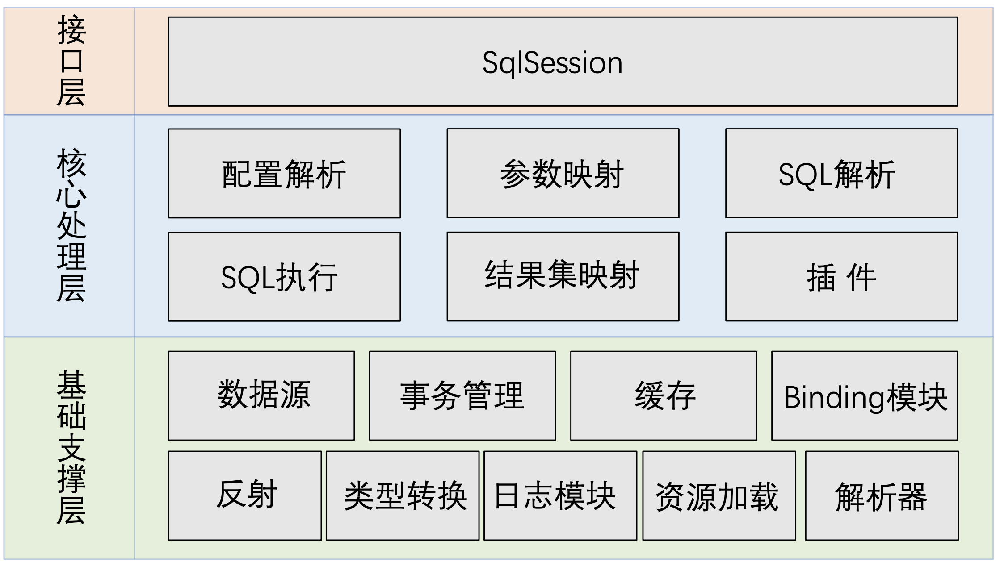

## 1. 源码分析概述

### 1.1 源码包分析

[MyBatis 源码下载地址](https://github.com/mybatis/mybatis-3)

MyBatis源码导入过程：

- 1. 下载MyBatis的源码
- 2. 检查maven的版本，必须是3.25以上，建议使用maven的最新版本
- 3. mybatis的工程是maven工程，在开发工具中导入，工程必须使用jdk1.8以上版本;
- 4. 把mybatis源码的pom文件中<optional>true</optional>，全部改为false;
- 5. 在工程目录下执行 mvn clean install -Dmaven.test.skip=true,将当前工程安装到本地仓库(pdf插件报
错的话，需要将这个插件屏蔽);
- 6. 其他工程依赖此工程

### 1.2 mybatis整体架构



### 1.3 谈谈设计模式的几个原则

- **单一职责原则**：一个类或者一个接口只负责唯一项职责，尽量设计出功能单一的接口;

- **依赖倒转原则**：高层模块不应该依赖低层模块具体实现，解耦高层与低层。既面向**接口编程**，当实现发生变化
时，只需提供新的实现类，不需要修改高层模块代码;

- **开放-封闭原则**：程序对外扩展开放，对修改关闭;换句话说，当需求发生变化时，我们可以通过添加新模块
来满足新需求，而不是通过修改原来的实现代码来满足新需求;


## 2. 日志模块


### 2.1 需求一

MyBatis没有提供日志的实现类，需要接入第三方的日志组件，但第三方日志组件都有各自的Log级别，且各 不相同，所以MyBatis统一提供了trace、debug、warn、error四个级别;

#### 适配器模式

适配器模式(Adapter Pattern)是作为两个不兼容的接口之间的桥梁，将一个类的接口转换成客户希望的另外一个接口。适配器模式使得原本由于接口不兼容而不能一起工作的那些类可以一起工作;

- Target：目标角色，期待得到的接口。
- Adaptee：适配者角色，被适配的接口。
- Adapter：适配器角色，将源接口转换成目标接口。


适用场景：当调用双方都不太容易修改的时候，为了复用现有组件可以使用适配器模式;在系统中接入第三方组 件的时候经常被使用到;

注意：如果系统中存在过多的适配器，会增加系统的复杂性，设计人员应考虑对系统进行重构;

```java
package org.apache.ibatis.logging.jdk14;


/**
 * @author Clinton Begin
 */
//jdkLog的适配器Adapter，需要实现target interface
public class Jdk14LoggingImpl implements Log {

  //真正提供日志能力的jdk的日志类，Adaptee
  private final Logger log;

  public Jdk14LoggingImpl(String clazz) {
    log = Logger.getLogger(clazz);
  }

  @Override
  public boolean isDebugEnabled() {
    return log.isLoggable(Level.FINE);
  }

  @Override
  public boolean isTraceEnabled() {
    return log.isLoggable(Level.FINER);
  }

  @Override
  public void error(String s, Throwable e) {
    log.log(Level.SEVERE, s, e);
  }

  @Override
  public void error(String s) {
    log.log(Level.SEVERE, s);
  }

  @Override
  public void debug(String s) {
    log.log(Level.FINE, s);
  }

  @Override
  public void trace(String s) {
    log.log(Level.FINER, s);
  }

  @Override
  public void warn(String s) {
    log.log(Level.WARNING, s);
  }

}
```


### 2.2 需求二

自动扫描日志实现，并且第三方日志插件加载优先级如下:slf4J → commonsLoging → Log4J2 → Log4J → JdkLog;

```java
package org.apache.ibatis.logging;

/**
 * @author Clinton Begin
 * @author Eduardo Macarron
 */
public final class LogFactory {

  /**
   * Marker to be used by logging implementations that support markers
   */
  public static final String MARKER = "MYBATIS";

  //被选定的第三方日志组件适配器的构造方法
  private static Constructor<? extends Log> logConstructor;

  //自动扫描日志实现，并且第三方日志插件加载优先级如下：slf4J → commonsLoging → Log4J2 → Log4J → JdkLog
  static {
    tryImplementation(LogFactory::useSlf4jLogging);
    tryImplementation(LogFactory::useCommonsLogging);
    tryImplementation(LogFactory::useLog4J2Logging);
    tryImplementation(LogFactory::useLog4JLogging);
    tryImplementation(LogFactory::useJdkLogging);
    tryImplementation(LogFactory::useNoLogging);
  }

  private LogFactory() {
    // disable construction
  }

  public static Log getLog(Class<?> aClass) {
    return getLog(aClass.getName());
  }

  public static Log getLog(String logger) {
    try {
      return logConstructor.newInstance(logger);
    } catch (Throwable t) {
      throw new LogException("Error creating logger for logger " + logger + ".  Cause: " + t, t);
    }
  }

  public static synchronized void useCustomLogging(Class<? extends Log> clazz) {
    setImplementation(clazz);
  }

  public static synchronized void useSlf4jLogging() {
    setImplementation(org.apache.ibatis.logging.slf4j.Slf4jImpl.class);
  }

  public static synchronized void useCommonsLogging() {
    setImplementation(org.apache.ibatis.logging.commons.JakartaCommonsLoggingImpl.class);
  }

  public static synchronized void useLog4JLogging() {
    setImplementation(org.apache.ibatis.logging.log4j.Log4jImpl.class);
  }

  public static synchronized void useLog4J2Logging() {
    setImplementation(org.apache.ibatis.logging.log4j2.Log4j2Impl.class);
  }

  public static synchronized void useJdkLogging() {
    setImplementation(org.apache.ibatis.logging.jdk14.Jdk14LoggingImpl.class);
  }

  public static synchronized void useStdOutLogging() {
    setImplementation(org.apache.ibatis.logging.stdout.StdOutImpl.class);
  }

  public static synchronized void useNoLogging() {
    setImplementation(org.apache.ibatis.logging.nologging.NoLoggingImpl.class);
  }

  
  private static void tryImplementation(Runnable runnable) {
    if (logConstructor == null) {//当构造方法不为空才执行方法
      try {
        runnable.run();
      } catch (Throwable t) {
        // ignore
      }
    }
  }
  //通过指定的log类来初始化构造方法
  private static void setImplementation(Class<? extends Log> implClass) {
    try {
      Constructor<? extends Log> candidate = implClass.getConstructor(String.class);
      Log log = candidate.newInstance(LogFactory.class.getName());
      if (log.isDebugEnabled()) {
        log.debug("Logging initialized using '" + implClass + "' adapter.");
      }
      logConstructor = candidate;
    } catch (Throwable t) {
      throw new LogException("Error setting Log implementation.  Cause: " + t, t);
    }
  }

}
```


### 2.3 需求三

日志的使用要优雅地（AOP）嵌入到主体功能中;

#### 代理模式那些事

定义：给目标对象提供一个代理对象，并由代理对象控制对目标对象的引用;

- 通过引入代理对象的方式来间接访问目标对象，防止直接访问目标对象给系统带来的不必要复杂性; 
- 通过代理对象对原有的业务增强;


代理模式给我们带来的便利：

- 作为中介解耦客户端和真实对象，保护真实对象安全;(房屋中介)
- 防止直接访问目标对象给系统带来的不必要复杂性;(海外代购,SSH)
- 对业务进行增强，增强点多样化如：前入、后入、异常;(AOP)


参考：[[Java散记]静态代理和动态代理](https://zhuanlan.zhihu.com/p/47403993)

```java
import java.lang.reflect.InvocationHandler;
import java.lang.reflect.Method;
import java.lang.reflect.Proxy;

/**
 * 首先是一个接口Subject,这个接口就类似于上述静态代理中的Worker接口;
 */
interface Subject {
    void action();
}

/**
 * 被代理类,也就是真实的类,就类似于上述静态代理中的Seller类;
 */
class RealSubject implements Subject {
    @Override
    public void action() {
        System.out.println("我是被代理类哦!!");
    }
}

/**
 * 代理类,也就是代理对象,就类似于上述静态代理中的Scalper类;
 */
class ProxySubject implements InvocationHandler { // 涉及到动态代理需要实现这个接口InvocationHandler

    // 实现了接口的被代理类的对象引用声明;
    private Object object;

    public Object getNewInstance(Object object) {
        // 实例化被代理类的对象;
        this.object = object;
        // 返回一个代理类的对象;
        /**
         * 这里的newProxyInstance的三个参数:(ClassLoader loader, Class<?>[] interfaces, InvocationHandler h)
         *      1.第一个参数是需要传入类的加载器,这里指的是被代理类的类加载器,简单来说就是和被代理类使用相同的类加载器;
         *      2.第二个参数是需要传入类的接口,也就是说,这个类实现了哪些接口,我都要传过来;
         *      3.第三个参数是需要传入的一个InvocationHandler对象,指的是代理类对象,也就是调用这个函数的this对象(ProxySubject对象);
         */
        return Proxy.newProxyInstance(object.getClass().getClassLoader(), object.getClass().getInterfaces(), this);
    }

    // 当通过代理类的对象发起对被重写的方法的调用是,都会转换为对以下invoke方法的调用;
    @Override
    public Object invoke(Object proxy, Method method, Object[] args) throws Throwable {
        // 增强代码(前);
        System.out.println("前增强功能!!");

        // 被代理类的方法;
        Object value = method.invoke(object, args);

        // 增强代码(后);
        System.out.println("后增强功能!!");
        return value;
    }
}


public class DynamicProxyDemo {
    public static void main(String[] args){
        // 1.创建被代理类对象;
        RealSubject realSubject = new RealSubject();
        // 2.创建一个实现了InvocationHandler接口的类的对象;
        ProxySubject proxySubject = new ProxySubject();
        // 3.父类引用指向子类对象;
        Subject subject = (Subject)proxySubject.getNewInstance(realSubject);
        // 4.执行代理类的方法;
        subject.action();

        // 使用前面静态代理的例子,创建一个Seller的被代理类对象;
        Seller seller = new Seller();
        // 创建一个Worker的子类对象,指向Seller的代理类对象;
        Worker worker = (Worker)proxySubject.getNewInstance(seller);
        // 执行其方法;
        worker.sell();
    }
}
```


#### 需求三实现


- ConnectionLogger：负责打印连接信息和SQL语句，并创建PreparedStatementLogger;
- PreparedStatementLogger：负责打印参数信息，并创建ResultSetLogger
- ResultSetLogger：负责打印数据结果信息;


