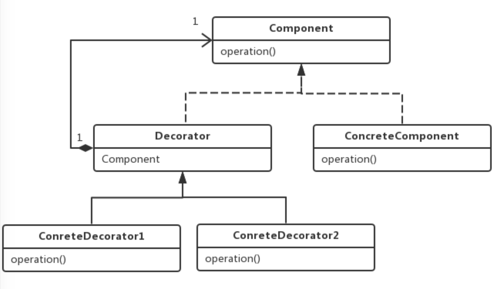

## 1. 基础模块源码分析

### 1.1 源码包分析

[MyBatis 源码下载地址](https://github.com/mybatis/mybatis-3)

MyBatis源码导入过程：

- 1. 下载MyBatis的源码
- 2. 检查maven的版本，必须是3.25以上，建议使用maven的最新版本
- 3. mybatis的工程是maven工程，在开发工具中导入，工程必须使用jdk1.8以上版本;
- 4. 把mybatis源码的pom文件中<optional>true</optional>，全部改为false;
- 5. 在工程目录下执行 mvn clean install -Dmaven.test.skip=true,将当前工程安装到本地仓库(pdf插件报
错的话，需要将这个插件屏蔽);
- 6. 其他工程依赖此工程

### 1.2 mybatis整体架构


### 1.3 谈谈设计模式的几个原则

- **单一职责原则**：一个类或者一个接口只负责唯一项职责，尽量设计出功能单一的接口;

- **依赖倒转原则**：高层模块不应该依赖低层模块具体实现，解耦高层与低层。既面向**接口编程**，当实现发生变化
时，只需提供新的实现类，不需要修改高层模块代码;

- **开放-封闭原则**：程序对外扩展开放，对修改关闭;换句话说，当需求发生变化时，我们可以通过添加新模块
来满足新需求，而不是通过修改原来的实现代码来满足新需求;


## 2. 日志模块


### 2.1 需求一

MyBatis没有提供日志的实现类，需要接入第三方的日志组件，但第三方日志组件都有各自的Log级别，且各 不相同，所以MyBatis统一提供了trace、debug、warn、error四个级别;

#### 适配器模式

适配器模式(Adapter Pattern)是作为两个不兼容的接口之间的桥梁，将一个类的接口转换成客户希望的另外一个接口。适配器模式使得原本由于接口不兼容而不能一起工作的那些类可以一起工作;

- Target：目标角色，期待得到的接口。
- Adaptee：适配者角色，被适配的接口。
- Adapter：适配器角色，将源接口转换成目标接口。


适用场景：当调用双方都不太容易修改的时候，为了复用现有组件可以使用适配器模式;在系统中接入第三方组 件的时候经常被使用到;

注意：如果系统中存在过多的适配器，会增加系统的复杂性，设计人员应考虑对系统进行重构;

```java
package org.apache.ibatis.logging.jdk14;


/**
 * @author Clinton Begin
 */
//jdkLog的适配器Adapter，需要实现target interface
public class Jdk14LoggingImpl implements Log {

  //真正提供日志能力的jdk的日志类，Adaptee
  private final Logger log;

  public Jdk14LoggingImpl(String clazz) {
    log = Logger.getLogger(clazz);
  }

  @Override
  public boolean isDebugEnabled() {
    return log.isLoggable(Level.FINE);
  }

  @Override
  public boolean isTraceEnabled() {
    return log.isLoggable(Level.FINER);
  }

  @Override
  public void error(String s, Throwable e) {
    log.log(Level.SEVERE, s, e);
  }

  @Override
  public void error(String s) {
    log.log(Level.SEVERE, s);
  }

  @Override
  public void debug(String s) {
    log.log(Level.FINE, s);
  }

  @Override
  public void trace(String s) {
    log.log(Level.FINER, s);
  }

  @Override
  public void warn(String s) {
    log.log(Level.WARNING, s);
  }

}
```


### 2.2 需求二

自动扫描日志实现，并且第三方日志插件加载优先级如下:slf4J → commonsLoging → Log4J2 → Log4J → JdkLog;

```java
package org.apache.ibatis.logging;

/**
 * @author Clinton Begin
 * @author Eduardo Macarron
 */
public final class LogFactory {

  /**
   * Marker to be used by logging implementations that support markers
   */
  public static final String MARKER = "MYBATIS";

  //被选定的第三方日志组件适配器的构造方法
  private static Constructor<? extends Log> logConstructor;

  //自动扫描日志实现，并且第三方日志插件加载优先级如下：slf4J → commonsLoging → Log4J2 → Log4J → JdkLog
  static {
    tryImplementation(LogFactory::useSlf4jLogging);
    tryImplementation(LogFactory::useCommonsLogging);
    tryImplementation(LogFactory::useLog4J2Logging);
    tryImplementation(LogFactory::useLog4JLogging);
    tryImplementation(LogFactory::useJdkLogging);
    tryImplementation(LogFactory::useNoLogging);
  }

  private LogFactory() {
    // disable construction
  }

  public static Log getLog(Class<?> aClass) {
    return getLog(aClass.getName());
  }

  public static Log getLog(String logger) {
    try {
      return logConstructor.newInstance(logger);
    } catch (Throwable t) {
      throw new LogException("Error creating logger for logger " + logger + ".  Cause: " + t, t);
    }
  }

  public static synchronized void useCustomLogging(Class<? extends Log> clazz) {
    setImplementation(clazz);
  }

  public static synchronized void useSlf4jLogging() {
    setImplementation(org.apache.ibatis.logging.slf4j.Slf4jImpl.class);
  }

  public static synchronized void useCommonsLogging() {
    setImplementation(org.apache.ibatis.logging.commons.JakartaCommonsLoggingImpl.class);
  }

  public static synchronized void useLog4JLogging() {
    setImplementation(org.apache.ibatis.logging.log4j.Log4jImpl.class);
  }

  public static synchronized void useLog4J2Logging() {
    setImplementation(org.apache.ibatis.logging.log4j2.Log4j2Impl.class);
  }

  public static synchronized void useJdkLogging() {
    setImplementation(org.apache.ibatis.logging.jdk14.Jdk14LoggingImpl.class);
  }

  public static synchronized void useStdOutLogging() {
    setImplementation(org.apache.ibatis.logging.stdout.StdOutImpl.class);
  }

  public static synchronized void useNoLogging() {
    setImplementation(org.apache.ibatis.logging.nologging.NoLoggingImpl.class);
  }

  
  private static void tryImplementation(Runnable runnable) {
    if (logConstructor == null) {//当构造方法不为空才执行方法
      try {
        runnable.run();
      } catch (Throwable t) {
        // ignore
      }
    }
  }
  //通过指定的log类来初始化构造方法
  private static void setImplementation(Class<? extends Log> implClass) {
    try {
      Constructor<? extends Log> candidate = implClass.getConstructor(String.class);
      Log log = candidate.newInstance(LogFactory.class.getName());
      if (log.isDebugEnabled()) {
        log.debug("Logging initialized using '" + implClass + "' adapter.");
      }
      logConstructor = candidate;
    } catch (Throwable t) {
      throw new LogException("Error setting Log implementation.  Cause: " + t, t);
    }
  }

}
```


### 2.3 需求三

日志的使用要优雅地（AOP）嵌入到主体功能中;

#### 代理模式那些事

定义：给目标对象提供一个代理对象，并由代理对象控制对目标对象的引用;

- 通过引入代理对象的方式来间接访问目标对象，防止直接访问目标对象给系统带来的不必要复杂性; 
- 通过代理对象对原有的业务增强;


代理模式给我们带来的便利：

- 作为中介解耦客户端和真实对象，保护真实对象安全;(房屋中介)
- 防止直接访问目标对象给系统带来的不必要复杂性;(海外代购,SSH)
- 对业务进行增强，增强点多样化如：前入、后入、异常;(AOP)


参考：[[Java散记]静态代理和动态代理](https://zhuanlan.zhihu.com/p/47403993)

```java
import java.lang.reflect.InvocationHandler;
import java.lang.reflect.Method;
import java.lang.reflect.Proxy;

/**
 * 首先是一个接口Subject,这个接口就类似于上述静态代理中的Worker接口;
 */
interface Subject {
    void action();
}

/**
 * 被代理类,也就是真实的类,就类似于上述静态代理中的Seller类;
 */
class RealSubject implements Subject {
    @Override
    public void action() {
        System.out.println("我是被代理类哦!!");
    }
}

/**
 * 代理类,也就是代理对象,就类似于上述静态代理中的Scalper类;
 */
class ProxySubject implements InvocationHandler { // 涉及到动态代理需要实现这个接口InvocationHandler

    // 实现了接口的被代理类的对象引用声明;
    private Object object;

    public Object getNewInstance(Object object) {
        // 实例化被代理类的对象;
        this.object = object;
        // 返回一个代理类的对象;
        /**
         * 这里的newProxyInstance的三个参数:(ClassLoader loader, Class<?>[] interfaces, InvocationHandler h)
         *      1.第一个参数是需要传入类的加载器,这里指的是被代理类的类加载器,简单来说就是和被代理类使用相同的类加载器;
         *      2.第二个参数是需要传入类的接口,也就是说,这个类实现了哪些接口,我都要传过来;
         *      3.第三个参数是需要传入的一个InvocationHandler对象,指的是代理类对象,也就是调用这个函数的this对象(ProxySubject对象);
         */
        return Proxy.newProxyInstance(object.getClass().getClassLoader(), object.getClass().getInterfaces(), this);
    }

    // 当通过代理类的对象发起对被重写的方法的调用是,都会转换为对以下invoke方法的调用;
    @Override
    public Object invoke(Object proxy, Method method, Object[] args) throws Throwable {
        // 增强代码(前);
        System.out.println("前增强功能!!");

        // 被代理类的方法;
        Object value = method.invoke(object, args);

        // 增强代码(后);
        System.out.println("后增强功能!!");
        return value;
    }
}


public class DynamicProxyDemo {
    public static void main(String[] args){
        // 1.创建被代理类对象;
        RealSubject realSubject = new RealSubject();
        // 2.创建一个实现了InvocationHandler接口的类的对象;
        ProxySubject proxySubject = new ProxySubject();
        // 3.父类引用指向子类对象;
        Subject subject = (Subject)proxySubject.getNewInstance(realSubject);
        // 4.执行代理类的方法;
        subject.action();

        // 使用前面静态代理的例子,创建一个Seller的被代理类对象;
        Seller seller = new Seller();
        // 创建一个Worker的子类对象,指向Seller的代理类对象;
        Worker worker = (Worker)proxySubject.getNewInstance(seller);
        // 执行其方法;
        worker.sell();
    }
}
```


#### 需求三实现


- ConnectionLogger：负责打印连接信息和SQL语句，并创建PreparedStatementLogger;
- PreparedStatementLogger：负责打印参数信息，并创建ResultSetLogger
- ResultSetLogger：负责打印数据结果信息;


##### 一个抽象基类用于继承

```java
package org.apache.ibatis.logging.jdbc;
//...

//所有日志增强的抽象基类
public abstract class BaseJdbcLogger {

  //保存preparestatment中常用的set方法（占位符赋值）
  protected static final Set<String> SET_METHODS = new HashSet<>();
  //保存preparestatment中常用的执行sql语句的方法
  protected static final Set<String> EXECUTE_METHODS = new HashSet<>();

  //保存preparestatment中set方法的键值对
  private final Map<Object, Object> columnMap = new HashMap<>();

  //保存preparestatment中set方法的key值
  private final List<Object> columnNames = new ArrayList<>();
  //保存preparestatment中set方法的value值
  private final List<Object> columnValues = new ArrayList<>();

  // ...

  static {
    SET_METHODS.add("setString");
    SET_METHODS.add("setNString");
    SET_METHODS.add("setInt");
    // ...

    EXECUTE_METHODS.add("execute");
    EXECUTE_METHODS.add("executeUpdate");
    EXECUTE_METHODS.add("executeQuery");
    EXECUTE_METHODS.add("addBatch");
  }

// ...
```

##### ConnectionLogger

```java
package org.apache.ibatis.logging.jdbc;
//...

public final class ConnectionLogger extends BaseJdbcLogger implements InvocationHandler {

 //真正的连接对象
  private final Connection connection;

  private ConnectionLogger(Connection conn, Log statementLog, int queryStack) {
    super(statementLog, queryStack);
    this.connection = conn;
  }

  @Override
  //对连接的增强
  public Object invoke(Object proxy, Method method, Object[] params)
      throws Throwable {
    try {
      //如果是从Obeject继承的方法直接忽略
      if (Object.class.equals(method.getDeclaringClass())) {
        return method.invoke(this, params);
      }
      //如果是调用prepareStatement、prepareCall、createStatement的方法，打印要执行的sql语句
      //并返回prepareStatement的代理对象，让prepareStatement也具备日志能力，打印参数
      if ("prepareStatement".equals(method.getName())) {
        if (isDebugEnabled()) {
          debug(" Preparing: " + removeBreakingWhitespace((String) params[0]), true);//打印sql语句
        }        
        PreparedStatement stmt = (PreparedStatement) method.invoke(connection, params);
        stmt = PreparedStatementLogger.newInstance(stmt, statementLog, queryStack);//创建代理对象
        return stmt;
      } else if ("prepareCall".equals(method.getName())) {
        if (isDebugEnabled()) {
          debug(" Preparing: " + removeBreakingWhitespace((String) params[0]), true);//打印sql语句
        }        
        PreparedStatement stmt = (PreparedStatement) method.invoke(connection, params);//创建代理对象
        stmt = PreparedStatementLogger.newInstance(stmt, statementLog, queryStack);
        return stmt;
      } else if ("createStatement".equals(method.getName())) {
        Statement stmt = (Statement) method.invoke(connection, params);
        stmt = StatementLogger.newInstance(stmt, statementLog, queryStack);//创建代理对象
        return stmt;
      } else {
        return method.invoke(connection, params);
      }
    } catch (Throwable t) {
      throw ExceptionUtil.unwrapThrowable(t);
    }
  }

  /*
   * Creates a logging version of a connection
   *
   * @param conn - the original connection
   * @return - the connection with logging
   */
  public static Connection newInstance(Connection conn, Log statementLog, int queryStack) {
    InvocationHandler handler = new ConnectionLogger(conn, statementLog, queryStack);
    ClassLoader cl = Connection.class.getClassLoader();
    return (Connection) Proxy.newProxyInstance(cl, new Class[]{Connection.class}, handler);
  }

  /*
   * return the wrapped connection
   *
   * @return the connection
   */
  public Connection getConnection() {
    return connection;
  }

}

```

##### PreparedStatementLogger

```java
package org.apache.ibatis.logging.jdbc;
//...

public final class PreparedStatementLogger extends BaseJdbcLogger implements InvocationHandler {

  private final PreparedStatement statement;

  private PreparedStatementLogger(PreparedStatement stmt, Log statementLog, int queryStack) {
    super(statementLog, queryStack);
    this.statement = stmt;
  }

  @Override
  public Object invoke(Object proxy, Method method, Object[] params) throws Throwable {
    try {
      if (Object.class.equals(method.getDeclaringClass())) {
        return method.invoke(this, params);
      }          
      if (EXECUTE_METHODS.contains(method.getName())) {
        if (isDebugEnabled()) {
          debug("Parameters: " + getParameterValueString(), true);
        }
        clearColumnInfo();
        if ("executeQuery".equals(method.getName())) {
          // 继续返回ResultSetLogger的代理类
          ResultSet rs = (ResultSet) method.invoke(statement, params);
          return rs == null ? null : ResultSetLogger.newInstance(rs, statementLog, queryStack);
        } else {
          return method.invoke(statement, params);
        }
      } //。。。
    } catch (Throwable t) {
      throw ExceptionUtil.unwrapThrowable(t);
    }
  }

  /*
   * Creates a logging version of a PreparedStatement
   *
   * @param stmt - the statement
   * @param sql  - the sql statement
   * @return - the proxy
   */
  public static PreparedStatement newInstance(PreparedStatement stmt, Log statementLog, int queryStack) {
    InvocationHandler handler = new PreparedStatementLogger(stmt, statementLog, queryStack);
    ClassLoader cl = PreparedStatement.class.getClassLoader();
    return (PreparedStatement) Proxy.newProxyInstance(cl, new Class[]{PreparedStatement.class, CallableStatement.class}, handler);
  }

  /*
   * Return the wrapped prepared statement
   *
   * @return the PreparedStatement
   */
  public PreparedStatement getPreparedStatement() {
    return statement;
  }

}
```

总的来说，从Connection到PreparedStatement再到ResultSetLogger，就是多层嵌套的动态代理，用于对连接数据库时的不同方法进行动态代理增强。

- 工厂接口(Factory):工厂接口是工厂方法模式的核心接口，调用者会直接和工厂接口交互用于获取具体的 产品实现类;

- 具体工厂类(ConcreteFactory):是工厂接口的实现类，用于实例化产品对象，不同的具体工厂类会根据需求 实例化不同的产品实现类;

- 产品接口(Product):产品接口用于定义产品类的功能，具体工厂类产生的所有产品都必须实现这个接口。调用者与产品接口直接交互，这是调用者最关心的接口;

- 具体产品类(ConcreteProduct):实现产品接口的实现类，具体产品类中定义了具体的业务逻辑;


## 3. 数据源模块

### 工厂模式

工厂模式(Factory Pattern)属于创建型模式，它提供了一种创建对象的最佳方式。定义一个创建对象的接口，让其子类自己决定实例化哪一个工厂类，工厂模式使其创建过程延迟到子类进行


#### 为什么使用工厂模式


#### [抽象工厂和工厂模式的区别](https://www.zhihu.com/question/20367734)


### 3.1 需求

- 常见的数据源组件都实现了javax.sql.DataSource接口;
- MyBatis不但要能集成第三方的数据源组件，自身也提供了数据源的实现;
- 一般情况下，数据源的初始化过程参数较多，比较复杂;


### 3.2 数据源模块类图


- PooledConnection：使用动态代理封装了真正的数据库连接对象;

- PoolState：用于管理PooledConnection对象状态的组件，通过两个list分别 管理空闲状态的连接资源和活跃状态的连
接资源

- PooledDataSource：一个简单，同步的、线程安全的数据库连接池


### 3.3 工厂模式接口

```java
package org.apache.ibatis.datasource;

public interface DataSourceFactory {

  //设置DataSource的相关属性
  void setProperties(Properties props);

  //获取数据源
  DataSource getDataSource();

}

```


### 3.4 UnpooledDataSourceFactory

```java
package org.apache.ibatis.datasource.unpooled;


//不用连接池的数据连接工厂
public class UnpooledDataSourceFactory implements DataSourceFactory {

  private static final String DRIVER_PROPERTY_PREFIX = "driver.";
  private static final int DRIVER_PROPERTY_PREFIX_LENGTH = DRIVER_PROPERTY_PREFIX.length();

  protected DataSource dataSource;

  public UnpooledDataSourceFactory() {
    this.dataSource = new UnpooledDataSource();
  }

  @Override
  public void setProperties(Properties properties) {
    Properties driverProperties = new Properties();
    //创建DataSource相应的metaObject，方便赋值
    MetaObject metaDataSource = SystemMetaObject.forObject(dataSource);
    //遍历properties，将属性设置到DataSource中
    for (Object key : properties.keySet()) {
      String propertyName = (String) key;
      if (propertyName.startsWith(DRIVER_PROPERTY_PREFIX)) {
        String value = properties.getProperty(propertyName);
        driverProperties.setProperty(propertyName.substring(DRIVER_PROPERTY_PREFIX_LENGTH), value);
      } else if (metaDataSource.hasSetter(propertyName)) {
        String value = (String) properties.get(propertyName);
        Object convertedValue = convertValue(metaDataSource, propertyName, value);
        metaDataSource.setValue(propertyName, convertedValue);
      } else {
        throw new DataSourceException("Unknown DataSource property: " + propertyName);
      }
    }
    //设置DataSource.driverProperties属性
    if (driverProperties.size() > 0) {
      metaDataSource.setValue("driverProperties", driverProperties);
    }
  }

  @Override
  public DataSource getDataSource() {
    return dataSource;
  }
  //...
}
```


### 3.5 UnpooledDataSource

类似jdbc手动连接数据库的过程

```java
package org.apache.ibatis.datasource.unpooled;

public class UnpooledDataSource implements DataSource {
  
  private ClassLoader driverClassLoader;//驱动类的类加载器
  private Properties driverProperties;//数据库连接相关配置信息
  private static Map<String, Driver> registeredDrivers = new ConcurrentHashMap<>();//缓存已注册的数据库驱动类

  private String driver;
  private String url;
  private String username;
  private String password;

  private Boolean autoCommit;//是否自动提交
  private Integer defaultTransactionIsolationLevel;//事务隔离级别

  
  // 提问：为什么Class.forName("com.mysql.jdbc.Driver")后，驱动就被注册到DriverManager?
  // 因为 com.mysql.jdbc.Driver 中有静态代码块
  // public class Driver extends NonRegisteringDriver implements java.sql.Driver {
  // static {
  //   try {
  //     java.sql.DriverManager.registerDriver(new Driver());
  //   } catch (SQLException E) {
  //     throw new RuntimeException("Can't register driver!");
  //   }
  // }
  static {
    Enumeration<Driver> drivers = DriverManager.getDrivers();
    while (drivers.hasMoreElements()) {
      Driver driver = drivers.nextElement();
      registeredDrivers.put(driver.getClass().getName(), driver);
    }
  }

  public UnpooledDataSource() {
  }

  //...

  //从这个代码可以看出，unpooledDatasource获取连接的方式和手动获取连接的方式是一样的
  private Connection doGetConnection(Properties properties) throws SQLException {
    initializeDriver();
    Connection connection = DriverManager.getConnection(url, properties);
    //设置事务是否自动提交，事务的隔离级别
    configureConnection(connection);
    return connection;
  }

  //...
}
```

### 3.6 PooledDataSourceFactory

```java
package org.apache.ibatis.datasource.pooled;

public class PooledDataSourceFactory extends UnpooledDataSourceFactory {

  public PooledDataSourceFactory() {
    this.dataSource = new PooledDataSource();
  }

}
```

### 3.7 PooledConnection

```java
package org.apache.ibatis.datasource.pooled;

/**
 * 使用动态代理封装了真正的数据库连接对象
 * @author Clinton Begin
 */
//
class PooledConnection implements InvocationHandler {

  private static final String CLOSE = "close";
  private static final Class<?>[] IFACES = new Class<?>[] { Connection.class };

  private final int hashCode;
  //记录当前连接所在的数据源对象，本次连接是有这个数据源创建的，关闭后也是回到这个数据源；
  private final PooledDataSource dataSource;
  //真正的连接对象
  private final Connection realConnection;
  //连接的代理对象
  private final Connection proxyConnection;
  //从数据源取出来连接的时间戳
  private long checkoutTimestamp;
  //连接创建的的时间戳
  private long createdTimestamp;
  //连接最后一次使用的时间戳
  private long lastUsedTimestamp;
  //根据数据库url、用户名、密码生成一个hash值，唯一标识一个连接池
  private int connectionTypeCode;
  //连接是否有效
  private boolean valid;

  /*
   * Constructor for SimplePooledConnection that uses the Connection and PooledDataSource passed in
   *
   * @param connection - the connection that is to be presented as a pooled connection
   * @param dataSource - the dataSource that the connection is from
   */
  public PooledConnection(Connection connection, PooledDataSource dataSource) {
    this.hashCode = connection.hashCode();
    this.realConnection = connection;
    this.dataSource = dataSource;
    this.createdTimestamp = System.currentTimeMillis();
    this.lastUsedTimestamp = System.currentTimeMillis();
    this.valid = true;
    this.proxyConnection = (Connection) Proxy.newProxyInstance(Connection.class.getClassLoader(), IFACES, this);
  }

  //...

  /*
   * Required for InvocationHandler implementation.
   * 此方法专门用来增强数据库connect对象，使用前检查连接是否有效，关闭时对连接进行回收
   *
   * @param proxy  - not used
   * @param method - the method to be executed
   * @param args   - the parameters to be passed to the method
   * @see java.lang.reflect.InvocationHandler#invoke(Object, java.lang.reflect.Method, Object[])
   */
  @Override
  public Object invoke(Object proxy, Method method, Object[] args) throws Throwable {
    String methodName = method.getName();
    if (CLOSE.hashCode() == methodName.hashCode() && CLOSE.equals(methodName)) {//如果是调用连接的close方法，不是真正的关闭，而是回收到连接池
      dataSource.pushConnection(this);//通过pooled数据源来进行回收
      return null;
    } else {
      try {
        //使用前要检查当前连接是否有效
        if (!Object.class.equals(method.getDeclaringClass())) {
          // issue #579 toString() should never fail
          // throw an SQLException instead of a Runtime
          checkConnection();//
        }
        return method.invoke(realConnection, args);
      } catch (Throwable t) {
        throw ExceptionUtil.unwrapThrowable(t);
      }
    }
  }
  //...
}

```

### 3.8 PooledState

```java
/**
 *    Copyright ${license.git.copyrightYears} the original author or authors.
 *
 *    Licensed under the Apache License, Version 2.0 (the "License");
 *    you may not use this file except in compliance with the License.
 *    You may obtain a copy of the License at
 *
 *       http://www.apache.org/licenses/LICENSE-2.0
 *
 *    Unless required by applicable law or agreed to in writing, software
 *    distributed under the License is distributed on an "AS IS" BASIS,
 *    WITHOUT WARRANTIES OR CONDITIONS OF ANY KIND, either express or implied.
 *    See the License for the specific language governing permissions and
 *    limitations under the License.
 */
package org.apache.ibatis.datasource.pooled;

import java.util.ArrayList;
import java.util.List;

/**
 * PoolState：用于管理PooledConnection对象状态的组件，通过两个list分别
 * 管理空闲状态的连接资源和活跃状态的连接资源
 * 
 * @author Clinton Begin
 */
public class PoolState {

  protected PooledDataSource dataSource;
  //空闲的连接池资源集合
  protected final List<PooledConnection> idleConnections = new ArrayList<>();
  //活跃的连接池资源集合
  protected final List<PooledConnection> activeConnections = new ArrayList<>();
  //请求的次数
  protected long requestCount = 0;
  //累计的获得连接的时间
  protected long accumulatedRequestTime = 0;
  //累计的使用连接的时间。从连接取出到归还，算一次使用的时间；
  protected long accumulatedCheckoutTime = 0;
  //使用连接超时的次数
  protected long claimedOverdueConnectionCount = 0;
  //累计超时时间
  protected long accumulatedCheckoutTimeOfOverdueConnections = 0;
  //累计等待时间
  protected long accumulatedWaitTime = 0;
  //等待次数 
  protected long hadToWaitCount = 0;
  //无效的连接次数 
  protected long badConnectionCount = 0;

  //...

}

```

### 3.9 PooledDataSource

```java
package org.apache.ibatis.datasource.pooled;

//使用连接池的数据源
public class PooledDataSource implements DataSource {

  private static final Log log = LogFactory.getLog(PooledDataSource.class);

  private final PoolState state = new PoolState(this);

  //真正用于创建连接的数据源
  private final UnpooledDataSource dataSource;

  // OPTIONAL CONFIGURATION FIELDS
  //最大活跃连接数
  protected int poolMaximumActiveConnections = 10;
  //最大闲置连接数
  protected int poolMaximumIdleConnections = 5;
  //最大checkout时长（最长使用时间）
  protected int poolMaximumCheckoutTime = 20000;
  //无法取得连接是最大的等待时间
  protected int poolTimeToWait = 20000;
  //最多允许几次无效连接
  protected int poolMaximumLocalBadConnectionTolerance = 3;
  //测试连接是否有效的sql语句
  protected String poolPingQuery = "NO PING QUERY SET";
  //是否允许测试连接
  protected boolean poolPingEnabled;
  //配置一段时间，当连接在这段时间内没有被使用，才允许测试连接是否有效
  protected int poolPingConnectionsNotUsedFor;
  //根据数据库url、用户名、密码生成一个hash值，唯一标识一个连接池，由这个连接池生成的连接都会带上这个值
  private int expectedConnectionTypeCode;

  
  //...

  //回收连接资源
  protected void pushConnection(PooledConnection conn) throws SQLException {

    synchronized (state) {//回收连接必须是同步的
      state.activeConnections.remove(conn);//从活跃连接池中删除此连接
      if (conn.isValid()) {
        //判断闲置连接池资源是否已经达到上限
        if (state.idleConnections.size() < poolMaximumIdleConnections && conn.getConnectionTypeCode() == expectedConnectionTypeCode) {
          //没有达到上限，进行回收
          state.accumulatedCheckoutTime += conn.getCheckoutTime();
          if (!conn.getRealConnection().getAutoCommit()) {
            conn.getRealConnection().rollback();//如果还有事务没有提交，进行回滚操作
          }
          //基于该连接，创建一个新的连接资源，并刷新连接状态
          PooledConnection newConn = new PooledConnection(conn.getRealConnection(), this);
          state.idleConnections.add(newConn);
          newConn.setCreatedTimestamp(conn.getCreatedTimestamp());
          newConn.setLastUsedTimestamp(conn.getLastUsedTimestamp());
          //老连接失效
          conn.invalidate();
          if (log.isDebugEnabled()) {
            log.debug("Returned connection " + newConn.getRealHashCode() + " to pool.");
          }
          //唤醒其他被阻塞的线程
          state.notifyAll();
        } else {//如果闲置连接池已经达到上限了，将连接真实关闭
          state.accumulatedCheckoutTime += conn.getCheckoutTime();
          if (!conn.getRealConnection().getAutoCommit()) {
            conn.getRealConnection().rollback();
          }
          //关闭真的数据库连接
          conn.getRealConnection().close();
          if (log.isDebugEnabled()) {
            log.debug("Closed connection " + conn.getRealHashCode() + ".");
          }
          //将连接对象设置为无效
          conn.invalidate();
        }
      } else {
        if (log.isDebugEnabled()) {
          log.debug("A bad connection (" + conn.getRealHashCode() + ") attempted to return to the pool, discarding connection.");
        }
        state.badConnectionCount++;
      }
    }
  }

  private PooledConnection popConnection(String username, String password) throws SQLException {
    boolean countedWait = false;
    PooledConnection conn = null;
    long t = System.currentTimeMillis();//记录尝试获取连接的起始时间戳
    int localBadConnectionCount = 0;//初始化获取到无效连接的次数

    while (conn == null) {
      synchronized (state) {//获取连接必须是同步的
        if (!state.idleConnections.isEmpty()) {//检测是否有空闲连接
          // Pool has available connection
          //有空闲连接直接使用
          conn = state.idleConnections.remove(0);
          if (log.isDebugEnabled()) {
            log.debug("Checked out connection " + conn.getRealHashCode() + " from pool.");
          }
        } else {// 没有空闲连接
          if (state.activeConnections.size() < poolMaximumActiveConnections) {//判断活跃连接池中的数量是否大于最大连接数
            // 没有则可创建新的连接
            conn = new PooledConnection(dataSource.getConnection(), this);
            if (log.isDebugEnabled()) {
              log.debug("Created connection " + conn.getRealHashCode() + ".");
            }
          } else {// 如果已经等于最大连接数，则不能创建新连接
            //获取最早创建的连接
            PooledConnection oldestActiveConnection = state.activeConnections.get(0);
            long longestCheckoutTime = oldestActiveConnection.getCheckoutTime();
            if (longestCheckoutTime > poolMaximumCheckoutTime) {//检测是否已经以及超过最长使用时间
              // 如果超时，对超时连接的信息进行统计
              state.claimedOverdueConnectionCount++;//超时连接次数+1
              state.accumulatedCheckoutTimeOfOverdueConnections += longestCheckoutTime;//累计超时时间增加
              state.accumulatedCheckoutTime += longestCheckoutTime;//累计的使用连接的时间增加
              state.activeConnections.remove(oldestActiveConnection);//从活跃队列中删除
              if (!oldestActiveConnection.getRealConnection().getAutoCommit()) {//如果超时连接未提交，则手动回滚
                try {
                  oldestActiveConnection.getRealConnection().rollback();
                } catch (SQLException e) {//发生异常仅仅记录日志
                  /*
                     Just log a message for debug and continue to execute the following
                     statement like nothing happend.
                     Wrap the bad connection with a new PooledConnection, this will help
                     to not intterupt current executing thread and give current thread a
                     chance to join the next competion for another valid/good database
                     connection. At the end of this loop, bad {@link @conn} will be set as null.
                   */
                  log.debug("Bad connection. Could not roll back");
                }  
              }
              //在连接池中创建新的连接，注意对于数据库来说，并没有创建新连接；
              conn = new PooledConnection(oldestActiveConnection.getRealConnection(), this);
              conn.setCreatedTimestamp(oldestActiveConnection.getCreatedTimestamp());
              conn.setLastUsedTimestamp(oldestActiveConnection.getLastUsedTimestamp());
              //让老连接失效
              oldestActiveConnection.invalidate();
              if (log.isDebugEnabled()) {
                log.debug("Claimed overdue connection " + conn.getRealHashCode() + ".");
              }
            } else {
              // 无空闲连接，最早创建的连接没有失效，无法创建新连接，只能阻塞
              try {
                if (!countedWait) {
                  state.hadToWaitCount++;//连接池累计等待次数加1
                  countedWait = true;
                }
                if (log.isDebugEnabled()) {
                  log.debug("Waiting as long as " + poolTimeToWait + " milliseconds for connection.");
                }
                long wt = System.currentTimeMillis();
                state.wait(poolTimeToWait);//阻塞等待指定时间
                state.accumulatedWaitTime += System.currentTimeMillis() - wt;//累计等待时间增加
              } catch (InterruptedException e) {
                break;
              }
            }
          }
        }
        if (conn != null) {//获取连接成功的，要测试连接是否有效，同时更新统计数据
          // ping to server and check the connection is valid or not
          if (conn.isValid()) {//检测连接是否有效
            if (!conn.getRealConnection().getAutoCommit()) {
              conn.getRealConnection().rollback();//如果遗留历史的事务，回滚
            }
            //连接池相关统计信息更新
            conn.setConnectionTypeCode(assembleConnectionTypeCode(dataSource.getUrl(), username, password));
            conn.setCheckoutTimestamp(System.currentTimeMillis());
            conn.setLastUsedTimestamp(System.currentTimeMillis());
            state.activeConnections.add(conn);
            state.requestCount++;
            state.accumulatedRequestTime += System.currentTimeMillis() - t;
          } else {//如果连接无效
            if (log.isDebugEnabled()) {
              log.debug("A bad connection (" + conn.getRealHashCode() + ") was returned from the pool, getting another connection.");
            }
            state.badConnectionCount++;//累计的获取无效连接次数+1
            localBadConnectionCount++;//当前获取无效连接次数+1
            conn = null;
            //拿到无效连接，但如果没有超过重试的次数，允许再次尝试获取连接，否则抛出异常
            if (localBadConnectionCount > (poolMaximumIdleConnections + poolMaximumLocalBadConnectionTolerance)) {
              if (log.isDebugEnabled()) {
                log.debug("PooledDataSource: Could not get a good connection to the database.");
              }
              throw new SQLException("PooledDataSource: Could not get a good connection to the database.");
            }
          }
        }
      }

    }

    if (conn == null) {
      if (log.isDebugEnabled()) {
        log.debug("PooledDataSource: Unknown severe error condition.  The connection pool returned a null connection.");
      }
      throw new SQLException("PooledDataSource: Unknown severe error condition.  The connection pool returned a null connection.");
    }

    return conn;
  }

  //...

}

```


## 4. 数据源模块


### 4.1 缓存模块需求

- Mybatis缓存的实现是基于Map的，从缓存里面读写数据是缓存模块的核心基础功能;

- 除核心功能之外，有很多额外的附加功能，如:防止缓存击穿，添加缓存清空策略(fifo、lru)、序列化功
能、日志能力、定时清空能力等;

- 附加功能可以以任意的组合附加到核心基础功能之上;

**怎么样优雅的为核心功能添加附加能力？使用继承的办法扩展附加功能？**

继承的方式是静态的，用户不能控制增加行为的方式和时机。另外，新功能的存在多种组合，使用继承可能导致大量子类存在;
=> **装饰器模式**

### 4.2 装饰器模式

装饰器模式(Decorator Pattern)允许向一个现有的对象添加新的功能，是一种用于代替继承的技术，无需通过继 承增加子类就能扩展对象的新功能。使用对象的关联关系代替继承关系，更加灵活，同时避免类型体系的快速膨胀;



- 组件(Component):组件接口定义了全部组件类 和装饰器实现的行为;

- 组件实现类(ConcreteComponent):实现Component接口，组件实现类就是被装饰器装饰的原始对象，新功能或者附加功能都是通过装饰器添加 到该类的对象上的;

- 装饰器抽象类(Decorator):实现Component接 口的抽象类，在其中封装了一个Component 对象， 也就是被装饰的对象;

- 具体装饰器类(ConcreteDecorator):该实现类 要向被装饰的对象添加某些功能;


#### 优点

相对于继承，装饰器模式灵活性更强，扩展性更强;

- 灵活性:装饰器模式将功能切分成一个个独立的装饰器，在运行期可以根据需要动态的添加功能，甚至对添加 的新功能进行自由的组合;

- 扩展性:当有新功能要添加的时候，只需要添加新的装饰器实现类，然后通过组合方式添加这个新装饰器，无 需修改已有代码，符合开闭原则;

#### 装饰器模式使用举例

- IO中输入流和输出流的设计

```java
BufferedReader bufferedReader = new BufferedReader(new InputStreamReader(new FileInputStream("c://a.txt")));
```

- Servlet API中提供了一个request对象的Decorator设计模式的默认实现类HttpServletRequestWrapper， HttpServletRequestWrapper类增强了request对象的功能。

- Mybatis的缓存组件


### 4.3 BlockingCache


- Cache:Cache接口是缓存模块的核心接口，定义了缓存的基本操作;
- PerpetualCache:在缓存模块中扮演ConcreteComponent角色，使用HashMap来实现cache的相关操作;
- BlockingCache:阻塞版本的缓存装饰器，保证只有一个线程到数据库去查找指定的key对应的数据;


#### Cache接口

```java
package org.apache.ibatis.cache;

public interface Cache {

  /**
   * @return The identifier of this cache
   */
  String getId();//缓存实现类的id

  /**
   * @param key Can be any object but usually it is a {@link CacheKey}
   * @param value The result of a select.
   */
  void putObject(Object key, Object value);//往缓存中添加数据，key一般是CacheKey对象

  /**
   * @param key The key
   * @return The object stored in the cache.
   */
  Object getObject(Object key);//根据指定的key从缓存获取数据

  /**
   * As of 3.3.0 this method is only called during a rollback 
   * for any previous value that was missing in the cache.
   * This lets any blocking cache to release the lock that 
   * may have previously put on the key.
   * A blocking cache puts a lock when a value is null 
   * and releases it when the value is back again.
   * This way other threads will wait for the value to be 
   * available instead of hitting the database.
   *
   * 
   * @param key The key
   * @return Not used
   */
  Object removeObject(Object key);//根据指定的key从缓存删除数据

  /**
   * Clears this cache instance
   */  
  void clear();//清空缓存

  /**
   * Optional. This method is not called by the core.
   * 
   * @return The number of elements stored in the cache (not its capacity).
   */
  int getSize();//获取缓存的个数
  
  /** 
   * Optional. As of 3.2.6 this method is no longer called by the core.
   *  
   * Any locking needed by the cache must be provided internally by the cache provider.
   * 
   * @return A ReadWriteLock 
   */
  ReadWriteLock getReadWriteLock();//获取读写锁

}
```


#### Cache实现类

```java
/**
 *    Copyright ${license.git.copyrightYears} the original author or authors.
 *
 *    Licensed under the Apache License, Version 2.0 (the "License");
 *    you may not use this file except in compliance with the License.
 *    You may obtain a copy of the License at
 *
 *       http://www.apache.org/licenses/LICENSE-2.0
 *
 *    Unless required by applicable law or agreed to in writing, software
 *    distributed under the License is distributed on an "AS IS" BASIS,
 *    WITHOUT WARRANTIES OR CONDITIONS OF ANY KIND, either express or implied.
 *    See the License for the specific language governing permissions and
 *    limitations under the License.
 */
package org.apache.ibatis.cache.impl;

import java.util.HashMap;
import java.util.Map;
import java.util.concurrent.locks.ReadWriteLock;

import org.apache.ibatis.cache.Cache;
import org.apache.ibatis.cache.CacheException;

/**
 * @author Clinton Begin
 */
public class PerpetualCache implements Cache {

  private final String id;

  private Map<Object, Object> cache = new HashMap<>();

  public PerpetualCache(String id) {
    this.id = id;
  }

  @Override
  public String getId() {
    return id;
  }

  @Override
  public int getSize() {
    return cache.size();
  }

  @Override
  public void putObject(Object key, Object value) {
    cache.put(key, value);
  }

  @Override
  public Object getObject(Object key) {
    return cache.get(key);
  }

  @Override
  public Object removeObject(Object key) {
    return cache.remove(key);
  }

  @Override
  public void clear() {
    cache.clear();
  }

  @Override
  public ReadWriteLock getReadWriteLock() {
    return null;
  }

  @Override
  public boolean equals(Object o) {
    if (getId() == null) {
      throw new CacheException("Cache instances require an ID.");
    }
    if (this == o) {
      return true;
    }
    if (!(o instanceof Cache)) {
      return false;
    }

    Cache otherCache = (Cache) o;
    return getId().equals(otherCache.getId());
  }

  @Override
  public int hashCode() {
    if (getId() == null) {
      throw new CacheException("Cache instances require an ID.");
    }
    return getId().hashCode();
  }

}

```

#### BlockingCache

```java
package org.apache.ibatis.cache.decorators;

/**
 * Simple blocking decorator 
 * 
 * Simple and inefficient version of EhCache's BlockingCache decorator.
 * It sets a lock over a cache key when the element is not found in cache.
 * This way, other threads will wait until this element is filled instead of hitting the database.
 * 
 * 阻塞版本的缓存装饰器，保证只有一个线程到数据库去查找指定的key对应的数据
 * 
 * @author Eduardo Macarron
 *
 */
public class BlockingCache implements Cache {

  //阻塞的超时时长
  private long timeout;
  //被装饰的底层对象，一般是PerpetualCache
  private final Cache delegate;
  //锁对象集，粒度到key值
  private final ConcurrentHashMap<Object, ReentrantLock> locks;

  //...

  @Override
  public void putObject(Object key, Object value) {
    try {
      delegate.putObject(key, value);
    } finally {
      releaseLock(key);
    }
  }

  @Override
  public Object getObject(Object key) {
    acquireLock(key);//根据key获得锁对象，获取锁成功加锁，获取锁失败阻塞一段时间重试
    Object value = delegate.getObject(key);
    if (value != null) {//获取数据成功的，要释放锁
      releaseLock(key);
    }        
    return value;
  }

  @Override
  public Object removeObject(Object key) {
    // despite of its name, this method is called only to release locks
    releaseLock(key);
    return null;
  }

  //...

  
  private ReentrantLock getLockForKey(Object key) {
    ReentrantLock lock = new ReentrantLock();//创建锁
    ReentrantLock previous = locks.putIfAbsent(key, lock);//把新锁添加到locks集合中，如果添加成功使用新锁，如果添加失败则使用locks集合中的锁
    return previous == null ? lock : previous;
  }
  
//根据key获得锁对象，获取锁成功加锁，获取锁失败阻塞一段时间重试
  private void acquireLock(Object key) {
  //获得锁对象
    Lock lock = getLockForKey(key);
    if (timeout > 0) {//使用带超时时间的锁
      try {
        boolean acquired = lock.tryLock(timeout, TimeUnit.MILLISECONDS);
        if (!acquired) {//如果超时抛出异常
          throw new CacheException("Couldn't get a lock in " + timeout + " for the key " +  key + " at the cache " + delegate.getId());  
        }
      } catch (InterruptedException e) {
        throw new CacheException("Got interrupted while trying to acquire lock for key " + key, e);
      }
    } else {//使用不带超时时间的锁
      lock.lock();
    }
  }
  
  //...

}
```


### 4.4 Cache Key


Mybatis中涉及到动态SQL的原因，缓存项的key不能仅仅通过一个String来表示，所以通过CacheKey来封装缓存的 Key值，CacheKey可以封装多个影响缓存项的因素;判断两个CacheKey是否相同关键是比较两个对象的hash值是否一致;

构成CacheKey的对象

- mappedStatment的id
- 指定查询结果集的范围(分页信息)
- 查询所使用的SQL语句
- 用户传递给SQL语句的实际参数值


```java
import org.apache.ibatis.reflection.ArrayUtil;

/**
 * @author Clinton Begin
 */
public class CacheKey implements Cloneable, Serializable {

  private static final long serialVersionUID = 1146682552656046210L;

  public static final CacheKey NULL_CACHE_KEY = new NullCacheKey();

  private static final int DEFAULT_MULTIPLYER = 37;
  private static final int DEFAULT_HASHCODE = 17;

  private final int multiplier;//参与hash计算的乘数
  private int hashcode;//CacheKey的hash值，在update函数中实时运算出来的
  private long checksum;//校验和，hash值的和
  private int count;//updateList的中元素个数
  // 8/21/2017 - Sonarlint flags this as needing to be marked transient.  While true if content is not serializable, this is not always true and thus should not be marked transient.
  //该集合中的元素觉得两个CacheKey是否相等
  private List<Object> updateList;

  //...

  public void update(Object object) {
  //获取object的hash值
    int baseHashCode = object == null ? 1 : ArrayUtil.hashCode(object); 
    //更新count、checksum以及hashcode的值
    count++;
    checksum += baseHashCode;
    baseHashCode *= count;
    hashcode = multiplier * hashcode + baseHashCode;
    //将对象添加到updateList中
    updateList.add(object);
  }

  //...


  @Override
  public boolean equals(Object object) {
    if (this == object) {//比较是不是同一个对象
      return true;
    }
    if (!(object instanceof CacheKey)) {//是否类型相同
      return false;
    }

    final CacheKey cacheKey = (CacheKey) object;

    if (hashcode != cacheKey.hashcode) {//hashcode是否相同
      return false;
    }
    if (checksum != cacheKey.checksum) {//checksum是否相同
      return false;
    }
    if (count != cacheKey.count) {//count是否相同
      return false;
    }

    //以上都不相同，才按顺序比较updateList中元素的hash值是否一致
    for (int i = 0; i < updateList.size(); i++) {
      Object thisObject = updateList.get(i);
      Object thatObject = cacheKey.updateList.get(i);
      if (!ArrayUtil.equals(thisObject, thatObject)) {
        return false;
      }
    }
    return true;
  }

    //...

}

```


## 5. 反射模块

### 5.1 orm框架查询数据过程

**红色部分，需要反射去实现**


### 5.2 反射的核心类

- ObjectFactory：MyBatis每次创建结果对象的新实例时，它都会使用对象工厂(ObjectFactory)去构建POJO;

- ReflectorFactory：创建Reflector的工厂类，Reflector是mybatis反射模块的基础，每个Reflector对象都对应
一个类，在其中缓存了反射操作所需要的类元信息;

- ObjectWrapper：对对象的包装，抽象了对象的属性信息，他定义了一系列查询对象属性信息的方法，以及更
新属性的方法;

- ObjectWrapperFactory：ObjectWrapper 的工厂类，用于创建ObjectWrapper;

- MetaObject：封装了对象元信息，包装了mybatis中五个核心的反射类。也是提供给外部使用的反射工具类， 可以利用它可以读取或者修改对象的属性信息;


### 5.3 ObjectFactory

```java
// 核心接口
package org.apache.ibatis.reflection.factory;

import java.util.List;
import java.util.Properties;

/**
 * MyBatis uses an ObjectFactory to create all needed new Objects.
 * 
 * @author Clinton Begin
 */
public interface ObjectFactory {

  /**
   * Sets configuration properties.
   * @param properties configuration properties
   */
  void setProperties(Properties properties);

  /**
   * Creates a new object with default constructor. 
   * @param type Object type
   * @return
   */
  <T> T create(Class<T> type);

  /**
   * Creates a new object with the specified constructor and params.
   * @param type Object type
   * @param constructorArgTypes Constructor argument types
   * @param constructorArgs Constructor argument values
   * @return
   */
  <T> T create(Class<T> type, List<Class<?>> constructorArgTypes, List<Object> constructorArgs);
  
  /**
   * Returns true if this object can have a set of other objects.
   * It's main purpose is to support non-java.util.Collection objects like Scala collections.
   * 
   * @param type Object type
   * @return whether it is a collection or not
   * @since 3.1.0
   */
  <T> boolean isCollection(Class<T> type);

}

// 实现类
package org.apache.ibatis.reflection.factory;

public class DefaultObjectFactory implements ObjectFactory, Serializable {

  private static final long serialVersionUID = -8855120656740914948L;

  @Override
  public <T> T create(Class<T> type) {
    return create(type, null, null);
  }

  @SuppressWarnings("unchecked")
  @Override
  public <T> T create(Class<T> type, List<Class<?>> constructorArgTypes, List<Object> constructorArgs) {
    Class<?> classToCreate = resolveInterface(type);
    // we know types are assignable
    return (T) instantiateClass(classToCreate, constructorArgTypes, constructorArgs);
  }

  @Override
  public void setProperties(Properties properties) {
    // no props for default
  }

  // 调用构造函数：无参或者有参
  private  <T> T instantiateClass(Class<T> type, List<Class<?>> constructorArgTypes, List<Object> constructorArgs) {
    try {
      Constructor<T> constructor;
      if (constructorArgTypes == null || constructorArgs == null) {
        // 调用无参构造器
        constructor = type.getDeclaredConstructor();
        if (!constructor.isAccessible()) {
          constructor.setAccessible(true);
        }
        return constructor.newInstance();
      }
      // 调用有参构造器
      constructor = type.getDeclaredConstructor(constructorArgTypes.toArray(new Class[constructorArgTypes.size()]));
      if (!constructor.isAccessible()) {
        constructor.setAccessible(true);
      }
      return constructor.newInstance(constructorArgs.toArray(new Object[constructorArgs.size()]));
    } catch (Exception e) {
      StringBuilder argTypes = new StringBuilder();
      if (constructorArgTypes != null && !constructorArgTypes.isEmpty()) {
        for (Class<?> argType : constructorArgTypes) {
          argTypes.append(argType.getSimpleName());
          argTypes.append(",");
        }
        argTypes.deleteCharAt(argTypes.length() - 1); // remove trailing ,
      }
      StringBuilder argValues = new StringBuilder();
      if (constructorArgs != null && !constructorArgs.isEmpty()) {
        for (Object argValue : constructorArgs) {
          argValues.append(String.valueOf(argValue));
          argValues.append(",");
        }
        argValues.deleteCharAt(argValues.length() - 1); // remove trailing ,
      }
      throw new ReflectionException("Error instantiating " + type + " with invalid types (" + argTypes + ") or values (" + argValues + "). Cause: " + e, e);
    }
  }

  //...

}
```


### 5.4 ObjectFactory

```java
// 反射器工厂
package org.apache.ibatis.reflection;

public class DefaultReflectorFactory implements ReflectorFactory {
  private boolean classCacheEnabled = true;
  private final ConcurrentMap<Class<?>, Reflector> reflectorMap = new ConcurrentHashMap<>();

  public DefaultReflectorFactory() {
  }

  @Override
  public boolean isClassCacheEnabled() {
    return classCacheEnabled;
  }

  @Override
  public void setClassCacheEnabled(boolean classCacheEnabled) {
    this.classCacheEnabled = classCacheEnabled;
  }

  @Override
  public Reflector findForClass(Class<?> type) {
    if (classCacheEnabled) {
            // synchronized (type) removed see issue #461
      return reflectorMap.computeIfAbsent(type, Reflector::new);
    } else {
      return new Reflector(type);
    }
  }

  // ...

}


// 反射器
package org.apache.ibatis.reflection;

public class Reflector {

  private final Class<?> type;//对应的class
  private final String[] readablePropertyNames;//可读属性的名称集合，存在get方法即可读
  private final String[] writeablePropertyNames;//可写属性的名称集合，存在set方法即可写
  private final Map<String, Invoker> setMethods = new HashMap<>();//保存属性相关的set方法
  private final Map<String, Invoker> getMethods = new HashMap<>();//保存属性相关的get方法
  private final Map<String, Class<?>> setTypes = new HashMap<>();//保存属性相关的set方法入参类型
  private final Map<String, Class<?>> getTypes = new HashMap<>();//保存属性相关的get方法返回类型
  private Constructor<?> defaultConstructor;//class默认的构造函数

  //记录所有属性的名称集合
  private Map<String, String> caseInsensitivePropertyMap = new HashMap<>();

  public Reflector(Class<?> clazz) {
    type = clazz;
    addDefaultConstructor(clazz);//获取clazz的默认构造函数
    addGetMethods(clazz);//处理clazz中的get方法信息，填充getMethods、getTypes
    addSetMethods(clazz);//处理clazz中的set方法信息，填充setMethods、setTypes
    addFields(clazz);//处理没有get、set方法的属性
    //根据get、set方法初始化可读属性集合和可写属性集合
    readablePropertyNames = getMethods.keySet().toArray(new String[getMethods.keySet().size()]);
    writeablePropertyNames = setMethods.keySet().toArray(new String[setMethods.keySet().size()]);
    //初始化caseInsensitivePropertyMap
    for (String propName : readablePropertyNames) {
      caseInsensitivePropertyMap.put(propName.toUpperCase(Locale.ENGLISH), propName);
    }
    for (String propName : writeablePropertyNames) {
      caseInsensitivePropertyMap.put(propName.toUpperCase(Locale.ENGLISH), propName);
    }
  }

  // ...
  
}
```


### 5.5 ObjectWrapper

```java
// 核心接口
package org.apache.ibatis.reflection.wrapper;

/**
 * @author Clinton Begin
 */
public interface ObjectWrapper {

  //获取对象指定属性的值
  Object get(PropertyTokenizer prop);

  //设置对象指定属性的值
  void set(PropertyTokenizer prop, Object value);

  String findProperty(String name, boolean useCamelCaseMapping);

  String[] getGetterNames();

  String[] getSetterNames();

  Class<?> getSetterType(String name);

  Class<?> getGetterType(String name);

  boolean hasSetter(String name);

  boolean hasGetter(String name);

  MetaObject instantiatePropertyValue(String name, PropertyTokenizer prop, ObjectFactory objectFactory);
  //判断当前对象是否为集合
  boolean isCollection();
  
  //当前集合添加一个元素
  void add(Object element);
  
  //当前集合添加另外一个集合
  <E> void addAll(List<E> element);

}

public interface ObjectWrapperFactory {

  boolean hasWrapperFor(Object object);

  ObjectWrapper getWrapperFor(MetaObject metaObject, Object object);

}
```


### 5.6 源码测试

```java
public class MybatisDemo {
  
  private SqlSessionFactory sqlSessionFactory;

  @Before
  public void init() throws IOException {
    
    String resource = "mybatis-config.xml";
    InputStream inputStream = Resources.getResourceAsStream(resource);
    // 1.读取mybatis配置文件创SqlSessionFactory
    sqlSessionFactory = new SqlSessionFactoryBuilder().build(inputStream);
    inputStream.close();
  }
  
  
  //----------------源码分析之反射工具类的实例---------------------
  @Test
  public void reflectionTest(){
    
   // 使用Reflector读取类元信息
   Reflector findForClass = reflectorFactory.findForClass(TUser.class);
   Constructor<?> defaultConstructor = findForClass.getDefaultConstructor();
   String[] getablePropertyNames = findForClass.getGetablePropertyNames();
   String[] setablePropertyNames = findForClass.getSetablePropertyNames();
   System.out.println(defaultConstructor.getName());
   System.out.println(Arrays.toString(getablePropertyNames));
   System.out.println(Arrays.toString(setablePropertyNames));
   
   
   // 使用ObjectWrapper读取对象信息，并对对象属性进行赋值操作
   TUser userTemp = new TUser();
   ObjectWrapper wrapperForUser = new BeanWrapper(metaObject, userTemp);
   String[] getterNames = wrapperForUser.getGetterNames();
   String[] setterNames = wrapperForUser.getSetterNames();
   System.out.println(Arrays.toString(getterNames));
   System.out.println(Arrays.toString(setterNames));
   
   PropertyTokenizer prop = new PropertyTokenizer("userName");
   wrapperForUser.set(prop, "lison");
   System.out.println(userTemp);
    
    
    // 反射工具类初始化
    ObjectFactory objectFactory = new DefaultObjectFactory();
    TUser user = objectFactory.create(TUser.class);
    ObjectWrapperFactory objectWrapperFactory = new DefaultObjectWrapperFactory();
    ReflectorFactory reflectorFactory = new DefaultReflectorFactory();
    MetaObject metaObject = MetaObject.forObject(user, objectFactory, objectWrapperFactory, reflectorFactory);

    

    // 模拟数据库行数据转化成对象
    // 1.模拟从数据库读取数据
    Map<String, Object> dbResult = new HashMap<>();
    dbResult.put("id", 1);
    dbResult.put("user_name", "lison");
    dbResult.put("real_name", "李晓宇");
    TPosition tp = new TPosition();
    tp.setId(1);
    dbResult.put("position_id", tp);
    // 2.模拟映射关系
    Map<String, String> mapper = new HashMap<String, String>();
    mapper.put("id", "id");
    mapper.put("userName", "user_name");
    mapper.put("realName", "real_name");
    mapper.put("position", "position_id");
    
    // 3.使用反射工具类将行数据转换成pojo
    BeanWrapper objectWrapper = (BeanWrapper) metaObject.getObjectWrapper();
    
    Set<Entry<String, String>> entrySet = mapper.entrySet();
    for (Entry<String, String> colInfo : entrySet) {
      String propName = colInfo.getKey();
      Object propValue = dbResult.get(colInfo.getValue());
      PropertyTokenizer proTokenizer = new PropertyTokenizer(propName);
      objectWrapper.set(proTokenizer, propValue);
    }
    System.out.println(metaObject.getOriginalObject());
  }
}  
```


