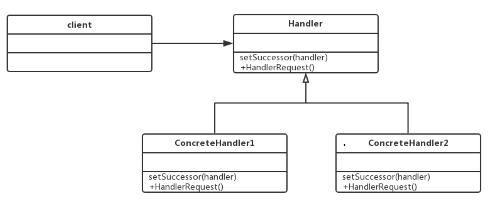

## 1. spring集成Mybatis的原理

### 1.1 SqlSessionFactoryBean源码分析

```java
package org.mybatis.spring;

public class SqlSessionFactoryBean implements FactoryBean<SqlSessionFactory>, InitializingBean, ApplicationListener<ApplicationEvent> {

  //... 	

  /**
   * {@inheritDoc}
   */
  @Override
  //在spring容器中创建全局唯一的sqlSessionFactory
  public void afterPropertiesSet() throws Exception {
    notNull(dataSource, "Property 'dataSource' is required");
    notNull(sqlSessionFactoryBuilder, "Property 'sqlSessionFactoryBuilder' is required");
    state((configuration == null && configLocation == null) || !(configuration != null && configLocation != null),
              "Property 'configuration' and 'configLocation' can not specified with together");

    this.sqlSessionFactory = buildSqlSessionFactory();
  }

  /**
   * Build a {@code SqlSessionFactory} instance.
   *
   * The default implementation uses the standard MyBatis {@code XMLConfigBuilder} API to build a
   * {@code SqlSessionFactory} instance based on an Reader.
   * Since 1.3.0, it can be specified a {@link Configuration} instance directly(without config file).
   *
   * @return SqlSessionFactory
   * @throws IOException if loading the config file failed
   */
  protected SqlSessionFactory buildSqlSessionFactory() throws IOException {

    Configuration configuration;

    XMLConfigBuilder xmlConfigBuilder = null;
    if (this.configuration != null) {//如果configuration不为空，则使用该对象，并对其进行配置
      configuration = this.configuration;
      if (configuration.getVariables() == null) {
        configuration.setVariables(this.configurationProperties);
      } else if (this.configurationProperties != null) {
        configuration.getVariables().putAll(this.configurationProperties);
      }
    } else if (this.configLocation != null) {//创建xmlConfigBuilder，读取mybatis的核心配置文件
      xmlConfigBuilder = new XMLConfigBuilder(this.configLocation.getInputStream(), null, this.configurationProperties);
      configuration = xmlConfigBuilder.getConfiguration();
    } else {//如果configuration为空，实例化一个configuration对象
      if (LOGGER.isDebugEnabled()) {
        LOGGER.debug("Property 'configuration' or 'configLocation' not specified, using default MyBatis Configuration");
      }
      configuration = new Configuration();
      if (this.configurationProperties != null) {
        configuration.setVariables(this.configurationProperties);
      }
    }
    //设置objectFactory
    if (this.objectFactory != null) {
      configuration.setObjectFactory(this.objectFactory);
    }
    //设置objectWrapperFactory
    if (this.objectWrapperFactory != null) {
      configuration.setObjectWrapperFactory(this.objectWrapperFactory);
    }
  //设置vfs
    if (this.vfs != null) {
      configuration.setVfsImpl(this.vfs);
    }
  //扫描指定的包typeAliasesPackage，注册别名
    if (hasLength(this.typeAliasesPackage)) {
      String[] typeAliasPackageArray = tokenizeToStringArray(this.typeAliasesPackage,
          ConfigurableApplicationContext.CONFIG_LOCATION_DELIMITERS);
      for (String packageToScan : typeAliasPackageArray) {
        configuration.getTypeAliasRegistry().registerAliases(packageToScan,
                typeAliasesSuperType == null ? Object.class : typeAliasesSuperType);
        if (LOGGER.isDebugEnabled()) {
          LOGGER.debug("Scanned package: '" + packageToScan + "' for aliases");
        }
      }
    }
  //为typeAliases指定的类注册别名
    if (!isEmpty(this.typeAliases)) {
      for (Class<?> typeAlias : this.typeAliases) {
        configuration.getTypeAliasRegistry().registerAlias(typeAlias);
        if (LOGGER.isDebugEnabled()) {
          LOGGER.debug("Registered type alias: '" + typeAlias + "'");
        }
      }
    }
    //注册插件
    if (!isEmpty(this.plugins)) {
      for (Interceptor plugin : this.plugins) {
        configuration.addInterceptor(plugin);
        if (LOGGER.isDebugEnabled()) {
          LOGGER.debug("Registered plugin: '" + plugin + "'");
        }
      }
    }
    //扫描指定的包typeHandlersPackage，注册类型解析器
    if (hasLength(this.typeHandlersPackage)) {
      String[] typeHandlersPackageArray = tokenizeToStringArray(this.typeHandlersPackage,
          ConfigurableApplicationContext.CONFIG_LOCATION_DELIMITERS);
      for (String packageToScan : typeHandlersPackageArray) {
        configuration.getTypeHandlerRegistry().register(packageToScan);
        if (LOGGER.isDebugEnabled()) {
          LOGGER.debug("Scanned package: '" + packageToScan + "' for type handlers");
        }
      }
    }
  //为typeHandlers指定的类注册类型解析器
    if (!isEmpty(this.typeHandlers)) {
      for (TypeHandler<?> typeHandler : this.typeHandlers) {
        configuration.getTypeHandlerRegistry().register(typeHandler);
        if (LOGGER.isDebugEnabled()) {
          LOGGER.debug("Registered type handler: '" + typeHandler + "'");
        }
      }
    }
    //配置databaseIdProvider
    if (this.databaseIdProvider != null) {//fix #64 set databaseId before parse mapper xmls
      try {
        configuration.setDatabaseId(this.databaseIdProvider.getDatabaseId(this.dataSource));
      } catch (SQLException e) {
        throw new NestedIOException("Failed getting a databaseId", e);
      }
    }
  //配置缓存
    if (this.cache != null) {
      configuration.addCache(this.cache);
    }
     //使用xmlConfigBuilder读取mybatis的核心配置文件
    if (xmlConfigBuilder != null) {
      try {
        xmlConfigBuilder.parse();

        if (LOGGER.isDebugEnabled()) {
          LOGGER.debug("Parsed configuration file: '" + this.configLocation + "'");
        }
      } catch (Exception ex) {
        throw new NestedIOException("Failed to parse config resource: " + this.configLocation, ex);
      } finally {
        ErrorContext.instance().reset();
      }
    }
    //默认使用SpringManagedTransactionFactory作为事务管理器
    if (this.transactionFactory == null) {
      this.transactionFactory = new SpringManagedTransactionFactory();
    }
   //设置Environment
    configuration.setEnvironment(new Environment(this.environment, this.transactionFactory, this.dataSource));

  //根据mapperLocations的配置，处理映射配置文件以及相应的mapper接口
    if (!isEmpty(this.mapperLocations)) {
      for (Resource mapperLocation : this.mapperLocations) {
        if (mapperLocation == null) {
          continue;
        }

        try {
          XMLMapperBuilder xmlMapperBuilder = new XMLMapperBuilder(mapperLocation.getInputStream(),
              configuration, mapperLocation.toString(), configuration.getSqlFragments());
          xmlMapperBuilder.parse();
        } catch (Exception e) {
          throw new NestedIOException("Failed to parse mapping resource: '" + mapperLocation + "'", e);
        } finally {
          ErrorContext.instance().reset();
        }

        if (LOGGER.isDebugEnabled()) {
          LOGGER.debug("Parsed mapper file: '" + mapperLocation + "'");
        }
      }
    } else {
      if (LOGGER.isDebugEnabled()) {
        LOGGER.debug("Property 'mapperLocations' was not specified or no matching resources found");
      }
    }
    //最终使用sqlSessionFactoryBuilder创建sqlSessionFactory
    return this.sqlSessionFactoryBuilder.build(configuration);
  }

  /**
   * 
   * 将SqlSessionFactory对象注入spring容器
   * {@inheritDoc}
   */
  @Override
  public SqlSessionFactory getObject() throws Exception {
    if (this.sqlSessionFactory == null) {
      afterPropertiesSet();
    }

    return this.sqlSessionFactory;
  }

  //...

}

```
### 1.2 MapperFactoryBean源码分析

```java
package org.mybatis.spring.mapper;

public class MapperFactoryBean<T> extends SqlSessionDaoSupport implements FactoryBean<T> {

  private Class<T> mapperInterface;

  private boolean addToConfig = true;

  public MapperFactoryBean() {
    //intentionally empty 
  }
  
  public MapperFactoryBean(Class<T> mapperInterface) {
    this.mapperInterface = mapperInterface;
  }

  /**
   * {@inheritDoc}
   */
  @Override
  //MapperFactoryBean在容器初始化时，要确保mapper接口被注册到mapperRegistry
  protected void checkDaoConfig() {
    super.checkDaoConfig();

    notNull(this.mapperInterface, "Property 'mapperInterface' is required");
    //
    Configuration configuration = getSqlSession().getConfiguration();//通过SqlSession从容器中拿到configuration
    if (this.addToConfig && !configuration.hasMapper(this.mapperInterface)) {
      try {
    	//如果mapperRegistry中不包含当前接口的动态代理工厂，则添加一个
        configuration.addMapper(this.mapperInterface);
      } catch (Exception e) {
        logger.error("Error while adding the mapper '" + this.mapperInterface + "' to configuration.", e);
        throw new IllegalArgumentException(e);
      } finally {
        ErrorContext.instance().reset();
      }
    }
  }

  /**
   * 通过在容器中的mapperRegistry，返回当前mapper接口的动态代理
   * 
   * {@inheritDoc}
   */
  @Override
  public T getObject() throws Exception {
    return getSqlSession().getMapper(this.mapperInterface);
  }

  //...
}

```

### 1.3 MapperScannerConfigurer源码分析

```java
package org.mybatis.spring.mapper;

public class MapperScannerConfigurer implements BeanDefinitionRegistryPostProcessor, InitializingBean, ApplicationContextAware, BeanNameAware {

  private String basePackage;//用于指定要扫描的包

  private boolean addToConfig = true;

  private SqlSessionFactory sqlSessionFactory;

  private SqlSessionTemplate sqlSessionTemplate;

  private String sqlSessionFactoryBeanName;

  private String sqlSessionTemplateBeanName;

  private Class<? extends Annotation> annotationClass;//mapper接口上有指定的annotation才会被扫描

  private Class<?> markerInterface;//mapper接口继承与指定的接口才会被扫描

  private ApplicationContext applicationContext;//容器上下文

  private String beanName;

  private boolean processPropertyPlaceHolders;

  private BeanNameGenerator nameGenerator;

  //...

  /**
   * {@inheritDoc}
   * 
   * @since 1.0.2
   */
  @Override
  public void postProcessBeanDefinitionRegistry(BeanDefinitionRegistry registry) {
    if (this.processPropertyPlaceHolders) {//占位符处理
      processPropertyPlaceHolders();
    }
    //实例化ClassPathMapperScanner，并对scanner相关属性进行配置
    ClassPathMapperScanner scanner = new ClassPathMapperScanner(registry);
    scanner.setAddToConfig(this.addToConfig);
    scanner.setAnnotationClass(this.annotationClass);
    scanner.setMarkerInterface(this.markerInterface);
    scanner.setSqlSessionFactory(this.sqlSessionFactory);
    scanner.setSqlSessionTemplate(this.sqlSessionTemplate);
    scanner.setSqlSessionFactoryBeanName(this.sqlSessionFactoryBeanName);
    scanner.setSqlSessionTemplateBeanName(this.sqlSessionTemplateBeanName);
    scanner.setResourceLoader(this.applicationContext);
    scanner.setBeanNameGenerator(this.nameGenerator);
    scanner.registerFilters();//根据上述配置，生成过滤器，只扫描合条件的class
    //扫描指定的包以及其子包
    scanner.scan(StringUtils.tokenizeToStringArray(this.basePackage, ConfigurableApplicationContext.CONFIG_LOCATION_DELIMITERS));
  }

  //...

}

```


## 2. 插件开发原理

插件是用来改变或者扩展mybatis的原有的功能，mybaits的插件就是通过继承Interceptor拦截器实现的；在没 有完全理解插件之前禁止使用插件对mybaits进行扩展，又可能会导致严重的问题；

mybatis中能使用插件进行拦截的接口和方法如下:

- Executor(update、query 、 flushStatment 、 commit 、 rollback 、 getTransaction 、 close 、 isClose)

- StatementHandler(prepare 、 paramterize 、 batch 、 update 、 query)

- ParameterHandler( getParameterObject 、 setParameters )

- ResultSetHandler( handleResultSets 、 handleCursorResultSets 、 handleOutputParameters )


### 2.1 插件开发快速入门

定义一个阈值，当查询操作运行时间超过这个阈值记录日志供运维人员定位慢查询，插件实现步骤:

- 1. 实现Interceptor接口方法 
- 2. 确定拦截的签名
- 3. 在配置文件中配置插件
- 4. 运行测试用例

```xml
<plugins>
	<plugin interceptor="com.enjoylearning.mybatis.Interceptors.ThresholdInterceptor"> 
		<property name="threshold" value="10"/>
	</plugin>
</plugins>
```

```java
package com.enjoylearning.mybatis.Interceptors;

@Intercepts({
	@Signature(type=StatementHandler.class,method="query",args={Statement.class, ResultHandler.class})
//	@Signature(type=StatementHandler.class,method="query",args={MappedStatement.class,Object.class, RowBounds.class, ResultHandler.class})
})

public class ThresholdInterceptor implements Interceptor {
	
	private long threshold;

	@Override
	public Object intercept(Invocation invocation) throws Throwable {
		long begin = System.currentTimeMillis();
		Object ret = invocation.proceed();
		long end=System.currentTimeMillis();
		long runTime = end - begin;
		if(runTime>=threshold){
			Object[] args = invocation.getArgs();
			Statement stat = (Statement) args[0];
			MetaObject metaObjectStat = SystemMetaObject.forObject(stat);
			PreparedStatementLogger statementLogger = (PreparedStatementLogger)metaObjectStat.getValue("h");
			// 因为封装了动态代理，所以PreparedStatementLogger在动态代理中是invocationHandler h
			Statement statement = statementLogger.getPreparedStatement();
			System.out.println("sql语句：“"+statement.toString()+"”执行时间为："+runTime+"毫秒，已经超过阈值！");
		}
		return ret;
	}

	@Override
	public Object plugin(Object target) {
		return Plugin.wrap(target, this);
	}

	@Override
	public void setProperties(Properties properties) {
		this.threshold = Long.valueOf(properties.getProperty("threshold"));
	}
}
```


### 2.2 源码分析之责任链模式

责任链模式:就是把一件工作分别经过链上的各个节点，让这些节点依次处理这个工作;和装饰器模式不同，每个节点都知道后继者是谁；适合为完成同一个请求需要多个处理类的场景；



要素分析：

- Handler：定义了一个处理请求的标准接口;

- ConcreteHandler：具体的处理者，处理它负责的部分，根据业务可以结束处理流程，也可以将请求转发给它的后继者;

- client :发送者，发起请求的客户端; 

责任链模式优点:

降低耦合度。它将请求的发送者和接收者解耦。简化了对象。使得对象不需要知道链的结构。增强给对象指派职责的灵活性。通过改变链内 的成员或者调动它们的次序，允许动态地新增 或者删除责任。增加新的请求处理类很方便。


### 2.3 mybatis插件模块源码分析

- 1. 插件的初始化 (XMLConfigBuilder.pluginElement)
- 2. 插件的加载 (Configuration.new\*方法，四大对象的创建) 
- 3. 插件的调用 (Plugin. wrap、 Plugin. invoke)

[mybatis插件理解](https://github.com/pagehelper/Mybatis-PageHelper/blob/master/wikis/zh/Interceptor.md)


### 2.4 Mybatis分页插件PageHelper


- 1. 分页插件的使用; 
	[中文文档](https://github.com/pagehelper/Mybatis-PageHelper/blob/master/README_zh.md) 
	[使用手册](https://github.com/pagehelper/Mybatis-PageHelper/blob/master/wikis/zh/HowToUse.md)

- 2. 分页插件的注意事项; 
	[注意事项](https://github.com/pagehelper/Mybatis-PageHelper/blob/master/wikis/zh/Important.md)

- 3. 分页插件的源码概述;


