# 1. Spring是什么？

## 简介

Spring是一种开源轻量级框架，是为了解决企业应用程序开发复杂性而创建的，Spring致力于解决JavaEE的各层解决方案，而不仅仅于某一层的方案。

2003年2月Spring框架正式称为一道开源项目，Spring致力于J2EE应用的各种解决方案，而不仅仅专注于某一层解决方案。可以说Spring是企业应用开发的“一站式”选择， Spring贯穿于表现层、业务层、持久层，然而Spring并不想取代那些已经有的框架，而是以高度的开放性，与这些已有的框架进行整合。

## Spring的目标：

- 1. 让现有的技术更容易使用，
- 2. 促进良好的编程习惯。

Spring是一个全面的解决方案，它坚持一个原则：不从新造轮子。已经有较好解决方案的领域，Spring绝不重复性实现，比如：对象持久化和OR映射，Spring只对现有的JDBC，Hibernate等技术提供支持，使之更容易使用，而不做重复的实现。Spring框架有很多特性，这些特性由7个定义良好的模块构成。

## Spring体系结构

- 1. Spring Core：即，Spring核心，它是框架最基础的部分，提供IOC和依赖注入特性
- 2. Spring Context：即，Spring上下文容器，它是BeanFactory功能加强的一个子接口
- 3. Spring Web：它提供Web应用开发的支持
- 4. Spring MVC：它针对Web应用中MVC思想的实现
- 5. Spring DAO：提供对JDBC抽象层，简化了JDBC编码，同时，编码更具有健壮性。
- 6. Spring ORM：它支持用于流行的ORM框架的整合，比如：Spring + Hibernate、Spring + iBatis、Spring + JDO的整合等等。
- 7. Spring AOP：AOP即，面向切面编程，它提供了与AOP联盟兼容的编程实现


# 2. Spring常用组件

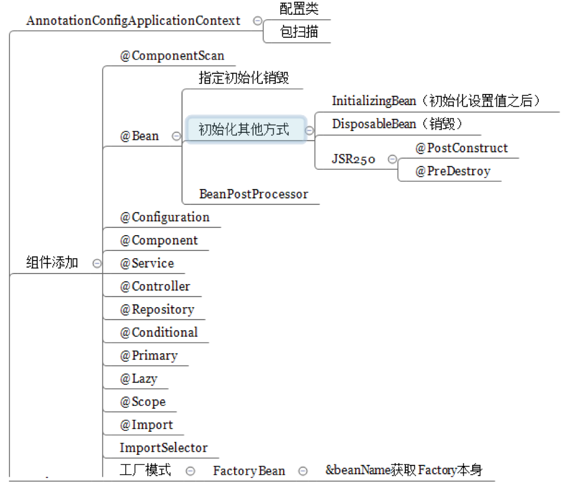


## 2.1 Spring初体验

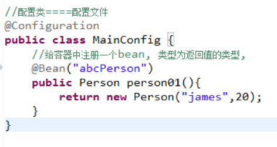
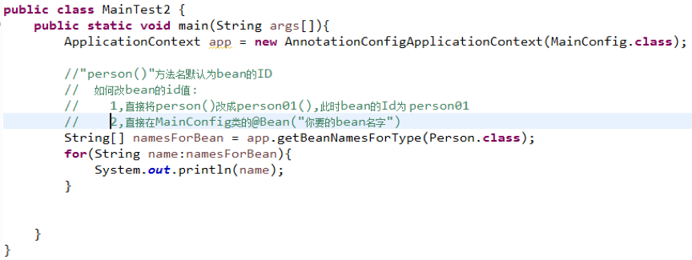


## 2.2 @ComponentScan扫描规则

### 配置类例子以及扫描规则解释：

```java
package com.enjoy.cap2.config;

// import...

@Configuration

// ######### 1
@ComponentScan(value="com.enjoy.cap2")
// 扫描com.enjoy.cap2下所有的组件/Bean，包括Configuration等、Cap2MainConfig自己

// ######### 2
@ComponentScan(value="com.enjoy.cap2",includeFilters={
		@Filter(type=FilterType.ANNOTATION,classes={Controller.class}),
		@Filter(type=FilterType.ASSIGNABLE_TYPE,classes={OrderDao.class}),
}, useDefaultFilters = false)
//excludeFilters = Filter[] 指定扫描的时候按照什么规则排除那些组件，exclude的时候需要使用useDefaultFilters = true
//includeFilters = Filter[] 指定扫描的时候只需要包含哪些组件
//useDefaultFilters = false 默认是true，扫描所有组件，使用includeFilters要改成false。useDefaultFilters会把所有@Component全部扫描。

//－－－－扫描规则如下
//FilterType.ANNOTATION：按照注解
//FilterType.ASSIGNABLE_TYPE：按照给定的类型（类的名字）；比如按BookService类型
//FilterType.ASPECTJ：使用ASPECTJ表达式
//FilterType.REGEX：使用正则指定
//FilterType.CUSTOM：使用自定义规则，自已写类，实现TypeFilter接口

// ######## 3
@ComponentScan(value="com.enjoy.cap2", includeFilters={
		@Filter(type=FilterType.CUSTOM, classes={JamesTypeFilter.class})
}, useDefaultFilters=false)
// 扫描com.enjoy.cap2下所有的组件/Bean，使用自定义的过滤器
// useDefaultFilters默认是true,扫描所有组件，要改成false,使用自定义扫描范围

public class Cap2MainConfig {
	// 给容器中注册一-个bean,类型为返回值的类型，id默认为方法名person01
	@Bean
	public Person person01(){
		return new Person("james",20);
	}
}
```

### 自定义扫描类：

```java
package com.enjoy.cap2.config;

// import...

public class JamesTypeFilter implements TypeFilter{
	private ClassMetadata classMetadata;

	/*
	 * MetadataReader: 读取到的当前正在扫描的类的信息
	 * MetadataReaderFactory: 可以获取到其他任何类信息的
	 */
	@Override
	public boolean match(MetadataReader metadataReader, MetadataReaderFactory metadataReaderFactory)
			throws IOException {
		// 获取当前类注解的信息
		AnnotationMetadata annotationMetadata = metadataReader.getAnnotationMetadata();
		// 获取当前正在扫描的类的类信息
		classMetadata = metadataReader.getClassMetadata();
		// 获取当前类资源(类的路径)
		Resource resource = metadataReader.getResource();
		
		String className = classMetadata.getClassName();
		System.out.println("----->"+className);
		if(className.contains("Controller")){
			//当类名包含"Controller"，则匹配成功
			return true;
		}
		return false;
	}
}
```

### @ComponentScans：可放入多个@ComponentScan

[What is the difference between @ComponentScans and @ComponentScan?](https://stackoverflow.com/questions/52421944/what-is-the-difference-between-componentscans-and-componentscan)

```java
@Configuration
@ComponentScans({ 
    @ComponentScan(basePackages = "com.baeldung.annotations"), 
    @ComponentScan(basePackageClasses = VehicleFactoryConfig.class)
})
class VehicleFactoryConfig {}
```


## 2.3 @Scope扫描规则

### IOC容器的单实例和多实例：

```java
package com.enjoy.cap3.config;

// import...

@Configuration
public class Cap3MainConfig {
	// 给容器中注册一个bean，类型为返回值的类型，默认是单实例
	/*
	 * prototype：多实例: IOC容器 启动的时候, IOC容器启动并不会去调用方法创建对象，
	 * 而是每次获取的时候才会调用方法创建对象
	 *
	 * singleton：单实例(默认)：IOC容器启动的时候会调用方法创建对象并放到IOC容器中，
	 * 以后每次获取的就是直接从容器（实例存储在一个大的Map中）中拿（Map.get）的同一个bean
	 *
	 * request：主要针对web应用，递交一次请求创建一个实例
	 *
	 * session：同一个session创建一个实例
	 */
	@Scope("prototype")
	@Bean
	public Person person(){
		return new Person("james",20);
	}
}
```

### IOC容器的单实例和多实例的测试：

```java
// import...

public class Cap3Test {
	@Test
	public void test01(){
		AnnotationConfigApplicationContext app = new AnnotationConfigApplicationContext(Cap3MainConfig.class);

		Object bean1 = app.getBean("person");
		Object bean2 = app.getBean("person");
		System.out.println(bean1 == bean2);
		// Person为prototype时，(bean1 == bean2) => false
		// Person为singleton时，(bean1 == bean2) => true

	}
}

```


## 2.4 @Lazy懒加载/延迟加载

### @Lazy的使用

```java
package com.enjoy.cap4.config;

// import ...

@Configuration
public class Cap4MainConfig {
	// 给容器中注册一个bean,类型为返回值的类型，默认是单实例
	/*
	 * 懒加载主要针对单实例bean，默认在容器启动的时候创建对象
	 * 使用懒加载时，容器启动时候不创建对象，仅当第一次使用（获取）bean的时候才创建被初始化
	 */
	@Lazy
	@Bean
	public Person person(){
		// 在Bean创建对象创建前打印
		System.out.println("给容器中添加person.......");
		return new Person("james",20);
	}
}
```

### 测试

```java
// import ...

public class Cap4Test {
	@Test
	public void test01(){
		AnnotationConfigApplicationContext app = new AnnotationConfigApplicationContext(Cap4MainConfig.class);
		
		System.out.println("IOC容器创建完成........");
		app.getBean("person");
		// 如果Person加@Lazy，输出顺序为：
		// IOC容器创建完成........
		// 给容器中添加person.......
		//
		// 如果Person不加@Lazy，输出顺序为:
		// 给容器中添加person.......
		// IOC容器创建完成........
	}
}
```


## 2.5 @Conditional条件注册bean

将IOC容器注册bean时，当操作系统为WINDOWS时,注册Lison实例；当操作系统为LINUX时，注册James实例，此时要用得@Conditional注解进行定制化条件选择注册bean。


```java
package com.enjoy.cap5.config;

// import ...

@Configuration
public class Cap5MainConfig {
	@Bean("person")
	public Person person(){
		System.out.println("给容器中添加person.......");
		return new Person("person",20);
	}
	
	@Conditional(WinCondition.class)
	@Bean("lison")
	public Person lison(){
		System.out.println("给容器中添加lison.......");
		return new Person("Lison",58);
	}

	@Conditional(LinCondition.class)
	@Bean("james")//bean在容器中的ID为james, IOC容器MAP,  map.put("id",value)
	public Person james(){
		System.out.println("给容器中添加james.......");
		return new Person("james",20);
	}
}
```

### Linux和Windows的条件类

#### Tips：

- FactoryBean：注册机制，可以把Java实例Bean通过FactoryBean注入到容器中
- BeanFactory：从IOC容器获取实例化后的bean

```java
package com.enjoy.cap5.config;

// import ...

public class LinCondition implements Condition{
	/*
	*ConditionContext: 判断条件可以使用的上下文(环境)
	*AnnotatedTypeMetadata: 注解的信息
	*
	*/
	@Override
	public boolean matches(ConditionContext context, AnnotatedTypeMetadata metadata) {
		// 是否为LINUX系统？
		// 能获取到IOC容器正在使用的beanFactory
		ConfigurableListableBeanFactory beanFactory = context.getBeanFactory();
		// 获取当前环境变量(包括我们操作系统是WIN还是LINUX??)
		Environment environment = context.getEnvironment();
		String os_name = environment.getProperty("os.name");
		if(os_name.contains("linux")){
			return true;
		}
		return false;
	}
}
```

### 测试

```java
// import ...

public class Cap5Test {
	// 如果操作系统是WINDOWS系统，给I0C容器注册lison,bean
	// 如果操作系統是LINUX系統，IOC容器注册james的bean
	// 新建WinCondition类，用来指定Lison的实例bean
	// 新建LinuxCondition.java类，用来指定James的实例bean
	// 如何测试Linux: run as configuration -> VM Argment -> -Dos.name=linux
    // 条件注入
	@Test
	public void test01(){
		// 声明IOC容器
		AnnotationConfigApplicationContext app = new AnnotationConfigApplicationContext(Cap5MainConfig.class);
		System.out.println("IOC容器创建完成........");

		// 拿到容器中所有Person定义，看看容器中有多少bean
		String[] beanNamesForType = app.getBeanNamesForType(Person.class);
		for(String name : beanNamesForType) {
			System.out.println(name);
		}
		// 测试：-Dos.name=linux
		// output:
		// 给容器中添加person.......
		// 给容器中添加james.......
		// IOC容器创建完成........
		// person
		// james

		// 把所有对象和ID放到Map里
		Map<String, Person> personBean = app.getBeansOfType(Person.class);
		System.out.println(personBean);
		// output:
		// {person=Person [name=person, age=20], james=Person [name=james, age=20]}
	}
}
```


## 2.6 @Import注册bean


```java
package com.enjoy.cap6.config;

// import ...

@Configuration
@Import(value = { Dog.class,Cat.class, JamesImportSelector.class,JamesImportBeanDefinitionRegistrar.class })
public class Cap6MainConfig {
	/*
	 * 给容器中注册组件的方式
	 * 1,@Bean: [导入第三方的类或包的组件],比如Person为第三方的类, 需要在我们的IOC容器中使用
	 * 2,包扫描+组件的标注注解(@ComponentScan:  @Controller, @Service  @Reponsitory  @Componet),一般是针对我们自己写的类
	 * 3,@Import:[快速给容器导入一个组件] 注意:@Bean有点简单
	 *      a,@Import(要导入到容器中的组件):容器会自动注册这个组件,bean 的 id为全类名
	 *      b,ImportSelector:是一个接口,返回需要导入到容器的组件的全类名数组
	 *      c,ImportBeanDefinitionRegistrar:可以手动添加组件到IOC容器, 所有Bean的注册可以使用BeanDifinitionRegistry
	 *          写JamesImportBeanDefinitionRegistrar实现ImportBeanDefinitionRegistrar接口即可
	 * 4,使用Spring提供的FactoryBean(工厂bean)进行注册
	 *     
	 *   
	 */
	//容器启动时初始化person的bean实例
	@Bean("person")
	public Person person(){
		return new Person("james",20);
	}
	@Bean
	public JamesFactoryBean jamesFactoryBean(){
		return new JamesFactoryBean();
	}
}

```

### import ImportSelector例子

```java
package com.enjoy.cap6.config;

// import ...

public class JamesImportSelector implements ImportSelector{
	@Override
	public String[] selectImports(AnnotationMetadata importingClassMetadata){
		// 返回全类名的bean
		return new String[]{"com.enjoy.cap6.bean.Fish","com.enjoy.cap6.bean.Tiger"};
//		return new String[]{};

	}
}
```

### import ImportBeanDefinitionRegistrar例子

```java
package com.enjoy.cap6.config;

// import ...

public class JamesImportBeanDefinitionRegistrar implements ImportBeanDefinitionRegistrar {

	/*
	* AnnotationMetadata:当前类的注解信息
	* BeanDefinitionRegistry:BeanDefinition注册类
	*    把所有需要添加到容器中的bean加入;
	*    @Scope
	*/
	@Override
	public void registerBeanDefinitions(AnnotationMetadata importingClassMetadata, BeanDefinitionRegistry registry) {
		boolean bean1 = registry.containsBeanDefinition("com.enjoy.cap6.bean.Dog");
		boolean bean2 = registry.containsBeanDefinition("com.enjoy.cap6.bean.Cat");
		// 如果Dog和Cat同时存在于我们IOC容器中，那么创建Pig类，并加入到IOC容器
		if(bean1 && bean2){
			// 对于我们要注册的bean, 给bean进行封装,
			RootBeanDefinition beanDefinition = new RootBeanDefinition(Pig.class);
			registry.registerBeanDefinition("pig", beanDefinition);
		}
	}

}

```

### import FactoryBean（工厂模式）例子

#### Tips：

- FactoryBean：注册机制，可以把Java实例Bean通过FactoryBean注入到容器中
- BeanFactory：从IOC容器获取实例化后的bean

```java
package com.enjoy.cap6.config;

// import ...

// 创建一个Spring定义的工厂bean
public class JamesFactoryBean implements FactoryBean<Monkey>{
	// 返回一个Monkey对象
	@Override
	public Monkey getObject() throws Exception {
		return new Monkey();
	}

	@Override
	public Class<?> getObjectType() {
		return Monkey.class;
	}

	// 是否为单例？
	// true：这个bean是单实例，在容器只会存一份
	// false：每次获取都会创建一个新的bean
	// 怎么创建？就是调用getObject
	@Override
	public boolean isSingleton() {
		return true;
	}
}
```

**将JamesFactoryBean包装成Bean**：

```java
// import ...

@Configuration
@Import(value = { Dog.class, Cat.class, JamesImportSelector.class,
		JamesImportBeanDefinitionRegistrar.class })
public class Cap6MainConfig {
	// ...
	@Bean
	public JamesFactoryBean jamesFactoryBean(){
		return new JamesFactoryBean();
	}
}

```


#### 测试

```java
// import ...

public class Cap6Test {
	@Test
	public void test01(){
		AnnotationConfigApplicationContext app = new AnnotationConfigApplicationContext(Cap6MainConfig.class);
		System.out.println("IOC容器创建完成........");
		
		Object bean1 = app.getBean("&jamesFactoryBean"); 
		// 获取到的bean为jamesFactoryBean对象，源码中有判断"&"的操作，如果有“&”就返回bean本身，
		// 如果没有“&”就调用FactoryBean.getObject()返回bean
		// 由此可知，对于一般的bean，IOC容器会为其自动生成一个FactoryBean
		
		Object bean2 = app.getBean("jamesFactoryBean"); 
		// 实际是获取getObject创建的对象，即Monkey对象，并不是jamesFactoryBean对象

		System.out.println("bean1的类型="+bean1.getClass());
		// output: bean1的类型=class com.enjoy.cap6.config.JamesFactoryBean
		System.out.println("bean2的类型="+bean2.getClass());
		// output: bean2的类型=class com.enjoy.cap6.bean.Monkey
		System.out.println(bean1 == bean2);
		// false
		
		String[] beanDefinitionNames = app.getBeanDefinitionNames();
		for(String name:beanDefinitionNames){
			System.out.println(name);
		}
	}
}

```


## 2.7 Bean的生命周期

### 2.7.1 指定初始化init-method方法和销毁destory-method方法

bean的生命周期：指bean创建、初始化、销毁的过程，bean的生命周期是由容器进行管理的。我们可以自定义bean的初始化和销毁方法：容器在bean进行到当前生命周期的时候，来调用自定义的初始化和销毁方法。

```java
public class Bike {
	public Bike(){
		System.out.println("Bike constructor..............");
	}
	public void init(){
		System.out.println("Bike .....init.....");
	}
	public void destory(){
		System.out.println("Bike.....destory");
	}
}
```

#### 给Bike加上初始化和销毁方法：

```java
// import ...

@ComponentScan("com.enjoy.cap7.bean")
@Configuration
public class Cap7MainConfigOfLifeCycle {
	@Bean("person")
	public Person person(){
		System.out.println("给容器中添加person.......");
		return new Person("person",20);
	}
	@Bean(initMethod="init", destroyMethod="destory")
	public Bike bike(){
		return new Bike();
	}
}
```

#### 测试：

```java
// import ...

public class Cap7Test {
	@Test
	public void test01(){
		AnnotationConfigApplicationContext app = new AnnotationConfigApplicationContext(Cap7MainConfigOfLifeCycle.class);
		
		System.out.println("IOC容器创建完成........");

		// 什么时候被销毁呢?单实例模式下，当关闭容器的时候app.close();
		// 当声明bean @scope("prototype")多实例bean时，只有在获取bean的时候才初始化
		// anno.getBean("bike"); => 此时才会调用初始化
		// 针对多实例，IOC容器不负责销毁的，是由自己来控制，容器关闭不会调用销毁方法
		app.close();
		// 容器的销毁：
		// 	public void destroySingletons() {
		//      ...
		//		this.containedBeanMap.clear();
		//		this.dependentBeanMap.clear();
		//		this.dependenciesForBeanMap.clear();
	}
}

// output:
// 
// 给容器中添加person.......
// Bike constructor..............
// Bike .....init.....
// IOC容器创建完成........
// Bike.....destory
```

### 2.7.2 Bean实现InitializingBean和DisposableBean接口

- InitializingBean（定义初始化逻辑,可点进去看此类）：afterPropertiesSet()方法：**当beanFactory创建好对象，且把bean所有属性设置好之后，会调这个方法，相当于初始化方法**。

- DisposableBean（定义销毁逻辑,可点进去看此类）：destory()方法，当bean销毁时，**会把单实例bean进行销毁**。


```java
// import ...

@Component
public class Train implements InitializingBean, DisposableBean {

	public Train(){
		System.out.println("Train......constructor............");
	}

	// 在容器创建时调用：当bean属性赋值和初始化完成时调用
	// Invoked by a BeanFactory after it has set all bean properties supplied
	// (and satisfied BeanFactoryAware and ApplicationContextAware).
	@Override
	public void afterPropertiesSet() throws Exception {
		System.out.println("Train.......afterPropertiesSet()...");

	}

	// 在容器关闭时调用：当bean销毁时，调用此方法
	// Invoked by a BeanFactory on destruction of a singleton.
	@Override
	public void destroy() throws Exception {
		System.out.println("Train......destory......");
		//logger.error
	}
}
```

#### 测试：

```java
// import ...

public class Cap7Test {
	@Test
	public void test01(){
		AnnotationConfigApplicationContext app = new AnnotationConfigApplicationContext(Cap7MainConfigOfLifeCycle.class);
		
		System.out.println("IOC容器创建完成........");

		// 什么时候被销毁呢?单实例模式下，当关闭容器的时候app.close();
		// 当声明bean @scope("prototype")多实例bean时，只有在获取bean的时候才初始化
		// anno.getBean("bike"); => 此时才会调用初始化
		// 针对多实例，IOC容器不负责销毁的，是由自己来控制，容器关闭不会调用销毁方法
		app.close();
	}
}

// output:
// 
// Train......constructor............
// Train.......afterPropertiesSet()...
// IOC容器创建完成........
// Train......destory......
```

### 2.7.3 使用JSR250规则定义的（java规范）两个注解来实现

- @PostConstruct: 在Bean创建完成,且属于赋值完成后进行初始化,属于JDK规范的注解
- @PreDestroy: 在bean将被移除之前进行通知, 在容器销毁之前进行清理工作

```java
// import ...

@Component
public class Jeep {
	public Jeep(){
		System.out.println("Jeep.....constructor........");
	}

	// 对象创建并赋值之后调用
	@PostConstruct
	public void init(){
		System.out.println("Jeep.....@PostConstruct........");
	}
	
	// 容器移除对象之前回调通知，销毁bean
	@PreDestroy
	public void destory(){
		System.out.println("Jeep.....@PreDestroy......");
	}
}
```

#### 测试

```java
// import ...

public class Cap7Test {
	@Test
	public void test01(){
		AnnotationConfigApplicationContext app = new AnnotationConfigApplicationContext(Cap7MainConfigOfLifeCycle.class);
		
		System.out.println("IOC容器创建完成........");

		// 什么时候被销毁呢?单实例模式下，当关闭容器的时候app.close();
		// 当声明bean @scope("prototype")多实例bean时，只有在获取bean的时候才初始化
		// anno.getBean("bike"); => 此时才会调用初始化
		// 针对多实例，IOC容器不负责销毁的，是由自己来控制，容器关闭不会调用销毁方法
		app.close();
	}
}

// output:
//
// Jeep.....constructor........
// Jeep.....@PostConstruct........
// IOC容器创建完成........
// Jeep.....@PreDestroy......

```


### 2.7.4 使用BeanPostProcessor后置处理器

#### 分析创建Bean的部分源码：

BeanPostProcessor类[interface]：bean的后置处理器，在bean初始化之前调用进行拦截，作用：在bean初始化前后进行一些处理工作，打开此类。
	 
- postProcessBeforeInitialization()：在初始化之前进行后置处理工作（在init-method之前），什么时候调用：它任何初始化方法调用之前（比如在InitializingBean的afterPropertiesSet初始化之前，或自定义init-method调用之前使用）       

- postProcessAfterInitialization()：在初始化之后进行后置处理工作，比如在InitializingBean的afterPropertiesSet()


```java
/**
	 * Initialize the given bean instance, applying factory callbacks
	 * as well as init methods and bean post processors.
	 * <p>Called from {@link #createBean} for traditionally defined beans,
	 * and from {@link #initializeBean} for existing bean instances.
	 * @param beanName the bean name in the factory (for debugging purposes)
	 * @param bean the new bean instance we may need to initialize
	 * @param mbd the bean definition that the bean was created with
	 * (can also be {@code null}, if given an existing bean instance)
	 * @return the initialized bean instance (potentially wrapped)
	 * @see BeanNameAware
	 * @see BeanClassLoaderAware
	 * @see BeanFactoryAware
	 * @see #applyBeanPostProcessorsBeforeInitialization
	 * @see #invokeInitMethods
	 * @see #applyBeanPostProcessorsAfterInitialization
	 */
	protected Object initializeBean(final String beanName, final Object bean, @Nullable RootBeanDefinition mbd) {
		if (System.getSecurityManager() != null) {
			AccessController.doPrivileged((PrivilegedAction<Object>) () -> {
				invokeAwareMethods(beanName, bean);
				return null;
			}, getAccessControlContext());
		}
		else {
			invokeAwareMethods(beanName, bean);
		}

		Object wrappedBean = bean;
		if (mbd == null || !mbd.isSynthetic()) {
			// 后置处理器Before
			wrappedBean = applyBeanPostProcessorsBeforeInitialization(wrappedBean, beanName);
		}

		try {
			// 在这里会调用@Bean(initMethod="intiFunc")
			invokeInitMethods(beanName, wrappedBean, mbd); 
		}
		catch (Throwable ex) {
			throw new BeanCreationException(
					(mbd != null ? mbd.getResourceDescription() : null),
					beanName, "Invocation of init method failed", ex);
		}
		if (mbd == null || !mbd.isSynthetic()) {
			// 后置处理器After
			wrappedBean = applyBeanPostProcessorsAfterInitialization(wrappedBean, beanName);
		}

		return wrappedBean;
	}
```

#### 创建BeanPostProcessor后置处理器

```java
// import ...

@Component // Config类内把这个扫描一下
public class JamesBeanPostProcessor implements BeanPostProcessor {
	@Override
	public Object postProcessBeforeInitialization(Object bean, String beanName) throws BeansException {
		// 返回一个的对象(传过来的对象)
		// 在初始化方法调用之前进行后置处理工作,
		// 什么时候调用它: init-method=init之前调用
		System.out.println("postProcessBeforeInitialization...."+beanName+"..."+bean);
		return bean;
	}
	@Override
	public Object postProcessAfterInitialization(Object bean, String beanName) throws BeansException {
		// 什么时候调用: init-method=init之后调用
		System.out.println("postProcessAfterInitialization...."+beanName+"..."+bean);
		return bean;
	}
}
```

#### 测试

```java
// import ...

public class Cap7Test {
	@Test
	public void test01(){
		AnnotationConfigApplicationContext app = new AnnotationConfigApplicationContext(Cap7MainConfigOfLifeCycle.class);
		
		System.out.println("IOC容器创建完成........");

		// 什么时候被销毁呢?单实例模式下，当关闭容器的时候app.close();
		// 当声明bean @scope("prototype")多实例bean时，只有在获取bean的时候才初始化
		// anno.getBean("bike"); => 此时才会调用初始化
		// 针对多实例，IOC容器不负责销毁的， 是由自己来控制

		app.close();
		// 容器的销毁：
		// 	public void destroySingletons() {
		//      ...
		//		this.containedBeanMap.clear();
		//		this.dependentBeanMap.clear();
		//		this.dependenciesForBeanMap.clear();
	}
}
// output：
// postProcessBeforeInitialization....org.springframework.context.event.internalEventListenerProcessor...org.springframework.context.event.EventListenerMethodProcessor@23529fee
// postProcessAfterInitialization....org.springframework.context.event.internalEventListenerProcessor...org.springframework.context.event.EventListenerMethodProcessor@23529fee
// postProcessBeforeInitialization....org.springframework.context.event.internalEventListenerFactory...org.springframework.context.event.DefaultEventListenerFactory@2805c96b
// postProcessAfterInitialization....org.springframework.context.event.internalEventListenerFactory...org.springframework.context.event.DefaultEventListenerFactory@2805c96b
// postProcessBeforeInitialization....cap7MainConfigOfLifeCycle...com.enjoy.cap7.config.Cap7MainConfigOfLifeCycle$$EnhancerBySpringCGLIB$$d6095561@184cf7cf
// postProcessAfterInitialization....cap7MainConfigOfLifeCycle...com.enjoy.cap7.config.Cap7MainConfigOfLifeCycle$$EnhancerBySpringCGLIB$$d6095561@184cf7cf
// Jeep.....constructor........
// postProcessBeforeInitialization....jeep...com.enjoy.cap7.bean.Jeep@38c5cc4c
// Jeep.....@PostConstruct........
// postProcessAfterInitialization....jeep...com.enjoy.cap7.bean.Jeep@38c5cc4c
// 给容器中添加person.......
// postProcessBeforeInitialization....person...Person [name=person, age=20]
// postProcessAfterInitialization....person...Person [name=person, age=20]
// Bike constructor..............
// postProcessBeforeInitialization....bike...com.enjoy.cap7.bean.Bike@4445629
// Bike .....init.....
// postProcessAfterInitialization....bike...com.enjoy.cap7.bean.Bike@4445629
// IOC容器创建完成........
// Bike.....destory
// Jeep.....@PreDestroy......

```

#### BeanPostProcessor原理

可从容器类跟进顺序为：

AnnotationConfigApplicationContext-->refresh()-->
finishBeanFactoryInitialization(beanFactory)--->
beanFactory.preInstantiateSingletons()-->
760行getBean(beanName)--->
199行doGetBean(name, null, null, false)-->
317行createBean(beanName, mbd, args)-->
501行doCreateBean(beanName, mbdToUse, args)-->
541行createBeanInstance(beanName, mbd, args)(完成bean创建)-->
578行populateBean(beanName, mbd, instanceWrapper)(属性赋值)-->
579行initializeBean(beanName, exposedObject, mbd)(Bean初始化)->
1069行到1710行,后置处理器完成对init方法的前后处理.

最终得到如下如下：

```
createBeanInstance(beanName, mbd, args)(通过反射机制完成bean创建)
populateBean(beanName, mbd, instanceWrapper); 给bean进行属性赋值
initializeBean() //初始化Bean方法内容如下,后置处理器对init方法的前后处理
{
  applyBeanPostProcessorsBeforeInitialization(wrappedBean, beanName);
  invokeInitMethods(beanName, wrappedBean, mbd) //执行自定义初始化
  applyBeanPostProcessorsAfterInitialization(wrappedBean, beanName)
}
```

从以上分析不难发现，bean的生命周期为bean的创建，初始化，当容器关闭时对单实例的bean进行销毁。

### 2.7.5 上述所有方法的调用顺序总结

我们可以配置类似下方的类：

```java
// import ...

public class Train implements InitializingBean, DisposableBean {
	
	public Train(){
		System.out.println("Train.....constructor");
	}

	public void initMethod(){
		System.out.println("Train.....initMethod.....");
	}

	public void destroyMethod(){
		System.out.println("Train.....destroyMethod");
	}

	@PostConstruct
	public void postConstruct(){
		System.out.println("Train.....@PostConstruct");
	}

	@PreDestroy
	public void preDestroy(){
		System.out.println("Train.....@PreDestroy");
	}

	// 在容器创建时调用：当我们的bean属性赋值和初始化完成时调用
	// Invoked by a BeanFactory after it has set all bean properties supplied
	// (and satisfied BeanFactoryAware and ApplicationContextAware).
	@Override
	public void afterPropertiesSet() throws Exception {
		System.out.println("Train.....afterPropertiesSet()");

	}

	// 在容器关闭时调用：当我们bean销毁时，调用此方法
	// Invoked by a BeanFactory on destruction of a singleton.
	@Override
	public void destroy() throws Exception {
		System.out.println("Train.....destory");
		//logger.error
	}
}


// 对应配置类
@ComponentScan("com.enjoy.cap7.bean")
@Configuration
public class Cap7MainConfigOfLifeCycle {
	@Bean(initMethod="initMethod", destroyMethod="destroyMethod")
	public Train train(){
		return new Train();
	}
}
```

#### 测试结果

```java
// import ...
public class Cap7Test {
	@Test
	public void test01(){
		AnnotationConfigApplicationContext app = new AnnotationConfigApplicationContext(Cap7MainConfigOfLifeCycle.class);
		
		System.out.println("IOC容器创建完成........");

		app.close();
	}
}

// output:
// 
// Train.....constructor
// postProcessBeforeInitialization....train...com.enjoy.cap7.bean.Train@77167fb7
// Train.....@PostConstruct
// Train.....InitializingBean: afterPropertiesSet()
// Train.....initMethod.....
// postProcessAfterInitialization....train...com.enjoy.cap7.bean.Train@77167fb7
// IOC容器创建完成........
// Feb 18, 2020 12:40:38 PM org.springframework.context.support.AbstractApplicationContext doClose
// Train.....@PreDestroy
// Train.....DisposableBean: destory
// Train.....destroyMethod
```


## 2.8 BeanPostProcessor分析及组件使用

spring在创建每个bean的时候都会用着这些处理器去进行操作：

```java
// class AbstractAutowireCapableBeanFactory

	@Override
	public Object applyBeanPostProcessorsBeforeInitialization(Object existingBean, String beanName)
			throws BeansException {

		Object result = existingBean;
		// 把spring所有的processor进行遍历
		// 有ApplicationContextAwareProcessor、AutowiredAnnotationBeanPostProcessor等等。。
		// 包括自己写的满足BeanPostProcessor接口的bean
		for (BeanPostProcessor beanProcessor : getBeanPostProcessors()) {
			Object current = beanProcessor.postProcessBeforeInitialization(result, beanName);
			if (current == null) {
				return result;
			}
			result = current;
		}
		return result;
	}
```

ApplicationContextAwareProcessor中的postProcessBeforeInitialization如下：

对于每个bean来说，都要进行下方函数的判断，看是否满足XXXAware接口，如果满足特定接口，就会反回对应的AccessControlContext给当前bean。其实Spring中我们所做的一切，工作时都是一个处理器：比如@Configuration对应ConfigurationClassPostProcessor，其他Spring配置也同理

```java
// class ApplicationContextAwareProcessor

	@Override
	@Nullable
	public Object postProcessBeforeInitialization(final Object bean, String beanName) throws BeansException {
		AccessControlContext acc = null;

		if (System.getSecurityManager() != null &&
				(bean instanceof EnvironmentAware || bean instanceof EmbeddedValueResolverAware ||
						bean instanceof ResourceLoaderAware || bean instanceof ApplicationEventPublisherAware ||
						bean instanceof MessageSourceAware || bean instanceof ApplicationContextAware)) {
			acc = this.applicationContext.getBeanFactory().getAccessControlContext();
		}

		if (acc != null) {
			AccessController.doPrivileged((PrivilegedAction<Object>) () -> {
				invokeAwareInterfaces(bean);
				return null;
			}, acc);
		}
		else {
			invokeAwareInterfaces(bean);
		}

		return bean;
	}
```

### 2.8.1 ApplicationContextAwareProcessor实现分析

此类帮我们组建IOC容器，跟进ApplicationContextAwareProcessor我们发现，这个后置处理器其实就是判断我们的bean有没有实现ApplicationContextAware接口，并处理相应的逻辑，其实所有的后置处理器原理均如此。

那么怎么组建呢? 只需要实现ApplicationContextAware接口。

```java
// import ...

@Component
public class Plane implements ApplicationContextAware {

	private ApplicationContext applicationContext;

	public Plane(){
		System.out.println("Plane.....constructor........");
	}
	@PostConstruct
	public void init(){
		System.out.println("Plane.....@PostConstruct........");
	}
	
	@PreDestroy
	public void destory(){
		System.out.println("Plane.....@PreDestroy......");
	}
	@Override
	public void setApplicationContext(ApplicationContext applicationContext) throws BeansException {
		//将applicationContext传进来,可以拿到
		this.applicationContext = applicationContext;
	}
}
```

Plane运行时：

```java
// class ApplicationContextAwareProcessor

	@Override
	@Nullable
	public Object postProcessBeforeInitialization(final Object bean, String beanName) throws BeansException {
		AccessControlContext acc = null;

		if (System.getSecurityManager() != null &&
				(bean instanceof EnvironmentAware || bean instanceof EmbeddedValueResolverAware ||
						bean instanceof ResourceLoaderAware || bean instanceof ApplicationEventPublisherAware ||
						bean instanceof MessageSourceAware || bean instanceof ApplicationContextAware)) {
			acc = this.applicationContext.getBeanFactory().getAccessControlContext();
			// 获取 AccessControlContext
		}

		if (acc != null) {
			AccessController.doPrivileged((PrivilegedAction<Object>) () -> {
				invokeAwareInterfaces(bean);
				return null;
			}, acc);
		}
		else {
			// 进入invokeAwareInterfaces
			invokeAwareInterfaces(bean);
		}

		return bean;
	}
```

进入invokeAwareInterfaces：

```java
// class ApplicationContextAwareProcessor

private void invokeAwareInterfaces(Object bean) {
		if (bean instanceof Aware) {
			if (bean instanceof EnvironmentAware) {
				((EnvironmentAware) bean).setEnvironment(this.applicationContext.getEnvironment());
			}
			if (bean instanceof EmbeddedValueResolverAware) {
				((EmbeddedValueResolverAware) bean).setEmbeddedValueResolver(this.embeddedValueResolver);
			}
			if (bean instanceof ResourceLoaderAware) {
				((ResourceLoaderAware) bean).setResourceLoader(this.applicationContext);
			}
			if (bean instanceof ApplicationEventPublisherAware) {
				((ApplicationEventPublisherAware) bean).setApplicationEventPublisher(this.applicationContext);
			}
			if (bean instanceof MessageSourceAware) {
				((MessageSourceAware) bean).setMessageSource(this.applicationContext);
			}
			// Plane也会获得IOC容器
			if (bean instanceof ApplicationContextAware) {
				((ApplicationContextAware) bean).setApplicationContext(this.applicationContext);
			}
		}
	}
```

- 在创建Plane对象还没初始化之前，先判断是不是实现了ApplicationContextAware接口，如果是的话就调用invokeAwareInterfaces方法, 并给里面注入值。

- 进入invokeAwareInterfaces()方法判断是哪个aware，如果是ApplicationContextAware，就将当前的bean转成ApplicationContextAware类型，调用setApplicationContext()，把IOC容器注入到Plane里去。


### 2.8.2 BeanValidationPostProcess实现分析

多用于数据过滤、数据校验，处理器的原理和其它处理器一致。当对象创建完，给bean赋值后，在WEB用得特别多，把页面提交的值进行校验。

```java
// class BeanValidationPostProcess

@Override
	public Object postProcessBeforeInitialization(Object bean, String beanName) throws BeansException {
		if (!this.afterInitialization) {
			doValidate(bean); // 初始化之前校验
		}
		return bean;
	}

	@Override
	public Object postProcessAfterInitialization(Object bean, String beanName) throws BeansException {
		if (this.afterInitialization) {
			doValidate(bean); // 初始化之后校验
		}
		return bean;
	}
```


### 2.8.3 InitDestroyAnnotationBeanPostProcessor实现分析

此处理器用来处理@PostConstruct，@PreDestroy怎么知道这两注解是前后开始调用的呢？就是InitDestroyAnnotationBeanPostProcessor这个处理的。

```java
@Component
public class Jeep {
	public Jeep(){
		System.out.println("Jeep.....constructor........");
	}
	@PostConstruct
	public void init(){
		System.out.println("Jeep.....@PostConstruct........");
	}
	@PreDestroy
	public void destory(){
		System.out.println("Jeep.....@PreDestroy......");
	}
}
```

以@PostConstruct为例, 为什么声明这个注解后就能找到初始化init方法呢?

```java
// class InitDestroyAnnotationBeanPostProcessor

	@Override
	public Object postProcessBeforeInitialization(Object bean, String beanName) throws BeansException {
		// 找到bean生命周期内所有的注解
		// 根据注解找到init和destroy方法
		LifecycleMetadata metadata = findLifecycleMetadata(bean.getClass());
		try {
			// 调用init方法
			metadata.invokeInitMethods(bean, beanName);
		}
		catch (InvocationTargetException ex) {
			throw new BeanCreationException(beanName, "Invocation of init method failed", ex.getTargetException());
		}
		catch (Throwable ex) {
			throw new BeanCreationException(beanName, "Failed to invoke init method", ex);
		}
		return bean;
	}

	public void invokeInitMethods(Object target, String beanName) throws Throwable {
			Collection<LifecycleElement> checkedInitMethods = this.checkedInitMethods;
			Collection<LifecycleElement> initMethodsToIterate =
					(checkedInitMethods != null ? checkedInitMethods : this.initMethods);
			if (!initMethodsToIterate.isEmpty()) {
				boolean debug = logger.isDebugEnabled();
				for (LifecycleElement element : initMethodsToIterate) {
					if (debug) {
						logger.debug("Invoking init method on bean '" + beanName + "': " + element.getMethod());
					}
					// 利用反射调用了这个方法
					element.invoke(target);
				}
			}
		}
```

#### 总结：Spring底层对BeanPostProcessor的使用：包括bean的赋值，注入其它组件，生命周期注解功能，@Async，等等


# 3. 组件赋值

## 3.1 @Value赋值

### 使用类

```java
package com.enjoy.cap8.bean;

import org.springframework.beans.factory.annotation.Value;

public class Bird {
	//使用@Value进行赋值，没有getter、setter也可以

	// 1. 基本字符，若未赋值 => null
	@Value("James")
	private String name;

	// 2. springEL表达式，若未赋值 => null
	@Value("#{20-2}")
	private Integer age;

	// 3. 可以读取我们的配置文件，若未赋值 => null
	@Value("${bird.color}")
	private String color;

	public Bird() {
		super();
	}

	public Bird(String name, Integer age, String color) {
		super();
		this.name = name;
		this.age = age;
		this.color = color;
	}

	@Override
	public String toString() {
		return "Bird [name=" + name + ", age=" + age + ", color=" + color + "]";
	}

	public String getColor() {
		return color;
	}
	public void setColor(String color) {
		this.color = color;
	}
	public String getName() {
		return name;
	}
	public void setName(String name) {
		this.name = name;
	}
	public Integer getAge() {
		return age;
	}
	public void setAge(Integer age) {
		this.age = age;
	}	
}
```

### 配置类

```java
package com.enjoy.cap8.config;

import org.springframework.context.annotation.Bean;
import org.springframework.context.annotation.Configuration;
import org.springframework.context.annotation.PropertySource;

import com.enjoy.cap8.bean.Bird;

@Configuration
@PropertySource(value="classpath:/test.properties") // resources也在classpath中
public class Cap8MainConfig {
	@Bean
	public Bird bird(){
		return new Bird();
	}
}
```

### 测试

```java
import org.junit.Test;
import org.springframework.beans.factory.annotation.Autowired;
import org.springframework.context.annotation.AnnotationConfigApplicationContext;
import org.springframework.core.env.ConfigurableEnvironment;

import com.enjoy.cap7.config.Cap7MainConfigOfLifeCycle;
import com.enjoy.cap8.bean.Bird;
import com.enjoy.cap8.config.Cap8MainConfig;

public class Cap8Test {
	@Test
	public void test01(){
		AnnotationConfigApplicationContext app = new AnnotationConfigApplicationContext(Cap8MainConfig.class);

		// 从容器中获取所有bean
		String[] names = app.getBeanDefinitionNames();

		// 遍历输出
		for(String name:names){
			System.out.println(name);
		}

		System.out.println("IOC容器创建完成........");

		// 从容器中直接获取bird对象
		Bird bird = (Bird) app.getBean("bird");
		System.out.println(bird);

		// properties 会加载道环境变量中，那么可以从环境变量里直接取bird.color的值
		ConfigurableEnvironment environment = app.getEnvironment();
		System.out.println("environment===="+environment.getProperty("bird.color"));
		app.close();
	}
}

// output
// org.springframework.context.annotation.internalConfigurationAnnotationProcessor
// org.springframework.context.annotation.internalAutowiredAnnotationProcessor
// org.springframework.context.annotation.internalRequiredAnnotationProcessor
// org.springframework.context.annotation.internalCommonAnnotationProcessor
// org.springframework.context.event.internalEventListenerProcessor
// org.springframework.context.event.internalEventListenerFactory
// cap8MainConfig
// bird
// IOC容器创建完成........
// Bird [name=James, age=18, color=red]
// environment====red
```


## 3.2 @Autowired自动装配

自动装配：Spring利用依赖注入（DI），完成对IOC容器中的各个组件的依赖关系赋值。


```java
@Controller
public class TestController {
	@Autowired
	private TestService testService;
}


@Service
public class TestService {
	@Autowired // 自动装配注入
	private TestDao testDao;

	public void println(){
		System.out.println(testDao);
	}
}

@Repository
public class TestDao {
}
```

测试：

```java
@Configuration
@ComponentScan({"com.enjoy.cap9.controller","com.enjoy.cap9.service","com.enjoy.cap9.dao"})
public class Cap9MainConfig {
}

public class Cap9Test {
	@Test
	public void test01(){
		AnnotationConfigApplicationContext app = new AnnotationConfigApplicationContext(Cap9MainConfig.class);
		
		TestService testService = app.getBean(TestService.class);
		TestDao testDao = app.getBean(TestDao.class);

		// 直接从容器中获取TestDao, 和使用Autowired注解注入的TestDao来取比较
		System.out.println(testDao);
		testService.println();

		app.close();
	}
}

// output:
// com.enjoy.cap9.dao.TestDao@1677d1
// com.enjoy.cap9.dao.TestDao@1677d1
```

**直接从容器中获取TestDao, 和使用Autowired注解注入的TestDao来取比较，发现是同一个Bean，地址一样**


此时如果TestDao和Cap9MainConfig改成这样：

```java
@Repository
public class TestDao {
	private String flag = "1"; // 默认flag为1
	public String getFlag() {
		return flag;
	}

	public void setFlag(String flag) {
		this.flag = flag;
	}

	@Override
	public String toString() {
		return "TestDao [flag=" + flag + "]";
	}
}

@Configuration
@ComponentScan({"com.enjoy.cap9.controller","com.enjoy.cap9.service","com.enjoy.cap9.dao"})
public class Cap9MainConfig {
	@Bean("testDao2")
	public TestDao testDao(){
		TestDao testDao = new TestDao();
		testDao.setFlag("2"); //如果TestService获取的是testDao2，应打印出flag为2
		return testDao;
	}
}

// output:
// 
// TestDao [flag=1]
// org.springframework.beans.factory.NoUniqueBeanDefinitionException: No qualifying bean of type 'com.enjoy.cap9.dao.TestDao' available: expected single matching bean but found 2: testDao,testDao2
```

说明TestService中的@Autowired优先加载的容器中bean的id为testDao，而不是Cap9MainConfig中的testDao2。

**@Autowired表示默认优先按类型去容器中找对应的组件，通过被@Autowired修饰的变量名去找，相当于app.getBean(TestDao.class)去容器获取id为testDao的bean，并注入到TestService的bean中，如果没有对应变量名为testDao的bean，就尝试使用TestDao.class其他的bean实例**

使用方式如下：

```java
TestService {
	@Autowired
    private TestDao testDao; // 默认去容器中找id为”testDao”的bean
}
```

但是如果使用@Qualifier，则可以选择@Autowired所加载的bean，如下：

```java
@Service
public class TestService {
	@Qualifier("testDao2")
	@Autowired
	private TestDao testDao;
	
	public void println(){
		System.out.println(testDao);
	}
}

// output:
// 
// TestDao [flag=2]
// org.springframework.beans.factory.NoUniqueBeanDefinitionException: No qualifying bean of type 'com.enjoy.cap9.dao.TestDao' available: expected single matching bean but found 2: testDao,testDao2
```

修改TestService的@Autowired的属性名字也可以实现，找到testDao2：

```java
@Service
public class TestService {
	@Autowired
	private TestDao testDao2;
	
	public void println(){
		System.out.println(testDao2);
	}
}
```

如果容器中没有任何一个TestDao的实例，会出现什么状况呢？=> 会报错

因为@Autowired注解里的属性默认required=true.必须找到bean，那怎么解决呢？可以通过修改“required=false”，指定为非必须，当容器没有testDao3这个bean，也不会报错。


```java
@Service
public class TestService {
	@Qualifier("testDao3")
	@Autowired(required=false)
	private TestDao testDao;
	
	public void println(){
		System.out.println(testDao);
	}
}
```

### 使用@Primary

@Primary注解指定bean如何加载呢?

在未加入@Primary时：

```java
@Controller
public class TestController {
	@Autowired
	private TestService testService;
}

@Service
public class TestService {
	@Autowired
	private TestDao testDao;
	
	public void println(){
		System.out.println(testDao);
	}
}

@Configuration
@ComponentScan({"com.enjoy.cap9.controller","com.enjoy.cap9.service","com.enjoy.cap9.dao"})
public class Cap9MainConfig {
//	@Primary
	@Bean("testDao2")
	public TestDao testDao(){
		TestDao testDao = new TestDao();
		testDao.setFlag("2");
		return testDao;
	}
}


// 测试
public class Cap9Test {
	@Test
	public void test01(){
		AnnotationConfigApplicationContext app = new AnnotationConfigApplicationContext(Cap9MainConfig.class);
		
		TestService testService = app.getBean(TestService.class);
		testService.println();
		//直接从容器中获取TestDao, 和使用Autowired注解来取比较
		TestDao testDao = app.getBean(TestDao.class);
		System.out.println(testDao);
		
		app.close();
	}
}

// output:
// TestDao [flag=1]
// org.springframework.beans.factory.NoUniqueBeanDefinitionException: No qualifying bean of type 'com.enjoy.cap9.dao.TestDao' available: expected single matching bean but found 2: testDao,testDao2

```

但是在加入给@Bean("testDao2")加上@Primary后，表示进行自装配TestDao.class的时候默认首选这个bean，所以输出结果变为：

```java
@Configuration
@ComponentScan({"com.enjoy.cap9.controller","com.enjoy.cap9.service","com.enjoy.cap9.dao"})
public class Cap9MainConfig {
	@Primary // spring进行自装配的时候默认首选的bean
	@Bean("testDao2")
	public TestDao testDao(){
		TestDao testDao = new TestDao();
		testDao.setFlag("2");
		return testDao;
	}
}

// output：
// TestDao [flag=2]
// TestDao [flag=2]
```

### @Qualifier与@Primary注解同时存在

**为了验证@Qualifier与@Primary两注解的加载顺序**，当对于testDao在容器中同时存在多个时，且@Qualifier与@Primary注解同时存在，会发生什么呢?

```java
@Service
public class TestService {
	@Qualifier("testDao")
	@Autowired
	private TestDao testDao2;
	
	public void println(){
		System.out.println(testDao2);
	}
}

@Configuration
@ComponentScan({"com.enjoy.cap9.controller","com.enjoy.cap9.service","com.enjoy.cap9.dao"})
public class Cap9MainConfig {
	//spring进行自装配的时候默认首选的bean
	@Primary
	@Bean("testDao2")
	public TestDao testDao(){
		TestDao testDao = new TestDao();
		testDao.setFlag("2");
		return testDao;
	}
}

// output:
// TestDao [flag=1] 
// => TestService打印的结果：使用了@Qualifier，表示直接到容器中寻找testDao的bean，flag==1
// TestDao [flag=2] => 
// => 直接使用app.getBean("TestDao")，获取的是@Primary注解声明的bean，flag==2
```

**此时只能说明一点：@Qualifier是根据bean id指定获取testDao，不受@Primary影响。**

### 进一步测试

```java
@Service
public class TestService {
//	@Qualifier("testDao")
	@Autowired
	private TestDao testDao; // 将testDao2改成testDao，用来测试是否会加载bean id为testDao的bean
	
	public void println(){
		System.out.println(testDao);
	}
}

@Configuration
@ComponentScan({"com.enjoy.cap9.controller","com.enjoy.cap9.service","com.enjoy.cap9.dao"})
public class Cap9MainConfig {
	//spring进行自装配的时候默认首选的bean
	@Primary
	@Bean("testDao2")
	public TestDao testDao(){
		TestDao testDao = new TestDao();
		testDao.setFlag("2");
		return testDao;
	}
}

// output:
// TestDao [flag=2] 
// => 很明显都是注入@Primary制定的bean，即@Bean("testDao2")
// TestDao [flag=2] => 
// => 通过@Primary标记的bean，它的bean默认被首选使用，调用app.getBean(TestDao.class)时，会优先使用该bean，不会出现org.springframework.beans.factory.NoUniqueBeanDefinitionException的情况
```

### @Autowired方法，参数，构造方法都可加载

#### A> @Autowired放到方法上的测试步骤：

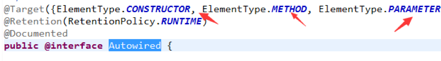
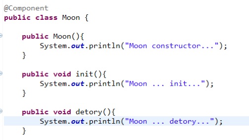
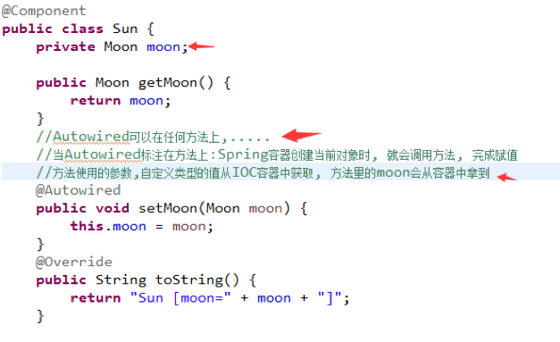

setMoon()方法使用的参数，自定义类型的值从IOC容器中获取，方法里的moon会从容器中拿到

#### 测试：

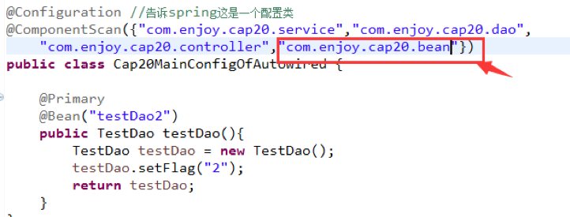
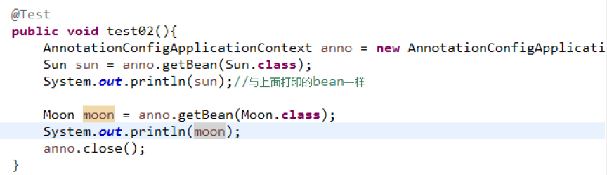

结果如下：(为同一个bean)

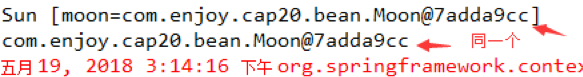

方法使用的参数,自定义类型的值从IOC容器中获取, 方法里的moon会从容器中拿到

#### B> 将Autowired标记在有参构造器

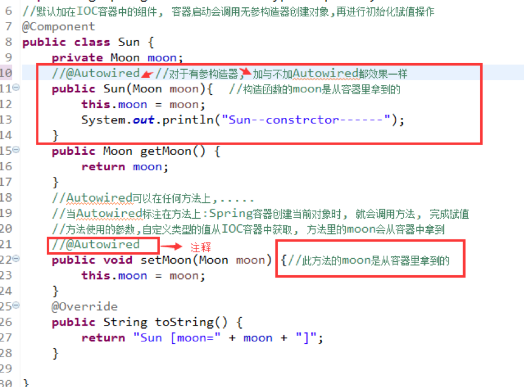

构造函数的moon是从容器里拿到的，执行test02()测试，同样，也可以放在构造器的参数位置也可以获取到IOC容器的bean。

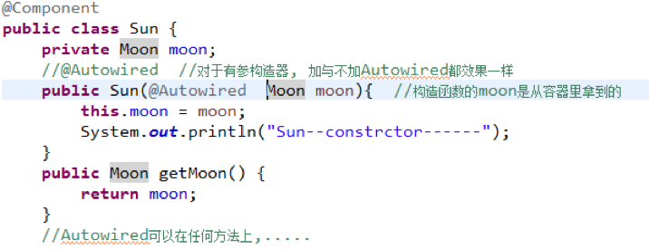

结论：不管@Autowired是放到参数，方法还是构造方法，都是从容器里取到的bean。


## 3.3 @Resource(JSR250)

接着上面的测试，此时我们把@Qualifier和@Autowired注释掉（注意：此时@Primary还没被注释）

```java
@Service
public class TestService {
//	@Qualifier("testDao")
//	@Autowired
	@Resource
	private TestDao testDao;
	
	public void println(){
		System.out.println(testDao);
	}
}


@Configuration
@ComponentScan({"com.enjoy.cap9.controller","com.enjoy.cap9.service","com.enjoy.cap9.dao"})
public class Cap9MainConfig {
	//spring进行自装配的时候默认首选的bean
	@Primary
	@Bean("testDao2")
	public TestDao testDao(){
		TestDao testDao = new TestDao();
		testDao.setFlag("2");
		return testDao;
	}
}

// output:
// TestDao [flag=1] // 效果也是一样的, 但它不先优先装配@Primary的bean
// TestDao [flag=2] // 通过@Primary标记的bean，它的bean默认被首选使用，调用app.getBean(TestDao.class)时，会优先使用该bean，不会出现org.springframework.beans.factory.NoUniqueBeanDefinitionException的情况
```

### 小结

**@Resource和Autowired的区别如下:**

- @Resource和Autowired一样可以装配bean
- @Resource缺点:
	- 不能支持@Primary功能
    - 不能支持@Autowired(required = false)的功能

当然也可以在TestService里按以下方式指定要注入的Bean：

```java
@Service
public class TestService {

	@Resource(name="testDao2")
	private TestDao testDao;
	
	public void println(){
		System.out.println(testDao);
	}
}

// output:
// TestDao [flag=2] 
// TestDao [flag=2]
```


### 3.4 @Inject(JSR330) 

***@Inject与@Autowired的区别如下：***

- @Inject和Autowired一样可以装配bean，并支持@Primary功能，可用于非spring框架
- @Inject缺点：但不能支持@Autowired(required = false)的功能，需要引入第三方包javax.inject 

Autowired属于spring的，不能脱离spring，而@Resource和@Inject都是JAVA规范，推荐大家使用@Autowired。


### 3.5 自动装配，Aware注入spring底层组件原理

自定义组件想要使用Spring容器底层的组件（ApplicationContext、BeanFactory等等）

思路：自定义组件实现xxxAware，在创建对象的时候，会调用接口规定的方法注入到相关组件：Aware

```java
// import ...

//实现 BeanNameAware 与 ApplicationContextAware接口
// ApplicationContextAware接口: 获取IOC容器
// BeanNameAware接口: 获取Bean信息
// EmbeddedValueResolverAware接口: 解析器(表达式及相关脚本解析)

@Component
public class Light implements ApplicationContextAware, BeanNameAware, EmbeddedValueResolverAware {
	private ApplicationContext applicationContext;
	
	@Override
	public void setBeanName(String name) {
		System.out.println("当前bean的名字:"+name);
	}

	@Override
	public void setApplicationContext(ApplicationContext applicationContext) throws BeansException {
			System.out.println("传入的IOC容器: "+applicationContext);
			this.applicationContext = applicationContext;
	}

	@Override
	public void setEmbeddedValueResolver(StringValueResolver resolver) {
		String result = resolver.resolveStringValue("你好${os.name}, 计算#{3*8}");
		System.out.println("解析的字符串为---"+result);		
	}
}
```

#### 测试

```java
// import ...

public class Cap9Test {
	@Test
	public void test01(){
		AnnotationConfigApplicationContext app = new AnnotationConfigApplicationContext(Cap9MainConfig.class);
		System.out.println(app);

		app.close();
		
	}
}
// output:
// 当前bean的名字:light
// 解析的字符串为---你好Mac OS X, 计算24
// 传入的IOC容器: org.springframework.context.annotation.AnnotationConfigApplicationContext@2be94b0f: startup date [Wed Feb 19 17:47:42 CST 2020]; root of context hierarchy
// org.springframework.context.annotation.AnnotationConfigApplicationContext@2be94b0f: startup date [Wed Feb 19 17:47:42 CST 2020]; root of context hierarchy
```

可知，app和Light的实例拿到的是同一个IOC容器（@2be94b0f）。

#### 总结

把Spring底层的组件可以注入到自定义的bean中，ApplicationContextAware是利用ApplicationContextAwareProcessor来处理的，其它XXXAware也类似，都有相关的Processor来处理，其实就是后置处理器来处理。XXXAware---->功能使用了XXXProcessor来处理的, 这就是后置处理器的作用。

例如：ApplicaitonContextAware--->ApplicationContextProcessor后置处理器来处理的


