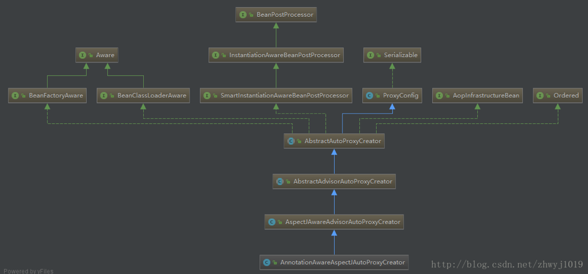

## 1. 什么是AOP？

AOP：面向切面编程[底层就是动态代理]，指程序在运行期间动态的将某段代码切入到指定方法位置进行运行的编程方式

## 2. AOP通知方法

样例：

```java
// 业务逻辑类
public class Calculator {
	//业务逻辑方法
	public int div(int i, int j){
		System.out.println("--------");
		return i/j;
	}
}

// 声明为切面类
@Aspect
public class LogAspects {
	// 对com.enjoy.cap10.aop.Calculator下的所有public的，且返回值为int的方法设置为Pointcut
	// 不想区分是哪个函数加"*"，任意多个参数及类型加".."
	@Pointcut("execution(public int com.enjoy.cap10.aop.Calculator.*(..))")
	public void pointCut(){}; // 公共切入方法

	// @Before代表在目标方法执行前切入, 并指定在哪个方法前切入
//	@Before("execution(public int com.enjoy.cap10.aop.Calculator.div())")
	@Before("pointCut()") // 指定公共切入方法即可
	public void logStart(){
		System.out.println("除法运行....参数列表是:{}");
	}

	// 外部类引用直接写上切面类的类路径和方法即可
	@After("com.enjoy.cap10.aop.LogAspects.pointCut()")
	public void logEnd(){
		System.out.println("除法结束......");

	}

	@AfterReturning("pointCut()")
	public void logReturn(){
		System.out.println("除法正常返回......运行结果是:{}");
	}

	@AfterThrowing("pointCut()")
	public void logException(){
		System.out.println("运行异常......异常信息是:{}");
	}

	@Around("pointCut()")
	public Object Around(ProceedingJoinPoint proceedingJoinPoint) throws Throwable{
		System.out.println("@Around:执行目标方法之前...");
		Object obj = proceedingJoinPoint.proceed(); // 相当于开始调div()
		System.out.println("@Around:执行目标方法之后...");
		return obj;
	}
}

// 配置类
/*
 * 日志切面类的方法需要动态感知到div()方法运行, 
 *  通知方法:
 *     前置通知:logStart(); 在我们执行div()除法之前运行(@Before)
 *     后置通知:logEnd();在我们目标方法div运行结束之后 ,不管有没有异常(@After)
 *     返回通知:logReturn();在我们的目标方法div正常返回值后运行(@AfterReturning)
 *     异常通知:logException();在我们的目标方法div出现异常后运行(@AfterThrowing)
 *     环绕通知:动态代理, 需要手动执行joinPoint.procced()(其实就是相当于我们的手动执行目标方法div()), 
 * 				在div()执行之前的逻辑相当于前置通知, div()执行之后的逻辑相当于我们后置通知(@Around)
 */
@Configuration
@EnableAspectJAutoProxy // 开启原生态Spring中的的AOP开关
public class Cap10MainConfig {
	// 业务逻辑加入到IOC容器中
	@Bean
	public Calculator calculator(){
		return new Calculator();
	}

	// 切面类加入到IOC容器中
	@Bean
	public LogAspects logAspects(){
		return new LogAspects();
	}
}

// 测试类
public class Cap10Test {
	@Test
	public void test01(){
		AnnotationConfigApplicationContext app = new AnnotationConfigApplicationContext(Cap10MainConfig.class);
		
		//Calculator c = new Calculator();
		Calculator c = app.getBean(Calculator.class);
		int result = c.div(4, 3);
		System.out.println(result);

		result = c.div(4, 0);
		System.out.println(result);
		app.close();
	}
}

// output: 
//									正常返回的调用顺序：
// @Around:执行目标方法之前...  		=> @Around
// 除法运行....参数列表是:{}			=> @Before
// --------							=> div()
// @Around:执行目标方法之后...			=> @Around
// 除法结束......						=> @After
// 除法正常返回......运行结果是:{}		=> @AfterReturning
// 
// 1								异常的调用顺序：
// @Around:执行目标方法之前...			=> @Around
// 除法运行....参数列表是:{}			=> @Before
// --------							=> div()
// 除法结束......						=> @After
// 运行异常......异常信息是:{}			=> @AfterThrowing
```


使用JoinPoint可以拿到相关的内容，比如方法名，参数：

```java
//日志切面类
@Aspect
public class LogAspects {
	@Pointcut("execution(public int com.enjoy.cap10.aop.Calculator.*(..))")
	public void pointCut(){};
	
	//@before代表在目标方法执行前切入, 并指定在哪个方法前切入
	@Before("pointCut()")
	public void logStart(JoinPoint joinPoint){
		System.out.println(joinPoint.getSignature().getName()+"除法运行....参数列表是:{"+Arrays.asList(joinPoint.getArgs())+"}");
	}
	@After("pointCut()")
	public void logEnd(JoinPoint joinPoint){
		System.out.println(joinPoint.getSignature().getName()+"除法结束......");
		
	}
	@AfterReturning(value="pointCut()",returning="result")
	public void logReturn(Object result){
		System.out.println("除法正常返回......运行结果是:{"+result+"}");
	}
	@AfterThrowing(value="pointCut()",throwing="exception")
	public void logException(Exception exception){
		System.out.println("运行异常......异常信息是:{"+exception+"}");
	}
	
	// @Around("pointCut()")
	// public Object Around(ProceedingJoinPoint proceedingJoinPoint) throws Throwable{
	// 	System.out.println("@Arount:执行目标方法之前...");
	// 	Object obj = proceedingJoinPoint.proceed();//相当于开始调div地
	// 	System.out.println("@Arount:执行目标方法之后...");
	// 	return obj;
	// }
}

// output:
// 
// div除法运行....参数列表是:{[4, 2]}
// --------
// div除法结束......
// 除法正常返回......运行结果是:{2}
// 2
// div除法运行....参数列表是:{[4, 0]}
// --------
// div除法结束......
// 运行异常......异常信息是:{java.lang.ArithmeticException: / by zero}

```


### 小结

AOP看起来很麻烦, 只要3步就可以了：

- 1. 将业务逻辑组件和切面类都加入到容器中, 告诉spring哪个是切面类(@Aspect)
- 2. 在切面类上的每个通知方法上标注通知注解, 告诉Spring何时运行(写好切入点表达式,参照官方文档)
- 3. 开启基于注解的AOP模式  @EableXXXX


## 3. AOP源码分析

代理主要有两种类型：

- JDK：invocationHandler、Proxy、反射，以实现接口为主
- CGLIB：需要继承

AOP原理：【看给容器中注册了什么组件，这个组件什么时候工作，这个组件的功能是什么？】

核心从@EnableAspectJAutoProxy入手，AOP整个功能要启作用，就是靠这个，加入它才有AOP。

### 3.1 @EnableAspectJAutoProxy源码

```java
@Target(ElementType.TYPE)
@Retention(RetentionPolicy.RUNTIME)
@Documented
@Import(AspectJAutoProxyRegistrar.class) // 导入了此类，需要深入下去
public @interface EnableAspectJAutoProxy {

	/**
	 * Indicate whether subclass-based (CGLIB) proxies are to be created as opposed
	 * to standard Java interface-based proxies. The default is {@code false}.
	 */
	boolean proxyTargetClass() default false;
	// proxyTargetClass属性，默认false，采用JDK动态代理织入增强(实现接口的方式)
	// 如果设为true，则采用CGLIB动态代理织入增强

	/**
	 * Indicate that the proxy should be exposed by the AOP framework as a {@code ThreadLocal}
	 * for retrieval via the {@link org.springframework.aop.framework.AopContext} class.
	 * Off by default, i.e. no guarantees that {@code AopContext} access will work.
	 * @since 4.3.1
	 */
	boolean exposeProxy() default false;
	// 通过aop框架暴露该代理对象，aopContext能够访问

}
```

它引入AspectJAutoProxyRegistrar，并实现了ImportBeanDefinitionRegistrar接口，ImportBeanDefinitionRegistrar接口能给容器中自定义注册组件，以前也使用过，比如我们以前也使用过这个类：

```java
public class JamesImportBeanDefinitionRegistrar implements ImportBeanDefinitionRegistrar {

	/*
	*AnnotationMetadata:当前类的注解信息
	*BeanDefinitionRegistry:BeanDefinition注册类
	*    把所有需要添加到容器中的bean加入;
	*    @Scope
	*/
	@Override
	public void registerBeanDefinitions(AnnotationMetadata importingClassMetadata, BeanDefinitionRegistry registry) {
		boolean bean1 = registry.containsBeanDefinition("com.enjoy.cap6.bean.Dog");
		boolean bean2 = registry.containsBeanDefinition("com.enjoy.cap6.bean.Cat");
		//如果Dog和Cat同时存在于我们IOC容器中,那么创建Pig类, 加入到容器
		//对于我们要注册的bean, 给bean进行封装,
		if(bean1 && bean2){
			RootBeanDefinition beanDefinition = new RootBeanDefinition(Pig.class);
			registry.registerBeanDefinition("pig", beanDefinition);
		}
	}
}
```

在AspectJAutoProxyRegistrar里可以自定义注册一些bean，那么注册了什么bean呢?

```java
/**
 * Registers an {@link org.springframework.aop.aspectj.annotation.AnnotationAwareAspectJAutoProxyCreator
 * AnnotationAwareAspectJAutoProxyCreator} against the current {@link BeanDefinitionRegistry}
 * as appropriate based on a given @{@link EnableAspectJAutoProxy} annotation.
 *
 * @author Chris Beams
 * @author Juergen Hoeller
 * @since 3.1
 * @see EnableAspectJAutoProxy
 */
class AspectJAutoProxyRegistrar implements ImportBeanDefinitionRegistrar {

	/**
	 * Register, escalate, and configure the AspectJ auto proxy creator based on the value
	 * of the @{@link EnableAspectJAutoProxy#proxyTargetClass()} attribute on the importing
	 * {@code @Configuration} class.
	 */
	@Override
	public void registerBeanDefinitions(
			AnnotationMetadata importingClassMetadata, BeanDefinitionRegistry registry) {

		// 注册一个这个组件, 如果有需要的话....
		AopConfigUtils.registerAspectJAnnotationAutoProxyCreatorIfNecessary(registry);

		AnnotationAttributes enableAspectJAutoProxy =
				AnnotationConfigUtils.attributesFor(importingClassMetadata, EnableAspectJAutoProxy.class);
		if (enableAspectJAutoProxy != null) {
			if (enableAspectJAutoProxy.getBoolean("proxyTargetClass")) {
				AopConfigUtils.forceAutoProxyCreatorToUseClassProxying(registry);
			}
			if (enableAspectJAutoProxy.getBoolean("exposeProxy")) {
				AopConfigUtils.forceAutoProxyCreatorToExposeProxy(registry);
			}
		}
	}
}
```

我们进去看看

```java
// Class AopConfigUtils

	@Nullable
	public static BeanDefinition registerAspectJAnnotationAutoProxyCreatorIfNecessary(BeanDefinitionRegistry registry) {
		return registerAspectJAnnotationAutoProxyCreatorIfNecessary(registry, null);
	}

	// ...

	@Nullable
	public static BeanDefinition registerAspectJAnnotationAutoProxyCreatorIfNecessary(BeanDefinitionRegistry registry,
			@Nullable Object source) {

		// 升级或注册，传入AnnotationAwareAspectJAutoProxyCreator.class
		return registerOrEscalateApcAsRequired(AnnotationAwareAspectJAutoProxyCreator.class, registry, source);
	}

	// ...
	/**
	 * The bean name of the internally managed auto-proxy creator.
	 */
	public static final String AUTO_PROXY_CREATOR_BEAN_NAME =
			"org.springframework.aop.config.internalAutoProxyCreator";

	// ...

	@Nullable
	private static BeanDefinition registerOrEscalateApcAsRequired(Class<?> cls, BeanDefinitionRegistry registry,
			@Nullable Object source) {

		Assert.notNull(registry, "BeanDefinitionRegistry must not be null");

		// 想注册一个AnnotationAwareAspectJAutoProxyCreator的组件,

		// 如果容器中bean已经有了internalAutoProxyCreator，就直接进行的操作
		if (registry.containsBeanDefinition(AUTO_PROXY_CREATOR_BEAN_NAME)) {
			BeanDefinition apcDefinition = registry.getBeanDefinition(AUTO_PROXY_CREATOR_BEAN_NAME);
			if (!cls.getName().equals(apcDefinition.getBeanClassName())) {
				int currentPriority = findPriorityForClass(apcDefinition.getBeanClassName());
				int requiredPriority = findPriorityForClass(cls);
				if (currentPriority < requiredPriority) {
					apcDefinition.setBeanClassName(cls.getName());
				}
			}
			return null;
		}

		// 但是如果我们的IOC中还没有，
		// 就会使用传进来的cls（AnnotationAwareAspectJAutoProxyCreator.class）
		// 用registry把bean的定义做好
		// 封装bean的名叫做AUTO_PROXY_CREATOR_BEAN_NAME，即(internalAutoProxyCreator)
		RootBeanDefinition beanDefinition = new RootBeanDefinition(cls);
		beanDefinition.setSource(source);
		beanDefinition.getPropertyValues().add("order", Ordered.HIGHEST_PRECEDENCE);
		beanDefinition.setRole(BeanDefinition.ROLE_INFRASTRUCTURE);
		// 成功注册
		registry.registerBeanDefinition(AUTO_PROXY_CREATOR_BEAN_NAME, beanDefinition);
		return beanDefinition;
	}
```

其实就是利用@EnableAspectJAutoProxy中的AspectJAutoProxyRegistrar给我们容器中注册一个AnnotationAwareAspectJAutoProxyCreator组件，翻译过来其实就叫做“注解装配模式的ASPECT切面自动代理创建器”的组件。

因此我们要重点研究AnnotationAwareAspectJAutoProxyCreator组件(ASPECT自动代理创建器)，研究这个透了，整个原理也就明白了，所有的原理就是看容器注册了什么组件，这个组件什么时候工作，及工作时候的功能是什么?


### 3.2 AnnotationAwareAspectJAutoProxyCreator

继承关系如下：

```java
AnnotationAwareAspectJAutoProxyCreator类关系如下，继承关系：
 * 	AnnotationAwareAspectJAutoProxyCreator
 * 	   ->AspectJAwareAdvisorAutoProxyCreator
 * 		  ->AbstractAdvisorAutoProxyCreator
 * 			 ->AbstractAutoProxyCreator
 * 			   implements SmartInstantiationAwareBeanPostProcessor, BeanFactoryAware
 // 						关注后置处理器（在bean初始化完成前后做事情）、自动装配BeanFactory

```

- SmartInstantiationAwareBeanPostProcessor是bean的后置处理器
- BeanFactoryAware能把beanFacotry的bean工厂传进来 

通过分析以上的bean继承关系我们发现，AnnotationAwareAspectJAutoProxyCreator不仅具有BeanPostProcessor的特点，也有Aware接口的特点（实现了BeanFactoryAware接口）



那我们来分析它做为beanPostProcessor后置处理器做了哪些工作, 做为BeanFactoryAware又做了哪些工作？

- AnnotationAwareAspectJAutoProxyCreator => InstantiationAwareBeanPostProcessor：前、后处理
- Calculator（业务bean） => finishBeanFactoryInitialization => give a chance to get proxy instance，（AOP）单实例Calculator => 先实例化


#### 分析创建和注册AnnotationAwareAspectJAutoProxyCreator的流程

```
- 1. register()传入配置类，准备创建ioc容器
- 2. 注册配置类，调用refresh（）刷新创建容器；
- 3. registerBeanPostProcessors(beanFactory);注册bean的后置处理器来方便拦截bean的创建(主要是分析创建AnnotationAwareAspectJAutoProxyCreator)；
	- 1）、 先获取ioc容器已经定义了的需要创建对象的所有BeanPostProcessor
 	- 2）、给容器中加别的BeanPostProcessor
 	- 3）、优先注册实现了PriorityOrdered接口的BeanPostProcessor；
 	- 4）、再给容器中注册实现了Ordered接口的BeanPostProcessor；
 	- 5）、注册没实现优先级接口的BeanPostProcessor；
 	- 6）、注册BeanPostProcessor，实际上就是创建BeanPostProcessor对象，保存在容器中；
 		创建internalAutoProxyCreator的BeanPostProcessor【其实就是AnnotationAwareAspectJAutoProxyCreator】
 		- 1）、创建Bean的实例
 		- 2）、populateBean；给bean的各种属性赋值
 		- 3）、initializeBean：初始化bean；
 			- 1）、invokeAwareMethods()：处理Aware接口的方法回调
 			- 2）、applyBeanPostProcessorsBeforeInitialization()：应用后置处理器的postProcessBeforeInitialization（）
 			- 3）、invokeInitMethods()；执行自定义的初始化方法
 			- 4）、applyBeanPostProcessorsAfterInitialization()；执行后置处理器的postProcessAfterInitialization（）；
 		- 4）、BeanPostProcessor(AnnotationAwareAspectJAutoProxyCreator)创建成功；--》aspectJAdvisorsBuilder
 	- 7）、把BeanPostProcessor注册到BeanFactory中；
 		beanFactory.addBeanPostProcessor(postProcessor);
``` 		

注意:以上是创建和注册AnnotationAwareAspectJAutoProxyCreator的过程

更详细的内容请见仓库内的[springAOP核心组件分析.pdf](./springAOP核心组件分析.pdf)


#### 如何创建增强的Caculator增强bean的流程:

```
 - 1,refresh--->finishBeanFactoryInitialization(beanFactory);完成BeanFactory初始化工作；创建剩下的单实例bean
  	- 1）、遍历获取容器中所有的Bean，依次创建对象getBean(beanName);
  				getBean->doGetBean()->getSingleton()->
  	- 2）、创建bean【AnnotationAwareAspectJAutoProxyCreator在所有bean创建之前会有一个拦截，InstantiationAwareBeanPostProcessor，会调用postProcessBeforeInstantiation()】
  		- 2.1）、先从缓存中获取当前bean，如果能获取到，说明bean是之前被创建过的，直接使用，否则再创建；
  					只要创建好的Bean都会被缓存起来
  		- 2.2）、createBean（）;创建bean；
  					AnnotationAwareAspectJAutoProxyCreator 会在任何bean创建之前先尝试返回bean的实例
  					【BeanPostProcessor是在Bean对象创建完成初始化前后调用的】
  					【InstantiationAwareBeanPostProcessor是在创建Bean实例之前先尝试用后置处理器返回对象的】
  			- 2.2.1）、resolveBeforeInstantiation(beanName, mbdToUse);解析BeforeInstantiation,如果能返回代理对象就使用，如果不能就继续,后置处理器先尝试返回对象；
  			bean = applyBeanPostProcessorsBeforeInstantiation（）：
  			拿到所有后置处理器，如果是InstantiationAwareBeanPostProcessor;
  			就执行postProcessBeforeInstantiation
  			if (bean != null) {
					bean = applyBeanPostProcessorsAfterInitialization(bean, beanName);
			}
  
  			- 2.2.2）、doCreateBean(beanName, mbdToUse, args);真正的去创建一个bean实例；和单实例bean创建流程一样；
```  

更详细的内容请见仓库内的[springAOP核心组件分析.pdf](./springAOP核心组件分析.pdf)		

			  			
#### 【AnnotationAwareAspectJAutoProxyCreator】作用:

```
InstantiationAwareBeanPostProcessor：
	- 1）、每一个bean创建之前，调用postProcessBeforeInstantiation()；
  		关心MathCalculator和LogAspect的创建
  		- 1）、判断当前bean是否在advisedBeans中（保存了所有需要增强bean）
  		- 2）、判断当前bean是否是基础类型的Advice、Pointcut、Advisor、AopInfrastructureBean，
  			或者是否是切面（@Aspect）
  		- 3）、是否需要跳过
  			- 1）、获取候选的增强器（切面里面的通知方法）【List<Advisor> candidateAdvisors】
  				每一个封装的通知方法的增强器是 InstantiationModelAwarePointcutAdvisor；
  				判断每一个增强器是否是 AspectJPointcutAdvisor 类型的；返回true
  			- 2）、永远返回false
  
	- 2）、创建对象
  postProcessAfterInitialization；
  		return wrapIfNecessary(bean, beanName, cacheKey);//包装如果需要的情况下
  		- 1）、获取当前bean的所有增强器（通知方法）  Object[]  specificInterceptors
  			- 1、找到候选的所有的增强器（找哪些通知方法是需要切入当前bean方法的）
  			- 2、获取到能在bean使用的增强器。
  			- 3、给增强器排序
  		- 2）、保存当前bean在advisedBeans中；
  		- 3）、如果当前bean需要增强，创建当前bean的代理对象；
  			- 1）、获取所有增强器（通知方法）
  			- 2）、保存到proxyFactory
  			- 3）、创建代理对象：Spring自动决定
  				JdkDynamicAopProxy(config);jdk动态代理；
  				ObjenesisCglibAopProxy(config);cglib的动态代理；
  		- 4）、给容器中返回当前组件使用cglib增强了的代理对象；
  		- 5）、以后容器中获取到的就是这个组件的代理对象，执行目标方法的时候，代理对象就会执行通知方法的流程；
```

更详细的内容请见仓库内的[springAOP核心组件分析.pdf](./springAOP核心组件分析.pdf)


