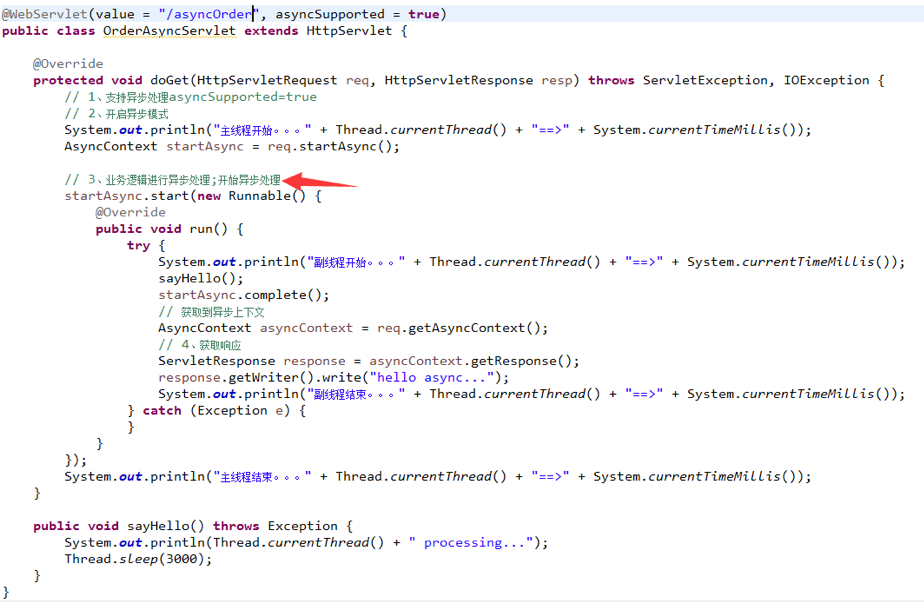

## 1. Servlet3.0使用样例


```java
// 以前来写web的三大组件：以前写servlet filter listener都需要在web.xml进行注册，包括springmvc的前端控制器DispactherServlet也需要在web.xml注册，现在可以通过注解的方式快速搭建我们的web应用


// Shared libraries（共享库） and runtimes pluggability（运行时插件）的原理,在后面的框架整合里，用得比较多，来分析下它；
// ServletContainerInitializer初始化web容器：
// 在web容器启动时为提供给第三方组件机会做一些初始化的工作，例如注册servlet或者filters等，servlet规范(JSR356)中通过ServletContainerInitializer实现此功能。
// 每个框架要使用ServletContainerInitializer就必须在对应的jar包的META-INF/services 目录创建一个名为javax.servlet.ServletContainerInitializer的文件，文件内容指定具体的ServletContainerInitializer实现类，那么，当web容器启动时就会运行这个初始化器做一些组件内的初始化工作。


//容器启动的时候会将@HandlesTypes指定的这个类型下面的子类（实现类，子接口等）传递过来；
//传入感兴趣的类型；
@HandlesTypes(value={JamesService.class})
// 一般伴随着ServletContainerInitializer一起使用的还有HandlesTypes注解，通过HandlesTypes可以将感兴趣的一些类注入到ServletContainerInitializer的onStartup方法作为参数传入。
public class JamesServletContainerInitializer implements ServletContainerInitializer{
	/**
	 * tomcat启动时加载应用的时候，会运行onStartup方法；
	 *
	 * Set<Class<?>> arg0：感兴趣的类型的所有子类型(对实现了JamesService接口相关的)；
	 * ServletContext arg1:代表当前Web应用的ServletContext；一个Web应用一个ServletContext；
	 *
	 * 1）、使用ServletContext注册Web组件（Servlet、Filter、Listener）
	 * 2）、使用编码的方式，在项目启动的时候给ServletContext里面添加组件；
	 * 		必须在项目启动的时候来添加；
	 * 		1）、ServletContainerInitializer得到的ServletContext；
	 * 		2）、ServletContextListener得到的ServletContext；
	 */

	// 使用ServletContext注册web组件（其实就是Servlet,Filter,Listener三大组件），对于我们自己写的JamesServlet，我们可以使用@WebServlet注解来加入JamesServlet组件，但若是我们要导入第三方阿里的连接池或filter，以前的web.xml方式就可通过配置加载就可以了，但现在我们使用ServletContext注入进来；

	@Override
	public void onStartup(Set<Class<?>> arg0, ServletContext arg1) throws ServletException {
		System.out.println("感兴趣的类型：");
		for (Class<?> claz : arg0) {
			System.out.println(claz);//当传进来后，可以根据自己需要利用反射来创建对象等操作
		}

		// 注册servlet组件
		// 在运行的过程中，是不可以注册组件， 和IOC道理一样，出于安全考虑
		javax.servlet.ServletRegistration.Dynamic servlet = arg1.addServlet("orderServlet", new OrderServlet());
		// 配置servlet的映射信息（路径请求）
		servlet.addMapping("/orderTest");

		// 注册监听器Listener
		arg1.addListener(OrderListener.class);

		// 注册Filter
		javax.servlet.FilterRegistration.Dynamic filter = arg1.addFilter("orderFilter", OrderFilter.class);
		// 添加Filter的映射信息，可以指定专门来拦截哪个servlet
		filter.addMappingForUrlPatterns(EnumSet.of(DispatcherType.REQUEST), true, "/*");

	}
}


public interface JamesService {

}

public class OrderServlet extends HttpServlet {
	
	@Override
	protected void doGet(HttpServletRequest req, HttpServletResponse resp) throws ServletException, IOException {
		// TODO Auto-generated method stub
		resp.getWriter().write("jamesServlet...");
	}

}


/**
 * 监听项目的启动和停止
 * @author james
 *
 */
public class OrderListener implements ServletContextListener {

	
	//监听ServletContext销毁
	@Override
	public void contextDestroyed(ServletContextEvent arg0) {
		// TODO Auto-generated method stub
		System.out.println("UserListener...contextDestroyed...");
	}

	//监听ServletContext启动初始化
	@Override
	public void contextInitialized(ServletContextEvent arg0) {
		// TODO Auto-generated method stub
		ServletContext servletContext = arg0.getServletContext();
		System.out.println("UserListener...contextInitialized...");
	}

}


public class OrderFilter implements Filter {

	@Override
	public void destroy() {
		// TODO Auto-generated method stub
		
	}

	@Override
	public void doFilter(ServletRequest arg0, ServletResponse arg1, FilterChain arg2)
			throws IOException, ServletException {
		// 过滤请求
		System.out.println("UserFilter...doFilter...");
		//放行
		arg2.doFilter(arg0, arg1);
		
	}

	@Override
	public void init(FilterConfig arg0) throws ServletException {
		// TODO Auto-generated method stub
		
	}
}
```


## 2. Servlet与SpringMvc的整合分析

**我们可先打开javax.servlet.ServletContainerInitializer这个文件看看**


**打开SpringServletContainerInitializer源码类**


**打开WebApplicationInitializer源码看看组件及实现**


### AbstractContextLoaderInitializer


### AbstractDispatcherServletInitializer：从名字来看可知是DispatcherServlet初始化


### 子类AbstractAnnotationConfigDispatcherServletInitializer：注解方式配置的dispatcherServlet初始化器


### root根容器与servlet容器的区别 => 父子容器


很明显，servlet的容器用来处理@Controller，视图解析，和web相关组件而root根容器主要针对服务层，和数据源DAO层及事务控制相关处理（图源自spring官网）

[spring mvc hierarchy](https://docs.spring.io/spring/docs/5.0.2.RELEASE/spring-framework-reference/web.html#mvc-servlet-context-hierarchy)


## 3. Servlet与SpringMvc的整合样例

新建JamesWebInitializer继承AbstractAnnotationConfigDispatcherServletInitializer类

```java
//web容器启动的时候创建对象；调用方法来初始化容器以前前端控制器
public class JamesWebAppInitializer extends AbstractAnnotationConfigDispatcherServletInitializer {

	//获取根容器的配置类；（Spring的配置文件）   父容器；
	@Override
	protected Class<?>[] getRootConfigClasses() {
		//指定配置类（配置文件）位置
		return new Class<?>[]{JamesRootConfig.class} ;
	}

	//获取web容器的配置类（SpringMVC配置文件）  子容器；
	@Override
	protected Class<?>[] getServletConfigClasses() {
		return new Class<?>[]{JamesAppConfig.class} ;
	}

	//获取DispatcherServlet的映射信息
	//  /：拦截所有请求（包括静态资源（xx.js,xx.png）），但是不包括*.jsp；
	//  /*：拦截所有请求；连*.jsp页面都拦截；jsp页面是tomcat的jsp引擎解析的；
	@Override
	protected String[] getServletMappings() {
		// TODO Auto-generated method stub
		return new String[]{"/"};
	}

}
```

新建两个配置类JamesRootConfig和JamesAppConfig，形成父子容器的效果

```java
//Spring的容器不扫描controller; 父容器
@ComponentScan(value="com.enjoy",excludeFilters={
		@Filter(type=FilterType.ANNOTATION,classes={Controller.class})
})
public class JamesRootConfig {

}


//SpringMVC只扫描Controller；子容器
//useDefaultFilters=false 禁用默认的过滤规则；
@ComponentScan(value="com.enjoy",includeFilters={
		@Filter(type=FilterType.ANNOTATION,classes={Controller.class})
},useDefaultFilters=false)
@EnableWebMvc
public class JamesAppConfig extends WebMvcConfigurerAdapter  {
	
	// 定制视图解析器
	@Override
	public void configureViewResolvers(ViewResolverRegistry registry) {
		//比如我们想用JSP解析器,默认所有的页面都从/WEB-INF/AAA.jsp
		registry.jsp("/WEB-INF/pages/",".jsp");
	}
	
	// 静态资源访问,静态资源交给tomcat来处理
	// 如果不开启，那么/WEB-INF/index.jsp中的静态资源（png等文件）将访问不到
	 @Override
	public void configureDefaultServletHandling(DefaultServletHandlerConfigurer configurer) {
		 configurer.enable();
	}

	 // 拦截器
	 @Override
	public void addInterceptors(InterceptorRegistry registry) {
		registry.addInterceptor(new JamesInterceptor()).addPathPatterns("/**");
	}
}


```

相关组件


```java

@Controller
public class OrderController   {
	@Autowired
	OrderService orderService;
	
	@ResponseBody
	@RequestMapping("/buy")
	public String buy(){
		return orderService.goBuy("12345678");
	}
	
	@RequestMapping("/ok")
	public String ok(){
		System.out.println("Page Function");
		return "ok"; //因为已经配置了configureViewResolvers，相当于会找 /WEB-INF/pages/ok.jsp
	}
}


@Service
public class OrderService   {
	public String goBuy(String orderId){
		return "orderId===="+orderId;
	}
}


// 拦截器
public class JamesInterceptor implements HandlerInterceptor{
	//在目标方法运行之间执行
	public boolean preHandle(HttpServletRequest request, HttpServletResponse response, Object handler)
			throws Exception {
		System.out.println("----preHandle-------------");
		return true;
	}

	//在目标方法执行之后执行
	public void postHandle(HttpServletRequest request, HttpServletResponse response, Object handler,
			ModelAndView modelAndView) throws Exception {
		System.out.println("----postHandle-------------");
	}

	//页面响应之后执行
	public void afterCompletion(HttpServletRequest request, HttpServletResponse response, Object handler, Exception ex)
			throws Exception {
		System.out.println("----afterCompletion-------------");
	}
}
// 拦截器输出效果
// ----preHandle-------------
// Page Function
// ----postHandle-------------
// ----afterCompletion-------------
```


## 4. Servlet与SpringMvc的异步处理总结


### 4.1 Servlet的同步处理和异步处理

#### 同步处理

什么是同步处理？客户端请求发出后，服务端完成工作后直接响应


同步请求原理，从tomcat中获取连接线程进行处理，但tomcat的线程数有限，会造成线程资源的紧张。


#### 例子


重启tomcat，得到如下结果



从头到尾都是由同一个线程4进行处理的，同一线程处理。很明显，线程从头执行到尾，会造成资源占用不能释放

#### 异步处理


从servlet3.0文档的9.6章节也可以看到，要声明的内容


重启tomcat，查看运行结果如下，主线程与副线程分别为不同的线程，主线程从开始到结束不等待副线程就返回了：


#### 异步原理


### 4.2 SpringMVC的异步处理

我们可以打官网[mvc-servlet-context-hierarchy](https://docs.spring.io/spring/docs/5.0.2.RELEASE/spring-framework-reference/web.html#mvc-servlet-context-hierarchy)

第1.7.1章节，讲述得很清晰，springmvc异步机制是基于servlet3来做的封装处理，通过这两种返回值都可以完成异步。

官网例子如下：


#### Callable例子

```java
	@ResponseBody
	@RequestMapping("/order01")
	public Callable<String> order01(){
		System.out.println("主线程开始..."+Thread.currentThread()+"==>"+System.currentTimeMillis());
		
		Callable<String> callable = new Callable<String>() {
			@Override
			public String call() throws Exception {
				System.out.println("副线程开始..."+Thread.currentThread()+"==>"+System.currentTimeMillis());
				Thread.sleep(2000);
				System.out.println("副线程开始..."+Thread.currentThread()+"==>"+System.currentTimeMillis());
				return "order buy successful........";
			}
		};
		
		System.out.println("主线程结束..."+Thread.currentThread()+"==>"+System.currentTimeMillis());
		return callable;
	}
// console output：
// ----preHandle-------------/springmvc_anno_12_war_exploded/order01
// 主线程开始...Thread[http-nio-8080-exec-10,5,main]==>1582793831812
// 主线程结束...Thread[http-nio-8080-exec-10,5,main]==>1582793831812
// 副线程开始...Thread[MvcAsync2,5,main]==>1582793831814
// 副线程开始...Thread[MvcAsync2,5,main]==>1582793833814
// ----preHandle-------------/springmvc_anno_12_war_exploded/order01
// ----postHandle-------------
// ----afterCompletion-------------
```

**原理：**


控制台打印结果为什么会两次进入拦截器preHandle呢？=> 很明显可知：请求进入时拦截了一次，将Callable返回结果时，将请求重新派发给容器时又拦截了一次，所以进了两次拦截；


#### DeferredResult例子

用一个简单的需求来测试：以创建订单为例，tomcat启动线程1来完成一个请求，但实际上是订单服务才能创建订单，那么tomcat线程应该把请求转发给订单服务，使用消息中间件来处理，订单服务把处理结果也放到消息中间件，由tomcat的线程N拿到结果后，响应给客户端。


[官网第1.7.1章节](https://docs.spring.io/spring/docs/5.0.2.RELEASE/spring-framework-reference/web.html#mvc-servlet-context-hierarchy)


所以我们可以写一个简易的例子：

```java

// ################ 模拟简易队列

public class JamesDeferredQueue {
	
	private static Queue<DeferredResult<Object>> queue = new ConcurrentLinkedQueue<>();
	
	public static void save(DeferredResult<Object> deferredResult){
		queue.add(deferredResult);
	}
	
	public static DeferredResult<Object> get( ){
		return queue.poll();
	}

}

// ################ 在Controller中

	// 其实相当于我们说的tomcat的线程1，来处理用户请求，并将请求的操作放到Queue队列里
	@ResponseBody
	@RequestMapping("/createOrder")
	public DeferredResult<Object> createOrder(){
		// 等待超时时间5000ms，超时返回错误提示create fail...
		DeferredResult<Object> deferredResult = new DeferredResult<>((long)5000, "create fail...");
		System.out.println(Thread.currentThread().getId() + " handle...");
		// 将请求保存到Queue队列
		JamesDeferredQueue.save(deferredResult);
		
		return deferredResult;
	}
	
	// 其实相当于我们说的tomcat的线程N，来处理用户请求，并将请求的操作放到Queue队列里
	@ResponseBody
	@RequestMapping("/get")
	public String create(){
		//创建订单（按真实操作应该是从订单服务取，这里直接返回）
		String order = UUID.randomUUID().toString();//模拟从订单服务获取的订单信息（免调接口）

		// 请求已经在队列中过期，直接返回request timeout
		DeferredResult<Object> deferredResult = JamesDeferredQueue.get();
		System.out.println(deferredResult.getResult());
		if (deferredResult.isSetOrExpired()) {
			return "request timeout";
		}
		
		// 线程N将DeferredResult返回的信息进行设值
		deferredResult.setResult(order);
		System.out.println(Thread.currentThread().getId() + " handle...");

		return "create success, orderId == "+order;
	}
```


