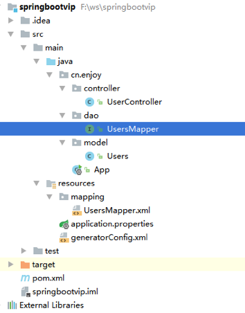

# 1. 简介

## 1.1. SpringBoot介绍

Spring Boot使开发独立的，产品级别的基于Spring的应用变得非常简单，你只需"just run"。 我们为Spring平台及第三方库提供开箱即用的设置，这样你就可以有条不紊地开始。多数Spring Boot应用需要很少的Spring配置。

你可以使用Spring Boot创建Java应用，并使用java -jar启动它或采用传统的war部署方式。

### 1.1.1. 解决的问题

- 依赖太多了, 且存在版本问题 
- 配置太多了且每次都一样, 大部分工程, 配置每次都是一样的, 从一个地方拷贝到另外一个地方. 且Spring发展10多年, 各种配置版本太多, 对于很多程序员来说, 分不清哪个是有效, 哪个无效. 
- 部署太麻烦. 需要tomcat部署, 项目结构也需要照着Java EE的目录结构来写.

### 1.1.2. SpringBoot特点

- 创建独立的Spring应用程序
- 嵌入的Tomcat，无需部署WAR文件
- 简化Maven配置
- 自动配置Spring
- 提供生产就绪型功能，如指标，健康检查和外部配置
- 绝对没有代码生成和对XML没有要求配置

### 1.1.3. SpringBoot功能

- 自动配置(auto-configuration)
一项简化配置的功能，比如在classpath中发现有spring security的jar包，则自动创建相关的bean等

- starters(简化依赖)
这个比较关键，方便spring去集成各类组件，比如redis、mongodb等等。


### 1.1.4. SpringBoot的发展


## 1.2.	系统要求

默认情况下，本堂课使用SpringBoot 2.1.2最新版本，最好安装JDK8以及以上的版本，maven使用3.3或者以上的版本（本教程使用maven3.6版本）

### 1.3. 第一个SpringBoot项目

新建一个普通maven项目

创建pom文件

```xml
<?xml version="1.0" encoding="UTF-8"?>
<project xmlns="http://maven.apache.org/POM/4.0.0"
         xmlns:xsi="http://www.w3.org/2001/XMLSchema-instance"
         xsi:schemaLocation="http://maven.apache.org/POM/4.0.0 http://maven.apache.org/xsd/maven-4.0.0.xsd">
    <modelVersion>4.0.0</modelVersion>
    <groupId>enjoy</groupId>
    <artifactId>springbootvip</artifactId>
    <version>1.0-SNAPSHOT</version>
    <parent>
        <groupId>org.springframework.boot</groupId>
        <artifactId>spring-boot-starter-parent</artifactId>
        <version>2.1.2.RELEASE</version>
    </parent>
    <dependencies>
        <dependency>
            <groupId>org.springframework.boot</groupId>
            <artifactId>spring-boot-starter-web</artifactId>
        </dependency>
    </dependencies>

</project>
```

编写代码：

为了完成应用程序，我们需要创建一个单独的Java文件。Maven默认会编译src/main/java下的源码

新建：cn.enjoy.Example

```java
package cn.enjoy;

import org.springframework.boot.*;
import org.springframework.boot.autoconfigure.*;
import org.springframework.stereotype.*;
import org.springframework.web.bind.annotation.*;

@RestController
@EnableAutoConfiguration
public class Example {
    @RequestMapping("/")
    String home() {
        return "Hello World!";
    }
    public static void main(String[] args) throws Exception {
        SpringApplication.run(Example.class, args);
    }
}
```

@RestController和@RequestMapping说明：

- @RestController。这被称为一个构造型（stereotype）注解。它为阅读代码的人们提供建议。对于Spring，该类扮演了一个特殊角色。在本示例中，我们的类是一个web @Controller，所以当处理进来的web请求时，Spring会询问它。

- @RequestMapping注解提供路由信息。它告诉Spring任何来自"/"路径的HTTP请求都应该被映射到home方法。@RestController注解告诉Spring以字符串的形式渲染结果，并直接返回给调用者。

- @EnableAutoConfiguration。这个注解告诉Spring Boot根据添加的jar依赖猜测你想如何配置Spring。由于spring-boot-starter-web添加了Tomcat和Spring MVC，所以auto-configuration将假定你正在开发一个web应用并相应地对Spring进行设置。

main方法。这只是一个标准的方法，它遵循Java对于一个应用程序入口点的约定。我们的main方法通过调用run，将业务委托给了Spring Boot的SpringApplication类。SpringApplication将引导我们的应用，启动Spring，相应地启动被自动配置的Tomcat web服务器。我们需要将Example.class作为参数传递给run方法来告诉SpringApplication谁是主要的Spring组件。

执行main方法，使用一个浏览器打开 localhost:8080，以下输出：

Hello World!

## 1.4. 注意事项

Spring Boot不需要使用任何特殊的代码结构，然而，这里有一些地方需要注意

使用"default"包

当类没有包含package声明时，它被认为处于default package下。通常不推荐使用default package，并应该避免使用它。因为对于使用@ComponentScan，@EntityScan或@SpringBootApplication注解的Spring Boot应用来说，来自每个jar的类都会被读取，这会造成一定的问题。

**定位main应用类**

通常建议你将main应用类放在位于其他类上面的根包（root package）中。通常使用@EnableAutoConfiguration注解你的main类，并且暗地里为某些项定义了一个基础“search package”。例如，如果你正在编写一个JPA应用，被@EnableAutoConfiguration注解的类所在包将被用来搜索@Entity项。

使用根包允许你使用@ComponentScan注解而不需要定义一个basePackage属性。如果main类位于根包中，你也可以使用@SpringBootApplication注解。
下面是一个典型的结构：

```
cn
 +- enjoy
     +- myproject
         +- Application.java
         |
         +- domain
         |   +- Customer.java
         |   +- CustomerRepository.java
         |
         +- service
         |   +- CustomerService.java
         |
         +- web
             +- CustomerController.java
```


# 2. SpringBoot快速入门

可以继承spring-boot-starter-parent项目来获取合适的默认设置。
想配置你的项目继承spring-boot-starter-parent只需要简单地设置parent为：

```xml
<parent>
        <groupId>org.springframework.boot</groupId>
        <artifactId>spring-boot-starter-parent</artifactId>
        <version>2.1.2.RELEASE</version>
</parent>
```

注：你应该只需要在该依赖上指定Spring Boot版本。如果导入其他的starters，你可以放心的省略版本号。

**使用没有父POM的Spring Boot**

不是每个人都喜欢继承spring-boot-starter-parent POM。你可能需要使用公司标准parent，或你可能倾向于显式声明所有Maven配置。

如果你不使用spring-boot-starter-parent，通过使用一个scope=import的依赖，你仍能获取到依赖管理的好处：

```xml
  <dependencyManagement>
        <dependencies>
            <dependency>
                <groupId>org.springframework.boot</groupId>
                <artifactId>spring-boot-dependencies</artifactId>
                <version>2.1.2.RELEASE</version>
                <type>pom</type>
                <scope>import</scope>
            </dependency>
        </dependencies>
    </dependencyManagement>
```

**登陆\注册**

## 2.1. 建表

```sql
CREATE TABLE `enjoy_user` (
	`id`  int NOT NULL AUTO_INCREMENT ,
	`passwd`  varchar(255) NULL ,
	`username`  varchar(255) NULL ,
	PRIMARY KEY (`id`)
);
```

## 2.2. 搭建springboot环境

```xml
   <parent>
        <groupId>org.springframework.boot</groupId>
        <artifactId>spring-boot-starter-parent</artifactId>
        <version>2.1.2.RELEASE</version>
    </parent>
	  <properties>
        <project.build.sourceEncoding>UTF-8</project.build.sourceEncoding>
        <maven.compiler.source>1.8</maven.compiler.source>
        <maven.compiler.target>1.8</maven.compiler.target>
    </properties>
	<dependencies>
        <dependency>
            <groupId>org.springframework.boot</groupId>
            <artifactId>spring-boot-starter-web</artifactId>
        </dependency>
    </dependencies>
```
	
新建App.java

```java
	@SpringBootApplication // @ComponentScan扫描所在包以及子包
public class App {
    public static void main(String[] args) throws Exception {
    	SpringApplication.run(App.class, args);
    }
}
```
	
## 2.3. 新建Controller

```java
package cn.enjoy.controller;
import org.springframework.web.bind.annotation.RequestMapping;
import org.springframework.web.bind.annotation.RestController;

@RestController
public class UserController {

    @RequestMapping("/hello")
    public Object sayHello() {
        return "hello";
    }
}
```

运行App，在浏览器输入：localhost:8080/hello，发现“hello”说明第一步部署成功。

## 2.4. 集成mybatis

```xml
<dependency>
    <groupId>org.mybatis.spring.boot</groupId>
    <artifactId>mybatis-spring-boot-starter</artifactId>
    <version>1.2.0</version>
</dependency>
```
jdbc的驱动

```xml
<dependency>
    <groupId>mysql</groupId>
    <artifactId>mysql-connector-java</artifactId>
</dependency>
```

## 2.5. 生成mapper

在resources目录，新建application.properties文件，增加内容如下
```
spring.datasource.driverClassName=com.mysql.jdbc.Driver
spring.datasource.url=jdbc:mysql://127.0.0.1:3306/spring?serverTimezone=GMT%2B8
spring.datasource.username=root
spring.datasource.password=root1234%

mybatis.mapperLocations=classpath:mapping/*.xml
```

准备mybatis的生成文件generatorConfig.xml，并在相应目录**创建好model,dao,mapping文件夹**

```xml
<?xml version="1.0" encoding="UTF-8"?>
<!DOCTYPE generatorConfiguration
        PUBLIC "-//mybatis.org//DTD MyBatis Generator Configuration 1.0//EN"
        "http://mybatis.org/dtd/mybatis-generator-config_1_0.dtd">
<generatorConfiguration>
    <!-- 数据库驱动:选择你的本地硬盘上面的数据库驱动包-->
    <classPathEntry  location="C:\Users\VULCAN\.m2\repository\mysql\mysql-connector-java\5.1.37\mysql-connector-java-5.1.37.jar"/>
    <context id="DB2Tables"  targetRuntime="MyBatis3">
        <commentGenerator>
            <property name="suppressDate" value="true"/>
            <!-- 是否去除自动生成的注释 true：是 ： false:否 -->
            <property name="suppressAllComments" value="true"/>
        </commentGenerator>
        <!--数据库链接URL，用户名、密码 -->
        <jdbcConnection driverClass="com.mysql.jdbc.Driver" connectionURL="jdbc:mysql://127.0.0.1:3306/spring" userId="root" password="root1234%">
        </jdbcConnection>
        <javaTypeResolver>
            <property name="forceBigDecimals" value="false"/>
        </javaTypeResolver>
        <!-- 生成模型的包名和位置-->
        <javaModelGenerator targetPackage="cn.enjoy.model" targetProject="src/main/java">
            <property name="enableSubPackages" value="true"/>
            <property name="trimStrings" value="true"/>
        </javaModelGenerator>
        <!-- 生成映射文件的包名和位置-->
        <sqlMapGenerator targetPackage="mapping" targetProject="src/main/resources">
            <property name="enableSubPackages" value="true"/>
        </sqlMapGenerator>
        <!-- 生成DAO的包名和位置-->
        <javaClientGenerator type="XMLMAPPER" targetPackage="cn.enjoy.dao" targetProject="src/main/java">
            <property name="enableSubPackages" value="true"/>
        </javaClientGenerator>
        <!-- 要生成的表 tableName是数据库中的表名或视图名 domainObjectName是实体类名-->
        <table tableName="enjoy_user" domainObjectName="Users" enableCountByExample="false" enableUpdateByExample="false" enableDeleteByExample="false" enableSelectByExample="false" selectByExampleQueryId="false"></table>
    </context>
</generatorConfiguration>
```

右键生成：结构图如下
 


注意：得再App启动类上增加@MapperScan扫描注解

```java
@SpringBootApplication
@MapperScan("cn.enjoy.dao")
public class App {
    public static void main(String[] args) throws Exception {
        SpringApplication.run(App.class, args);
    }
}
```

## 2.6. 新增mapper登陆方法

```
Users findByUsernameAndPasswd(@Param("username") String username, @Param("passwd") String passwd);
```

对应的XML配置

```xml
<select id="findByUsernameAndPasswd" resultType="cn.enjoy.model.Users" parameterType="map">
    select
    <include refid="Base_Column_List" />
    from enjoy_user where 1=1
    <if test="passwd != null" >
      and passwd = #{passwd,jdbcType=VARCHAR}
    </if>
    <if test="username != null" >
      and username = #{username,jdbcType=VARCHAR}
</if>
limit 1
  </select>
```  

## 2.7. SpringBoot单元测试

要测试刚才新增的Mapper方法是否成功，这里需要单元测试，在springboot中是有专门的组件来做单元测试的，在pom文件中新增依赖

```xml
<dependency>
            <groupId>org.springframework.boot</groupId>
            <artifactId>spring-boot-starter-test</artifactId>
        </dependency>
```

新建UserTest放置在test目录下

```java
package cn.enjoy.test;
import cn.enjoy.App;

import cn.enjoy.dao.UsersMapper;
import cn.enjoy.model.Users;
import org.junit.Test;
import org.junit.runner.RunWith;
import org.springframework.boot.test.context.SpringBootTest;
import org.springframework.test.context.junit4.SpringRunner;

import javax.annotation.Resource;


@SpringBootTest(classes = {App.class})
@RunWith(SpringRunner.class)
public class UserTest {

    @Resource
    private UsersMapper usersMapper;

    @Test
    public void testAdd() {
        Users user = new Users() ;
        user.setPasswd("123");
        user.setUsername("enjoy");
        usersMapper.insertSelective(user);
    }

    @Test
    public void testFindUser() {
        Users enjoy = usersMapper.findByUsernameAndPasswd("enjoy", "123");
        System.out.println(enjoy);
    }

}
```

这样SpringBoot集成单元测试成功！

## 2.8. 新建service

新增接口IUserService 

```java
public interface IUserService {
     boolean login(String username,String passwd);
     boolean register(String username,String passwd);
}
```

创建实现类

```java
package cn.enjoy.service.impl;
import cn.enjoy.dao.UsersMapper;
import cn.enjoy.model.Users;
import cn.enjoy.service.IUserService;
import javax.annotation.Resource;
@Service
public class UserServiceImpl implements IUserService {

    @Resource
    private UsersMapper usersMapper;

    @Override
    public boolean login(String username, String passwd) {
        Users users = usersMapper.findByUsernameAndPasswd(username, passwd);
        return users != null;
    }

    @Override
    public boolean register(String username, String passwd) {
        Users users = new Users();
        users.setUsername(username);
        users.setPasswd(passwd);
        int cnt = usersMapper.insertSelective(users);
        return cnt > 0;
    }
}
```

## 2.9. 修改controller

修改UserController,增加login和register方法

```java
package cn.enjoy.controller;

import cn.enjoy.service.IUserService;
import org.springframework.web.bind.annotation.RequestMapping;
import org.springframework.web.bind.annotation.RestController;

import javax.annotation.Resource;

@RestController
public class UserController {

    @Resource
    private IUserService iUserService;


    @RequestMapping("/hello")
    public Object sayHello() {
        return "hello";
    }

    @RequestMapping("/login")
    public String login(String username,String passwd) {
        boolean login = iUserService.login(username, passwd);
        if(login) {
            return "登陆成功";
        }else {
            return  "登陆失败";
        }
    }

    @RequestMapping("/register")
    public String register(String username,String passwd) {
        boolean login = iUserService.register(username, passwd);
        if(login) {
            return "注册成功";
        }else {
            return  "注册失败";
        }
    }
}
```

在浏览器上输入：localhost:8080/register?username=deer&passwd=123，显示“注册成功”

在浏览器上输入：localhost:8080/login?username=deer&passwd=123，显示“登陆成功”

## 2.10. 事务支持

修改IUserService接口，增加一个新增batchAdd方法，在UserServiceImpl增加相应实现类，在实现类中故意产生一个被0整除得异常

```java
package cn.enjoy.service;
public interface IUserService {
     boolean login(String username,String passwd);

     boolean register(String username,String passwd);

     void batchAdd(String username,String passwd);
}
```

```java	
package cn.enjoy.service.impl;
import cn.enjoy.dao.UsersMapper;
import cn.enjoy.model.Users;
import cn.enjoy.service.IUserService;
import org.springframework.stereotype.Service;
import javax.annotation.Resource;

@Service
public class UserServiceImpl implements IUserService {

    @Resource
    private UsersMapper usersMapper;

    @Override
    public boolean login(String username, String passwd) {
        Users users = usersMapper.findByUsernameAndPasswd(username, passwd);
        return users != null;
    }

    @Override
    public boolean register(String username, String passwd) {
        Users users = new Users();
        users.setUsername(username);
        users.setPasswd(passwd);
        int cnt = usersMapper.insertSelective(users);
        return cnt > 0;
    }
    @Override
    public void batchAdd(String username, String passwd) {
        Users users = new Users();
        users.setUsername(username);
        users.setPasswd(passwd);
        usersMapper.insertSelective(users);
         int i = 10 /0;
         users = new Users();
        users.setUsername(username+"2");
        users.setPasswd(passwd);
        usersMapper.insertSelective(users);
    }
}
```

修改UserContoller,增加batchAdd方法

```java
@RequestMapping("/batchAdd")
    public String batchAdd(String username,String passwd) {
        iUserService.batchAdd(username, passwd);
      return "成功";
    }
```

重新运行，在浏览器上输入：localhost:8080/batchAdd?username=enjoy&passwd=123

可以发现在浏览器上出现


################################################
##################### TODO #####################
################################################  

检查数据库，发现表里面已经产生了一个错误的数据，产生了事务问题。

事务支持：
在batchAdd方法上增加@Transactional注解，重启服务后，在浏览器上输入
localhost:8080/batchAdd?username=enjoy&passwd=123

浏览器还继续报错，但检查数据库，事务问题已经得到了解决
2.11.	全局异常处理
通过上面步骤，虽然已经解决了事务问题，但界面上出现这500错误，这对用户来说还是不友好。

一般在企业里面对这些异常一般都会统一捕获，由一个专门的异常处理类来统一处理。
2.11.1.	异常捕获

package cn.enjoy.utils;
import org.springframework.web.bind.annotation.ControllerAdvice;
import org.springframework.web.bind.annotation.ExceptionHandler;
import org.springframework.web.bind.annotation.ResponseBody;
import javax.servlet.http.HttpServletRequest;
/**
 * 异常处理类
 */
@ControllerAdvice
public class GlobalExceptionHandler {
    @ExceptionHandler(value = RuntimeException.class)
    @ResponseBody
    public Object defaultErrorHandler(HttpServletRequest req, Exception e) throws Exception {
        e.printStackTrace();
        return "我是个异常处理类";
    }
}

重启服务后，在浏览器上输入会出现异常的服务
localhost:8080/batchAdd?username=enjoy&passwd=123

界面返回：
 

2.11.2.	404页面处理
在浏览器上故意输错地址
localhost:8080/batchAddx?username=enjoy&passwd=123，后端并没有这服务，虽然已经做了相关的异常捕获，但浏览器还是显示了。
 
这个时候就要做404（其他异常代码一样）

在配置这样错误页面的时候，以前是在WEB.XML中进行配置，而在这里，需要有个WebServerFactoryCustomizer的实例进行配置

在前面建立的GlobalExceptionHandler，新建一个方法
@Bean
    public WebServerFactoryCustomizer<ConfigurableWebServerFactory> webServerFactoryCustomizer(){
        return (factory->{
            ErrorPage error404Page = new ErrorPage(HttpStatus.NOT_FOUND, "/404.do");
            factory.addErrorPages( error404Page);
        });
    }

新建BaseController
package cn.enjoy.controller;

import org.springframework.web.bind.annotation.RequestMapping;
import org.springframework.web.bind.annotation.RestController;

@RestController
public class BaseController {

    @RequestMapping("/404.do")
    public Object error_404() {
        return "你要找的页面，被lison偷吃了！";
    }
}


重启服务，在浏览器上输入
localhost:8080/batchAddx?username=enjoy&passwd=123
此时，页面返回“你要找的页面，被lison偷吃了！”

注意：WebServerFactoryCustomizer这种配置方式是在SpringBoot2之后才这样配置的，在1.X的版本需要用到的是EmbeddedServletContainerCustomizer 
代码如下
   @Bean
   public EmbeddedServletContainerCustomizer containerCustomizer() {
       return (container -> {
           ErrorPage error404Page = new ErrorPage(HttpStatus.NOT_FOUND, "/404.do");
           container.addErrorPages( error404Page);
        });
   }

2.12.	静态资源访问
静态资源：js, css, html, 图片，音视频等
静态资源路径：是指系统可以直接访问的路径，且路径下的所有文件均可被用户直接读取。
Spring Boot默认提供静态资源目录位置需置于classpath下，目录名需符合如下规则：
/static
/public
/resources
/META-INF/resources

在resources目录下面建立static文件夹，在文件夹里面任意放张图片。
命名为：enjoy.jpg
 

在地址栏上输入localhost:8080/enjoy.jpg，可以看到图片

2.13.	前端界面
2.13.1.	JSP集成
 一般来说springboot不建议直接使用jsp页面，但不排除有些公司的项目依然使用jsp做前端界面。

springboot内置的tomcat并没有集成对jsp的支持，也没有对EL表达式的支持，因此要使用jsp应该先把相关的依赖集成进来

在pom文件里面新增
      <!--JavaServer Pages Standard Tag Library，JSP标准标签库-->
        <dependency>
            <groupId>javax.servlet</groupId>
            <artifactId>jstl</artifactId>
        </dependency>

        <!--内置tocat对Jsp支持的依赖，用于编译Jsp-->
        <dependency>
            <groupId>org.apache.tomcat.embed</groupId>
            <artifactId>tomcat-embed-jasper</artifactId>
        </dependency>

由于要springmvc解析jsp,要配置试图解析器，在applicaiton.properties 里面新增
spring.mvc.view.prefix=/WEB-INF/jsp/
spring.mvc.view.suffix=.jsp

在resources里面新建WEB-INF文件夹，在里面放一个index.jsp页面
 
内容如下：
<%@ page language="java" contentType="text/html; charset=UTF-8"
	pageEncoding="UTF-8"%>
<!DOCTYPE html PUBLIC "-//W3C//DTD HTML 4.01 Transitional//EN" "http://www.w3.org/TR/html4/loose.dtd">
<html>
<head>
<meta http-equiv="Content-Type" content="text/html; charset=UTF-8">
<title>享学课堂</title>
</head>
<body>
	<h1>这是个jsp页面!!</h1>
</body>
</html>

最后新建一个controller，注意这里的注解是@Controller,千万不能用@RestController
package cn.enjoy.controller;

import org.springframework.stereotype.Controller;
import org.springframework.web.bind.annotation.RequestMapping;
@Controller
@RequestMapping("/jsp")
public class JspController {
    @RequestMapping("/hi")
    public String sayHello() {
        return "index";
    }
}


在浏览器上输入：localhost:8080/jsp/hi，可以看到JSP页面。

2.13.2.	模板引擎
SpringBoot 推荐使用模板引擎来渲染html，如果你不是历史遗留项目，一定不要使用JSP，常用的模板引擎很多，有freemark,thymeleaf等，其实都大同小异
其中springboot 强烈推荐的是用thymeleaf

pom文件种添加thymeleaf的支持，并且删除JSP的支持
  <dependency>
            <groupId>org.springframework.boot</groupId>
            <artifactId>spring-boot-starter-thymeleaf</artifactId>
        </dependency>

        <!--&lt;!&ndash;JavaServer Pages Standard Tag Library，JSP标准标签库&ndash;&gt;-->
        <!--<dependency>-->
            <!--<groupId>javax.servlet</groupId>-->
            <!--<artifactId>jstl</artifactId>-->
        <!--</dependency>-->

        <!--&lt;!&ndash;内置tocat对Jsp支持的依赖，用于编译Jsp&ndash;&gt;-->
        <!--<dependency>-->
            <!--<groupId>org.apache.tomcat.embed</groupId>-->
            <!--<artifactId>tomcat-embed-jasper</artifactId>-->
        <!--</dependency>-->

删除application.properties文件里面视图解析器内容
#spring.mvc.view.prefix=/WEB-INF/jsp/
#spring.mvc.view.suffix=.jsp

新建Controller内容如下
package cn.enjoy.controller;

import org.springframework.stereotype.Controller;
import org.springframework.ui.ModelMap;
import org.springframework.web.bind.annotation.RequestMapping;
@Controller
@RequestMapping("/tpl")
public class ThymeleafController {
    @RequestMapping("/testThymeleaf")
    public String testThymeleaf(ModelMap map) {
     // 设置属性
     map.addAttribute("name", "enjoy");
     // testThymeleaf：为模板文件的名称
     // 对应src/main/resources/templates/testThymeleaf.html
     return "testThymeleaf";
 }
}


Springboot默认的模板配置路径为：src/main/resources/templates
在resources目录里面新建一个templates目录，在目录里面新建testThymeleaf.html文件
<!DOCTYPE html>
<html xmlns:th="http://www.w3.org/1999/xhtml">
<head lang="en">
    <meta charset="UTF-8" />
    <title>enjoy</title>
</head>
<body>
<h1 th:text="${name}"/>
</body>
</html>

	在浏览器上输入：localhost:8080/tpl/testThymeleaf，可以看到页面。

2.14.	集成Swagger2构建API文档
Swagger2 的作用
	随项目自动生成强大RESTful API文档，减少工作量
	API文档与代码整合在一起，便于同步更新API说明
	页面测试功能来调试每个RESTful API

修改pom文件，添加swagger2的相关依赖
  <dependency>
            <groupId>io.springfox</groupId>
            <artifactId>springfox-swagger2</artifactId>
            <version>2.7.0</version>
        </dependency>
        <dependency>
            <groupId>io.springfox</groupId>
            <artifactId>springfox-swagger-ui</artifactId>
            <version>2.7.0</version>
        </dependency>


新建一个swagger的配置类SwaggerConfig.java
package cn.enjoy.utils;

import org.springframework.context.annotation.Bean;
import org.springframework.context.annotation.Configuration;
import springfox.documentation.builders.ApiInfoBuilder;
import springfox.documentation.builders.PathSelectors;
import springfox.documentation.builders.RequestHandlerSelectors;
import springfox.documentation.service.ApiInfo;
import springfox.documentation.service.Contact;
import springfox.documentation.spi.DocumentationType;
import springfox.documentation.spring.web.plugins.Docket;
import springfox.documentation.swagger2.annotations.EnableSwagger2;

@Configuration
@EnableSwagger2
public class SwaggerConfig {

    @Bean
    public Docket createRestApi() {
        return new Docket(DocumentationType.SWAGGER_2)
                .apiInfo(apiInfo())
                .select()
                .apis(RequestHandlerSelectors.basePackage("cn.enjoy"))// 指定扫描包下面的注解
                .paths(PathSelectors.any())
                .build();
    }
    // 创建api的基本信息
    private ApiInfo apiInfo() {
        return new ApiInfoBuilder()
                .title("集成Swagger2构建RESTful APIs")
                .description("集成Swagger2构建RESTful APIs")
                .termsOfServiceUrl("http://www.xiangxueketang.cn/")
                .contact(new Contact("enjoy","cn.xiangxueketang","enjoy@enjoy.cn"))
                .version("1.0.0")
                .build();
    }
}

新建Controller用于显示相关接口
package cn.enjoy.controller;


import io.swagger.annotations.ApiImplicitParam;
import io.swagger.annotations.ApiOperation;
import org.springframework.web.bind.annotation.PathVariable;
import org.springframework.web.bind.annotation.RequestMapping;
import org.springframework.web.bind.annotation.RequestMethod;
import org.springframework.web.bind.annotation.RestController;

import java.util.HashMap;
import java.util.Map;

@RestController
@RequestMapping(value="/swagger")
public class SwaggerController {
    @ApiOperation(value="获取用户信息", notes="根据id来获取用户详细信息")
    @ApiImplicitParam(name="id", value="用户ID", required=true, dataType="String")
    @RequestMapping(value="/{id}", method= RequestMethod.GET)
    public Map<String,String> getInfo(@PathVariable String id) {
        Map<String ,String> map = new HashMap<String, String>();
        map.put("name", "lison");
        map.put("age", "38");
        return map;
    }
}

访问：http://localhost:8080/swagger-ui.html
2.15.	日志集成
java有许多的日志组件，比如 log4j,log4j2,logback还有java自生提供的Java Util Logging，其实在springboot中对这些组件都提供了支持，log4j，log4j2和logback都提供相应的组件支持。

2.15.1.	Logback
在springboot中默认使用的日志工具是logback,不过在提及具体的日志工具之前要提一个名词，这个名词就是slf4j(Simple Logging Facade For Java)

百度百科解释
https://baike.baidu.com/item/slf4j/6408868

slf4j不是具体的日志解决方案，它有点类似于jdbc,使用了门面模式，是一个针对各类日志的抽象实现，既然是抽象的日志实现，在springboot中肯定不需要额外导入。

注意：spring-boot-starter中就提供了对spring-boot-starter-logging的依赖
在spring-boot-starter-logging中可以看到以及集成了slf4j与具体实现logback的默认支持

 

修改UserController

import org.slf4j.Logger;
import org.slf4j.LoggerFactory;
private final Logger logger = LoggerFactory.getLogger(UserController.class);

 

在浏览器上输入：localhost:8080/hello，可以看控制台日志的输出
 
2.15.1.1.	日志级别
修改controller 把日志的输出改成
logger.debug("这个一个hello日志");

这个时候重启，再调用，发现后台并不会有任何输出，这原因是日志级别在作祟

默认情况下，Spring Boot 配置的是INFO 日志级别，也就是会输出INFO级别以上的日志(ERROR, WARN, INFO)。
如果需要 Debug 级别的日志。在 src/main/resources/application.properties 中配置。
debug=true
此外，配置 logging.level.* 来具体输出哪些包的日志级别。
例如
logging.level.root=INFO
logging.level.org.springframework.web=DEBUG
logging.level.cn.enjoy.controller=DEBUG

 
这个时候，包括springframework.web以及cn.enjoy.controller的debug日志都可以输出来了
 


2.15.1.2.	日志文件
一般情况下，springboot日志只会输出到控制台，并不会写入到日志文件，但是，在一些正式环境的应用中，我们需要通过在 application.properites 文件中配置 logging.file 文件名称和 logging.path 文件路径，将日志输出到日志文件中。

logging.path = /var/tmp
logging.file = xxx.log
logging.level.root = info

注意：

如果只配置 logging.path，在 /var/tmp文件夹生成一个日志文件为 spring.log。如果只配置 logging.file，会在项目的当前路径下生成一个 xxx.log 日志文件。

这里有一个坑，logging.path 和logging.file都配置了，只会有logging.file生效，所以，如果要指定日志生成的具体位置使用logging.file 配置就好

在application.properties中配置
logging.file =F:\\log\\enjoy.log
 

这样在F盘的相应位置出现日志文件

2.15.2.	log4j2

在spring-boot-dependencies POMs中搜索spring-boot-starter-log4j2
发现Spring boot父Pom中自己提供了这个依赖，于是我们加入如下jar依赖：

修改pom.xml文件
 <dependency>
            <groupId>org.springframework.boot</groupId>
            <artifactId>spring-boot-starter-web</artifactId>
            <exclusions>
                <exclusion>
                    <groupId>org.springframework.boot</groupId>
                    <artifactId>spring-boot-starter-logging</artifactId>
                </exclusion>
            </exclusions>
        </dependency>
        <dependency>
            <groupId>org.springframework.boot</groupId>
            <artifactId>spring-boot-starter-log4j2</artifactId>
        </dependency>

注意: 由于默认使用logback在扩展log4j2之前先要把logback移除

日志使用跟上面logback一样。

2.15.3.	log4j
如果不只为了学习集成log4j,在工作是最好不要使用log4j,毕竟有了log4j2,也有了logback使用log4j就是吃饱了撑着
在springboot中并没有提供对log4j这个依赖的支持，因此要使用它配置起来还是挺麻烦的。
在： mvnrepository.com 中发现log4j最新版本spring-boot-starter-log4j是1.3.8.RELEASE
修改pom.xml文件
 <dependency>
            <groupId>org.springframework.boot</groupId>
            <artifactId>spring-boot-starter-web</artifactId>
            <exclusions>
                <exclusion>
                    <groupId>org.springframework.boot</groupId>
                    <artifactId>spring-boot-starter-logging</artifactId>
                </exclusion>
            </exclusions>
        </dependency>
        <dependency>
            <groupId>org.springframework.boot</groupId>
            <artifactId>spring-boot-starter-log4j</artifactId>
            <version>1.3.8.RELEASE</version>
        </dependency>

在classpath下增加log4j.properties文件
log4j.rootCategory=INFO, stdout, file, errorfile
log4j.category.cn.enjoy=INFO, myFile
log4j.logger.error=errorfile

# 控制台输出
log4j.appender.stdout=org.apache.log4j.ConsoleAppender
log4j.appender.stdout.layout=org.apache.log4j.PatternLayout
log4j.appender.stdout.layout.ConversionPattern=%d{yyyy-MM-dd HH:mm:ss,SSS} %5p %c{1}:%L - %m%n

# root日志输出
log4j.appender.file=org.apache.log4j.DailyRollingFileAppender
log4j.appender.file.file=logs/all.log
log4j.appender.file.DatePattern='.'yyyy-MM-dd
log4j.appender.file.layout=org.apache.log4j.PatternLayout
log4j.appender.file.layout.ConversionPattern=%d{yyyy-MM-dd HH:mm:ss,SSS} %5p %c{1}:%L - %m%n

# error日志输出
log4j.appender.errorfile=org.apache.log4j.DailyRollingFileAppender
log4j.appender.errorfile.file=logs/error.log
log4j.appender.errorfile.DatePattern='.'yyyy-MM-dd
log4j.appender.errorfile.Threshold = ERROR
log4j.appender.errorfile.layout=org.apache.log4j.PatternLayout
log4j.appender.errorfile.layout.ConversionPattern=%d{yyyy-MM-dd HH:mm:ss,SSS} %5p %c{1}:%L - %m%n

# cn.enjoy下的日志输出
log4j.appender.myFile=org.apache.log4j.DailyRollingFileAppender
log4j.appender.myFile.file=logs/my.log
log4j.appender.myFile.DatePattern='.'yyyy-MM-dd
log4j.appender.myFile.layout=org.apache.log4j.PatternLayout
log4j.appender.myFile.layout.ConversionPattern=%d{yyyy-MM-dd HH:mm:ss,SSS} %5p %c{1}:%L ---- %m%n

在代码中使用
import org.apache.log4j.Logger;
private final Logger logger = Logger.getLogger(xxx.class);

2.15.4.	使用AOP统一日志处理
为了防止在工作中经常在代码中加入大量的日志处理代码，在实际项目开发中，一般使用AOP统一完成日志处理工作

修改pom文件，引入springboot对aop的支持
<dependency>
            <groupId>org.springframework.boot</groupId>
            <artifactId>spring-boot-starter-aop</artifactId>
 </dependency>

新增AOP日志处理类
package cn.enjoy.utils;

import org.aspectj.lang.JoinPoint;
import org.aspectj.lang.annotation.AfterReturning;
import org.aspectj.lang.annotation.Aspect;
import org.aspectj.lang.annotation.Before;
import org.aspectj.lang.annotation.Pointcut;
import org.slf4j.Logger;
import org.slf4j.LoggerFactory;
import org.springframework.stereotype.Component;
import org.springframework.web.context.request.RequestContextHolder;
import org.springframework.web.context.request.ServletRequestAttributes;

import javax.servlet.http.HttpServletRequest;
import java.util.Enumeration;


@Aspect
@Component
public class WebLogAspect {

    private static final Logger logger = LoggerFactory.getLogger(WebLogAspect.class);

    @Pointcut("execution(public * cn.enjoy.controller.*.*(..))")
    public void webLog() {
    }

    @Before("webLog()")
    public void doBefore(JoinPoint joinPoint) throws Throwable {
        // 接收到请求，记录请求内容
        ServletRequestAttributes attributes = (ServletRequestAttributes) RequestContextHolder.getRequestAttributes();
        HttpServletRequest request = attributes.getRequest();
        // 记录下请求内容
        logger.info("URL : " + request.getRequestURL().toString());
        logger.info("HTTP_METHOD : " + request.getMethod());
        logger.info("IP : " + request.getRemoteAddr());
        Enumeration<String> enu = request.getParameterNames();
        while (enu.hasMoreElements()) {
            String name = (String) enu.nextElement();
            logger.info("name:{},value:{}", name, request.getParameter(name));
        }
    }

    @AfterReturning(returning = "ret", pointcut = "webLog()")
    public void doAfterReturning(Object ret) throws Throwable {
        // 处理完请求，返回内容
        logger.info("RESPONSE : " + ret);
    }
}

