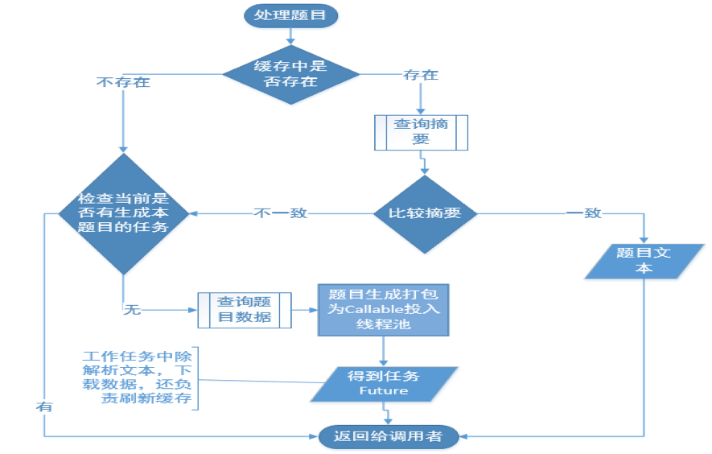

# 1. 架构改进之路

服务的拆分，把离线文档的生成拆了出来，变成一个单独的RPC服务。web服务进行拆分，一一调用离线文档的服务。

实现RPC服务（本身是同步的）时，引入了一个缓冲机制，任务放入一个队列。web服务器可以很快对客户进行应答。文档生成并行化，生产者消费者模式，还可以进行生产者消费者级联。

# 2. 文档处理的改进之路

## 2.1 对于每个离线文档生成本身

分析业务:

- 1、从容量为10万左右的题库中为每个学生抽取适合他的题目
- 2、每道题目都含有大量的图片需要下载到本地，和文字部分一起渲染

但是我们仔细考察整个系统的业务就会发现，我们是在一次考试后为学员生成自适应的练习册，换句话说，不管考试考察的内容如何，学生的成绩如何，每次考试的知识点是有限的，而从这些知识点中可以抽取的相关联的题目数也总是有限的，不同的学生之间所需要的题目会有很大的重复性。举个例子我们为甲学生因为他考卷上的错误部分抽取了80个题目，有很大的概率其他学生跟甲学生错误的地方会有重复，相对应的题目也会有重复。对于这部分题目，我们是完全没有必要重复处理的，包括从数据库中重新获取题目、解析和下载图片。这也是我们可供优化的一大突破点。其次，一篇练习册是由很多的题目组成的，每个题目相互之间是独立的，我们完全可以并行的、异步的处理每个题目。

## 2.2 具体怎么做？

要**避免重复工作**肯定是使用缓存机制，对已处理过的题目进行缓存。我们看看怎么使用缓存机制进行优化。这个业务，毋庸置疑，map肯定是最适合的，因为我们要根据题目的id来找题目的详情，用哪个map？我们现在是在多线程下使用，考虑的是并发安全的concurrentHashMap。

**当我们的服务接收到处理一个题目的请求**，首先会在缓存中get一次，没有找到，可以认为这是个新题目，准备向数据库请求题目数据并进行题目的解析，图片的下载。

这里有一个并发安全的点需要注意，因为是多线程的应用，会发生多个线程在处理多个文档时有同时进行处理相同题目的情况，这种情况下不做控制，一是会造成数据冲突和混乱，比如同时读写同一个磁盘文件，二是会造成计算资源的浪费，同时为了防止文档的生成阻塞在当前题目上，因此每个新题目的处理过程会包装成一个Callable投入一个线程池中 而把处理结果作为一个Future返回，等到线程在实际生成文档时再从Future中get出结果进行处理。因此在每个新题目实际处理前，还会检查当前是否有这个题目的处理任务正在进行。

**如果题目在缓存中被找到**，并不是直接引用就可以了，因为题库中的题目因为种种关系存在被修改的可能，比如存在错误，比如可能内容被替换，，这个时候缓存中数据其实是失效过期的，所以需要先行检查一次。
如何检查？我们前面说过题库中的题目平均长度在800个字节左右，直接equals来检查题目正文是否变动过，明显效率比较低，所以我们这里又做了一番处理，什么处理？对题目正文事先做了一次SHA的摘要并保存在数据库，并且要求题库开发小组在处理题目数据入库的时候进行SHA摘要，在本机缓存中同样保存了这个摘要信息。
在比较题目是否变动过时，首先检查摘要是否一致，摘要一致说明题目不需要更新，摘要不一致时，才需要更新题目文本，将这个题目视为新题目，进入新题目的处理流程，这样的话就减少了数据的传输量，也降低了数据库的压力。

 
## 2.3 继续改进

首先，是数据结构的选择，但是我们仔细分析就会发现，作为一个长期运行的服务，如果我们使用concurrentHashMap，意味着随着时间的推进，缓存对内存的占用会不断的增长。最极端的情况，十万个题目全部被加载到内存，这种情况下会占据多少内存呢？我们做个计算，题库中题目的平均长度在800个字节左右，十万个题目大约会使用75M左右的空间。

看起来还好，但是有几点，第一，我们除了题目本身还会有其他的一些附属信息需要缓存，比如题目图片在本地磁盘的存储位置等等，那就说，实际缓存的数据内容会远远超过800个字节，第二，map类型的的内存使用效率是比较低的，以hashmap为例，内存利用率一般只有20%到40%左右，而concurrentHashMap只会更低，有时候只有hashmap的十分之一到4分之一，这也就是说十万个题目放在concurrentHashMap中会实际占据几百兆的内存空间，是很容易造成内存溢出的，也就是大家常见的OOM。

考虑到这种情况，我们需要一种数据结构有map的方便但同时可以限制内存的占用大小或者可以根据需要按照某种策略刷新缓存。最后我们选择了ConcurrentLinkedHashMap，这是由Google开源一个线程安全的hashmap，它本身是对ConcurrentHashMap的封装，可以限定最大容量，并实现一个了基于LRU也就是最近最少使用算法策略的进行更新的缓存。很完美的契合了我们的要求，对于已经缓冲的题目，越少使用的就可以认为这个题目离当前考试考察的章节越远，被再次选中的概率就越小，在容量已满，需要腾出空间给新缓冲的题目时，越少使用就会优先被清除。

**服务器重启的时候，已缓存的题目怎么办**？在这里我们除了本地内存缓存还可以使用了本地文件存储，启用了一个二级缓存机制。到服务器会升级、会宕机，已经在内存中缓存的数据会丢失，为了避免这一点，我们将相关的数据在本地进行了一个持久化的操作，保存在了本地磁盘。

# 3. 启示

- 1. 性能优化一定要建立在对业务的深入分析上，比如我们在性能优化的切入点，在缓存数据结构的选择就建立在对业务的深入理解上；
- 2. 性能优化要善于利用语言的高并发特性，性能优化多多利用缓存，异步任务等机制，正是因为我们使用这些特性和机制，才让我们的应用在性能上有个了质的飞跃；
- 3. 引入各种机制的同时要注意避免带来新的不安全因素和瓶颈，比如说缓存数据过期的问题，并发时的线程安全问题，都是需要我们去克服和解决的。

