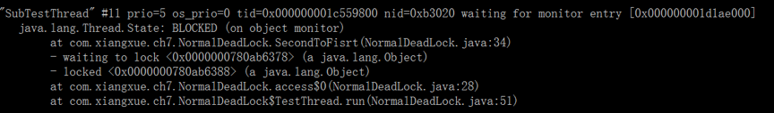
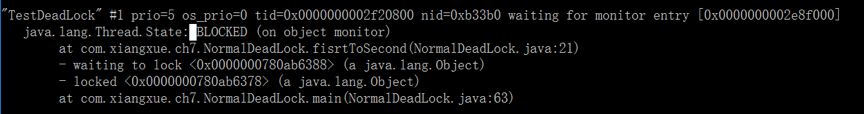
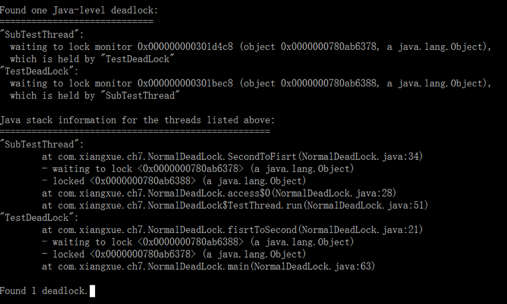

# 1. 类的线程安全定义  

如果多线程下使用这个类，不过多线程如何使用和调度这个类，这个类总是表示出正确的行为，这个类就是线程安全的。

类的线程安全表现为：

- 操作的原子性
- 内存的可见性

不做正确的同步，在多个线程之间共享状态的时候，就会出现线程不安全。

# 2. 怎么才能做到类的线程安全？

## 栈封闭

所有的变量都是在方法内部声明的，这些变量都处于栈封闭状态。

## 无状态

没有任何成员变量的类，就叫无状态的类 => 线程安全

## 让类不可变

所有基本类型的包装类都是不可变的。

让状态不可变，两种方式：

- 1. 加final关键字，对于一个类，所有的成员变量应该是私有的，同样的只要有可能，所有的成员变量应该加上final关键字，但是加上final，要注意如果成员变量又是一个对象时，这个对象所对应的类也要是不可变，才能保证整个类是不可变的。
- 2. 根本就不提供任何可供修改成员变量的地方，同时成员变量也不作为方法的返回值

## volatile

只能保证类的可见性，最适合一个线程写，多个线程读的情景：ConcurrentHashMap等等。

## 加锁和CAS

## 安全的发布 || 深度拷贝

类中持有的成员变量，特别是对象的引用，**如果这个成员对象不是线程安全的，通过get等方法发布出去，会造成这个成员对象本身持有的数据在多线程下不正确的修改，从而造成整个类线程不安全的问题**。

## TheadLocal

# 3. 其他情况以及线程不安全会引发的问题

## Servlet

不是线程安全的类，为什么我们平时没感觉到：

- 1. 在需求上，很少有共享的需求。
- 2. 接收请求与返回应答都是由一个线程来负责的。

## 死锁

**死锁**,是指两个或两个以上的进程在执行过程中，由于竞争资源或者由于彼此通信而造成的一种阻塞的现象，
若无外力作用，它们都将无法推进下去。此时称系统处于死锁状态或系统产生了死锁。

资源一定是多于1个，同时小于等于竞争的线程数，资源只有一个，只会产生激烈的竞争。
死锁的根本成因：获取锁的顺序不一致导致。

### 简单的: 
  


  
 
- 怀疑发生死锁：通过jps -m查询应用的id，再通过jstack \<id\>查看应用的锁的持有情况
- 解决办法：保证加锁的顺序性

### 动态的：

动态顺序死锁，在实现时按照某种顺序加锁了，但是因为外部调用的问题，导致无法保证加锁顺序而产生的。比如需要锁住的资源通过多个参数传入，但是用户传入参数的顺序未知。

解决：

- 1. 通过内在排序，保证加锁的顺序性，例如：先锁哈希值小的资源，如果哈希值相同可以设置一个TieLock这种更上层的锁让多个线程顺序执行这一小段逻辑。
- 2. 通过tryLock拿锁，也可以


## 活锁

尝试拿锁的机制中，发生多个线程之间互相谦让，不断发生拿锁，释放锁的过程。
解决办法：每个线程休眠随机数，错开拿锁的时间。

## 线程饥饿

低优先级的线程，总是拿不到执行时间

## 线程安全的单例模式

双重检查锁定：单例模式类的构造函数不是原子操作，所以有可能单例对象的引用有了但是对象的域不一定赋值完成，导致空指针

```java
public class SingleDcl {
	private User user;
    private static SingleDcl singleDcl; // 解决方法：加volatile
    private SingleDcl(){
    	// create user...
    }

    public static SingleDcl getInstance(){
    	if(singleDcl==null) {
    		synchronized (SingleDcl.class) { //类锁
				if(singleDcl==null) {
					singleDcl = new SingleDcl(); // 构造函数不是原子的，所以有可能singleDcl引用已经不为null但是内部域User不一定赋值完成
				}
			}
    	}
        return singleDcl;
    }
}
// singleDcl.getUser().getXXX() -> NullPointException
```

### 饿汉式 - 类初始化模式（延迟占位模式）

JVM中，对类的的加载和初始化，有虚拟机保证线程安全。

```java
// 纯饿汉式 => 内存消耗大
public class SingleHungry {
    public static SingleEHan singleEHan = new SingleEHan();
    private SingleHungry(){}

}

// 饿汉式 - 类初始化模式
public class SingleInit {
    private SingleInit(){}

    //定义一个私有类，来持有当前类的实例
    private static class InstanceHolder{
        public static SingleInit instance = new SingleInit();
    }

    // SingleInit初始化时，InstanceHolder类不会被初始化，调用getInstance时，才会初始化InstanceHolder
    public static SingleInit getInstance(){
        return InstanceHolder.instance;
    }

}
```

当getInstance方法第一次被调用的时候，它第一次读取InstanceHolder.instance，内部类InstanceHolder类得到初始化；而这个类在装载并被初始化的时候，会初始化它的静态域，从而创建SingleInit的实例，由于是静态的域，因此只会在虚拟机装载类的时候初始化一次，并由虚拟机来保证它的线程安全性。

这个模式的优势在于，getInstance方法并没有被同步，并且只是执行一个域的访问，因此延迟初始化并没有增加任何访问成本。


### 延迟初始化（延迟占位）模式


```java
public class InstanceLazy {
	
	private Integer value;
	private Integer val ;//可能很大，如巨型数组1000000，日常不多，并不是每个实例都用
	
    public InstanceLazy(Integer value) {
		super();
		this.value = value;
	}

	public Integer getValue() {
		return value;
	}
	
	private static class ValHolder {
		public static Integer vHolder = new Integer(1000000);
	}
	
	public Integer getVal() { // 调用时才加载初始化ValHolder
		return ValHolder.vHolder;
	}	

}
```

**相关文章**

- [Java（静态）内部类](https://stackoverflow.com/questions/70324/java-inner-class-and-static-nested-class)
- [为什么Java内部类要设计成静态和非静态两种？](https://www.zhihu.com/question/28197253)

## 性能和思考

衡量应用程序的性能：并发数、延迟响应时间（多快）、吞吐量（处理能力的指标，单位时间完成工作的多少）、可伸缩性（增加CPU/机器后，性能增长是线性的么？），吞吐量是由并发数量与延迟共同决定的。并发数和延迟响应时间是完全独立的，甚至有时会相互矛盾。一般服务器应用来说：并发数和可伸缩性比响应时间更重要一些。

- **保证程序正确，达不到性能要求的时候，再提高速度（业务开发）**
- 已测试为基准，例如压测等
- 一个应用程序中，串行部分是肯定有的，可利用并行化、异步化、模块化，优化程度参考[Amdahl定律](https://baike.baidu.com/item/%E9%98%BF%E5%A7%86%E8%BE%BE%E5%B0%94%E5%AE%9A%E5%BE%8B/10386960?fromtitle=Amdahl%E5%AE%9A%E5%BE%8B&fromid=2935958)
- 使用并发是为了提高性能，但是引入多线程后会增加相关的开销
- 影响性能的因素：线程的创建与销毁、调度、上下文切换、内存同步（加锁、内存屏障、内存刷新）、阻塞（挂起会产生两次额外的上下文切换）
- 减少锁的竞争：
	- 缩小锁的范围：快进快出，减少对锁持有的时间
	- 减少锁的粒度：使用锁的时候，如果锁保护多个对象，但是多个对象其实是独立变化的，不如创建多个锁一一保护各个对象。但是要注意避免死锁
	- 对于短时间密集加锁的操作可以适当将锁锁粗化
	- 锁分段：如ConcurrentHashMap内部的机制
	- 替换独占锁：读写锁、自旋CAS、系统的并发容器如ConcurrentHashMap 


