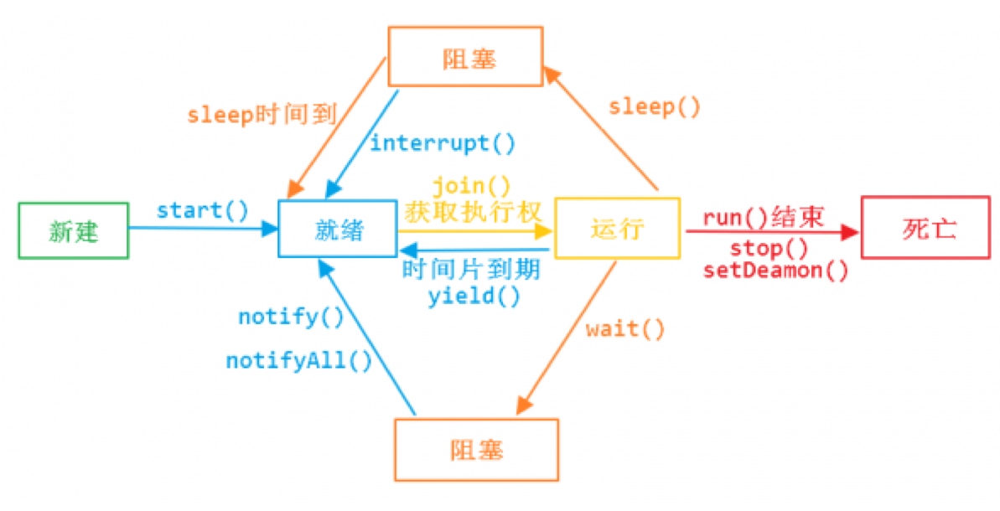

# 1. 线程基础、线程之间的共享和协作

## 1.1 基础知识

### CPU核心数和可运行线程数的关系

核心数:线程数=1:1  使用了超线程技术后---> 1:2

### CPU时间片轮转机制

又称RR调度，会导致上下文切换

### 什么是进程和线程

- 进程：程序运行资源分配的最小单位，进程内部有多个线程，会共享这个进程的资源
- 线程：CPU调度的最小单位，必须依赖进程而存在。

### 并行和并发

- 并行：同一时刻，可以同时处理事情的能力
- 并发：与单位时间相关，在单位时间内可以处理事情的能力

### 高并发编程的意义、好处和注意事项

- 好处：充分利用cpu的资源、加快用户响应的时间，程序模块化，异步化

- 问题：1.线程共享资源，存在冲突, 2.容易导致死锁 3.启用太多的线程，就有搞垮机器的可能

### 认识Java里的线程

- Class extends Thread
- Class implements Runnable / Callable

### 让Java里的线程安全停止工作

- 线程自然终止：自然执行完或抛出未处理异常

- stop()，resume(),suspend()已不建议使用，stop()会导致线程不会正确释放资源，suspend()容易导致死锁。
java线程是协作式，而非抢占式 => 主要是为了让每个线程有充分的时间做自己的清理工作。

- 调用一个线程的interrupt() 方法中断一个线程，并不是强行关闭这个线程，只是跟这个线程打个招呼，将线程的中断标志位置为true，线程是否中断，由线程本身决定。
isInterrupted() 判定当前线程是否处于中断状态。可利用IsInterrupted()来判断其他线程是否对本线程发出interrupt，再做进一步处理。

- static方法interrupted() 判定当前线程是否处于中断状态，同时中断标志位改为false。**方法里如果抛出InterruptedException，线程的中断标志位会被复位成false，如果确实是需要中断线程，要求我们自己在catch语句块里再次调用interrupt()**。

- 当一个方法抛出 InterruptedException 时，意味着几件事情: 除了它可以抛出一个特定的检查异常, 它还告诉你它是一种阻塞方法，它会尝试解除阻塞并提前返回。

[浅析线程的正确停止](https://juejin.im/post/5d6c8e23f265da03c23eedb8)

### 线程常用方法和线程的状态



线程只有5种状态。整个生命周期就是这几种状态的切换。

### run()、start()、yield()

- run方法就是普通对象的普通方法，只有调用了start()后，Java才会将线程对象和操作系统中实际的线程进行映射，再由新的线程来执行run方法。
- yield: 让出cpu的执行权，将线程从运行转到可运行状态，但是下个时间片，该线程依然有可能被再次选中运行。

### 线程的优先级

取值为1\~10，缺省为5，但线程的优先级不可靠，有些操作系统甚至会忽略线程优先级，不建议作为线程开发时候的手段。

### 守护线程

守护线程有：
Monitor Ctrl-Break
Signal Dispatcher
Finalizer
Reference Handler
GC

- 他们和主线程共死。如果给自定义的子线程setDaemon(true)，和主线程共死。同时，守护进程里的finally不能保证一定执行。所以，子进程想用finally做必要的清理时，不能作为守护进程。

## 1.2 线程间的共享

- synchronized内置锁：
	- 对象锁，锁的是类的对象实例，不同的实例之间互不影响。
	- static synchronized - “类”锁，锁的是每个类的的Class对象，每个类的的Class对象在一个虚拟机中只有一个，所以类锁也只有一个。

- volatile关键字：虚拟机提供的最轻同步机制，对某变量加上volatile，意味着每次get都会从主内存读取，set完后，一定要成员写入主内存，保证其他线程get到最新的值（缓存失效），读写不会加锁。但是，这不是线程安全的，因为它只能确保内存可见性，不能确保原子性。适合于只有一个线程写，多个线程读的场景。

- ThreadLocal线程变量。每个线程只使用自己的拷贝。可以理解为是个map，类型Map<Thread,Integer>，尽量存储小一些数据，否则内存消耗很大，链接池用的比较多。

## 1.3 线程间协作

- 轮询：难以保证及时性，资源开销很大
- 等待和通知
	- wait()    对象上的方法
	- notify/notifyAll  对象上的方法

### 等待和通知的标准范式：

等待方：

- 1、	获取对象的锁；
- 2、	循环里判断条件是否满足，不满足调用wait方法：**wait方法会释放锁，并等待信号通知，在收到通知后，会去尝试重新获得这个锁，所以在wait方法退出之前会重新获取这把锁，只有获取了这把锁才会继续执行。整个wait方法是原子的。**
- 3、	条件满足执行业务逻辑

通知方来说：

- 1、	获取对象的锁；
- 2、	改变条件
- 3、	通知所有等待在对象的线程: notify/notifyAll

notify和notifyAll应该用谁？应该尽量使用notifyAll，因为synchronized只是一个锁，如果在一个锁上有不同的线程做着不同的业务，使用notify只会发送一个信号到同一对象上等待队列中的一个wait，并不一定是自己期望的那个wait，所以有可能发生信号丢失的的情况。

**相关文章**

- [sleep和wait的区别](https://www.zhihu.com/question/23328075/answer/665978836)
- [你知道wait/notify的这些知识点吗？](https://juejin.im/post/5da03850e51d4577f706198b)


### 等待超时模式实现一个连接池：

假设等待时间时长为T，当前时间now+T以后超时：

```java
long  overtime = now+T;
long remain = T;//等待的持续时间
while(result不满足条件&& remain>0){
	wait(remain);
	remain = overtime – now;//等待剩下的持续时间
}
return result;
```
### join()方法

主要用途：线程A，执行了线程B的join方法，线程A必须要等待B执行完成了以后，线程A才能继续自己的工作。


### 调用yield()、sleep()、wait()、notify()等方法对锁有何影响？ 

- 线程在执行yield()以后，持有的锁是不释放的
- sleep()方法被调用以后，持有的锁是不释放的
- 调动方法之前，必须要持有锁。调用了wait()方法以后，锁就会被释放，当wait方法返回的时候，线程会重新持有锁
- 调动方法之前，必须要持有锁，调用notify()方法本身不会释放锁的


# 2. 线程的并发工具类

## 2.1 Fork-Join 分而治之

### 什么是分而治之

规模为N的问题，N<阈值，直接解决，N>阈值，将N分解为K个小规模子问题，子问题互相对立，与原问题形式相同，将子问题的解合并得到原问题的解。但在动态规划中k个子问题相互有关系。

比如：加速二分查找、快速排序、比较排序

### 工作密取 workStealing

类似golang调度系统中偷取G的方式，提前完成任务的线程，从工作繁重线程的Task队列中把工作偷过来运行。

### Fork/Join使用的标准范式


- Fork/Join的同步用法同时演示返回结果值：统计整形数组中所有元素的和
- Fork/Join的异步用法同时演示不要求返回值：遍历指定目录（含子目录）寻找指定类型文件

## 2.2 CountDownLatch

作用：是一组线程等待其他的线程完成工作以后在执行，加强版的join，使用await用来等待，countDown负责计数器的减一。

例子：主线程需要等待三个子线程全部完成才能继续走：主线程声明countDownLatch(3)，然后调用await。子线程完成调用countDown让计数器减一，当扣除完毕（扣除数达到3次时），主线程从await的阻塞中恢复。

## 2.3 CyclicBarrier

让一组线程达到某个屏障，被阻塞，一直到组内最后一个线程达到屏障时，屏障开放，所有被阻塞的线程会继续运行CyclicBarrier(int parties)
CyclicBarrier(int parties, Runnable barrierAction)，屏障开放，barrierAction定义的任务会执行，任务执行后，各个线程中的await才返回。

CountDownLatch和CyclicBarrier辨析：
- 1、countdownlatch放行由第三者控制，CyclicBarrier放行由一组线程本身控制，所以CyclicBarrier中的await到达约定数量前都会被阻塞，达到后一起放行。
- 2、countdownlatch放行条件 >= 线程数，CyclicBarrier放行条件=线程数

## 2.4 Semaphore

控制同时访问某个特定资源的线程数量，用在流量控制

## 2.5 Exchange

两个线程间的数据交换，用得比较少。第一个到达exchange时，会阻塞，等到第二个线程也到达exchange时，双方就交换对应的数据。

## 2.6 Callable、Future和FutureTask 


- isDone，结束，正常还是异常结束，或者自己取消，返回true，正在运行则返回false。
- isCancelled 任务完成前被取消，返回true；
- cancel（boolean）：
	- 任务还没开始，返回false
	- 任务已经启动，cancel(true)，中断正在运行的任务，中断成功，返回true，cancel(false)，不会去中断已经运行的任务。Future.cancel(false) is only useful to avoid starting tasks that hadn't already been started.
	- 任务已经结束，返回false

**相关文章：**

- [Use case for Future.cancel(false)?](https://stackoverflow.com/questions/3271564/use-case-for-future-cancelfalse)

使用场景：包含图片和文字的文档的处理：图片（云上），可以用future去取图片，主线程继续解析文字。


# 3. 原子操作CAS 

## 3.1 什么是原子操作？如何实现原子操作？ 

原子操作是不可分割的，在执行完毕之前不会被任何其它任务或事件中断。

synchronized类的原子操作是基于阻塞的锁的机制，特点：

- 1. 被阻塞的线程优先级很高，
- 2. 拿到锁的线程一直不释放锁怎么办？
- 3. 大量的竞争，消耗cpu，同时带来死锁或者其他安全。

### CAS的原理：

CAS(Compare And Swap)，指令级别保证这是一个原子操作。有三个运算符CAS(V, A, B)：一个内存地址V，一个期望的值A，一个新值B。

基本思路：如果地址V上的值和期望的值A相等，就给地址V赋给新值B，如果不是，不做任何操作，会进入循环（死循环，自旋）里不断的进行CAS操作。利用了现代处理器都支持的CAS的指令，循环这个指令，直到成功为止。


### CAS存在的问题：

- [ABA问题](https://www.zhihu.com/question/23281499)：A -> B -> A，地址上还是A，但是A的其他环境（例如：链表前后）变化，且程序无法感知，你大爷还是你大爷，但是你大妈已经不是你大妈了。可利用版本号解决: A1-B2-A3，虽然还是A，但是版本已经不是之前的版本了，程序可以感知到A的环境变化。
- 开销问题：CAS操作长期不成功，cpu会不断的循环。 
- 只能保证一个变量的原子操作：可把多个变量绑定成一个对象进行操作。

Jdk中相关原子操作类的使用：
AtomicMarkableReference -> 可返回内存有没有被动过。
AtomicStampedReference -> 可返回内存被动过几次。
上述两者可解决ABA问题。


# 4. 显式锁和AQS 

## 4.1 显式锁

### Lock接口和synchronized的比较

- synchronized：代码简洁, 但是获取锁的过程不可被中断，没有超时的机制，没有提供类似tryLock的机制，如果没有这三种要求就尽量使用synchronized，已经被优化的很不错了。
- Lock：获取锁可以被中断，超时获取锁，尝试获取锁，读多写少用读写锁。
- Lock.unlock一定要放在finally内部，保证异常试会释放资源。

### 可重入锁ReentrantLock、所谓锁的公平和非公平

- 可重入锁：若一个程序或子程序可以“在任意时刻被中断然后操作系统调度执行另外一段代码，这段代码又调用了该子程序不会出错”，则称其为可重入（reentrant或re-entrant）的。即当该子程序正在运行时，执行线程可以再次进入并执行它，仍然获得符合设计时预期的结果。与多线程并发执行的线程安全不同，可重入强调对单个线程执行时重新进入同一个子程序仍然是安全的。
- **synchronized 是可重入锁！**
- 如果在时间上，先对锁进行获取的请求，一定先被满足，这个锁就是公平的，不满足，就是非公平的。非公平的效率一般来讲更高，因为，为了保证获取锁的顺序可能会造成需要挂起额外的的线程，切换上下文的时间可能会增加。而插队的线程有几率充分利用其他线程阻塞唤醒的时间，从而效率更高。
- ReentrantLock和synchronized关键字，都是排他锁，同一时刻只允许一个线程访问。

### ReadWriteLock接口和读写锁ReentrantReadWriteLock

读写锁：同一时刻允许多个读线程同时访问，但是写线程访问的时候，所有的读和写都被阻塞，**最适宜与读多写少的情况**。

### Condition接口

- 用Lock和Condition实现等待通知，await+signal类似于synchronized中wait+notify的作用。
- 唤醒时尽量使用signal而不用signalAll，因为相较于synchronized而言，ReadWriteLock可以生成多个Condition，如果一个锁上有不同的线程做着不同的业务时可以生成多个Condition，只需要唤醒对应Condition等待的线程就可以了，并不用全题唤醒。

## 4.2 AbstractQueuedSynchronizer深入分析 

### LockSupport工具

- 阻塞一个线程
- 唤醒一个线程
- 构建同步组件的基础工具 

park开头的方法用于阻塞。unpark(Thread thread)类方法，用于唤醒。

### AQS使用方式和其中的设计模式

继承，模板方法设计模式，Lock接口面向的是锁的使用者，AQS面向的是锁的实现者，

模板方法：
- 独占式获取：accquire、acquireInterruptibly、tryAcquireNanos
- 共享式获取：acquireShared、acquireSharedInterruptibly、tryAcquireSharedNanos
- 独占式释放锁：release
- 共享式释放锁：releaseShared

需要子类覆盖的流程方法：
- 独占式获取：tryAcquire
- 独占式释放：tryRelease
- 共享式获取：tryAcquireShared
- 共享式释放：tryReleaseShared
- 这个同步器是否处于独占模式：isHeldExclusively

**同步状态state**：
- getState:获取当前的同步状态
- setState：设置当前同步状态
- compareAndSetState 使用CAS设置状态，保证状态设置的原子性

### AQS中的数据结构-节点和同步队列


竞争失败的线程会打包成Node放到同步队列，Node可能的状态里：
- CANCELLED：线程等待超时或者被中断了，需要从队列中移走
- SIGNAL：后续的节点等待状态，当前节点完成工作释放资源后，通知后面的节点去运行
- CONDITION：当前节点处于等待队列
- PROPAGATE：共享，表示状态要往后面的节点传播
- 0，表示初始状态

### 节点在同步队列中的增加和移出

#### 节点加入到同步队列


#### 首节点的变化


### 独占式同步状态获取与释放


## 4.3 Condition分析

### 一个Condition包含一个等待队列


### 同步队列与等待队列


### await方法

线程调用await时，说明他肯定获取了锁。


### signal方法

 - 调用signal时，尝试竞争锁，如果没抢到就放到同步队列的尾部。如果调用signalAll，就会唤醒所有Condition队列中的线程，但是只有一个线程能获得锁，所以剩下的被唤醒的线程需要被移动到同步队列中（无用功）。
 - syncronized中，有类似的同步队列和Condition队列，但是Condition队列只有一个。所以在notify时，你不确定Condition队列的首节点不一定是你想要的线程，所以必须得notifyAll。
 - ReentrantLock可以有多个Condition队列 -> 可通过设定多个特定的Condition队列，去保证signal唤醒的都是自己想要的线程，所以不需要signalAll。


## 4.4 回顾ReentrantLock和ReentrantReadWriteLock的实现

### ReentrantLock

- 锁的可重入：tryAcquire时判断请求锁的人是不是现在锁的拥有者，如果是就累加state，tryRelease同理，同一线程加锁几次就需要释放几次。
- 公平锁：tryAcquire一定要判定一下有没有前驱节点，如果有就不会尝试拿锁。
- 非公平锁：tryAcquire中首先尝试看能不能直接获取锁。

### ReentrantReadWriteLock

- state管理：
	- 高16位：当前有多少线程获取了读锁，HoldCounter记录每一个读锁获得几次
	- 低16位：记录写锁（重入）
- 写锁可以降级为读锁，读锁不可以上升为读锁。


# 5. 并发容器

## 5.1 ConcurrentHashMap

**Hashmap多线程会导致HashMap的Entry链表形成环形数据结构，原因是两个线程同时refresh，一个已经扩容完成，另一才刚开始扩容...**。一旦形成环形数据结构，Entry的next节点永远不为空，就会产生死循环获取Entry。

HashTable使用synchronized来保证线程安全，**但在线程竞争激烈的情况下HashTable的效率非常低下**。因为当一个线程访问HashTable的同步方法，其他线程也访问HashTable的同步方法时，会进入阻塞或轮询状态。如线程1使用put进行元素添加，线程2不但不能使用put方法添加元素，也不能使用get方法来获取元素，所以竞争越激烈效率越低。

**相关文章**

- [HashMap的死循环](https://juejin.im/post/5a66a08d5188253dc3321da0)

### 预备知识

#### Hash

散列，哈希：把任意长度的输入通过一种算法（散列），变换成为固定长度的输出，这个输出值就是散列值。属于压缩映射，容易产生哈希冲突。Hash算法有直接取余法等。
产生哈希冲突时解决办法：开放寻址；2、再散列；3、链地址法（相同hash值的元素用链表串起来）。

ConcurrentHashMap在发生hash冲突时采用了链地址法。MD4,MD5,SHA属于hash算法，又称摘要算法。

### 位运算

int类型的位：

```
高位                  低位
31 30 29 ... 5 4 3 2 1 0
0  0  0  ... 1 0 1 0 0 0
```

2的0次方 = 1，2的1次方=2...以此类推，以上表格代表数字（2的5次方+2的3次方）=40。由上面的表格可以看出，数字类型在数字渐渐变大时，是由低位慢慢向高位扩展的。Java实际保存int型时，正数：第31位=0，负数：第31位=1。

常用位运算有：
```
- 位与  &  (1&1=1 	1&0=0	 0&0=0)
- 位或  |   (1|1=1		 1|0=1 	0|0=0)
- 位非  ~  （ ~1=0 	 ~0=1）
- 位异或  ^   (1^1=0	 1^0=1	 0^0=0) 
- <<有符号左移     >>有符号的右移    >>>无符号右移  例如：8 << 2 = 32	8>>2 = 2
- 取模的操作 a % (Math.pow(2,n)) 等价于 a & ( Math.pow(2,n)-1)
```
位运算适用：权限控制，物品的属性非常多时的保存


## 5.2 JDK1.7中ConcurrentHashMap原理和实现


ConcurrentHashMap是由Segment数组结构和HashEntry数组结构组成。Segment实际继承自可重入锁（ReentrantLock），在ConcurrentHashMap里扮演锁的角色；HashEntry则用于存储键值对数据。一个ConcurrentHashMap里包含一个Segment数组，每个Segment里包含一个HashEntry数组，我们称之为table，每个HashEntry是一个链表结构的元素。


### ConcurrentHashMap实现原理是怎么样的? ConcurrentHashMap如何在保证高并发下线程安全的同时实现了性能提升？

答：ConcurrentHashMap允许多个修改操作并发进行，其关键在于使用了**锁分离**技术。它使用了多个锁来控制对hash表的不同部分进行的修改。内部使用段(Segment)来表示这些不同的部分，每个段其实就是一个小的hash table，只要多个修改操作发生在不同的段上，它们就可以并发进行。

### 初始化做了什么事？

初始化有三个参数：

- initialCapacity：初始容量大小 ，默认16。
- loadFactor, 扩容因子，默认0.75，当一个Segment存储的元素数量大于initialCapacity* loadFactor时，该Segment会进行一次扩容。
- concurrencyLevel 并发度，默认16。并发度可以理解为程序运行时能够同时更新ConccurentHashMap且不产生锁竞争的最大线程数，实际上就是ConcurrentHashMap中的分段锁个数，即Segment[]的数组长度。如果并发度设置的过小，会带来严重的锁竞争问题；如果并发度设置的过大，原本位于同一个Segment内的访问会扩散到不同的Segment中，CPU cache命中率会下降，从而引起程序性能下降。如果既要达到最可能的平均分配hashMap的value的在table的各个index，又要用二进制计算实现存取效率，就要要求容量必须为2的幂次方。

**相关文章**

- [关于hashMap的容量为什么是2的幂次方的最详细解析](https://blog.csdn.net/LLF_1241352445/article/details/81321991)

>构造方法中部分代码解惑


保证Segment数组的大小，一定为2的幂，例如用户设置并发度为17，则实际Segment数组大小则为32


保证每个Segment中tabel数组的大小，一定为2的幂，初始化的三个参数取默认值时，table数组大小为2


初始化Segment数组，并实际只填充Segment数组的第0个元素。


用于定位元素所在segment。segmentShift表示偏移位数，通过前面的int类型的位的描述我们可以得知，int类型的数字在变大的过程中，低位总是比高位先填满的，为保证元素在segment级别分布的尽量均匀，计算元素所在segment时，总是取hash值的高位进行计算。segmentMask作用就是为了利用位运算中取模的操作：a % (Math.pow(2,n)) 等价于 a & (Math.pow(2,n)-1)

### 在get和put操作中，是如何快速定位元素放在哪个位置的？

对于某个元素而言，一定是放在某个segment元素的某个table元素中的，所以在定位上，
定位segment：取得key的hashcode值进行一次**再散列（通过Wang/Jenkins算法）**，拿到再散列值后，以再散列值的高位进行取模得到当前元素在哪个segment上。这是为了保证hash的结果是相对均匀的。


定位table：同样是取得key的**再散列**值以后，用再散列值的全部和table的长度进行取模，得到当前元素在table的哪个元素上。


### get()

定位segment和定位table后，依次扫描这个table元素下的的链表，要么找到元素，要么返回null。

**在高并发下的情况下如何保证取得的元素是最新的？**用于存储键值对数据的HashEntry，在设计上它的成员变量value等都是volatile类型的，这样就保证别的线程对value值的修改，get方法可以马上看到。


### put()

- 1. 首先定位segment，当这个segment在map初始化后，还为null，由ensureSegment方法负责填充这个segment。
- 2. 对Segment 加锁
	
- 3. 定位所在的table元素，并扫描table下的链表，找到时：
	
	没有找到时：
	

### 扩容操作

Segment 不扩容，扩容下面的table数组，每次都是将数组翻倍


带来的好处

假设原来table长度为4，那么元素在table中的分布是这样的：

|   Hash值  |  15 | 23 | 34  | 56  | 77  |
| ------------ | ------------ | ------------ | ------------ | ------------ | ------------ |
| 在table中下标  | 3 = 15%4  | 3 = 23%4  | 2 = 34%4  | 0 = 56%4  | 1 = 77%4  |

扩容后table长度变为8，那么元素在table中的分布变成：

|   Hash值  | 56  |   |  34 |   |   | 77  |   | 15,23  |
| ------------ | ------------ | ------------ | ------------ | ------------ | ------------ | ------------ | ------------ | ------------ |
| 下标 | 0  |  1 | 2  | 3  | 4  | 5  | 6  | 7  |

可以看见 hash值为34和56的下标保持不变，而15,23,77的下标都是在原来下标的基础上+4即可，可以快速定位和减少重排次数。


### size方法

size的时候进行两次不加锁的统计，两次一致直接返回结果，不一致，重新加锁再次统计

### 弱一致性

get方法和containsKey方法都是通过对链表遍历判断是否存在key相同的节点以及获得该节点的value（没又实用锁）。但由于遍历过程中其他线程可能对链表结构做了调整，因此get和containsKey返回的可能是过时的数据，这一点是ConcurrentHashMap在弱一致性上的体现。

**相关文章**

- [ConcurrentHashMap是弱一致性分析](https://blog.csdn.net/wzq6578702/article/details/50908836)

## 5.3 JDK1.8中ConcurrentHashMap原理和实现

### 与1.7相比的重大变化

- 1. 取消了segment数组，直接用table保存数据，**锁的粒度更小，减少并发冲突的概率**。
- 2. 存储数据时采用了链表+红黑树的形式，纯链表的形式时间复杂度为O(n)，红黑树则为O（logn），性能提升很大。什么时候链表转红黑树？当key值相等的元素形成的链表中元素个数超过8个的时候。**但是当个数小于6个的时候，红黑树会重新变回链表。**

**相关文章**

- [为什么Map桶中个数超过8才转为红黑树](https://www.javazhiyin.com/34651.html )

### 主要数据结构和关键变量

Node类存放实际的key和value值。

sizeCtl的取值情况：

- 负数：表示进行初始化或者扩容，-1表示正在初始化，-N表示有N-1个线程正在进行扩容
- 正数：=0表示还没有被初始化，>0表示初始化或者是下一次进行扩容的阈值

TreeNode extends Node用在红黑树，表示树的节点, TreeBin是实际放在table数组中的，代表了这个红黑树的根。

### 初始化做了什么事？

懒初始化，只是给成员变量赋值，没有分配相关内存。在put时才进行实际数组的填充。

### 在get和put操作中，是如何快速定位元素放在哪个位置的？


### get（）方法


### put()方法

数组的实际初始化


### 扩容操作

transfer()方法进行实际的扩容操作，table大小也是翻倍的形式，有一个并发扩容的机制：helpTransfer() -> Helps transfer if a resize is in progress。

### size方法

估计的大概数量，不是精确数量。

### 弱一致

## 5.4 ConcurrentSkipListMap跳表 和 ConcurrentSkipListSet


- TreeMap和TreeSet有序的容器，这两种容器的并发版本。
- SkipList，以空间换时间，在原链表的基础上形成多层索引，提高链表结构的索引速度，但是某个节点在插入时，是否成为索引，随机决定，所以跳表又称为概率数据结构。

## 5.5 ConcurrentLinkedQueue

无界非阻塞队列，底层是个链表，遵循先进先出原则。可看成LinkList的并发版本。

- add,offer将元素插入到尾部
- peek（拿头部的数据，但是不移除）和poll（拿头部的数据，但是移除）

## 5.6 写时复制容器 

写时复制的容器。通俗的理解是当我们往一个容器添加元素的时候，不直接往当前容器添加，而是先将当前容器进行Copy，复制出一个新的容器，然后新的容器里添加元素，添加完元素之后，再将原容器的引用指向新的容器。这样做的好处是我们可以对容器进行并发的读，而不需要加锁，因为当前容器不会添加任何元素。所以写时复制容器也是一种读写分离的思想，读和写不同的容器。如果读的时候有多个线程正在向容器添加数据，读还是会读到旧的数据，因为写的时候不会锁住旧的，只能保证最终一致性。

**适用读多写少的并发场景，常见应用：白名单/黑名单， 商品类目的访问和更新场景。但存在内存占用问题。**

## 5.7 阻塞队列

### 概念、生产者消费者模式 

- 1. 当队列满的时候，插入元素的线程被阻塞，直达队列不满。
- 2. 队列为空的时候，获取元素的线程被阻塞，直到队列不空。

### 生产者和消费者模式

生产者就是生产数据的线程，消费者就是消费数据的线程。在多线程开发中，如果生产者处理速度很快，而消费者处理速度很慢，那么生产者就必须等待消费者处理完，才能继续生产数据。同样的道理，如果消费者的处理能力大于生产者，那么消费者就必须等待生产者。为了解决这种生产消费能力不均衡的问题，便有了生产者和消费者模式。生产者和消费者模式是通过一个容器来解决生产者和消费者的强耦合问题。生产者和消费者彼此之间不直接通信，而是通过阻塞队列来进行通信，所以生产者生产完数据之后不用等待消费者处理，直接扔给阻塞队列，消费者不找生产者要数据，而是直接从阻塞队列里取，阻塞队列就相当于一个缓冲区，平衡了生产者和消费者的处理能力。

### 常用方法


| 方法     | 抛出异常 | 返回值 | 一直阻塞 | 超时退出    |
| -------- | -------- | ------ | -------- | ----------- |
| 插入方法 | add      | offer  | put      | Offer(time) |
| 移除方法 | remove   | poll   | take     | Poll(time)  |
| 检查方法 | element  | peek   | N/A      | N/A         |


- 抛出异常：当队列满时，如果再往队列里插入元素，会抛出IllegalStateException（"Queuefull"）异常。当队列空时，从队列里获取元素会抛出NoSuchElementException异常。
- 返回特殊值：当往队列插入元素时，会返回元素是否插入成功，成功返回true。如果是移除方法，则是从队列里取出一个元素，如果没有则返回null。
- 一直阻塞：当阻塞队列满时，如果生产者线程往队列里put元素，队列会一直阻塞生产者线程，直到队列可用或者响应中断退出。当队列空时，如果消费者线程从队列里take元素，队列会阻塞住消费者线程，直到队列不为空。
- 超时退出：当阻塞队列满时，如果生产者线程往队列里插入元素，队列会阻塞生产者线程一段时间，如果超过了指定的时间，生产者线程就会退出。

### 常用阻塞队列 

- ArrayBlockingQueue：一个由数组结构组成的有界阻塞队列。按照先进先出原则，要求设定初始大小
- LinkedBlockingQueue：一个由链表结构组成的有界阻塞队列。按照先进先出原则，可以不设定初始大小，默认Integer.Max_Value


**ArrayBlockingQueue和LinkedBlockingQueue的不同：**

- 锁上面：ArrayBlockingQueue只有一个锁，LinkedBlockingQueue用了两个锁，
- 实现上：ArrayBlockingQueue直接插入元素，LinkedBlockingQueue需要转换。

- PriorityBlockingQueue：一个支持优先级排序的无界阻塞队列。**默认情况下，按照自然顺序，要么实现compareTo()方法，指定构造参数Comparator**，同优先级时顺序随机。
- DelayQueue：一个使用优先级队列实现的无界阻塞队列。支持延时获取的元素的阻塞队列，元素必须要实现Delayed接口。适用场景：实现自己的缓存系统，订单到期，限时支付等等。
- SynchronousQueue：一个不存储元素的阻塞队列。每一个put操作都要等待一个take操作。如果生产者put，但是没有消费者take，则put会阻塞。
- LinkedTransferQueue：一个由链表结构组成的无界阻塞队列。transfer()必须要消费者消费了以后方法才会返回，tryTransfer()无论消费者是否接收，方法都立即返回。
- LinkedBlockingDeque：一个由链表结构组成的双向阻塞队列。
可以从队列的头和尾都可以插入和移除元素，相互配合，实现工作密取，方法名带了First对头部操作，带了last从尾部操作，另外：add=addLast;	remove=removeFirst;	take=takeFirst

### 阻塞队列的实现原理

比如，ArrayBlockingQueue就是基于Lock和Condition实现的。


