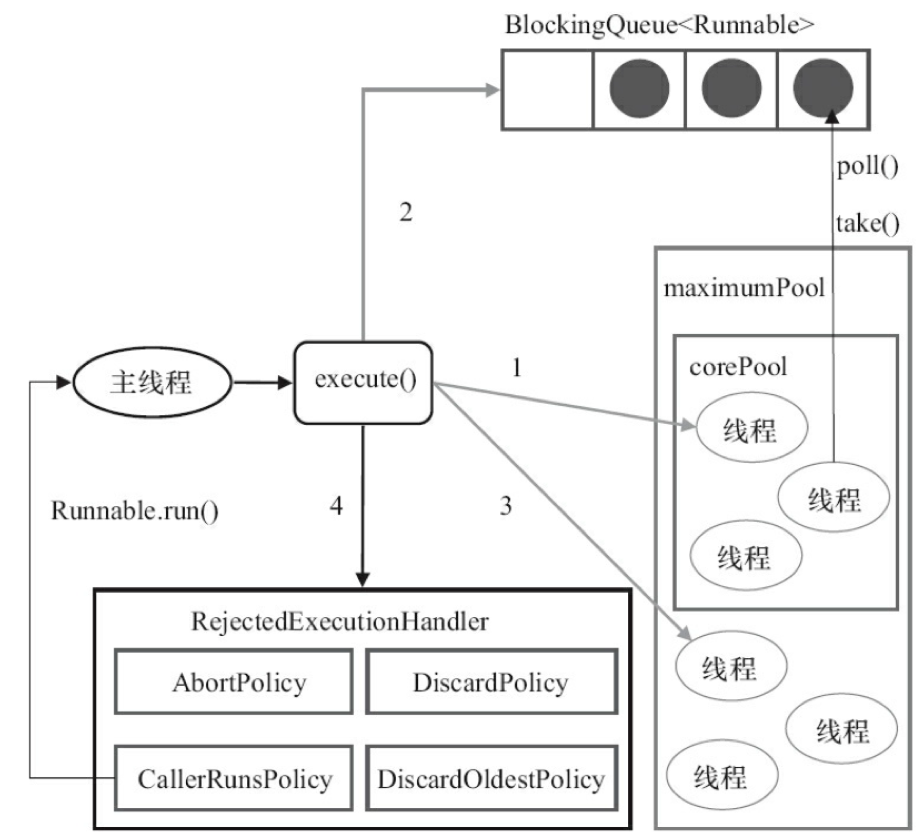
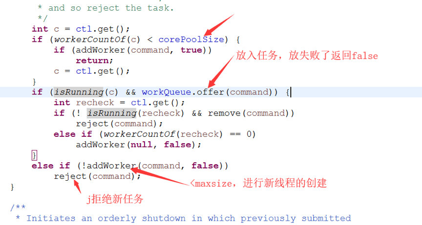
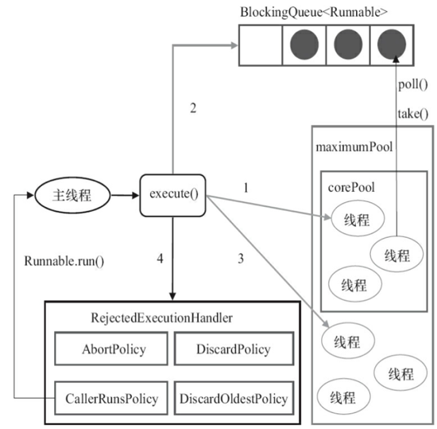
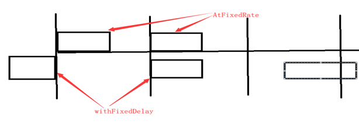
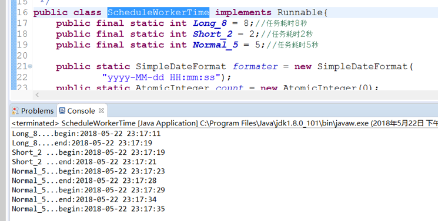
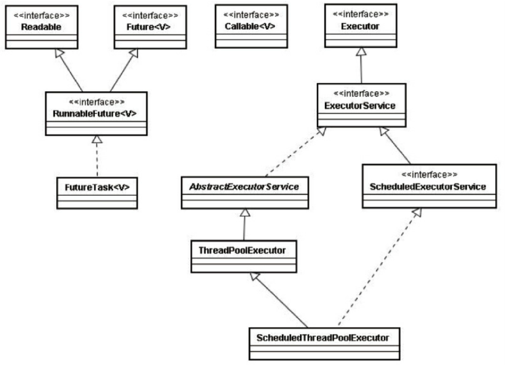
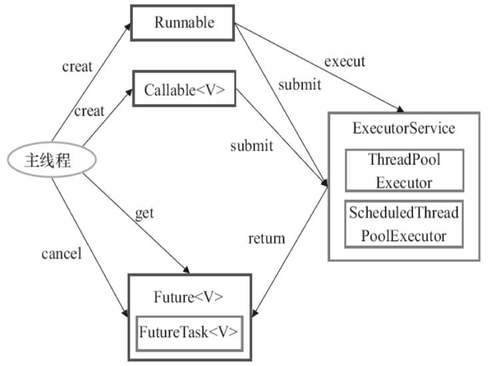

# 1. 线程池

## 什么是线程池？为什么要用线程池？  

- 1、降低资源的消耗。降低线程创建和销毁的资源消耗；
- 2、提高响应速度：线程的创建时间为T1，执行时间T2,销毁时间T3，线程池可以免去T1和T3的时间。
- 3、提高线程的可管理性。



## 实现一个我们自己的线程池

- 1、线程必须在池子已经创建好了，并且可以保持住，要有容器保存多个线程；
- 2、线程还要能够接受外部的任务，运行这个任务。容器保持这个来不及运行的任务.

# 2. JDK中的线程池和工作机制

## 线程池的创建

ThreadPoolExecutor，jdk所有线程池实现的父类

## 各个参数含义

- int corePoolSize：线程池中核心线程数，如果当前线程数小于corePoolSize => 就会创建新线程去执行任务。如果等于corePoolSize => 这个任务就会保存到BlockingQueue。如果调用prestartAllCoreThreads（）方法就会一次性的启动corePoolSize个数的线程。
- int maximumPoolSize, 允许的最大线程数。如果BlockingQueue也满了，当前线程数如果小于maximumPoolSize时候 => 就会再次创建新的线程。
- long keepAliveTime, 线程空闲下来后存活的时间。这个参数只在 当前线程数>corePoolSize时 才有用。
- TimeUnit unit, 存活时间的单位值。
- BlockingQueue<Runnable> workQueue, 保存任务的阻塞队列。
- ThreadFactory threadFactory, 创建线程的工厂，给新建的线程赋予名字。
- RejectedExecutionHandler handler：饱和策略
	- AbortPolicy ：直接抛出异常，**默认**。
	- CallerRunsPolicy：用调用者所在的线程来执行任务，提交任务的线程本身去执行。
	- DiscardOldestPolicy：丢弃阻塞队列里最老的任务，队列里最靠前的任务。
	- DiscardPolicy ：当前任务直接丢弃。
	- 实现自己的饱和策略，实现RejectedExecutionHandler接口即可。

## 提交任务

- 不需要返回 => execute(Runnable command)  
- 需要返回 => Future<T> submit(Callable<T> task)

## 关闭线程池

shutdown()和shutdownNow()：
- shutdownNow()：设置线程池的状态，还会尝试停止正在运行或者暂停任务的线程
- shutdown()：设置线程池的状态，只会中断所有没有执行任务的线程

## 工作机制




## 合理配置线程池

线程池的配置需要根据任务的性质来：计算密集型（CPU），IO密集型，混合型

- 计算密集型：加密，大数分解，正则等等。配置的线程数适当小一点，最大推荐：**机器的CPU核心数+1，为什么？CPU+1个线程数可以防止页缺失 => 当前线程需要的数据还在磁盘上，所以需要等待操作系统将数据调度至内存，而页缺失的该线程会被挂起，此时多出来的那一个线程就可以先运行。(机器的CPU核心=Runtime.getRuntime().availableProcessors();)**。但是线程数太多也不好，因为上下文切换时间反而浪费CPU不少的机器周期。

- IO密集型：读取文件，数据库连接，网络通讯等IO操作比直接的内存读取要慢好几个数量级，所以线程数适当大一点，未知情况下推荐的线程数为机器的CPU核心数\*2。具体分的话可以使用类似top的命令去看负载：
	- 在系统态的线程数过高 => 应用大部分都在等待系统调用：IO/外部操作 => 需要增加线程数
	- 用户态线程接近100% => 充分利用了CPU资源

- 混合型：尽量拆分，如果系统特点是IO复杂度>>计算复杂度，那拆分意义不大。系统的IO复杂度约等于计算复杂度时，才适合拆分。在**队列的选择上，应该使用有界队列，无界队列可能会导致内存溢出OOM => crash**。

## 预定义的线程池()

### FixedThreadPool

创建固定线程数量线程池，适用于负载较重的服务器，使用了无界队列 => OOM风险
- corePoolSize == maximumPoolSize

### SingleThreadExecutor

创建单个线程，需要顺序保证执行任务，不会有多个线程活动，使用了无界队列
- corePoolSize == maximumPoolSize == 1

### CachedThreadPool

会根据需要来创建新线程的，执行很多短期异步任务的程序，使用了SynchronousQueue
- corePoolSize == 0
- maximumPoolSize == Integer.MAX_VALUE
- 任何线程空闲超过60秒就销毁，如果创建线程过多，机器会crash

### WorkStealingPool（JDK7以后）

基于ForkJoinPool实现，工作密取

### ScheduledThreadPoolExecutor

需要定期执行周期任务，**Timer不建议使用了（Timer没有对运行时异常进行处理，一旦某个任务触发运行时异常，会导致整个Timer崩溃）**。

- newSingleThreadScheduledExecutor
```java
return new DelegatedScheduledExecutorService
            (new ScheduledThreadPoolExecutor(1));
```

只包含一个线程，只需要单个线程执行周期任务，保证顺序的执行各个任务

- newScheduledThreadPool

可以包含多个线程的，线程执行周期任务，适度控制后台线程数量的时候。

方法说明：
- schedule：只执行一次，任务还可以延时执行
- scheduleAtFixedRate：提交固定时间间隔的任务（上个任务的起始时间和下个任务的起始时间的间隔是固定的）
- scheduleWithFixedDelay：提交固定延时间隔执行的任务（上个任务的和结束时间下一个任务的开始之间的间隔是固定的）

两者的区别：



scheduleAtFixedRate任务超时：

规定60s执行一次，上一个任务执行了80s，下个任务在上一个任务结束后马上开始执行

第一个任务执行时长80s，第二个任务20s，第三个任务50s

第一个任务第0秒开始，第80S结束；

第二个任务第80s开始，在第100秒结束；

第三个任务第120s秒开始，170秒结束

第四个任务从180s开始

参加代码：ScheduleWorkerTime类，执行效果如图：

 

建议在提交给ScheduledThreadPoolExecutor的任务要住catch异常。抛出异常后下个周期不会执行

## Executor框架




一般来锁使用ThreadPoolExecutor会多一些，因为生产环境几乎不用无界队列且需要自己实现RejectedExecutionHandler。

## 了解CompletionService


