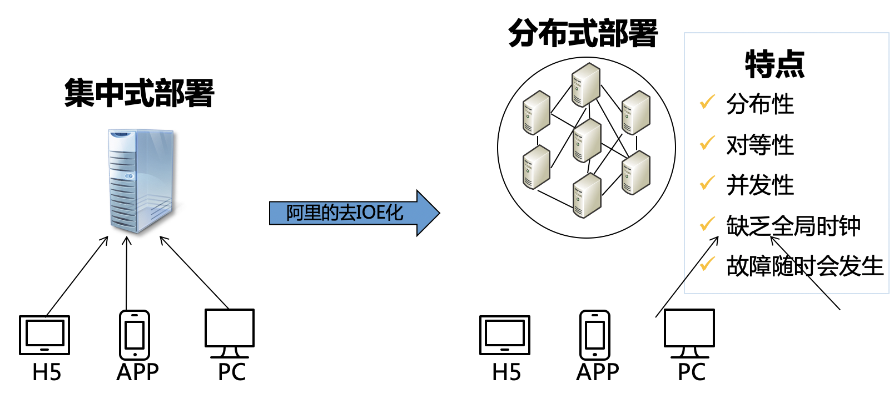
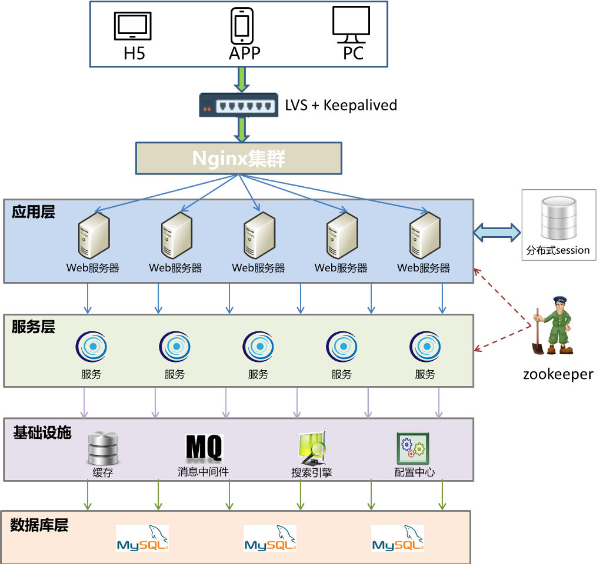
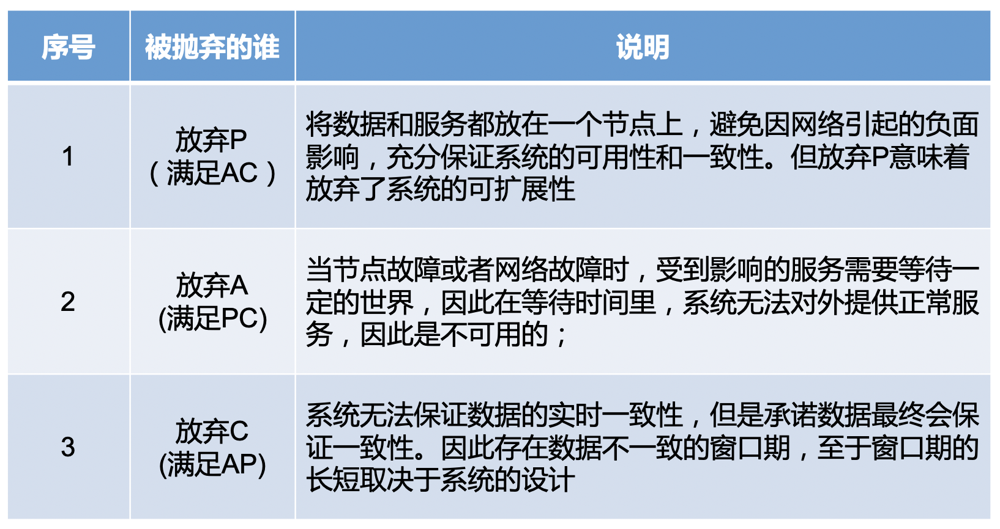

## 1. 分布式系统基础知识

分布式系统：一个硬件或软件组件分布在不同的网络计算机上，彼此之间仅仅通过**消息传递进行通信和协调的系统**

### 大型网站架构图回顾

### 分布式系统协调“方法论”

#### 分布式系统带来的问题

- 通信异常
- 网络分区
- 三态
- 节点故障

#### CAP理论

- C 一致性：数据在分布式环境下的多个副本之间能否保持一致性，这里的一致性更多是指强一致性；

- A 可用性：分布式系统一直处于可用状态，对于请求总是能在有限的时间内返回结果致性；

- P 分区容错性：除非整个网络故障，分布式系统在任何网络或者单点故障时，仍能对外提供满足一致性和可用性的服务；

CAP理论：一个分布式系统不可能同时满足一致性、可用性和分区容错性这三个基本需求，最多只能同时满足其中的两项；

**TIPS**：架构师的精力往往就花在怎么样根据业务场景在A和C直接寻求平衡；

#### BASE理论

即使无法做到强一致性，但分布式系统可以根据自己的业务特点，采用适当的方式来使系统达到最终的一致性；

- Basically Avaliable  基本可用：当分布式系统出现不可预见的故障时，允许损失部分可用性，保障系统的“基本可用”；体现在“时间上的损失”和“功能上的损失”；e.g：部分用户双十一高峰期淘宝页面卡顿或降级处理；

- Soft state 软状态：允许系统中的数据存在中间状态，既系统的不同节点的数据副本之间的数据同步过程存在延时，并认为这种延时不会影响系统可用性；e.g：12306网站卖火车票，请求会进入排队队列；

- Eventually consistent 最终一致性：所有的数据在经过一段时间的数据同步后，最终能够达到一个一致的状态；e.g：理财产品首页充值总金额短时不一致；

